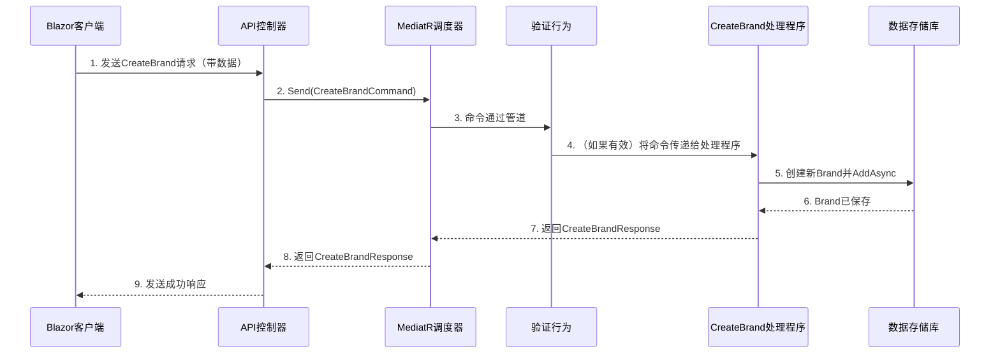

# 第3章：命令/查询职责分离（CQRS）与MediatR

欢迎回来

在[第2章：身份验证与授权（Identity & JWT）](02_authentication___authorization__identity___jwt__.md)中，我们学习了如何通过确保*谁*可以访问*什么*并执行*哪些操作*来保护应用程序的安全。现在，我们的安全系统已经就位，让我们探索如何组织执行这些操作和检索数据的代码。

将你的应用程序想象成一个繁忙的办公室。随着它的发展，任务可能会变得复杂。有些人负责接收订单和制作产品（改变事物），而其他人则忙于报告和回答问题（获取信息）。==如果每个人都做所有事情，很快就会变得混乱==

这就是**命令/查询职责分离（CQRS）与MediatR**的用武之地。它是一种保持应用程序逻辑整洁、有序且易于理解的方法，使构建和维护变得更加简单。

## 问题：应用程序增长中的混乱逻辑

随着应用程序的增长，业务逻辑可能会变得混乱。你可能会有以下代码：
*   添加新数据（例如创建`Brand`）。
*   修改现有数据（例如更新`Brand`）。
*   检索数据列表（例如搜索`Brands`）。
*   执行复杂计算。

如果所有这些逻辑都放在同一个地方（例如一个“服务”类中），它可能会变成一个庞大且难以管理的文件。这会带来以下问题：
*   **理解困难**：这个方法到底做了什么？它是修改数据还是仅仅获取数据？
*   **维护困难**：对某一部分的小修改可能会意外影响其他不相关的部分。
*   **扩展困难**：当所有内容都交织在一起时，优化系统的某些部分会更加困难。

我们的`dotnet-starter-kit`项目==使用CQRS来解决这个问题，通过清晰地将操作与查询分离，并使用`MediatR`作为中央消息传递者==。

## 解决方案：CQRS——将“执行”与“查询”分离

CQRS是一种架构模式，建议将应用程序的操作分为两个不同的类别：

1.  **命令（“执行者”）**：这些是*改变*应用程序状态的请求。它们告诉系统执行一个操作。
    *   **类比**：想象在餐厅点餐。你告诉厨房（系统）*制作*一些新的东西。
    *   **示例**：`CreateBrandCommand`、`UpdateBrandCommand`、`DeleteProductCommand`、`RegisterUserCommand`。
    *   命令不应返回被更改的数据，只返回操作成功的确认（例如新创建项的ID）。

2.  **查询（“询问者”）**：这些是*检索*应用程序数据的请求。它们从不更改任何数据，只获取数据。
    *   **类比**：询问服务员“你们有哪些甜点？”你在请求信息，而不是改变餐厅的库存。
    *   **示例**：`SearchBrandsCommand`（尽管它名为“Command”，但在CQRS中它表现得像一个查询，仅检索数据）、`GetProductByIdQuery`、`GetUserPermissionsQuery`。
    *   查询总是返回数据。

通过这种分离，你的代码变得更加清晰。当你看到一个“命令”时，你立即知道它会改变某些东西。当你看到一个“查询”时，你知道它只是获取信息。

### MediatR：智能消息传递者

即使命令和查询被分离，你仍然需要一种方式让应用程序实际*发送*这些请求到知道如何处理它们的代码部分。这就是`MediatR`库的作用。

*   **类比**：MediatR就像一个高效的邮局或中央调度员。当你发送一封信（一个命令或查询）时，你只需把它投递到邮局。你不需要知道处理它的具体地址；邮局会找到正确的“处理程序”并递送它。
*   **工作原理**：
    1.  你定义一个**命令**或**查询**（只是一个简单的C#类）。
    2.  你定义一个**处理程序**类，该类为特定的命令或查询实现`IRequestHandler<TRequest, TResponse>`。这个处理程序包含实际的业务逻辑。
    3.  在你的应用程序中，你将命令/查询“发送”给MediatR。
    4.  MediatR找到该命令/查询的正确处理程序并执行其`Handle`方法。

这使得你的代码高度解耦。发送请求的应用程序部分不需要知道处理它的部分，减少了依赖关系，使代码库更加整洁。

## 使用CQRS和MediatR：我们的Brands示例

让我们回顾一下[第1章：Blazor EntityTable组件](01_blazor_entitytable_component_.md)中的`Brands`示例。我们想要`Create`新品牌和`Search`现有品牌。

### 1. 定义一个命令：`CreateBrandCommand`

首先，我们定义一个简单的C#类，表示我们创建品牌的意图。这是我们对系统的“信件”。注意它实现了`IRequest<CreateBrandResponse>`，这是MediatR识别它为请求的方式。`CreateBrandResponse`通常包含新创建品牌的ID。

```csharp
// src/api/modules/Catalog/Catalog.Application/Brands/Create/v1/CreateBrandCommand.cs
using MediatR; // 重要：MediatR类型

public sealed record CreateBrandCommand(
    string? Name,
    string? Description = null) : IRequest<CreateBrandResponse>;

// CreateBrandResponse可以是一个简单的记录：
// public sealed record CreateBrandResponse(Guid Id);
```
**解释**：这个`CreateBrandCommand`是创建品牌的蓝图。它包含所有必要的信息（`Name`、`Description`），但没有关于*如何*创建它的逻辑。它只是声明“我想创建一个品牌，并期望返回一个`CreateBrandResponse`。”

### 2. 处理命令：`CreateBrandHandler`

接下来，我们创建一个知道*如何*处理`CreateBrandCommand`的类。这是我们针对这种特定“信件”的“邮局工作人员”。它实现了`IRequestHandler<TRequest, TResponse>`。

```csharp
// src/api/modules/Catalog/Catalog.Application/Brands/Create/v1/CreateBrandHandler.cs
using FSH.Framework.Core.Persistence; // 用于数据存储
using FSH.Starter.WebApi.Catalog.Domain; // 我们的Brand数据模型
using MediatR; // 重要：MediatR类型

public sealed class CreateBrandHandler(
    IRepository<Brand> repository) // 我们需要一种保存Brands的方式
    : IRequestHandler<CreateBrandCommand, CreateBrandResponse> // 处理CreateBrandCommand
{
    public async Task<CreateBrandResponse> Handle(CreateBrandCommand request, CancellationToken cancellationToken)
    {
        // 1. 验证输入（通常在到达此步骤之前由“行为”处理）
        ArgumentNullException.ThrowIfNull(request);

        // 2. 创建一个新的Brand对象（我们的业务逻辑）
        var brand = Brand.Create(request.Name!, request.Description);

        // 3. 将新Brand保存到数据库
        await repository.AddAsync(brand, cancellationToken);

        // 4. 返回新Brand的ID
        return new CreateBrandResponse(brand.Id);
    }
}
```
**解释**：这个`CreateBrandHandler`接收`CreateBrandCommand`。它的`Handle`方法包含实际的逻辑：创建一个`Brand`对象，然后使用`repository`（我们将在[第5章：数据持久化层](05_data_persistence_layer_.md)中探讨的概念）保存它。最后，它返回新创建品牌的ID。

### 3. 定义一个查询：`SearchBrandsCommand`

对于检索数据，我们也使用一个请求对象，即使在这个特定示例中它被命名为“Command”（它的行为像一个查询）。这个查询包括过滤和分页信息。

```csharp
// src/api/modules/Catalog/Catalog.Application/Brands/Search/v1/SearchBrandsCommand.cs
using FSH.Framework.Core.Paging; // 用于分页功能
using MediatR;

public class SearchBrandsCommand : PaginationFilter, IRequest<PagedList<BrandResponse>>
{
    public string? Name { get; set; }
    public string? Description { get; set; }
}

// BrandResponse可以是一个表示一个品牌的简单记录
// PagedList是分页结果的标准包装器
```
**解释**：`SearchBrandsCommand`是我们获取分页品牌列表的请求。它继承自`PaginationFilter`（用于页码、大小等），并允许可选的`Name`和`Description`过滤器。它期望返回一个`PagedList<BrandResponse>`。

### 4. 处理查询：`SearchBrandsHandler`

这个处理程序负责根据`SearchBrandsCommand`中的条件从存储中获取品牌。

```csharp
// src/api/modules/Catalog/Catalog.Application/Brands/Search/v1/SearchBrandsHandler.cs
using FSH.Framework.Core.Paging;
using FSH.Framework.Core.Persistence; // 用于读取数据
using MediatR;

public sealed class SearchBrandsHandler(
    IReadRepository<Brand> repository) // 我们需要一种读取Brands的方式
    : IRequestHandler<SearchBrandsCommand, PagedList<BrandResponse>> // 处理SearchBrandsCommand
{
    public async Task<PagedList<BrandResponse>> Handle(SearchBrandsCommand request, CancellationToken cancellationToken)
    {
        ArgumentNullException.ThrowIfNull(request);

        // 1. 构建一个“规范”来过滤和排序品牌
        var spec = new SearchBrandSpecs(request); // 这个规范定义了过滤逻辑

        // 2. 从存储库中获取过滤和分页的项目
        var items = await repository.ListAsync(spec, cancellationToken).ConfigureAwait(false);

        // 3. 获取匹配过滤器的项目总数（用于分页）
        var totalCount = await repository.CountAsync(spec, cancellationToken).ConfigureAwait(false);

        // 4. 将结果包装在PagedList中返回
        return new PagedList<BrandResponse>(items, request!.PageNumber, request!.PageSize, totalCount);
    }
}
```
**解释**：`SearchBrandsHandler`使用`IReadRepository`获取数据。它构建一个`SearchBrandSpecs`（一种表达复杂过滤/排序的方式），然后查询存储库以获取匹配的品牌及其总数。最后，它将结果包装在`PagedList`中返回。

### 连接到UI

还记得在[第1章：Blazor EntityTable组件](01_blazor_entitytable_component_.md)中我们有`_client.CreateBrandEndpointAsync`和`_client.SearchBrandsEndpointAsync`吗？这些客户端API调用与后端通信。

> 在后端，你的API控制器中，这些命令和查询被*发送*给MediatR：

```csharp
// 概念性：API控制器方法内部
public class BrandsController // ...
{
    private readonly ISender _mediator; // MediatR发送请求的方式

    public BrandsController(ISender mediator)
    {
        _mediator = mediator;
    }

    // 处理来自_client.CreateBrandEndpointAsync的调用
    [HttpPost]
    public async Task<ActionResult<Guid>> Create(CreateBrandCommand command)
    {
        // MediatR接收命令并找到/执行CreateBrandHandler
        var response = await _mediator.Send(command);
        return Ok(response.Id);
    }

    // 处理来自_client.SearchBrandsEndpointAsync的调用
    [HttpGet("search")]
    public async Task<ActionResult<PagedList<BrandResponse>>> Search([FromQuery] SearchBrandsCommand query)
    {
        // MediatR接收查询并找到/执行SearchBrandsHandler
        var response = await _mediator.Send(query);
        return Ok(response);
    }
}
```
**解释**：API控制器充当来自UI的入口点。

它不包含业务逻辑本身，而是从外部世界接收命令或查询，并通过`_mediator.Send()`发送它们。MediatR随后接管，找到适当的处理程序并处理请求。

## 幕后：MediatR的工作原理

让我们可视化`CreateBrandCommand`从Blazor客户端发送到保存到数据库的整个过程。



### MediatR初始化

当你的`dotnet-starter-kit`应用程序启动时，MediatR被配置为自动发现所有命令、查询及其对应的处理程序。这通常通过“程序集扫描”完成。

`Program.cs`文件通过辅助方法如`builder.ConfigureFshFramework()`和`builder.RegisterModules()`隐式设置MediatR：

```csharp
// src/api/server/Program.cs（框架扩展的概念性设置）
using MediatR; // 框架隐式使用

// ... 在builder.ConfigureFshFramework() / builder.RegisterModules()内部 ...
// 框架扫描程序集（例如你的应用程序和模块程序集）
// 以找到实现IRequest、IRequestHandler和IPipelineBehavior的类。
// 然后将它们注册到依赖注入容器中。
// 这意味着你不需要为每个处理程序显式编写.AddMediatR()调用！
```
**解释**：你通常不需要在这个项目结构中显式编写`builder.Services.AddMediatR(...)`调用，因为框架为你处理了它。它会自动找到所有的`IRequest`和`IRequestHandler`并注册它们，以便MediatR知道将每个命令/查询发送到哪里。

### MediatR管道行为

MediatR的另一个强大功能是它的**管道行为**。这些行为就像中间件，可以在处理程序运行*之前*或*之后*执行逻辑。一个常见的用例是**验证**。

在`CreateBrandCommand`到达`CreateBrandHandler`之前，我们可能想检查`Name`是否为空。与其在每个处理程序中放置这个检查，我们可以创建一个通用的`ValidationBehavior`。

```csharp
// src/api/framework/Infrastructure/Behaviours/ValidationBehavior.cs
using FluentValidation; // 一个流行的验证库
using MediatR;

public class ValidationBehavior<TRequest, TResponse>(IEnumerable<IValidator<TRequest>> validators) : IPipelineBehavior<TRequest, TResponse>
    where TRequest : IRequest<TResponse>
{
    private readonly IEnumerable<IValidator<TRequest>> _validators = validators;

    public async Task<TResponse> Handle(TRequest request, RequestHandlerDelegate<TResponse> next, CancellationToken cancellationToken)
    {
        if (_validators.Any()) // 检查是否有针对此请求的验证器
        {
            var context = new ValidationContext<TRequest>(request);
            var validationResults = await Task.WhenAll(_validators.Select(v => v.ValidateAsync(context, cancellationToken)));
            var failures = validationResults.SelectMany(r => r.Errors).Where(f => f != null).ToList();

            if (failures.Count > 0)
                throw new ValidationException(failures); // 如果验证失败，抛出错误
        }
        return await next(); // 如果有效，继续执行管道的下一步（最终到达处理程序）
    }
}
```
**解释**：这个`ValidationBehavior`拦截任何命令或查询（`TRequest`）在它到达处理程序之前。它找到为该请求类型注册的任何`IValidator`并运行它们。如果有任何验证错误，它会停止过程并抛出异常。如果一切有效，它调用`await next()`将请求传递到管道的下一步，最终到达实际的处理程序。这确保所有命令/查询在被处理之前都自动验证，而无需在每个处理程序中重复代码。

## 总结

| 概念         | 描述                                               | 类比                                     |
| :----------- | :------------------------------------------------- | :--------------------------------------- |
| **命令**     | 请求*更改*数据。执行一个操作。                     | 在餐厅点餐。                             |
| **查询**     | 请求*检索*数据。从不更改数据。                     | 向服务员询问菜单。                       |
| **MediatR**  | 一个调度器/消息传递者，将命令/查询路由到处理程序。 | 餐厅的订单系统或邮局。                   |
| **处理程序** | 包含特定命令或查询的业务逻辑。                     | 厨师（用于命令）或厨房员工（用于查询）。 |
| **行为**     | 在处理程序之前/之后运行的中间件（例如验证）。      | 烹饪前的质量检查或准备站。               |

## 结论

现在已经探索了命令/查询职责分离（CQRS）和MediatR库的强大功能。

了解到CQRS通过将==改变数据的操作（命令）与仅检索数据的操作（查询）分离==，帮助保持应用程序的组织性。

MediatR充当中央消息传递者，==将这些命令和查询路由到它们的特定处理程序==，使你的代码更清晰、更模块化且更易于扩展。我们还简要提到了管道行为，它允许像验证这样的通用逻辑被一致地应用。

这种模式是`dotnet-starter-kit`中业务逻辑结构的基础。在下一章中，我们将深入探讨这些`命令和查询操作的实际数据结构`：[领域实体与可审计行为](04_domain_entities___auditable_behavior_.md)。

