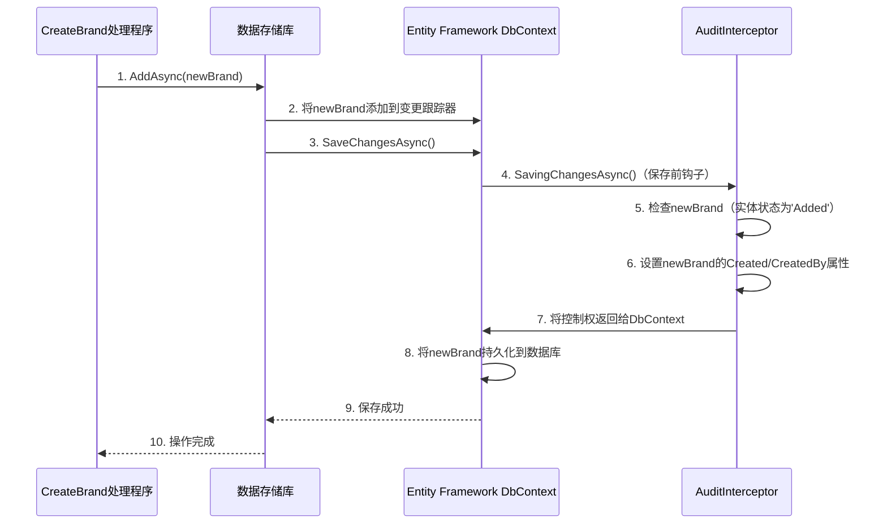

# 第4章：Domain Entities & Auditable Behavior

欢迎回来

在[第3章：命令/查询职责分离（CQRS）与MediatR](03_command_query_responsibility_segregation__cqrs__with_mediatr_.md)中，我们学习了如何通过将==“执行”（命令）与“查询”（查询）分离==来==路由组织==应用程序的逻辑。这些命令和查询，如`CreateBrandCommand`或`SearchBrandsCommand`，并不是凭空操作的；它们与代表我们`业务核心概念的实际数据进行交互`。

想象一下，我们正在构建一个图书馆系统。我们有书籍、会员和借阅记录。这些不仅仅是随机的数据片段；它们是图书馆处理的基本“事物”。每个“事物”（如一本书）都有自己的==属性==（标题、作者、ISBN）和==规则==（可以被借出、归还、损坏）。

本章介绍**领域实体**，它们是应用程序业务逻辑的基本“事物”或“构建块”，例如`Brand`、`Product`或`TodoItem`。

我们还将探讨**可审计行为**，这是一种智能的方式，可以==自动跟踪==这些实体的重要历史==记录==，例如谁创建了它们、最后一次修改的时间，甚至如何“软删除”它们而不会永久丢失数据。

这个系统确保我们的数据可靠，并提供清晰的历史记录，就像一位细心的图书管理员记录每本书的旅程，而不会真正将其从目录中移除。

## 问题：跟踪变化和保留历史

考虑一下我们在前几章中的`Brand`示例。当使用`EntityTable`组件和`CreateBrandCommand`或`UpdateBrandCommand`创建新品牌或更新现有品牌时：
*   你如何知道*谁*创建了这个品牌？
*   它具体是在什么时候创建的？
*   谁*最后*修改了它的描述？
*   修改是在什么时候进行的？
*   如果你“删除”一个品牌，它应该真正从数据库中消失，还是仅仅标记为删除以便以后可以恢复？

如果没有==标准化的方式来处理这些问题==，需要在*每个数据类型*中添加字段，如`CreatedDate`、`CreatedBy`、`ModifiedDate`、`ModifiedBy`和`IsDeleted`。然后，你还需要在每次创建、更新或“删除”记录时编写代码来填充这些字段。这将是一项重复且容易出错的工作！

## 解决方案：领域实体与可审计行为

`dotnet-starter-kit`通过以下强大组合解决了这个问题：

### 1. 领域实体：核心业务“事物”

**领域实体**是一个类，代表应用程序业务领域中的核心概念。这些对象具有身份（唯一ID）、属性（如`Name`、`Description`）和行为（如`Update`方法）。

在我们的项目中，`Brand`、`Product`和`TodoItem`都是领域实体的例子。它们被设计为封装自己的数据和逻辑。

### 2. `AuditableEntity`：内置的历史记录器

与其手动为每个实体添加跟踪字段，我们的实体继承自一个名为`AuditableEntity`的特殊类。这个类为所有需要历史记录的实体提供了一个基础蓝图。

`AuditableEntity`自动提供：
*   `Created`：实体首次创建的时间。
*   `CreatedBy`：创建它的用户ID。
*   `LastModified`：实体最后一次更新的时间。
*   `LastModifiedBy`：最后一次更新它的用户ID。
*   `Deleted`：实体被“软删除”的时间戳。
*   `DeletedBy`：“软删除”它的用户ID。

这意味着只需==继承`AuditableEntity`，就能免费获得这些强大的审计功能==

### 3. 软删除：永不真正消失

`Deleted`和`DeletedBy`属性启用了“软删除”。与其从数据库中物理删除记录（这可能很危险并导致数据丢失），软删除只是将记录标记为某个`DateTimeOffset`时间的`Deleted`，由某个`DeletedBy`用户操作。

记录仍然存在于数据库中，但通常从普通查询中过滤掉。这就像将文件移动到回收站而不是永久删除。

### 4. `IAggregateRoot`：事务一致性的标记

你可能还会注意到一些实体实现了`IAggregateRoot`。这是领域驱动设计（==DDD==）中的一个标记接口。它表示这个实体是相关对象集群的“根”，应该被视为数据更改的单一单元。对于初学者来说，只需知道它==有助于保持数据的一致性==：如果你修改了一个`IAggregateRoot`，其边界内的所有更改应该一起成功或失败。

## 如何使用：构建领域实体

让我们看看我们的`Brand`实体以及`Product`和`TodoItem`如何利用`AuditableEntity`。

### `AuditableEntity`基类

所有主要的领域实体最终都继承自`AuditableEntity<Guid>`，而它本身又继承自`BaseEntity<Guid>`。这提供了唯一的`Id`（一个`Guid`）和可审计属性。

（之前的手写rpc专栏中用到过同样的设计思想：[实现Json-Rpc](https://blog.csdn.net/2301_80171004/category_12880936.html?spm=1001.2014.3001.5482)）

```csharp
// src/api/framework/Core/Domain/AuditableEntity.cs
public class AuditableEntity<TId> : BaseEntity<TId>, IAuditable, ISoftDeletable
{
    public DateTimeOffset Created { get; set; }
    public Guid CreatedBy { get; set; }
    public DateTimeOffset LastModified { get; set; }
    public Guid? LastModifiedBy { get; set; }
    public DateTimeOffset? Deleted { get; set; }
    public Guid? DeletedBy { get; set; }
}

public abstract class AuditableEntity : AuditableEntity<Guid>
{
    protected AuditableEntity() => Id = Guid.NewGuid();
}
```
**解释**：这段代码定义了`AuditableEntity`类。注意它有`Created`、`CreatedBy`、`LastModified`、`LastModifiedBy`、`Deleted`和`DeletedBy`属性。它还实现了`IAuditable`和`ISoftDeletable`接口，这些接口定义了这些属性。没有泛型类型参数的`AuditableEntity`是一个方便的基类，适用于始终使用`Guid`作为ID的实体，在创建时自动分配一个新的`Guid`。

### 创建`Brand`实体

我们的`Brand`类简单地继承自`AuditableEntity`，并定义了自己的唯一属性和方法。它不需要担心`CreatedBy`或`LastModified`——这些会自动处理！

```csharp
// src/api/modules/Catalog/Catalog.Domain/Brand.cs
public class Brand : AuditableEntity, IAggregateRoot
{
    public string Name { get; private set; } = string.Empty;
    public string? Description { get; private set; }

    // ORM（对象关系映射器）的私有构造函数
    private Brand() { }

    // 创建新实例的私有构造函数
    private Brand(Guid id, string name, string? description)
    {
        Id = id; // 如果需要，可以手动设置ID，或者让AuditableEntity分配默认的Guid
        Name = name;
        Description = description;
        // 可选地排队一个领域事件，如BrandCreated
    }

    // 创建新Brand的公共静态方法
    public static Brand Create(string name, string? description)
    {
        return new Brand(Guid.NewGuid(), name, description);
    }

    // 更新Brand属性的方法
    public Brand Update(string? name, string? description)
    {
        bool isUpdated = false;

        if (!string.IsNullOrWhiteSpace(name) && !string.Equals(Name, name, StringComparison.OrdinalIgnoreCase))
        {
            Name = name;
            isUpdated = true;
        }
        // ... Description的类似逻辑 ...

        if (isUpdated)
        {
            // 可选地排队一个领域事件，如BrandUpdated
        }
        return this;
    }
}
```
**解释**：`Brand`实体定义了`Name`和`Description`。关键的是，它从`AuditableEntity`继承了`Id`、`Created`、`CreatedBy`等。`Create`和`Update`方法包含特定于`Brand`的业务逻辑，例如更新其`Name`或`Description`。当调用`Create`时，返回一个新的`Brand`实例，准备保存。当调用`Update`时，修改现有`Brand`对象的属性。

类似地，`Product`和`TodoItem`实体也继承自`AuditableEntity`：

```csharp
// src/api/modules/Catalog/Catalog.Domain/Product.cs
public class Product : AuditableEntity, IAggregateRoot
{
    public string Name { get; private set; } = string.Empty;
    public string? Description { get; private set; }
    public decimal Price { get; private set; }
    public Guid? BrandId { get; private set; }
    // ... 构造函数和方法 ...
    public static Product Create(string name, string? description, decimal price, Guid? brandId) { /* ... */ return new Product(); }
    public Product Update(string? name, string? description, decimal? price, Guid? brandId) { /* ... */ return this; }
}

// src/api/modules/Todo/Domain/TodoItem.cs
public sealed class TodoItem : AuditableEntity, IAggregateRoot
{
    public string Title { get; private set; } = string.Empty;
    public string Note { get; private set; } = string.Empty;
    // ... 构造函数和方法 ...
    public static TodoItem Create(string title, string note) { /* ... */ return new TodoItem(); }
    public TodoItem Update(string? title, string? note) { /* ... */ return this; }
}
```
**解释**：就像`Brand`一样，`Product`和`TodoItem`通过简单地继承`AuditableEntity`获得了所有审计功能。然后它们添加自己的特定属性和方法，保持代码专注于*它们是什么*，而不是*它们的历史如何被跟踪*。

## 幕后：`AuditInterceptor`

那么，这些`Created`、`CreatedBy`、`LastModified`、`LastModifiedBy`、`Deleted`和`DeletedBy`属性是如何自动填充的呢？魔法发生在**`AuditInterceptor`**中。

当你的应用程序保存对数据库的更改时（使用Entity Framework Core，我们将在[第5章：数据持久化层](05_data_persistence_layer_.md)中介绍），`AuditInterceptor`在更改发送到数据库*之前*“拦截”这些更改。

以下是处理`CreateBrandCommand`时的简化流程：


**解释**：当`CreateBrandHandler`要求`Repository`执行`AddAsync`添加一个新的`Brand`时，`Repository`告诉Entity Framework的`DbContext`。在`DbContext`实际写入数据库之前，`AuditInterceptor`介入。它看到一个新的`Brand`实体正在被`Added`，因此自动填充`Created`时间戳和`CreatedBy`用户ID。对于更新，它会填充`LastModified`和`LastModifiedBy`。对于删除，它通过设置`Deleted`和`DeletedBy`执行软删除。

### 深入代码：`AuditInterceptor`

`AuditInterceptor`是一个特殊的类，实现了Entity Framework Core的`SaveChangesInterceptor`。这允许它挂钩到保存过程中。

```csharp
// src/api/framework/Infrastructure/Persistence/Interceptors/AuditInterceptor.cs
public class AuditInterceptor(ICurrentUser currentUser, TimeProvider timeProvider, IPublisher publisher) : SaveChangesInterceptor
{
    // ... 其他方法 ...

    public override async ValueTask<InterceptionResult<int>> SavingChangesAsync(DbContextEventData eventData, InterceptionResult<int> result, CancellationToken cancellationToken = default)
    {
        UpdateEntities(eventData.Context); // 魔法发生在这里！
        // ... 还会发布审计跟踪 ...
        return await base.SavingChangesAsync(eventData, result, cancellationToken);
    }

    public void UpdateEntities(DbContext? context)
    {
        if (context == null) return;
        foreach (var entry in context.ChangeTracker.Entries<AuditableEntity>())
        {
            var utcNow = timeProvider.GetUtcNow();
            if (entry.State is EntityState.Added or EntityState.Modified || entry.HasChangedOwnedEntities())
            {
                if (entry.State == EntityState.Added)
                {
                    entry.Entity.CreatedBy = currentUser.GetUserId(); // 从身份中获取当前用户
                    entry.Entity.Created = utcNow;
                }
                entry.Entity.LastModifiedBy = currentUser.GetUserId(); // 在添加或修改时始终更新
                entry.Entity.LastModified = utcNow;
            }
            if(entry.State is EntityState.Deleted && entry.Entity is ISoftDeletable softDelete)
            {
                softDelete.DeletedBy = currentUser.GetUserId();
                softDelete.Deleted = utcNow;
                entry.State = EntityState.Modified; // 将状态更改为Modified以进行软删除
            }
        }
    }
}
```
**解释**：
*   Entity Framework在更改提交到数据库*之前*调用`SavingChangesAsync`方法。
*   然后它调用`UpdateEntities`，这是核心逻辑。
*   `UpdateEntities`循环遍历`DbContext`跟踪的所有实体（即新的、修改的或删除的实体）。
*   对于`Added`实体，它使用`ICurrentUser`服务（从[第2章：身份验证与授权（Identity & JWT）](02_authentication___authorization__identity___jwt__.md)中知道登录用户是谁）和当前时间设置`CreatedBy`和`Created`。
*   对于`Added`或`Modified`实体，它总是更新`LastModifiedBy`和`LastModified`。
*   关键的是，对于标记为`Deleted`*且*实现`ISoftDeletable`（如我们的`AuditableEntity`）的实体，它实际上不会删除它们。相反，它设置`DeletedBy`和`Deleted`，然后将`EntityState`改回`Modified`。这使得Entity Framework用删除信息更新记录，而不是物理删除它。

### 其他基类和契约

为了完整性，以下是`BaseEntity`和`IAuditable` / `ISoftDeletable`契约的简单定义：

```csharp
// src/api/framework/Core/Domain/BaseEntity.cs
public abstract class BaseEntity<TId> : IEntity<TId>
{
    public TId Id { get; protected init; } = default!;
    // ... 领域事件集合 ...
}

// src/api/framework/Core/Domain/Contracts/IAuditable.cs
public interface IAuditable
{
    DateTimeOffset Created { get; }
    Guid CreatedBy { get; }
    DateTimeOffset LastModified { get; }
    Guid? LastModifiedBy { get; }
}

// src/api/framework/Core/Domain/Contracts/ISoftDeletable.cs
public interface ISoftDeletable
{
    DateTimeOffset? Deleted { get; set; }
    Guid? DeletedBy { get; set; }
}
```
**解释**：
*   `BaseEntity`为任何实体提供基本的`Id`属性，无论它是否可审计。它还包括一个领域事件集合（用于更高级的解耦业务逻辑，超出本章范围）。
*   `IAuditable`和`ISoftDeletable`是接口，类似于类将具有某些属性的承诺。`AuditableEntity`实现了这些承诺，确保它具有审计和软删除所需的所有字段。

## 总结

| 概念                   | 描述                                                         | 类比                                                   |
| :--------------------- | :----------------------------------------------------------- | :----------------------------------------------------- |
| **领域实体**           | 具有身份、属性和行为的核心业务概念（`Brand`）。              | 一本实体书、会员或借阅记录。                           |
| **`AuditableEntity`**  | 为实体提供`Id`、创建、修改和软删除跟踪的基类。               | 每个项目的标准化日志页，预印有“创建者”、“最后修改”等。 |
| **可审计行为**         | 自动填充`Created`、`CreatedBy`、`LastModified`、`LastModifiedBy`属性。 | 自动在日志页上盖章日期和用户ID的时间戳机。             |
| **软删除**             | 将记录标记为`Deleted`而不是删除它，使其可恢复。              | 将书移到“退役”区而不是烧毁它。                         |
| **`IAggregateRoot`**   | 标记接口，表示实体是事务一致性的边界。                       | 必须始终放在一起的相关物品组的“封面”。                 |
| **`AuditInterceptor`** | Entity Framework Core组件，在保存时自动填充可审计属性。      | 图书管理员的助手，在归档前填写日志条目。               |


刚刚揭开了领域实体和可审计行为的强大概念，了解到像`Brand`、`Product`和`TodoItem`这样的实体是应用程序业务逻辑的基本构建块。

通过继承`AuditableEntity`，这些实体自动获得了有价值的历史跟踪能力，包括谁创建或最后修改了它们以及时间戳。

此外，`AuditableEntity`启用了“软删除”，保护你的数据免受意外永久删除的影响。这整个系统在后台无缝工作，归功于`AuditInterceptor`，它在保存数据更改时自动填充这些审计字段。

这种定义==核心数据的强大方式确保了完整性==，并为所有重要更改提供了清晰的审计跟踪。接下来，我们将深入探讨这些实体如何==实际存储和从数据库中检索==：[第5章：数据持久化层](05_data_persistence_layer_.md)。

