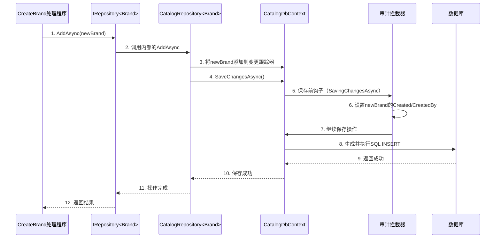

# 第5章：数据持久化层

欢迎回来

在[第4章：领域实体与可审计行为](04_domain_entities___auditable_behavior_.md)中，我们定义了核心业务“事物”，如`Brand`实体，并赋予它们结构和自动历史跟踪功能。但这些`Brand`实体只是应用程序内存中的C#类。当你创建一个新品牌或查看品牌列表时，它们实际上是如何存储和检索的？

想象一下，你正在运营一个繁忙的图书馆。你有一个详细的系统来分类书籍、跟踪借阅者和归还时间。但如果无法*存储*书籍及其记录，并在会员询问时快速*找到*它们，所有这些信息都毫无用处！你肯定不会把笔记写在散纸上，然后指望一切顺利

本章将全面介绍**数据持久化层**。这是应用程序中充当==高度组织化的归档和检索系统==的部分。它定义了应用程序如何存储和检索所有宝贵的数据，确保数据安全地保存在数据库中，并能高效访问。

## 问题：数据库的痛点

如果没有专用的数据持久化层，你将面临以下挑战：

*   **复杂的数据库代码**：你需要直接在应用程序中编写原始SQL命令（如`INSERT INTO Brands (...)`或`SELECT * FROM Products WHERE ...`）。这种方式冗长且容易出错。
*   **手动映射**：你需要手动将C#的`Brand`对象转换为数据库表中的行，反之亦然。
*   **数据库特定性**：你的代码会紧密耦合到特定的数据库技术（如PostgreSQL、SQL Server）。切换数据库意味着重写大部分应用程序代码。
*   **重复操作**：每次添加、获取、更新或删除（CRUD）记录时，你都需要编写类似的样板代码。

我们的`dotnet-starter-kit`通过==提供一个健壮的、抽象化的持久化层来解决这些问题==，为你处理所有这些复杂性。

## 解决方案：Entity Framework Core、`FshDbContext`和`IRepository`

`dotnet-starter-kit`使用以下工具和模式的强大组合来管理数据持久化：

1.  **Entity Framework Core (EF Core)**：这是.NET中流行的**对象关系映射器（ORM）**。可以把它看作一个神奇的翻译器。它允许你像操作数据库一样操作C#对象（如`Brand`、`Product`），并自动处理C#代码与底层数据库SQL命令之间的转换。你编写C#代码，EF Core生成并执行SQL。
2.  **`FshDbContext`**：这是我们应用程序的核心数据库“上下文”。它是EF Core中的一个特殊类，表示与数据库的会话。它知道所有你的实体（如`DbSet<Brand>`），并负责跟踪更改、查询数据和保存更新。我们的`FshDbContext`经过增强，可以处理应用程序范围内的常见问题，尤其是**多租户**（我们将在[第6章：多租户（FshTenantInfo）](06_multi_tenancy__fshtenantinfo__.md)中探讨）。
3.  **`IRepository`**：这是一个通用接口，提供了一种干净、通用的方式来执行基本的数据操作（添加、获取、更新、删除）*任何*实体。它就像一个通用适配器。你的业务逻辑（例如在MediatR处理程序中）与`IRepository`交互，后者再与EF Core交互，从而屏蔽了特定的数据库技术。

## 如何使用：存储和检索品牌

让我们回顾一下[第3章：命令/查询职责分离（CQRS）与MediatR](03_command_query_responsibility_segregation__cqrs__with_mediatr_.md)中的`CreateBrandHandler`和`SearchBrandsHandler`。它们需要一种方式来保存和加载`Brand`实体。这就是`IRepository`的用武之地。

### 1. 使用`IRepository<Brand>`保存新品牌

在我们的`CreateBrandHandler`中，我们注入`IRepository<Brand>`并使用其`AddAsync`方法。

```csharp
// src/api/modules/Catalog/Catalog.Application/Brands/Create/v1/CreateBrandHandler.cs（简化）
public sealed class CreateBrandHandler(
    IRepository<Brand> repository) // 依赖：Brand的IRepository
    : IRequestHandler<CreateBrandCommand, CreateBrandResponse>
{
    public async Task<CreateBrandResponse> Handle(CreateBrandCommand request, CancellationToken cancellationToken)
    {
        // 1. 创建一个新的Brand对象（来自第4章）
        var brand = Brand.Create(request.Name!, request.Description);

        // 2. 使用存储库将新Brand保存到数据库
        await repository.AddAsync(brand, cancellationToken); // 持久化发生在这里！

        // 3. 返回新Brand的ID
        return new CreateBrandResponse(brand.Id);
    }
}
```
**解释**：注意这有多简单！处理程序不知道`Brand`是如何保存的（例如生成了什么SQL，使用了什么数据库）。它只是告诉`repository`执行`AddAsync`操作。`IRepository`抽象使代码干净且专注于业务逻辑。

### 2. 使用`IReadRepository<Brand>`检索品牌

类似地，`SearchBrandsHandler`需要从数据库中获取品牌。它使用`IReadRepository<Brand>`（存储库的只读版本）及其`ListAsync`和`CountAsync`方法。

```csharp
// src/api/modules/Catalog/Catalog.Application/Brands/Search/v1/SearchBrandsHandler.cs（简化）
public sealed class SearchBrandsHandler(
    IReadRepository<Brand> repository) // 依赖：Brand的IReadRepository
    : IRequestHandler<SearchBrandsCommand, PagedList<BrandResponse>>
{
    public async Task<PagedList<BrandResponse>> Handle(SearchBrandsCommand request, CancellationToken cancellationToken)
    {
        // 1. 构建一个“规范”来过滤和排序品牌
        var spec = new SearchBrandSpecs(request); // 定义搜索条件

        // 2. 从存储库中获取过滤和分页的项目
        var items = await repository.ListAsync(spec, cancellationToken).ConfigureAwait(false);

        // 3. 获取匹配过滤器的项目总数
        var totalCount = await repository.CountAsync(spec, cancellationToken).ConfigureAwait(false);

        // 4. 返回结果
        return new PagedList<BrandResponse>(items, request!.PageNumber, request!.PageSize, totalCount);
    }
}
```
**解释**：同样，`SearchBrandsHandler`不关心SQL或数据库连接。它只需向`repository`提供`SearchBrandSpecs`（描述*搜索内容*），存储库就会返回匹配的`Brand`对象。

## 幕后：数据持久化的工作原理

让我们追踪`CreateBrandCommand`的流程，以理解数据持久化层的内部工作原理。

### 1. 创建品牌时的数据流


**解释**：
*   `CreateBrandHandler`调用`IRepository`的`AddAsync`。
*   这个调用由具体实现`CatalogRepository<Brand>`处理。
*   `CatalogRepository`然后使用`CatalogDbContext`（EF Core的`DbContext`）跟踪新的`Brand`实体，并最终调用`SaveChangesAsync`。
*   在保存之前，`AuditInterceptor`（来自[第4章：领域实体与可审计行为](04_domain_entities___auditable_behavior_.md)）自动填充`Created`和`CreatedBy`字段。
*   最后，`CatalogDbContext`生成适当的SQL `INSERT`语句并将其发送到实际的数据库。

### 2. `FshDbContext`：核心数据库上下文

`FshDbContext`是我们所有应用程序`DbContext`的基础。它扩展了EF Core的`MultiTenantDbContext`（用于[第6章：多租户（FshTenantInfo）](06_multi_tenancy__fshtenantinfo__.md)），并处理重要的全局问题：

```csharp
// src/api/framework/Infrastructure/Persistence/FshDbContext.cs（简化）
public class FshDbContext(IMultiTenantContextAccessor<FshTenantInfo> multiTenantContextAccessor,
    DbContextOptions options, IPublisher publisher, IOptions<DatabaseOptions> settings)
    : MultiTenantDbContext(multiTenantContextAccessor, options)
{
    private readonly DatabaseOptions _settings = settings.Value;

    protected override void OnModelCreating(ModelBuilder modelBuilder)
    {
        // 1. 自动从所有查询中过滤掉软删除的实体
        modelBuilder.AppendGlobalQueryFilter<ISoftDeletable>(s => s.Deleted == null);
        base.OnModelCreating(modelBuilder);
    }

    protected override void OnConfiguring(DbContextOptionsBuilder optionsBuilder)
    {
        // 2. 配置数据库提供程序（PostgreSQL、MSSQL）和连接字符串
        if (!string.IsNullOrWhiteSpace(multiTenantContextAccessor?.MultiTenantContext.TenantInfo?.ConnectionString))
        {
            optionsBuilder.ConfigureDatabase(_settings.Provider, multiTenantContextAccessor.MultiTenantContext.TenantInfo.ConnectionString!);
        }
    }

    public override async Task<int> SaveChangesAsync(CancellationToken cancellationToken = default)
    {
        // 3. 保存后发布领域事件（高级功能）
        this.TenantNotSetMode = TenantNotSetMode.Overwrite;
        int result = await base.SaveChangesAsync(cancellationToken).ConfigureAwait(false);
        await PublishDomainEventsAsync().ConfigureAwait(false);
        return result;
    }
    // ... PublishDomainEventsAsync方法 ...
}
```
**解释**：
*   **软删除的全局查询过滤器**：`FshDbContext`自动为所有实现`ISoftDeletable`的实体（如第4章中的`Brand`）添加`s => s.Deleted == null`到每个查询中。这意味着当你查询`Brands`时，默认情况下*永远不会*看到软删除的记录，而无需记住在每个地方添加`WHERE Deleted IS NULL`。
*   **数据库配置**：`OnConfiguring`方法根据设置和当前租户动态选择数据库提供程序（如PostgreSQL或MSSQL）和连接字符串。
*   **领域事件**：保存更改后，`FshDbContext`有逻辑发布“领域事件”，这是一种通知应用程序其他部分发生了重要事情的方式（例如“BrandCreatedEvent”）。

### 3. 模块特定的DbContext：`CatalogDbContext`

应用程序中的每个主要模块（如“Catalog”或“Todo”）都有自己的专用`DbContext`，继承自`FshDbContext`。这保持了每个模块的数据库问题分离和清晰。

```csharp
// src/api/modules/Catalog/Catalog.Infrastructure/Persistence/CatalogDbContext.cs（简化）
public sealed class CatalogDbContext : FshDbContext
{
    public CatalogDbContext(IMultiTenantContextAccessor<FshTenantInfo> multiTenantContextAccessor, DbContextOptions<CatalogDbContext> options, IPublisher publisher, IOptions<DatabaseOptions> settings)
        : base(multiTenantContextAccessor, options, publisher, settings)
    {
    }

    public DbSet<Product> Products { get; set; } = null!; // 表示Products表
    public DbSet<Brand> Brands { get; set; } = null!;     // 表示Brands表

    protected override void OnModelCreating(ModelBuilder modelBuilder)
    {
        base.OnModelCreating(modelBuilder);
        // 应用Brand和Product的配置（如表名、列类型）
        modelBuilder.ApplyConfigurationsFromAssembly(typeof(CatalogDbContext).Assembly);
        modelBuilder.HasDefaultSchema(SchemaNames.Catalog); // 为此模块设置默认模式
    }
}
```
**解释**：
*   `CatalogDbContext`声明`DbSet<Product>`和`DbSet<Brand>`，告诉EF Core它管理的实体。这些`DbSet`用于查询你的实体（例如`_context.Brands.Where(...)`）。
*   `OnModelCreating`为`Product`和`Brand`实体应用特定配置，并为Catalog模块设置默认数据库模式。

### 4. `IRepository`及其实现：`CatalogRepository`

`IRepository`接口（`IRepository<T>`）定义了基本CRUD操作的契约。`CatalogRepository<T>`实现了这个接口，使用`CatalogDbContext`执行实际的数据库交互。

```csharp
// src/api/framework/Core/Persistence/IRepository.cs（简化）
public interface IRepository<T> : IRepositoryBase<T> // IRepositoryBase有Add、Update、Delete等
    where T : class, IAggregateRoot
{
}

public interface IReadRepository<T> : IReadRepositoryBase<T> // IReadRepositoryBase有Get、List、Count等
    where T : class, IAggregateRoot
{
}
```

```csharp
// src/api/modules/Catalog/Catalog.Infrastructure/Persistence/CatalogRepository.cs（简化）
internal sealed class CatalogRepository<T> : RepositoryBase<T>, IReadRepository<T>, IRepository<T>
    where T : class, IAggregateRoot
{
    public CatalogRepository(CatalogDbContext context) // 注入我们的CatalogDbContext
        : base(context) // 传递给基类RepositoryBase
    {
    }

    // 此方法用于高级场景，如使用Mapster直接投影
    // 它允许查询直接将数据库结果映射到DTO以提高效率
    protected override IQueryable<TResult> ApplySpecification<TResult>(ISpecification<T, TResult> specification) =>
        specification.Selector is not null
            ? base.ApplySpecification(specification)
            : ApplySpecification(specification, false)
                .ProjectToType<TResult>();
}
```
**解释**：
*   `IRepository<T>`和`IReadRepository<T>`定义了契约（可用的方法）。
*   `CatalogRepository<T>`（以及其他模块的类似存储库）是具体实现。它在构造函数中接收`CatalogDbContext`，并使用`RepositoryBase<T>`（来自Ardalis.Specification）执行操作。
*   `ApplySpecification`重写展示了一种高级优化，可以使用Mapster将结果直接映射到`TResult`类型，减少数据库和应用程序内存之间的数据传输。

### 5. 数据库配置：`DatabaseOptions`和`Extensions.ConfigureDatabase`

`DatabaseOptions`类保存数据库的配置，如提供程序类型（PostgreSQL、MSSQL）和连接字符串。`Extensions.ConfigureDatabase`方法使用这些选项设置EF Core。

```csharp
// src/api/framework/Core/Persistence/DatabaseOptions.cs（简化）
public class DatabaseOptions // 从appsettings.json读取
{
    public string Provider { get; set; } = "postgresql"; // 例如"postgresql"、"mssql"
    public string ConnectionString { get; set; } = string.Empty;
}
```

```csharp
// src/api/framework/Infrastructure/Persistence/Extensions.cs（简化）
public static class Extensions
{
    internal static DbContextOptionsBuilder ConfigureDatabase(this DbContextOptionsBuilder builder, string dbProvider, string connectionString)
    {
        return dbProvider.ToUpperInvariant() switch
        {
            DbProviders.PostgreSQL => builder.UseNpgsql(connectionString, e => e.MigrationsAssembly("FSH.Starter.WebApi.Migrations.PostgreSQL")),
            DbProviders.MSSQL => builder.UseSqlServer(connectionString, e => e.MigrationsAssembly("FSH.Starter.WebApi.Migrations.MSSQL")),
            _ => throw new InvalidOperationException($"DB Provider {dbProvider} is not supported."),
        };
    }

    public static IServiceCollection BindDbContext<TContext>(this IServiceCollection services)
        where TContext : DbContext
    {
        services.AddDbContext<TContext>((sp, options) =>
        {
            var dbConfig = sp.GetRequiredService<IOptions<DatabaseOptions>>().Value;
            options.ConfigureDatabase(dbConfig.Provider, dbConfig.ConnectionString); // 使用ConfigureDatabase方法
            options.AddInterceptors(sp.GetServices<ISaveChangesInterceptor>()); // 添加拦截器如AuditInterceptor
        });
        return services;
    }
}
```
**解释**：
*   `DatabaseOptions`通常从你的`appsettings.json`文件中加载。
*   `DbContextOptionsBuilder`上的`ConfigureDatabase`扩展方法根据`Provider`字符串智能地设置正确的EF Core提供程序（例如PostgreSQL的`UseNpgsql`、MSSQL的`UseSqlServer`）。它还指向正确的迁移程序集。
*   `BindDbContext`是一个辅助方法，将你的特定`DbContext`（如`CatalogDbContext`）注册到依赖注入系统中，确保它获得正确的数据库选项和任何注册的`ISaveChangesInterceptor`（如第4章中的`AuditInterceptor`）。

### 数据持久化层的关键组件

| 组件                       | 角色                                                         | 类比                                                       |
| :------------------------- | :----------------------------------------------------------- | :--------------------------------------------------------- |
| **Entity Framework Core**  | 对象关系映射器（ORM），将C#转换为SQL。                       | 一个会说“C#”和“数据库SQL”的神奇翻译器。                    |
| **`FshDbContext`**         | 基础的EF Core `DbContext`，处理全局问题如多租户和软删除过滤器。 | 主中央档案馆大楼。                                         |
| **`CatalogDbContext`**     | 模块特定的`DbContext`，用于`Brand`、`Product`实体。          | 档案馆内的特定部门（如“目录记录”）。                       |
| **`IRepository<T>`**       | 基本数据操作（CRUD）的通用接口。                             | 与任何档案交互的通用适配器。                               |
| **`CatalogRepository<T>`** | `IRepository`的实现，用于Catalog实体，使用`CatalogDbContext`。 | “目录记录”的专职档案管理员，知道如何使用“目录部门”办公室。 |
| **`DatabaseOptions`**      | 数据库提供程序和连接字符串的配置。                           | 档案系统的设置（如“使用PostgreSQL”、“连接到这里”）。       |
| **`AuditInterceptor`**     | 自动填充审计字段（来自第4章）。                              | 细心的记录员，自动盖章“创建者”和“最后修改”。               |

## 结论

你已经成功探索了`dotnet-starter-kit`中健壮的**数据持久化层**！我们看到了**Entity Framework Core**如何作为C#实体与数据库之间的强大翻译器。专门的**`FshDbContext`**作为核心数据库上下文，处理共享问题如软删除和多租户。最后，**`IRepository`**提供了一种干净、通用的接口来执行数据操作，屏蔽了底层数据库技术。这种分层方法确保你的数据被可靠且高效地存储和检索。

这个强大的持久化层，加上`FshDbContext`的独特功能，对于处理复杂的应用程序需求至关重要。接下来，我们将深入探讨`FshDbContext`最重要的职责之一：[多租户（FshTenantInfo）](06_multi_tenancy__fshtenantinfo__.md)。

