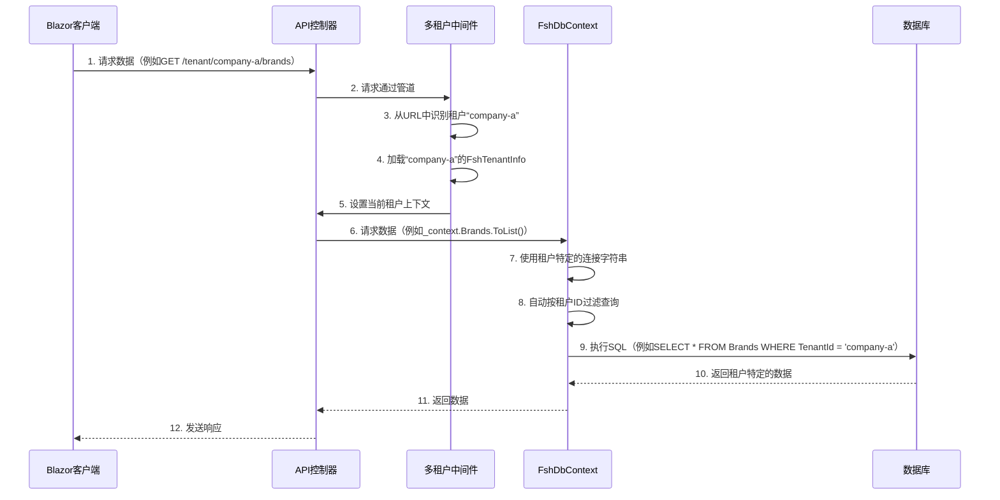

# 第6章：多租户（FshTenantInfo）

欢迎回来

在[第5章：数据持久化层](05_data_persistence_layer_.md)中，我们探讨了应用程序如何使用Entity Framework Core和`FshDbContext`存储和检索数据。我们甚至简要提到了`FshDbContext`是如何设计来处理“多租户”的。现在，是时候全面解析这个强大的概念了！

想象一下，你正在构建一个软件产品，许多不同的公司都想使用它。每家公司都需要自己独立的应用程序版本：
*   公司A需要自己的数据集（例如自己的产品列表、客户）。
*   公司B需要自己的配置。
*   两家公司都不应该看到对方的数据。

如果你必须为*每*家公司部署一个完全独立的应用程序实例，并配备自己的数据库，那将是一场管理噩梦！你将不得不更新和维护数十甚至数百个相同的应用程序，这非常低效。

这就是**多租户**的用武之地。它是一个核心概念，允许单个应用程序实例为多个独立的客户或“租户”提供服务。每个租户就像拥有自己专用的应用程序一样运行，具有隔离的数据和配置，同时共享底层基础设施（如应用程序代码和数据库服务器本身）。

可以把它想象成一栋共享公寓楼（你的单个应用程序实例），其中每个公寓都是一个独立的租户。每个人都共享相同的建筑结构（应用程序代码）和公用设施（数据库服务器），但每个公寓都有自己独特的生活空间、家具和规则（隔离的数据和配置）。

`dotnet-starter-kit`通过一个健壮的多租户系统实现了这一点，其核心是`FshTenantInfo`类。

## 问题：数据和配置隔离

如果没有多租户，确保每个客户的数据和设置完全分离和安全将变得极其困难。你需要：
*   手动为每个数据库表添加“TenantId”列。
*   记住在每个数据库查询中按当前租户的ID进行过滤。
*   管理每个租户的独立连接字符串，或者以某种方式动态切换它们。
*   处理新租户数据库的创建和初始化。

这是一项重复且容易出错的工作，会分散你构建核心业务功能的注意力。

## 解决方案：`FshTenantInfo`和Finbuckle.MultiTenant

`dotnet-starter-kit`利用流行的`Finbuckle.MultiTenant`库，通过自定义的`FshTenantInfo`类扩展它，以无缝管理多个租户。

### 1. `FshTenantInfo`：租户的身份证

`FshTenantInfo`是存储每个租户特定详细信息的核心对象。它就像租户的身份证，保存着关于他们是谁以及如何访问其资源的关键信息。

`FshTenantInfo`中的关键属性包括：
*   `Id`：租户的唯一标识符（例如“company-a”、“my-app”）。这通常用于在URL或标头中标识租户。
*   `Name`：租户的显示名称（例如“Company A Corp.”）。
*   `ConnectionString`：此租户数据的特定数据库连接字符串。如果为空，则使用默认的应用程序连接字符串。
*   `IsActive`：标志，指示租户当前是否活跃并被允许使用应用程序。
*   `ValidUpto`：租户的订阅或访问到期时间。
*   `AdminEmail`：租户管理员的电子邮件地址。

### 2. Finbuckle.MultiTenant：多租户协调器

`Finbuckle.MultiTenant`库充当“公寓楼管理员”。它处理以下复杂任务：
*   **租户识别**：确定当前请求来自哪个租户（例如从URL或HTTP标头中提取）。
*   **上下文管理**：使当前的`FshTenantInfo`在整个应用程序中可用。
*   **数据隔离**：自动确保数据库查询仅返回与当前租户相关的数据。
*   **连接字符串管理**：使用当前租户的正确连接字符串。

## 如何使用：与租户一起工作

让我们看看我们的应用程序如何使用`FshTenantInfo`来管理多租户。

### 识别当前租户

`dotnet-starter-kit`通常从**URL路径**中识别租户。你经常会看到租户的`Id`作为URL的一部分，例如：`https://localhost:7000/tenant/company-a/swagger`。段`/tenant/company-a/`告诉应用程序当前租户是“company-a”。

### `FshTenantInfo`类的实际应用

以下是`FshTenantInfo`类的简化版本。它继承自`IFshTenantInfo`，后者来自`Finbuckle.MultiTenant`库，允许我们添加自定义字段。

```csharp
// src/api/framework/Infrastructure/Tenant/FshTenantInfo.cs

using FSH.Framework.Infrastructure.Tenant.Abstractions;
using Finbuckle.MultiTenant.Abstractions; // 来自Finbuckle.MultiTenant

public sealed class FshTenantInfo : IFshTenantInfo
{
    public FshTenantInfo() { } // 用于数据库加载的空构造函数

    public FshTenantInfo(string id, string name, string? connectionString, string adminEmail, string? issuer = null)
    {
        Id = id; // 唯一ID（例如“company-a”）
        Identifier = id; // 也作为Finbuckle.MultiTenant的标识符
        Name = name; // 显示名称（例如“Company A”）
        ConnectionString = connectionString ?? string.Empty; // 数据库连接
        AdminEmail = adminEmail; // 管理员的电子邮件
        IsActive = true; // 初始状态为活跃
        Issuer = issuer;
        ValidUpto = DateTime.UtcNow.AddMonths(1); // 默认1个月有效期
    }

    public string Id { get; set; } = default!;
    public string Identifier { get; set; } = default!;
    public string Name { get; set; } = default!;
    public string ConnectionString { get; set; } = default!;
    public string AdminEmail { get; set; } = default!;
    public bool IsActive { get; set; }
    public DateTime ValidUpto { get; set; }
    public string? Issuer { get; set; }

    // 管理租户状态的方法
    public void AddValidity(int months) => ValidUpto = ValidUpto.AddMonths(months);
    public void Activate() => IsActive = true;
    public void Deactivate() => IsActive = false;
}
```
**解释**：这个类是每个租户信息的蓝图。它包括`Id`、`Name`和`ConnectionString`等基本数据。它还有`Activate`和`Deactivate`等方法，用于控制租户的活跃状态，可以由管理用户调用。

### 使用`ITenantService`管理租户

`ITenantService`提供了创建、激活、停用和检索`FshTenantInfo`对象的方法。这是你以编程方式管理租户的方式。

```csharp
// src/api/framework/Core/Tenant/Abstractions/ITenantService.cs

using FSH.Framework.Core.Tenant.Dtos;
using FSH.Framework.Core.Tenant.Features.CreateTenant;

public interface ITenantService
{
    Task<List<TenantDetail>> GetAllAsync();
    Task<bool> ExistsWithIdAsync(string id);
    Task<TenantDetail> GetByIdAsync(string id);
    Task<string> CreateAsync(CreateTenantCommand request, CancellationToken cancellationToken);
    Task<string> ActivateAsync(string id, CancellationToken cancellationToken);
    Task<string> DeactivateAsync(string id);
    Task<DateTime> UpgradeSubscription(string id, DateTime extendedExpiryDate);
}
```
**解释**：这个接口定义了管理租户的服务契约。例如，`CreateAsync`用于向系统中添加新租户，`ActivateAsync`开启租户的访问权限，`DeactivateAsync`关闭它。

### 创建新租户

当你创建一个新租户时，`TenantService`不仅存储`FshTenantInfo`，还确保他们的数据库正确设置。

```csharp
// src/api/framework/Infrastructure/Tenant/Services/TenantService.cs（简化）

public sealed class TenantService : ITenantService
{
    // ... 构造函数和其他方法 ...

    public async Task<string> CreateAsync(CreateTenantCommand request, CancellationToken cancellationToken)
    {
        // 1. 创建一个新的FshTenantInfo对象
        FshTenantInfo tenant = new(request.Id, request.Name, request.ConnectionString, request.AdminEmail, request.Issuer);

        // 2. 存储租户信息（例如在专门的租户数据库中）
        await _tenantStore.TryAddAsync(tenant).ConfigureAwait(false);

        // 3. 初始化新租户的数据库（迁移、种子数据）
        await InitializeDatabase(tenant).ConfigureAwait(false);

        return tenant.Id;
    }

    private async Task InitializeDatabase(FshTenantInfo tenant)
    {
        // 此方法确保新租户获得自己隔离的数据库模式或数据库。
        using var scope = _serviceProvider.CreateScope(); // 创建一个专用范围
        scope.ServiceProvider.GetRequiredService<IMultiTenantContextSetter>()
            .MultiTenantContext = new MultiTenantContext<FshTenantInfo>()
            {
                TenantInfo = tenant // 将上下文设置为新租户
            };

        // 为此特定租户运行数据库迁移和种子初始数据
        var initializers = scope.ServiceProvider.GetServices<IDbInitializer>();
        foreach (var initializer in initializers)
        {
            await initializer.MigrateAsync(CancellationToken.None).ConfigureAwait(false);
            await initializer.SeedAsync(CancellationToken.None).ConfigureAwait(false);
        }
    }
}
```
**解释**：`CreateAsync`方法根据请求构造一个新的`FshTenantInfo`。然后保存这个`FshTenantInfo`（通常存储在专用的“租户”数据库中），并关键地调用`InitializeDatabase`。`InitializeDatabase`方法创建一个新的隔离范围，将当前上下文设置为*新创建的租户*，然后为*该特定租户*运行任何必要的数据库迁移和初始数据种子。这确保新租户获得一个干净、可用的数据库环境。

## 幕后：多租户流程

让我们可视化多租户如何协调请求，当用户尝试访问特定租户的数据时。


**解释**：
1.  **客户端请求**：Blazor客户端发送一个包含租户标识符的URL请求。
2.  **租户识别**：`MultiTenantMiddleware`（来自`Finbuckle.MultiTenant`的组件）拦截请求。它从URL中提取租户ID（例如“company-a”）。
3.  **加载`FshTenantInfo`**：中间件然后加载“company-a”的完整`FshTenantInfo`对象（从专用的“租户”数据库中）。
4.  **设置上下文**：将“company-a”的`FshTenantInfo`设置为本次请求的“当前租户”。
5.  **`FshDbContext`配置**：当使用`FshDbContext`访问数据时（如[第5章：数据持久化层](05_data_persistence_layer_.md)所示），它会自动参考“当前租户”上下文：
    *   **连接字符串**：它使用`FshTenantInfo`中指定的`ConnectionString`（如果存在）连接到正确的数据库。如果`ConnectionString`为空，则默认为应用程序的主连接字符串，意味着共享数据库并通过租户ID进行数据隔离。
    *   **数据过滤**：因为`FshDbContext`继承自`MultiTenantDbContext`（来自`Finbuckle.MultiTenant`），它会自动为每个查询添加一个隐藏的`WHERE TenantId = 'current_tenant_id'`子句。这确保即使你忘记过滤，也*只会*看到当前租户的数据。
6.  **数据库交互**：数据库仅返回“company-a”特定的数据。
7.  **响应**：应用程序仅返回属于“company-a”的数据给客户端。

整个过程无缝进行，无需你的应用程序代码在每个查询中显式管理租户ID或连接字符串。

### `TenantDbContext`：存储租户信息

`FshTenantInfo`对象本身需要存储在某个地方。这由专门的`TenantDbContext`处理，它是一个用于管理租户信息的专用`DbContext`。

```csharp
// src/api/framework/Infrastructure/Tenant/Persistence/TenantDbContext.cs

using Finbuckle.MultiTenant.EntityFrameworkCore.Stores.EFCoreStore;
using Microsoft.EntityFrameworkCore;

public class TenantDbContext : EFCoreStoreDbContext<FshTenantInfo>
{
    public const string Schema = "tenant"; // 租户信息的专用模式
    public TenantDbContext(DbContextOptions<TenantDbContext> options)
        : base(options)
    {
        // ...（特定提供程序设置）...
    }

    protected override void OnModelCreating(ModelBuilder modelBuilder)
    {
        ArgumentNullException.ThrowIfNull(modelBuilder);
        base.OnModelCreating(modelBuilder);

        // 配置FshTenantInfo实体存储在“tenant”模式下的“Tenants”表中
        modelBuilder.Entity<FshTenantInfo>().ToTable("Tenants", Schema);
    }
}
```
**解释**：这个`TenantDbContext`负责存储和检索`FshTenantInfo`对象。它告诉Entity Framework Core将`FshTenantInfo`映射到名为“Tenants”的表，位于专用的“tenant”数据库模式中，与应用程序的常规数据分开。

### 重温`FshDbContext`：租户感知的数据访问

还记得[第5章：数据持久化层](05_data_persistence_layer_.md)中的`FshDbContext`吗？它对多租户至关重要，因为它知道如何使用`FshTenantInfo`进行数据库连接。

```csharp
// src/api/framework/Infrastructure/Persistence/FshDbContext.cs（简化）

public class FshDbContext(IMultiTenantContextAccessor<FshTenantInfo> multiTenantContextAccessor,
    DbContextOptions options, /* ... 其他服务 ... */)
    : MultiTenantDbContext(multiTenantContextAccessor, options) // 继承自MultiTenantDbContext！
{
    private readonly DatabaseOptions _settings = settings.Value;

    // ... OnModelCreating（用于软删除过滤器）...

    protected override void OnConfiguring(DbContextOptionsBuilder optionsBuilder)
    {
        // 从当前FshTenantInfo获取连接字符串
        var tenantConnectionString = multiTenantContextAccessor?.MultiTenantContext.TenantInfo?.ConnectionString;

        // 如果存在租户特定的连接字符串且不为空，则使用它。
        // 否则，回退到应用程序的默认连接字符串。
        if (!string.IsNullOrWhiteSpace(tenantConnectionString))
        {
            optionsBuilder.ConfigureDatabase(_settings.Provider, tenantConnectionString);
        }
        else // 使用appsettings.json中定义的默认连接字符串
        {
            optionsBuilder.ConfigureDatabase(_settings.Provider, _settings.ConnectionString!);
        }
        base.OnConfiguring(optionsBuilder);
    }

    // ... SaveChangesAsync（用于领域事件）...
}
```
**解释**：在`FshDbContext`的`OnConfiguring`方法中，它首先尝试从`multiTenantContextAccessor`（保存当前`FshTenantInfo`）获取`ConnectionString`。如果提供了租户特定的连接字符串，则使用它。否则，回退到应用程序的默认连接字符串。这允许：
1.  **每个租户的模式/数据库**：每个租户有自己的独立数据库或模式，由其唯一的`ConnectionString`指向。
2.  **共享数据库与TenantId列**：所有租户共享一个数据库，`MultiTenantDbContext`自动使用每个表中的`TenantId`列过滤数据（例如`Brand.TenantId`）。`dotnet-starter-kit`支持这两种方式。

## 关键多租户组件

| 组件                          | 角色                                                         | 类比                                               |
| :---------------------------- | :----------------------------------------------------------- | :------------------------------------------------- |
| **`FshTenantInfo`**           | 存储每个租户的特定详细信息（ID、名称、连接字符串）。         | 每个公寓居民的身份证。                             |
| **`Finbuckle.MultiTenant`库** | 协调租户识别和上下文管理。                                   | 公寓楼管理员。                                     |
| **`ITenantService`**          | 管理租户生命周期（创建、激活、停用）的接口。                 | 大楼的管理办公室。                                 |
| **`TenantService`**           | `ITenantService`的实现，管理`FshTenantInfo`和数据库初始化。  | 处理新租赁并准备公寓的物业经理。                   |
| **`TenantDbContext`**         | 存储`FshTenantInfo`对象的专用数据库上下文。                  | 大楼的居民中央目录。                               |
| **`FshDbContext`（重温）**    | 基础的应用程序`DbContext`，具有租户感知能力，使用正确的连接字符串并应用租户过滤器。 | 智能公用系统，确保每间公寓有自己的电表和水表读数。 |

## 结论

你刚刚掌握了**多租户**的概念，以及`dotnet-starter-kit`如何使用`FshTenantInfo`实现它！你了解到多租户允许单个应用程序为多个独立客户提供服务，每个客户都有隔离的数据和配置。`FshTenantInfo`类保存了每个租户的所有重要信息，而`Finbuckle.MultiTenant`库无缝处理租户识别和数据隔离。你看到了`ITenantService`如何管理租户，以及`FshDbContext`如何动态适应当前租户的连接字符串并自动过滤数据。这个健壮的系统提供了可扩展性和安全性，非常适合SaaS应用程序。

现在我们的应用程序可以安全地管理多个租户，下一章我们将把注意力转向理解应用程序的性能表现，并通过[可观测性堆栈](07_observability_stack_.md)快速发现问题。

