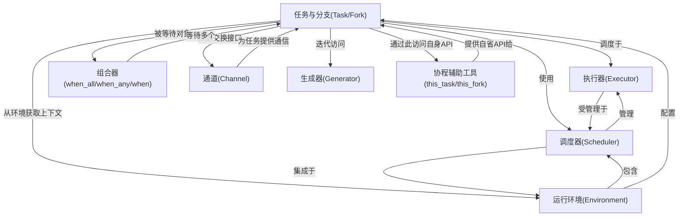
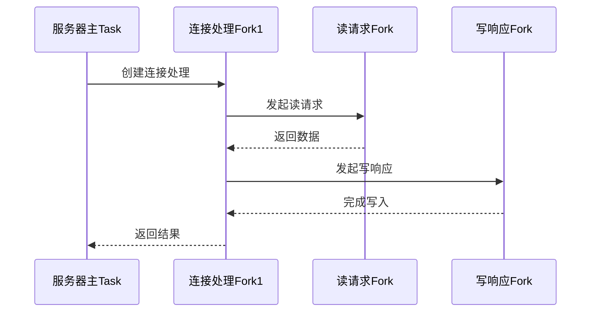
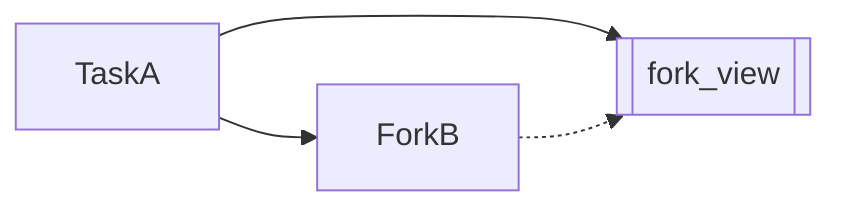

# docs：Coflux

Coflux是一个基于C++20协程的高性能框架，提供**==结构化并发==**和"**==任务即上下文==**"设计理念

通过`std::pmr`集成和灵活的`executor`管理机制，实现基于RAII的异步操作生命周期管理，使开发者能够构建安全、可预测且内存高效的复杂并发系统。

## 架构



## 章节

1. [任务与分支](01_task_and_fork_.md)
2. [运行环境](02_environment_.md)
3. [调度器](03_scheduler_.md)
4. [执行器](04_executor_.md)
5. [组合器(when_all/when_any/when)](05_combiner__when_all__when_any__when__.md)
6. [通道](06_channel_.md)
7. [生成器](07_generator_.md)
8. [协程辅助工具(this_task/this_fork)](08_this_coroutine_helpers__this_task__this_fork__.md)

---
# 第一章：任务与分支

欢迎来到Coflux

本章将深入探讨该框架异步编程的核心构建模块：`Task`（任务）与`Fork`（分支）

这两个概念是Coflux实现结构化并发管理的关键基石。

## 异步工作管理的挑战

设想管理一个大型软件项目，主项目包含多个子项目，每个子项目又涉及多个独立任务。若缺乏清晰的职责划分和生命周期管理，将导致：
* **孤儿任务**：子任务完成后无人接管其产出
* **失控故障**：子任务失败无法向上传递
* **资源泄漏**：主任务结束时子任务未正确清理

传统异步编程常出现"孤儿任务"问题——后台操作与创建者脱钩，导致难以追踪和清理。Coflux通过`Task`和`Fork`模型实现**结构化并发**，为C++应用提供解决方案。

## 核心概念解析

### `Task`（任务）
- **角色**：项目总负责人
- **职责**：
  - 管理下属所有`Fork`的生命周期
  - 确保自身销毁前所有子任务完成
  - 定义并发工作边界

### `Fork`（分支）
- **角色**：项目组成员
- **特性**：
  - 必须依附于父级`Task`或`Fork`
  - 随父级结束自动清理
  - 执行具体原子操作

### 对比矩阵
| 特性         | `coflux::task`         | `coflux::fork`       |
| ------------ | ---------------------- | -------------------- |
| **所有权**   | 拥有子任务管理权       | 依赖父级管理生命周期 |
| **生命周期** | 确保子任务完成后才销毁 | 父级结束时自动清理   |
| **典型场景** | 顶层服务/复杂子项目    | 具体子任务/步骤操作  |

## 实战案例：网络连接管理

```cpp
// 服务器主任务（Task）
auto server_task = [](auto& env) -> coflux::task<void> {
    // 并发处理三个客户端连接（Fork）
    co_await coflux::when_all(
        handle_connection(co_await coflux::context(), 1),
        handle_connection(co_await coflux::context(), 2),
        handle_connection(co_await coflux::context(), 3)
    );
}(env);

// 连接处理分支（Fork）
coflux::fork<void> handle_connection(auto&& env, int client_id) {
    auto request = co_await async_read_request(env, client_id);  // 子Fork
    co_await async_write_response(env, request + " [processed]"); // 子Fork
}
```

**执行流程**：


## 生命周期验证测试

```cpp
TEST(StructureTest, 任务析构同步子任务) {
    std::atomic<int> counter = 0;
    
    { // 作用域开始
        auto task = []() -> coflux::task<void> {
            counted_fork(co_await coflux::context()); // 子Fork1
            counted_fork(co_await coflux::context()); // 子Fork2
        }();
        // 此处task析构，会等待两个fork完成
    }
    
    ASSERT_EQ(counter.load(), 0); // 验证资源完全释放
}
```

## 底层机制揭秘

### 模板架构设计
```cpp
template <bool Ownership>
class basic_task {
    ~basic_task() {
        if constexpr (Ownership) {
            WaitForChildren(); // 任务版本等待子任务
        }
        // Fork版本由父级管理
    }
};

using task = basic_task<true>;  // 拥有子任务所有权
using fork = basic_task<false>; // 依赖父级管理
```

### 观察者模式：fork_view
允许一个Fork观察另一个Fork的结果而不建立所有权关系：


**注意事项**：
- `fork_view`必须短于被观察`Fork`的生命周期
- 仅提供只读访问接口
- 不改变原有依赖关系

## 本章总结

Coflux通过`Task`和`Fork`的层级化管理，实现了：
1. **结构化生命周期**：形成明确的父子依赖链
2. **自动资源回收**：父级析构保证子任务清理
3. **异常安全**：故障沿任务树向上传播
4. **清晰的并发边界**：每个Task定义独立工作域

下一章将探讨[运行环境](02_environment_.md)，了解任务执行所需的资源调度体系。