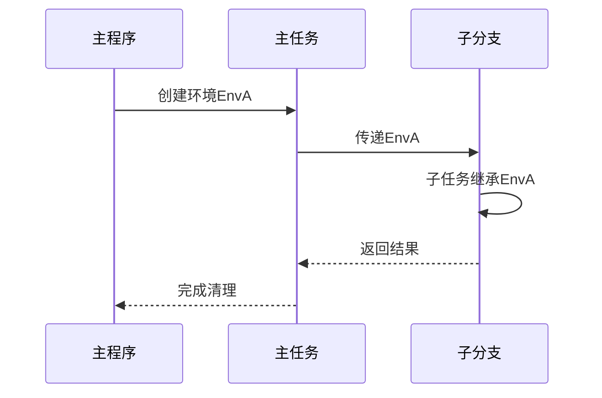

# 第二章：运行环境

在[第一章：任务与分支](01_task_and_fork_.md)中，我们学习了如何通过`Task`和`Fork`构建结构化的异步操作管理体系

但这些并发单元需要获取执行资源和运行规范，这就引出了`Environment`（运行环境）的概念。

## 核心价值：共享并发上下文

设想管理一个大型施工现场：
- **项目规范**：统一的操作标准
- **共享工具**：重型机械与安全设备
- **工作区域**：指定的操作空间
- **资源配额**：材料与资金分配

类似地，异步编程中的`Task`和`Fork`需要明确：
- **执行位置**：应使用哪个线程池
- **内存管理**：采用标准分配器还是高性能内存池

缺乏统一环境会导致效率低下、管理混乱甚至资源泄漏。

## 环境机制详解

`Environment`是Coflux中的上下文容器，为任务层级提供两大核心组件：

### 1. 调度器（Scheduler）
- 定义任务执行策略（详见[第三章：调度器](03_scheduler_.md)）
- 示例：指定CPU密集型与I/O密集型任务使用不同线程池

### 2. 内存资源（memory_resource）
- 基于C++20的`std::pmr`内存管理机制
- 支持定制化分配策略（如临时内存池）
- 显著提升高频内存操作性能

## 实战应用

### 环境初始化
```cpp
// 创建顶层环境（含线程池调度器）
using exec = coflux::thread_pool_executor<1024>;
auto env = coflux::make_environment<coflux::scheduler<exec>>();
```

### 任务环境继承
```cpp
coflux::task<void> server_task(auto&& env) {
    // 获取当前环境引用
    auto&& ctx = co_await coflux::context();
    
    // 启动子任务（自动继承环境）
    co_await handle_connection(ctx, 1); 
}
```

### 环境传递流程


## 底层实现

### 环境结构体
```cpp
struct environment {
    std::pmr::memory_resource* memo_;  // 内存资源指针
    scheduler_type scheduler_;        // 具体调度器实例
};
```

### 环境信息视图
```cpp
struct environment_info {
    scheduler<void> parent_scheduler_; // 类型擦除的调度器代理
    std::pmr::memory_resource* memo_; // 内存资源指针
    promise_fork_base* parent_promise_;// 结构化并发控制
};
```

### 工厂函数重载
```cpp
// 标准创建方式（使用默认内存资源）
auto env = coflux::make_environment<MyScheduler>(exec1, exec2);

// 高级创建方式（定制内存池）
auto pool = create_memory_pool();
auto env = coflux::make_environment(pool, MyScheduler{exec});
```

## 设计优势

1. **上下文一致性**：保障任务树使用统一的调度策略
2. **资源安全**：环境生命周期与主任务绑定
3. **性能优化**：支持细粒度内存管理
4. **扩展灵活**：通过类型擦除降低模板参数复杂度

下一章将深入解析[调度器](03_scheduler_.md)的工作机制，揭示任务执行位置的决策逻辑。