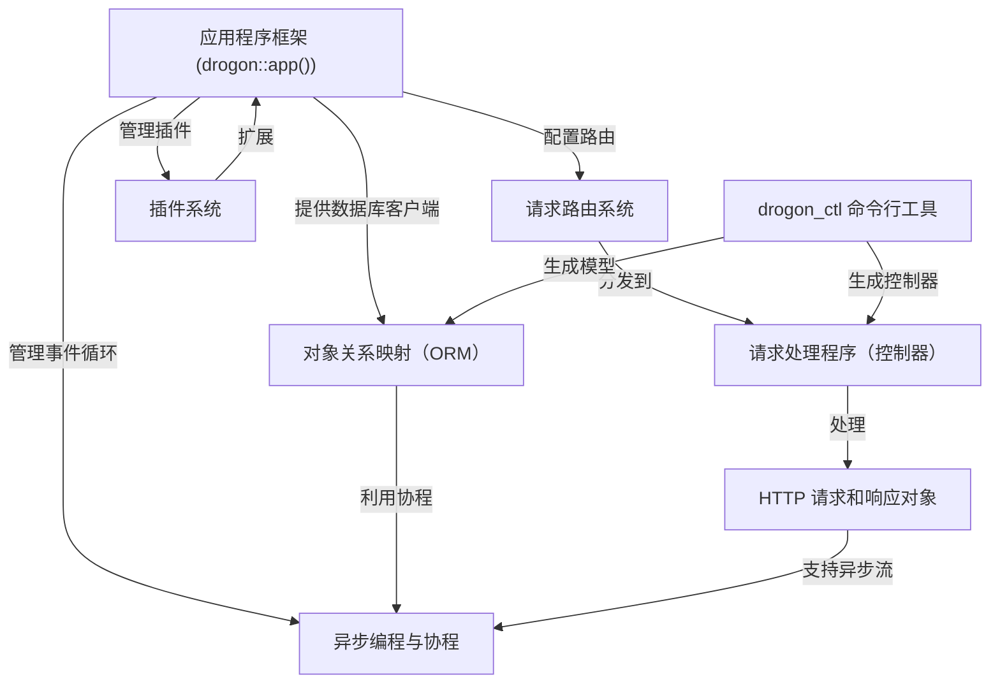
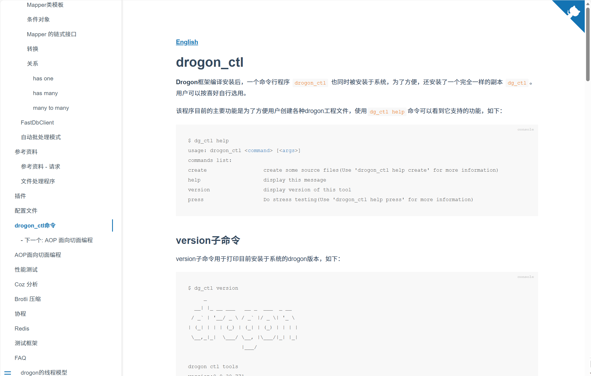
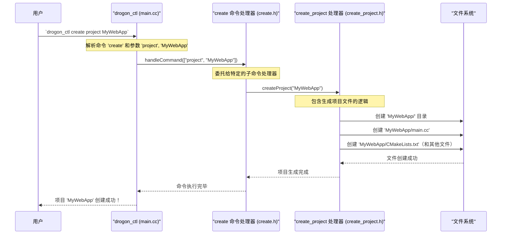

链接：[drogon的线程模型](https://drogonframework.github.io/drogon-docs/#/CHN/CHN-FAQ-1-线程模型)

# docs：drogon

Drogon 是一个**高性能 C++ Web 应用程序框架**，专为构建*异步 Web 服务器*和 *RESTful API* 而设计。==充当中央协调器==，管理应用程序生命周期，将传入的 HTTP 请求路由到适当的处理程序，并为数据库交互（ORM）、基于插件的可扩展性以及使用 C++20 协程的高效异步编程提供强大的工具

命令行工具 `drogon_ctl` 通过自动化样板代码生成进一步简化了开发。


## 可视化



## 章节

1. [drogon_ctl 命令行工具
](01_drogon_ctl_command_line_tool_.md)
2. [请求处理程序（控制器）
](02_request_handlers__controllers__.md)
3. [HTTP 请求和响应对象
](03_http_request_and_response_objects_.md)
4. [请求路由系统
](04_request_routing_system_.md)
5. [应用程序框架（drogon::app()）
](05_application_framework__drogon__app____.md)
6. [对象关系映射（ORM）
](06_object_relational_mapping__orm__.md)
7. [异步编程与协程
](07_asynchronous_programming___coroutines_.md)
8. [插件系统
](08_plugin_system_.md)

---

# 第 1 章：drogon_ctl 命令行工具

欢迎来到 Drogon 

当我们开始使用 C++ 构建强大的 Web 应用程序之旅时，我们会很快发现一个值得信赖的伙伴：`drogon_ctl`。可以把 `drogon_ctl` 看作是 Drogon 项目的私人助理。它是一个命令行工具，==处理许多重复性或"样板"任务，让我们能够专注于应用程序逻辑中核心的部分==。

## 为什么我们需要 `drogon_ctl`？

想象一下，我们正在启动一个新的 Web 项目

我们需要创建基本的项目结构，设置用于处理 Web 请求的文件，甚至可能需要连接到数据库。手动完成所有这些工作既耗时又容易出错。`drogon_ctl` ==自动化==了这些任务，使开发更快、更顺畅。

**例如：** 构建 Drogon 应用程序的第一步通常是创建项目本身。`drogon_ctl` 可以用一个命令为我们完成所有工作，而不是手动创建目录和文件

## `drogon_ctl` 能做什么

`drogon_ctl` 非常多功能。以下是它的一些核心功能：

*   **创建新项目：** 快速为新的 Drogon 应用程序设置基本文件结构。
*   **生成代码：** 自动为各种组件创建必要的 C++ 代码文件，例如：
    *   **控制器：** 这些处理传入的 Web 请求（更多内容请参见[请求处理程序（控制器）](02_request_handlers__controllers__.md)）。
    *   **过滤器：** 可以在请求到达控制器之前处理请求的组件。
    *   **插件：** 扩展 Drogon 应用程序的功能。
*   **生成 ORM 模型：** 如果我们正在使用数据库，`drogon_ctl` 可以检查数据库模式并自动生成 C++ 代码来与数据交互（我们将在[对象关系映射（ORM）](06_object_relational_mapping__orm__.md)中继续探讨）。
*   **编译 C++ 服务器页面（CSP）：** 将特殊的模板文件（CSP）转换为可执行的 C++ 代码，用于动态网页。

本质上，`drogon_ctl` 简化了 Drogon 应用程序的设置和持续开发，确保我们在正确的位置拥有正确的文件，为我们的自定义逻辑做好准备。

## 入门：创建第一个项目

让我们使用 `drogon_ctl` 创建一个全新的 Drogon 项目。这通常是我们运行的第一个命令。

打开终端或命令提示符并输入：

```bash
drogon_ctl create project MyFirstDrogonApp
```

**发生了什么？**
这个命令告诉 `drogon_ctl` 要 `create`（创建）一个名为 `MyFirstDrogonApp` 的新 `project`（项目）。我们应该看到类似这样的输出：

```
Generating project MyFirstDrogonApp...
Create MyFirstDrogonApp/main.cc file.
Create MyFirstDrogonApp/CMakeLists.txt file.
... (other files created) ...
Project 'MyFirstDrogonApp' created successfully!
```

如果我们现在查看当前目录，会发现一个名为 `MyFirstDrogonApp` 的新文件夹。在里面，`drogon_ctl` 已经生成了启动基本 Drogon Web 应用程序所需的所有文件，包括：

*   `main.cc`：应用程序启动的主 C++ 文件。
*   `CMakeLists.txt`：CMake 用于构建项目的文件。
*   `config.json`：Drogon 的配置文件。

这为我们节省了大量时间，并确保项目从一开始就具有正确且一致的结构

## 生成控制器

创建项目后，一个常见的任务是添加一个"控制器"来处理特定的 Web 请求。我们将在下一章中详细了解控制器，但现在，让我们看看 `drogon_ctl` 如何帮助我们创建一个。

首先，导航到新创建的项目目录：

```bash
cd MyFirstDrogonApp
```

现在，让我们创建一个简单的控制器：

```bash
drogon_ctl create controller MyHomeController
```

我们会看到输出指示创建了新文件：

```
Generating controller MyHomeController...
Create MyHomeController.h file.
Create MyHomeController.cc file.
```

如果我们检查 `controllers` 目录（或主项目目录，取决于 Drogon 版本），会找到 `MyHomeController.h` 和 `MyHomeController.cc`。这些文件为控制器提供了基本结构，准备好让我们添加特定的 Web 处理逻辑。

## 探索 `drogon_ctl` 命令

`drogon_ctl` 有一个 `help` 命令来显示所有可用选项。试试看：

```bash
drogon_ctl help
```

这将列出主要命令，如 `create`、`compile` 和 `version`。

要获取特定命令（如 `create`）的更具体帮助，我们可以添加其名称：

```bash
drogon_ctl help create
```

这将显示我们可以 `create`（创建）的不同类型的东西，如 `project`、`controller`、`filter`、`model`、`view` 和 `plugin`。

详见：[drogon_ctl命令](https://drogonframework.github.io/drogon-docs/#/CHN/CHN-12-drogon_ctl命令)



很优雅的一个文档 之后自己写文档也可以学习😋

## `drogon_ctl` 底层工作原理

我们可能想知道 `drogon_ctl` 是如何实现这些魔法的。在其核心，`drogon_ctl` 只是另一个 C++ 程序。当我们输入像 `drogon_ctl create project MyWebApp` 这样的命令时，以下是简化的事件序列：



本质上：
1.  我们的终端启动 `drogon_ctl` 程序。
2.  `drogon_ctl` 内部的 `main` 函数（来自 `drogon_ctl/main.cc`）读取我们输入的命令（`create`、`project`、`MyWebApp`）。
3.  然后它找到 `create` 的正确"命令处理器"。这个处理器（在 `drogon_ctl/create.h` 中定义）负责所有与 `create` 相关的任务。
4.  `create` 处理器进一步识别出我们想要 `create project`（创建项目），并调用用于创建项目的专门"子处理器"（在 `drogon_ctl/create_project.h` 中定义）。
5.  这个 `create_project` 处理器包含实际的 C++ 代码，将必要的项目文件和目录写入计算机的文件系统。

这种模块化设计意味着每个命令（`create`、`version`、`compile` 等）都有自己专用的逻辑，使 `drogon_ctl` 组织良好且可扩展。

## 结论

`drogon_ctl` 是任何 Drogon 开发者不可或缺的工具。它充当强大的助手，自动化常见项目组件的设置和生成。通过使用 `drogon_ctl`，我们可以快速搭建新项目、创建控制器、模型和其他必要文件，让我们能够直接开始实现独特的应用程序逻辑。

现在我们已经了解了如何使用 `drogon_ctl` 创建控制器，让我们深入探讨控制器实际上是什么，以及它如何帮助 Drogon 应用程序响应 Web 请求。

[第 2 章：请求处理程序（控制器）](02_request_handlers__controllers__.md)

