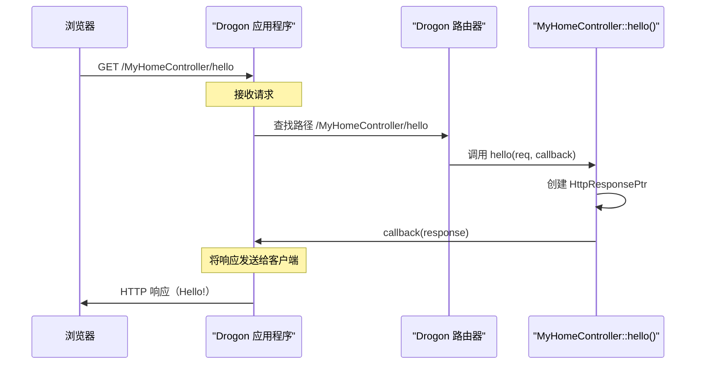

# 第 2 章：请求处理程序（控制器）

欢迎回到 Drogon ~

在[第 1 章：drogon_ctl 命令行工具](01_drogon_ctl_command_line_tool_.md)中，我们学习了如何使用 `drogon_ctl` 创建新项目，甚至生成"控制器"的基本文件。但控制器到底*是*什么，为什么它对构建 Web 应用程序如此重要？让我们深入了解

## 控制器解决什么问题？

想象一下，我们的 Web 应用程序是一家繁忙的餐厅。当顾客（Web 浏览器）下订单（向特定 URL 发送 Web 请求）时，厨房（应用程序的代码）如何知道要准备什么菜？这就是**请求处理程序**（通常称为**控制器**）发挥作用的地方。

控制器就像我们餐厅里的专业厨师。每位厨师都是准备某些类型菜肴（处理特定 Web 请求）的专家。当订单进来要求，比如说，"用户资料页面"时，请求会发送到"用户资料厨师"（控制器），然后他确切地知道如何准备响应（获取用户数据，格式化并发送回浏览器）。

如果没有控制器，所有请求都会进入一个巨大、混乱的厨房，使其无法管理。控制器为应用程序如何响应不同请求带来了秩序、模块化和清晰度。

## 什么是控制器？

在 Drogon 中，控制器是一个 C++ 类，我们在其中定义当使用特定 HTTP 方法（如 GET、POST、PUT、DELETE）访问某些 URL 时应用程序采取的特定操作。它们是应用程序处理 Web 请求的业务逻辑所在的逻辑单元。

Drogon 有不同类型的控制器，针对各种需求量身定制：

| 控制器类型             | 用途                                   | 最适合                              |
| :--------------------- | :------------------------------------- | :---------------------------------- |
| `HttpController`       | 使用多种方法处理各种路径的 HTTP 请求。 | RESTful API、具有多个操作的复杂网页 |
| `HttpSimpleController` | 使用单一方法处理单一路径的 HTTP 请求。 | 基本静态页面、简单的单一操作端点    |
| `WebSocketController`  | 使用 WebSocket 管理实时、持久连接。    | 聊天应用程序、实时仪表板、游戏后端  |

在本章中，我们将主要关注 `HttpController`，因为它是初学者最常见和最灵活的类型。

## 创建第一个控制器

让我们从第 1 章中 `drogon_ctl` 停止的地方继续。我们生成了一个 `MyHomeController`。如果还没有，请导航到 `MyFirstDrogonApp` 项目目录并创建它：

```bash
cd MyFirstDrogonApp
drogon_ctl create controller MyHomeController
```

现在，让我们看看生成的文件：`MyHomeController.h` 和 `MyHomeController.cc`。

### `MyHomeController.h`（头文件）

此文件声明了控制器类及其方法。它看起来像这样（简化版）：

```cpp
// MyHomeController.h
#pragma once
#include <drogon/HttpController.h> // 包含 HttpController

class MyHomeController : public drogon::HttpController<MyHomeController>
{
  public:
    // 定义将处理 Web 请求的方法（函数）
    METHOD_LIST_BEGIN
    // METHOD_ADD(MyHomeController::methodName, "/path", drogon::Get);
    METHOD_ADD(MyHomeController::hello, "/hello", drogon::Get);
    METHOD_ADD(MyHomeController::welcome, "/welcome/{name}", drogon::Get);
    METHOD_LIST_END

    void hello(const HttpRequestPtr &req,
               std::function<void(const HttpResponsePtr &)> &&callback) const;
    void welcome(const HttpRequestPtr &req,
                 std::function<void(const HttpResponsePtr &)> &&callback,
                 const std::string &name) const;
};
```

**这里发生了什么？**

*   `#pragma once` 和 `#include <drogon/HttpController.h>`：标准 C++ 内容。我们需要包含 `HttpController` 头文件来使用 Drogon 的控制器功能。
*   `class MyHomeController : public drogon::HttpController<MyHomeController>`：这行声明了 `MyHomeController` 类。它继承自 `drogon::HttpController`，使其成为 Drogon 控制器。`<MyHomeController>` 部分是 Drogon 用来自动注册控制器的 C++ 模板技巧。
*   `METHOD_LIST_BEGIN` 和 `METHOD_LIST_END`：这些是 Drogon 提供的特殊宏。它们像容器一样，标记此控制器将用于处理 Web 请求的方法（函数）列表的开始和结束。
*   `METHOD_ADD(MyHomeController::hello, "/hello", drogon::Get);`：这是我们告诉 Drogon 的地方："当有人向 `/hello` URL 发送 `GET` 请求时，调用 `MyHomeController` 内部的 `hello` 函数。"
    *   `MyHomeController::hello`：*此*控制器中将处理请求的函数。
    *   `"/hello"`：此函数将响应的 URL 路径。
    *   `drogon::Get`：此函数处理的 HTTP 方法（如 GET、POST、PUT、DELETE）。
*   `METHOD_ADD(MyHomeController::welcome, "/welcome/{name}", drogon::Get);`：这类似，但引入了一个动态部分：`{name}`。这告诉 Drogon，URL 中 `/welcome/` 之后出现的任何文本都应该被捕获并作为 `name` 参数传递给我们的 `welcome` 函数。
*   `void hello(...) const;` 和 `void welcome(...) const;`：这些是将处理请求的实际函数的声明。我们将在 `.cc` 文件中定义它们的实现。

### `MyHomeController.cc`（源文件）

此文件包含控制器方法的实际代码。

```cpp
// MyHomeController.cc
#include "MyHomeController.h" // 包含控制器的头文件
#include <drogon/HttpResponse.h> // 包含 HttpResponse

void MyHomeController::hello(const HttpRequestPtr &req,
                             std::function<void(const HttpResponsePtr &)> &&callback) const
{
    // 创建一个新的 HTTP 响应对象
    auto resp = drogon::HttpResponse::newHttpResponse();
    // 将响应的主体设置为 "Hello from Drogon Controller!"
    resp->setBody("Hello from Drogon Controller!");
    // 调用回调函数将响应发送回客户端
    callback(resp);
}

void MyHomeController::welcome(const HttpRequestPtr &req,
                               std::function<void(const HttpResponsePtr &)> &&callback,
                               const std::string &name) const
{
    auto resp = drogon::HttpResponse::newHttpResponse();
    resp->setBody("Welcome, " + name + "!");
    callback(resp);
}
```

**这里发生了什么？**

*   `#include "MyHomeController.h"`：包含我们刚才讨论的头文件。
*   `#include <drogon/HttpResponse.h>`：我们需要这个来创建 HTTP 响应对象。（我们将在[第 3 章：HTTP 请求和响应对象](03_http_request_and_response_objects_.md)中更深入地了解 `HttpRequestPtr` 和 `HttpResponsePtr`）。
*   `void MyHomeController::hello(...) const`：这是我们 `hello` 函数的定义。
    *   `const HttpRequestPtr &req`：此对象包含有关传入 Web 请求的所有详细信息（标头、主体、URL 等）。在这个简单示例中我们不使用它，但它始终可用。
    *   `std::function<void(const HttpResponsePtr &)> &&callback`：这是 Drogon 提供的特殊函数。在控制器方法完成准备响应后，我们**必须**调用此 `callback` 函数，将 `HttpResponsePtr` 传递给它。这告诉 Drogon 将响应发送回客户端。
*   `auto resp = drogon::HttpResponse::newHttpResponse();`：这创建了一个空的 HTTP 响应对象。
*   `resp->setBody("Hello from Drogon Controller!");`：我们设置响应的主要内容（主体）。
*   `callback(resp);`：我们发送响应！

## 测试控制器

让我们确保 Drogon 应用程序使用这个新控制器。打开 `main.cc` 文件（它在项目的根目录中）。我们可能会看到一些 `app().registerHandler()` 调用。为简单起见，让我们现在删除它们（或注释掉它们），这样我们只使用新控制器。

`main.cc` 应该看起来像这样（简化版）：

```cpp
// main.cc
#include <drogon/drogon.h>
#include <iostream> // 用于控制台输出

int main()
{
    // 配置 Drogon 在 IP 127.0.0.1（localhost）和端口 8848 上监听
    drogon::app().addListener("127.0.0.1", 8848);

    // 启动 Drogon 应用程序！
    std::cout << "Server running on 127.0.0.1:8848" << std::endl;
    drogon::app().run();
    return 0;
}
```

**等等！如果我们不在 `main.cc` 中 `registerHandler`，Drogon 如何知道 `MyHomeController`？** 这是 Drogon 的强大功能之一：**反射**！当我们继承自 `drogon::HttpController` 并使用 `METHOD_ADD` 时，Drogon 会在启动时自动发现并注册控制器。我们只需确保控制器文件是项目构建的一部分。

现在，让我们编译并运行应用程序：

1.  **构建**：在 `MyFirstDrogonApp` 目录中，创建一个 `build` 文件夹并运行 CMake 和 make：
    ```bash
    mkdir build
    cd build
    cmake ..
    make
    ```
2.  **运行**：
    ```bash
    ./MyFirstDrogonApp
    ```
    我们应该看到指示 Drogon 正在监听的输出，可能类似于：
    ```
    ...
    Server running on 127.0.0.1:8848
    ```

现在，打开 Web 浏览器或使用 `curl` 等工具访问这些 URL：

*   `http://127.0.0.1:8848/MyHomeController/hello`
*   `http://127.0.0.1:8848/MyHomeController/welcome/Alice`

**预期输出：**

*   对于 `/MyHomeController/hello`：我们应该看到 "Hello from Drogon Controller!"
*   对于 `/MyHomeController/welcome/Alice`：我们应该看到 "Welcome, Alice!"

**为什么 URL 中有 `MyHomeController`？**
默认情况下，当我们在 `HttpController` 中使用 `METHOD_ADD` 时，Drogon 会在路径中包含控制器的类名。因此，`"/hello"` 变成 `/MyHomeController/hello`。这有助于组织路由！（有方法可以更改这一点，但我们现在坚持使用默认设置）。

## 控制器底层工作原理

当我们定义控制器及其方法时，Drogon 如何将用户的 Web 请求连接到正确的 C++ 函数？让我们追踪一个请求。

### 全局视图（演练）

1.  **应用程序启动**：当 `drogon::app().run()` 命令执行时，Drogon 扫描已编译的 C++ 代码。
2.  **控制器注册**：由于巧妙的 C++ 技巧（静态对象和模板），Drogon 找到所有 `HttpController` 类（如 `MyHomeController`）并读取 `METHOD_ADD` 行。然后它将这些路径（`/MyHomeController/hello`、`/MyHomeController/welcome/{name}`）及其对应的 C++ 函数（`MyHomeController::hello`、`MyHomeController::welcome`）添加到其内部**路由表**。这个表就像一个目录，将 URL 映射到特定的控制器函数。
3.  **用户发出请求**：用户在浏览器中输入 `http://127.0.0.1:8848/MyHomeController/hello`。
4.  **Drogon 接收请求**：Drogon 服务器接收此传入的 HTTP 请求。
5.  **路由**：Drogon 的**请求路由系统**（我们将在[第 4 章：请求路由系统](04_request_routing_system_.md)中探讨）在其路由表中查找 URL `/MyHomeController/hello`。
6.  **控制器方法调用**：它发现此 URL（使用 GET 方法）应该由 `MyHomeController::hello` 处理。然后 Drogon 创建一个 `HttpRequestPtr` 对象（包含传入请求的详细信息）并准备一个 `callback` 函数。
7.  **执行**：Drogon 调用 `MyHomeController::hello` 函数，将请求和回调传递给它。
8.  **响应生成**：`hello` 函数完成其工作，创建一个 `HttpResponsePtr`，将其主体设置为 "Hello from Drogon Controller!"，然后调用提供的 `callback` 函数。
9.  **发送响应**：Drogon 从回调中获取 `HttpResponsePtr` 并将其发送回用户的浏览器。

这是一个简化的序列图：



### 代码：自动注册

让我们查看 Drogon 源文件中的一些片段，以了解这种自动注册如何工作，而无需在 `main.cc` 中手动调用 `app().registerHandler()`。

当我们像这样定义 `MyHomeController` 时：

```cpp
class MyHomeController : public drogon::HttpController<MyHomeController>
{
    // ...
    METHOD_LIST_BEGIN
    METHOD_ADD(MyHomeController::hello, "/hello", drogon::Get);
    METHOD_LIST_END
    // ...
};
```

Drogon 使用涉及静态成员和模板元编程的模式。查看 `HttpController.h` 文件：

```cpp
// lib/inc/drogon/HttpController.h（简化）
template <typename T, bool AutoCreation = true>
class HttpController : public DrObject<T>, public HttpControllerBase
{
  protected:
    template <typename FUNCTION>
    static void registerMethod(
        FUNCTION &&function,
        const std::string &pattern,
        // ... 其他参数
        bool classNameInPath = true,
        const std::string &handlerName = "")
    {
        // ...（构造完整路径并调用 app().registerHandler 的代码）...
        // 示例：app().registerHandler(path + pattern, function, constraints, handlerName);
    }

  private:
    class methodRegistrator
    {
      public:
        methodRegistrator()
        {
            if (AutoCreation)
                T::initPathRouting(); // 这调用 METHOD_LIST_BEGIN/END 块
        }
    };

    static methodRegistrator registrator_; // 这个静态对象的构造函数在启动时运行！
};

// 这行在类外部确保定义了静态成员
template <typename T, bool AutoCreation>
typename HttpController<T, AutoCreation>::methodRegistrator
    HttpController<T, AutoCreation>::registrator_;
```

1.  **`static methodRegistrator registrator_;`**：每个 `HttpController`（如 `MyHomeController`）都有一个名为 `registrator_` 的静态成员变量。至关重要的是，静态成员变量在 `main()` 开始运行*之前*初始化。
2.  **`methodRegistrator()` 构造函数**：当 `registrator_` 初始化时，会调用其构造函数 `methodRegistrator()`。
3.  **`T::initPathRouting()`**：在此构造函数内部，Drogon 调用 `T::initPathRouting()`。这里的 `T` 是我们的特定控制器类（例如，`MyHomeController`）。
4.  **宏的作用**：`METHOD_LIST_BEGIN` 和 `METHOD_LIST_END` 宏在控制器类中扩展为静态函数 `initPathRouting()`。而 `METHOD_ADD` 扩展为对 `HttpController::registerMethod()` 的调用。
    ```cpp
    // METHOD_LIST_BEGIN/END 和 METHOD_ADD 预处理后的样子：
    // 在 MyHomeController 内部：
    static void initPathRouting()
    {
        registerMethod(&MyHomeController::hello, "/hello", {drogon::Get}, true, "hello");
        registerMethod(&MyHomeController::welcome, "/welcome/{name}", {drogon::Get}, true, "welcome");
        return;
    }
    ```
5.  **`app().registerHandler()`**：最后，`registerMethod()` 内部调用 `drogon::app().registerHandler()`，这是将处理程序添加到 Drogon 主路由表的函数。

这种优雅的机制确保所有控制器方法在应用程序启动时自动注册到 Drogon 的路由系统，而无需在 `main.cc` 文件中手动添加每个路由。这就是使 Drogon 在组织大型应用程序时如此方便的原因！

## 结论

控制器是任何 Drogon Web 应用程序的支柱。它们提供了一种结构化的方式来处理传入的 Web 请求，定义应用程序的业务逻辑，并发送回适当的响应。通过使用 `HttpController`，我们可以轻松地将 URL 路径和 HTTP 方法映射到特定的 C++ 函数，保持代码的组织性和可维护性。Drogon 的自动注册功能由 C++ 反射提供支持，确保控制器无缝集成到应用程序中。

现在我们了解了如何处理请求，让我们仔细看看流经应用程序的实际数据：请求和响应对象本身。

[第 3 章：HTTP 请求和响应对象](03_http_request_and_response_objects_.md)

