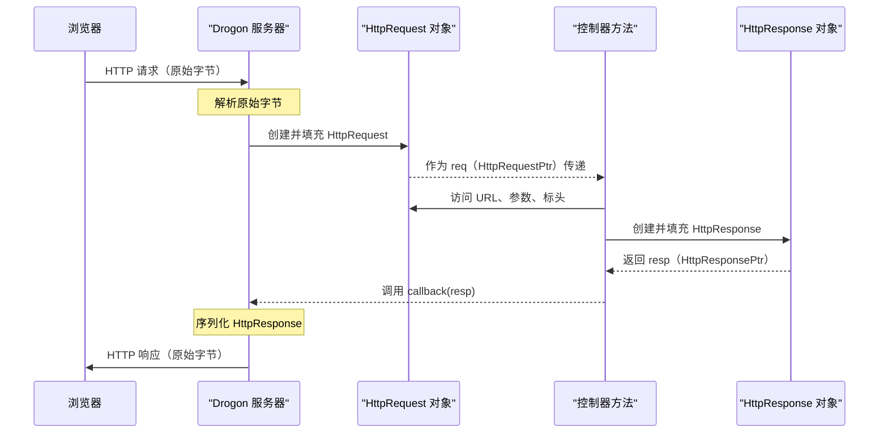

# 第 3 章：HTTP 请求和响应对象

欢迎回来

在[第 2 章：请求处理程序（控制器）](02_request_handlers__controllers__.md)中，我们学习了如何创建 `HttpController` 并定义响应特定 Web 请求的方法。我们看到这些方法接收一个 `HttpRequestPtr` 并使用 `callback` 函数发送回 `HttpResponsePtr`。但这些"请求"和"响应"对象到底是什么？它们是 Drogon 中 Web 通信的核心

## Web 服务器的邮件载体

想象一下，我们的 Drogon 应用程序是一个繁忙的邮局。
*   当客户端（如 Web 浏览器）向服务器发送消息时，就像发送一封信或包裹。该传入消息的所有详细信息——地址、发件人的详细信息、里面的内容——都被整齐地打包到一个 **HTTP 请求**对象中。
*   当服务器准备回复客户端时，就像发送一封回信或包裹。服务器回复的所有详细信息——收件人的地址、交付状态、我们要发送回的内容——都组织到一个 **HTTP 响应**对象中。

在 Drogon 中，这些分别由 `drogon::HttpRequest` 和 `drogon::HttpResponse` 类表示。我们使用智能指针与它们交互：`HttpRequestPtr` 和 `HttpResponsePtr`。

## `HttpRequest` 里面有什么？

`HttpRequest` 对象包含客户端发送到服务器的所有内容。可以将其视为一个丰富的数据结构，提供对传入 Web 请求所有部分的轻松访问。

以下是我们可以从 `HttpRequestPtr` 获取的一些关键内容：

*   **HTTP 方法**：是 GET、POST、PUT、DELETE 请求吗？（`req->method()`）
*   **URL 路径**：请求了服务器上的哪个特定路径？（`req->path()`）
*   **查询参数**：在 `?` 之后的 URL 中发送的数据（例如，`/search?query=drogon`）。（`req->getParameter("query")`）
*   **标头**：附加信息，如 `User-Agent`、`Content-Type`、`Accept`。（`req->getHeader("User-Agent")`）
*   **Cookie**：客户端为会话管理发送的小数据片段。（`req->getCookie("session_id")`）
*   **主体**：请求的主要内容，特别是对于 POST 或 PUT 请求（例如，JSON 数据、表单数据）。（`req->body()`、`req->getJsonObject()`）
*   **客户端信息**：客户端的 IP 地址。（`req->peerAddr()`）

## `HttpResponse` 里面有什么？

`HttpResponse` 对象是服务器创建并发送回客户端的内容。这是我们传达处理请求结果的方式。

以下是我们可以在 `HttpResponsePtr` 上设置的一些关键内容：

*   **状态码**：一个三位数字，指示结果（例如，200 OK、404 Not Found、500 Internal Server Error）。（`resp->setStatusCode(drogon::k200OK)`）
*   **标头**：信息，如 `Content-Type`、`Server`、`Date`。（`resp->addHeader("Server", "MyDrogonApp")`）
*   **Cookie**：在客户端上发送新 cookie 或更新现有 cookie。（`resp->addCookie("session_id", "abc123")`）
*   **主体**：我们想要发送回的实际内容（例如，HTML、JSON、纯文本）。（`resp->setBody("Hello from server!")`）

## 实际示例：更智能的问候

让我们通过使用 `HttpRequest` 和 `HttpResponse` 对象来增强第 2 章中的 `MyHomeController`，使其更智能一些。我们将添加一个接受查询参数并返回 JSON 响应的端点。

首先，让我们更新 `MyHomeController.h`：

```cpp
// MyHomeController.h（部分）
#pragma once
#include <drogon/HttpController.h>

class MyHomeController : public drogon::HttpController<MyHomeController>
{
  public:
    METHOD_LIST_BEGIN
    METHOD_ADD(MyHomeController::hello, "/hello", drogon::Get);
    METHOD_ADD(MyHomeController::welcome, "/welcome/{name}", drogon::Get);
    // 新端点：/api/greet?firstName=John&lastName=Doe
    METHOD_ADD(MyHomeController::apiGreet, "/api/greet", drogon::Get);
    METHOD_LIST_END

    void hello(const HttpRequestPtr &req,
               std::function<void(const HttpResponsePtr &)> &&callback) const;
    void welcome(const HttpRequestPtr &req,
                 std::function<void(const HttpResponsePtr &)> &&callback,
                 const std::string &name) const;
    // 新方法的声明
    void apiGreet(const HttpRequestPtr &req,
                  std::function<void(const HttpResponsePtr &)> &&callback) const;
};
```
我们添加了一个新的 `METHOD_ADD` 条目并声明了 `apiGreet` 函数。

现在，让我们在 `MyHomeController.cc` 中实现 `apiGreet`：

```cpp
// MyHomeController.cc（部分）
#include "MyHomeController.h"
#include <drogon/HttpResponse.h>
#include <json/json.h> // 用于 JSON 响应

// ...（hello 和 welcome 方法保持不变）...

void MyHomeController::apiGreet(const HttpRequestPtr &req,
                                std::function<void(const HttpResponsePtr &)> &&callback) const
{
    // 1. 从请求中获取参数
    std::string firstName = req->getParameter("firstName");
    std::string lastName = req->getParameter("lastName");

    // 2. 创建 JSON 响应主体
    Json::Value json;
    json["message"] = "Hello, " + firstName + " " + lastName + "!";
    json["status"] = "success";

    // 3. 创建带有 JSON 内容的 HTTP 响应对象
    auto resp = drogon::HttpResponse::newHttpJsonResponse(json);

    // 4. 设置附加标头
    resp->addHeader("X-Custom-Greeting", "Drogon Power!");

    // 5. 发送响应
    callback(resp);
}
```

**这里发生了什么？**

1.  **`req->getParameter("firstName")`**：我们使用 `HttpRequestPtr` 的 `getParameter` 方法轻松从 URL 的查询字符串中提取值（例如，`?firstName=John`）。如果参数不存在，它返回一个空字符串。
2.  **`Json::Value json;`**：我们从 `jsoncpp` 库（Drogon 内部使用）创建一个 `Json::Value` 对象。这允许我们构建结构化的 JSON 数据。
3.  **`drogon::HttpResponse::newHttpJsonResponse(json)`**：这是一个方便的工厂方法，用于创建 `HttpResponsePtr`，它会自动将 `Content-Type` 标头设置为 `application/json` 并将 `Json::Value` 转换为响应主体。
4.  **`resp->addHeader("X-Custom-Greeting", "Drogon Power!")`**：我们向响应添加自定义 HTTP 标头。标头提供有关响应的附加元数据。
5.  **`callback(resp)`**：一如既往，我们使用回调将准备好的 `HttpResponsePtr` 发送回客户端。

**测试方法：**

1.  确保我们在 `MyFirstDrogonApp` 目录中。
2.  构建项目：
    ```bash
    cd build
    cmake ..
    make
    ```
3.  运行应用程序：
    ```bash
    ./MyFirstDrogonApp
    ```
4.  打开浏览器或使用 `curl` 访问：
    `http://127.0.0.1:8848/MyHomeController/api/greet?firstName=Jane&lastName=Doe`

**预期输出（JSON）：**

```json
{
  "message": "Hello, Jane Doe!",
  "status": "success"
}
```

我们还可以在浏览器的开发者工具中或使用 `curl -v` 检查响应标头：

```
< HTTP/1.1 200 OK
< X-Custom-Greeting: Drogon Power!
< Content-Type: application/json
< Content-Length: ...
< ...
```

这演示了 `HttpRequest` 和 `HttpResponse` 对象如何允许我们灵活地与 Web 数据交互。

## 底层原理：数据如何流动

当 Web 请求到达并发送响应时，这些对象不仅仅是空容器；它们具有复杂的内部结构，用于高效的数据处理。

### Web 请求的往返

让我们可视化请求和响应的旅程：



1.  **传入请求**：浏览器通过网络发送原始 HTTP 数据（文本和二进制）。
2.  **Drogon 解析**：Drogon 服务器的网络层接收这些原始字节。然后将它们解析为结构化的 `HttpRequest` 对象，提取方法、路径、标头、cookie 和主体。某些解析（如查询参数或 JSON 主体）可能在我们首次请求该特定数据时延迟发生。
3.  **到控制器**：然后将完全形成的 `HttpRequestPtr` 传递给指定的控制器方法。
4.  **控制器逻辑**：控制器方法使用 `HttpRequestPtr` 理解客户端的请求，然后构建一个 `HttpResponsePtr`，其中包含它想要发送回的数据。
5.  **Drogon 序列化**：一旦控制器使用 `HttpResponsePtr` 调用回调，Drogon 就会获取此结构化对象并将其转换回原始 HTTP 数据（文本和二进制），包括添加必要的标头，如 `Content-Length` 或 `Date`。
6.  **传出响应**：Drogon 将这些原始字节发送回客户端。

### 代码

让我们看看 Drogon 如何管理 `HttpRequest` 和 `HttpResponse` 数据。我们会注意到它们是抽象基类（`HttpRequest`、`HttpResponse`），具有具体实现（`HttpRequestImpl`、`HttpResponseImpl`）。这种设计允许 Drogon 提供干净的 API，同时管理内部复杂性。

#### `HttpRequest` 

`HttpRequest` 对象保存各种信息片段。例如，标头存储在 `SafeStringMap`（不区分大小写的映射）中，如果主体非常大，可能存储在 `std::string` 中，甚至存储在临时文件中。

```cpp
// lib/inc/drogon/HttpRequest.h（简化）
class DROGON_EXPORT HttpRequest
{
  public:
    // ... 公共方法，如 method()、path()、getHeader()、getParameter() ...
    virtual const std::string &getHeader(std::string key) const = 0;
    virtual const SafeStringMap<std::string> &parameters() const = 0;
    virtual std::string_view body() const = 0; // 访问请求主体
    // ... 工厂方法，如 newHttpRequest()、newHttpJsonRequest() ...
};

// lib/src/HttpRequestImpl.h（简化）
class HttpRequestImpl : public HttpRequest
{
  private:
    HttpMethod method_{Invalid};
    std::string path_;
    std::string query_;
    SafeStringMap<std::string> headers_; // 存储标头
    SafeStringMap<std::string> cookies_; // 存储 cookie
    mutable SafeStringMap<std::string> parameters_; // 存储解析的参数
    mutable std::shared_ptr<Json::Value> jsonPtr_; // 用于 JSON 主体
    std::string content_; // 直接存储小主体
    std::unique_ptr<CacheFile> cacheFilePtr_; // 对于大主体，指向临时文件

    mutable bool flagForParsingParameters_{false}; // 延迟解析标志
    mutable bool flagForParsingJson_{false};       // 延迟解析标志
    // ... 其他内部成员 ...

    void parseParameters() const; // 延迟解析参数的方法
    void parseJson() const;       // 延迟解析 JSON 主体的方法
    void createTmpFile();         // 为大主体创建临时文件
};
```
当我们第一次调用 `req->getParameter("key")` 时，会调用 `HttpRequestImpl::parseParameters()`。此方法有效地将查询字符串和/或 URL 编码的表单主体解析到 `parameters_` 映射中，并将 `flagForParsingParameters_` 设置为 true，这样就不会再次解析。`req->getJsonObject()` 也类似。

#### `HttpResponse` 

`HttpResponse` 对象由控制器构建，然后 Drogon 将其序列化为实际的 HTTP 响应字节。

```cpp
// lib/inc/drogon/HttpResponse.h（简化）
class DROGON_EXPORT HttpResponse
{
  public:
    // ... 公共方法，如 setStatusCode()、addHeader()、setBody()、addCookie() ...
    virtual void setStatusCode(HttpStatusCode code) = 0;
    virtual void addHeader(std::string field, const std::string &value) = 0;
    virtual void setBody(const std::string &body) = 0;
    // ... 工厂方法，如 newHttpResponse()、newHttpJsonResponse() ...
};

// lib/src/HttpResponseImpl.h（简化）
class DROGON_EXPORT HttpResponseImpl : public HttpResponse
{
  private:
    HttpStatusCode statusCode_{kUnknown};
    SafeStringMap<std::string> headers_; // 存储标头
    SafeStringMap<Cookie> cookies_;       // 存储 cookie
    mutable std::shared_ptr<HttpMessageBody> bodyPtr_; // 存储响应主体
    mutable std::shared_ptr<Json::Value> jsonPtr_;     // 用于 JSON 响应主体

    mutable bool flagForSerializingJson_{true}; // JSON 序列化标志
    // ... 其他内部成员 ...

    void makeHeaderString(trantor::MsgBuffer &headerString); // 构建标头字符串
    void renderToBuffer(trantor::MsgBuffer &buffer);         // 序列化整个响应
    void generateBodyFromJson() const;                       // 将 Json::Value 转换为主体字符串
};
```
当我们调用 `resp->setBody("some text")` 时，`HttpResponseImpl` 将此内容存储在其 `bodyPtr_` 中。当使用 `HttpResponse::newHttpJsonResponse(json)` 时，它设置 `jsonPtr_`。稍后，当 Drogon 准备发送响应时，`HttpResponseImpl::generateBodyFromJson()` 将 `jsonPtr_` 转换为实际的 `bodyPtr_` 字符串，然后 `HttpResponseImpl::makeHeaderString()` 和 `HttpResponseImpl::renderToBuffer()` 将所有部分（状态行、标头、cookie、主体）组装成完整的原始 HTTP 响应，准备通过网络发送。

## 结论

`HttpRequest` 和 `HttpResponse` 对象是封装客户端与 Drogon 服务器之间所有通信的基本数据结构。

通过理解它们的内容和可用于操作的方法，我们可以对 Web 应用程序如何接收请求和制作响应进行细粒度控制。

这使我们能够使用 ==C++ 构建动态的、数据驱动的 Web 服务和页面==。

接下来，我们将看到 Drogon 如何使用其强大的**请求路由系统**有效地将传入请求定向到正确的控制器方法。

[第 4 章：请求路由系统](04_request_routing_system_.md)

