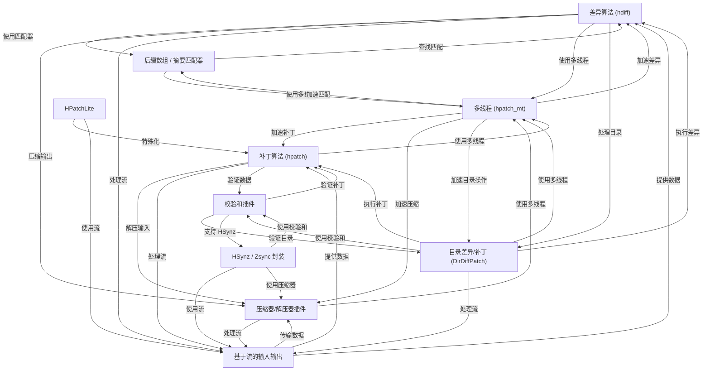
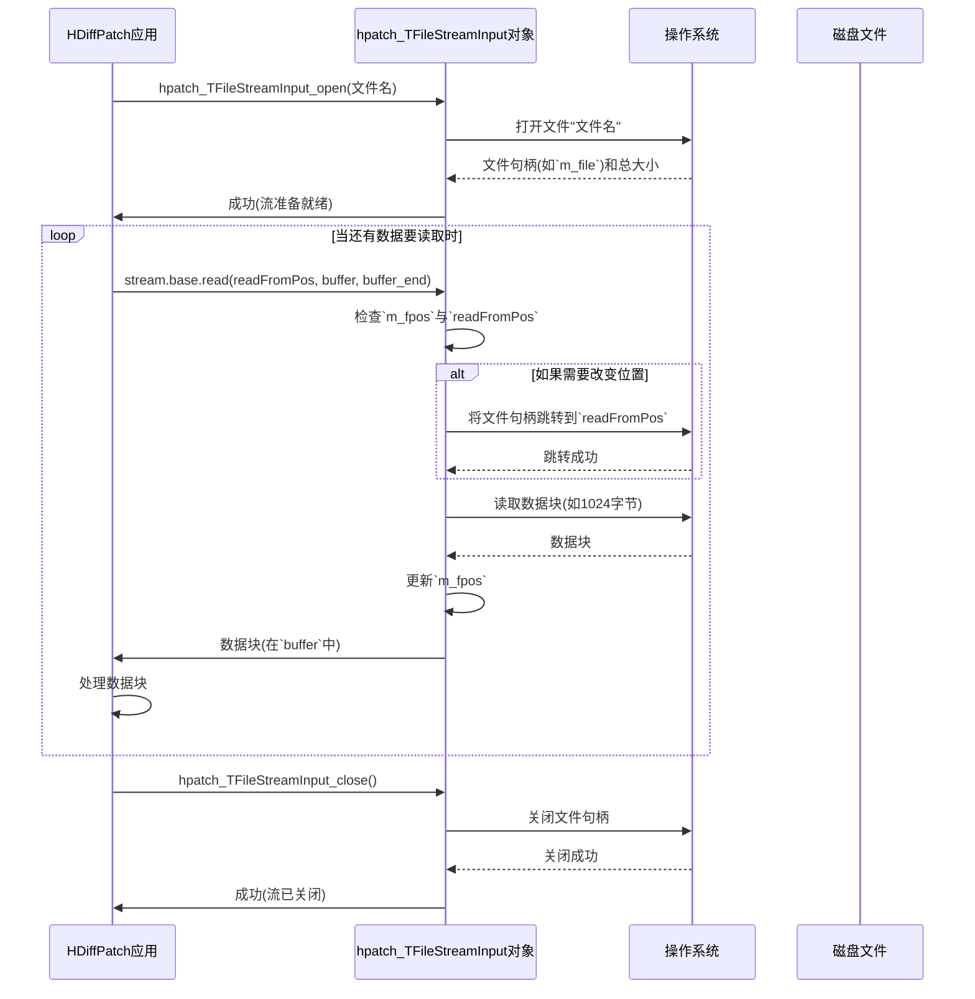

链接：[sisong/HDiffPatch: a C\C++ library and command-line tools for Diff & Patch between binary files or directories(folder); cross-platform; runs fast; create small delta/differential; support large files and limit memory requires when diff & patch.](https://github.com/sisong/HDiffPatch?tab=readme-ov-file)

# docs：HDiffPatch

HDiffPatch 是一款强大的工具，用于通过查找旧版本和新版本之间的**差异**来高效*更新数据*，并生成紧凑的"差异文件"

随后，==**补丁算法**可以利用该文件从*旧数据*重建*新数据*==

该工具设计灵活，支持多种压缩方法，能够处理完整的目录结构，并==针对**多线程**性能和*嵌入式系统*的最小资源占用进行了优化==。

## 可视化



## 章节

1. [基于流的输入输出](01_stream_based_i_o_.md)
2. [差异算法 (hdiff)](02_diff_algorithm__hdiff__.md)
3. [补丁算法 (hpatch)](03_patch_algorithm__hpatch__.md)
4. [压缩器/解压器插件](04_compressor_decompressor_plugins_.md)
5. [校验和插件](05_checksum_plugins_.md)
6. [目录差异/补丁 (DirDiffPatch)](06_directory_diff_patch__dirdiffpatch__.md)
7. [多线程 (hpatch_mt)](07_multi_threading__hpatch_mt__.md)
8. [后缀数组 / 摘要匹配器](08_suffix_array___digest_matcher_.md)
9. [HPatchLite](09_hpatchlite_.md)
10. [HSynz / Zsync 封装](10_hsynz___zsync_wrapper_.md)

---

# 第一章：基于流的输入输出

欢迎来到HDiffPatch

第一章将介绍HDiffPatch处理文件的核心概念：**基于流的输入输出**

虽然听起来技术性很强，但这实际上是一个非常实用的理念，能够帮助HDiffPatch高效工作，尤其是处理超大文件时。

## 大文件的痛点

想象我们有一本巨大的电子书——比如1TB大小

如果程序试图一次性将整本书加载到计算机内存（RAM）中，电脑很可能会崩溃或变得极其缓慢。即使内存足够，将整个大文件完全载入内存通常也是低效甚至不可能的。

这是HDiffPatch等工具面临的常见挑战，它们需要比较或修改的文件可能从几KB到几GB甚至几TB不等。

> 如何在内存不足的情况下处理这些庞然大物？

## 解决方案：基于流的输入输出

答案就是**基于流的输入输出**。可以将其类比为阅读那本大书，但我们不会试图一次性打开整本书，而是逐页（或几页）阅读。处理完当前页的信息后，再继续下一页。我们==永远不需要同时打开整本书==。

在计算机中，"流"是数据的连续流动。基于流的输入输出意味着程序以小块形式从源（如文件）读取数据，并以相同方式将数据写入目标（如另一个文件）。这种方法至关重要：

*   **内存高效**：任何时候只有文件的一小部分在内存中。
*   **处理大文件**：程序可以处理几乎任意大小的文件，仅受存储空间限制，而非内存容量。
*   **灵活性**：相同的流机制通常可用于不同数据源（文件、网络连接、内存缓冲区）。

## 流的核心概念

让我们分解HDiffPatch中基于流输入输出的核心思想：

1.  **输入流**：数据从源头流出的"水龙头"。HDiffPatch使用输入流读取"旧文件"或"新文件"（生成差异时）或"补丁文件"（应用补丁时）。
2.  **输出流**：数据流向目标的"排水口"。HDiffPatch使用输出流写入生成的"补丁文件"（生成差异时）或"新文件"（应用补丁时）。
3.  **数据块**：==数据被分成固定大小的小块读写==，而非一次性处理。HDiffPatch通常使用默认块大小（如约1MB的`hpatch_kFileIOBestMaxSize`）来优化性能。
4.  **流位置**：就像==书签==一样，流会跟踪数据流中当前的读写位置，使程序能够顺序读取或"跳转"到特定位置。
5.  **文件句柄**：操作系统在=="打开"文件时分配的特殊标识符==，是该文件连接的唯一ID。HDiffPatch使用这些句柄与底层文件系统交互。

## HDiffPatch中的流使用：简单文件读取

让我们看看HDiffPatch如何使用基于流的输入输出来读取"旧文件"

例如，生成差异时，HDiffPatch需要读取`旧文件`和`新文件`。我们以读取`旧文件`为例。

HDiffPatch定义了表示流的结构体。主要的读取结构是`hpatch_TStreamInput`，定义在`libHDiffPatch/HPatch/patch_types.h`中：

```c
// libHDiffPatch/HPatch/patch_types.h
typedef struct hpatch_TStreamInput
{
    void*            streamImport; // 流的内部数据
    hpatch_StreamPos_t streamSize; // 流的总大小
    // 从流中读取数据的函数
    hpatch_BOOL            (*read)(const struct hpatch_TStreamInput* stream,hpatch_StreamPos_t readFromPos,
                                       unsigned char* out_data,unsigned char* out_data_end);
    // ... 其他内部细节 ...
} hpatch_TStreamInput;
```

这个`hpatch_TStreamInput`结构体是蓝图，包含：
*   `streamImport`：指向流实现方式内部数据的指针（如从文件读取时可能包含文件句柄）。
*   `streamSize`：流中可用数据的总大小。
*   `read`：函数指针！这是基于流输入输出的核心，指向实际执行读取操作的函数。

读取文件时，HDiffPatch使用另一个结构体`hpatch_TFileStreamInput`，它是`hpatch_TStreamInput`针对文件的具体实现，定义在`file_for_patch.h`中：

```c
// file_for_patch.h
typedef struct hpatch_TFileStreamInput{
    hpatch_TStreamInput base;   // 使其与hpatch_TStreamInput兼容
    hpatch_FileHandle   m_file; // 实际文件句柄
    hpatch_StreamPos_t  m_fpos; // 当前内部文件位置
    // ... 其他内部细节 ...
} hpatch_TFileStreamInput;
```

以下是使用HDiffPatch流类型打开文件、读取数据和关闭文件的简化示例：

```c
// 使用输入流的简化示例
#include "file_for_patch.h" // 包含hpatch_TFileStreamInput等
#include <stdio.h> // 用于printf

void example_read_file(const char* filename) {
    hpatch_TFileStreamInput fileStream;
    hpatch_TFileStreamInput_init(&fileStream); // 初始化流对象

    // 1. 以输入流形式打开文件
    if (!hpatch_TFileStreamInput_open(&fileStream, filename)) {
        printf("错误：无法打开文件%s\n", filename);
        return;
    }
    printf("文件%s成功打开。大小：%" PRIu64 "字节\n", filename, fileStream.base.streamSize);

    // 2. 分块读取数据
    hpatch_byte buffer[1024]; // 保存数据块的小缓冲区
    hpatch_StreamPos_t currentPos = 0;
    while (currentPos < fileStream.base.streamSize) {
        size_t bytesToRead = sizeof(buffer);
        if (currentPos + bytesToRead > fileStream.base.streamSize) {
            bytesToRead = (size_t)(fileStream.base.streamSize - currentPos);
        }
        if (bytesToRead == 0) break;

        // 调用流的读取函数
        if (!fileStream.base.read(&fileStream.base, currentPos, buffer, buffer + bytesToRead)) {
            printf("错误：无法从文件流读取！\n");
            break;
        }
        // ... 在此处理'buffer'数据 ...
        // 本示例仅打印消息
        printf("从位置%" PRIu64 "读取%zu字节\n", currentPos, bytesToRead);

        currentPos += bytesToRead;
    }

    // 3. 关闭文件流
    if (!hpatch_TFileStreamInput_close(&fileStream)) {
        printf("错误：无法关闭文件%s\n", filename);
    }
    printf("文件%s已关闭。\n", filename);
}

// 实际应用中会调用example_read_file("my_old_file.bin");
```

此示例中：
*   `hpatch_TFileStreamInput_open`准备读取文件。
*   重复调用`fileStream.base.read()`获取数据。==注意`readFromPos`参数，这允许从流中特定位置读取，而不仅是当前位置==。
*   `hpatch_TFileStreamInput_close`释放文件。

如果`my_old_file.bin`大小为3000字节，函数输出可能如下：

```
文件my_old_file.bin成功打开。大小：3000字节
从位置0读取1024字节
从位置1024读取1024字节
从位置2048读取952字节
文件my_old_file.bin已关闭。
```

## 原理：hpatch_TFileStreamInput如何工作

让我们进一步了解调用`hpatch_TFileStreamInput_open`及其`read`函数时发生了什么。



### 代码解析

让我们看看`file_for_patch.c`中实现此行为的代码片段。

首先是`hpatch_TFileStreamInput_open`函数：

```c
// file_for_patch.c
hpatch_BOOL hpatch_TFileStreamInput_open(hpatch_TFileStreamInput* self,const char* fileName_utf8){
    // ... 初始化和错误检查 ...
    if (!_import_fileOpenRead(fileName_utf8,&self->m_file,&self->base.streamSize))
        _ferr_return(); // 处理文件打开错误
    
    self->base.streamImport=self;
    self->base.read=_TFileStreamInput_read_file; // 分配实际读取函数
    self->m_fpos=0; // 初始化内部位置
    self->m_offset=0; // 用于部分流，此处不相关
    return hpatch_TRUE;
}
```

此函数调用内部辅助函数`_import_fileOpenRead`获取`m_file`句柄并确定`streamSize`。关键是将`self->base.read`指向`_TFileStreamInput_read_file`，这将是调用`fileStream.base.read()`时实际执行的函数。

现在看看简化的`_TFileStreamInput_read_file`（由`base.read`指向的函数）：

```c
// file_for_patch.c
static hpatch_BOOL _TFileStreamInput_read_file(const hpatch_TStreamInput* stream,hpatch_StreamPos_t readFromPos,
                                                   TByte* out_data,TByte* out_data_end){
    size_t readLen;
    hpatch_TFileStreamInput* self=(hpatch_TFileStreamInput*)stream->streamImport;
    // ... 参数验证和边界检查 ...

    readLen=(size_t)(out_data_end-out_data); // 计算要读取的字节数
    if (readLen==0) return hpatch_TRUE; // 无需读取

    // 如果请求位置不是上次停止处，移动文件指针
    if (self->m_fpos!=readFromPos+self->m_offset){
        if (!_import_fileSeek64To(self->m_file,readFromPos+self->m_offset)) _rw_ferr_return();
    }
    // 执行实际文件读取
    if (!_import_fileRead(self->m_file,out_data,out_data+readLen)) _rw_ferr_return();
    self->m_fpos=readFromPos+self->m_offset+readLen; // 更新内部位置
    return hpatch_TRUE;
}
```

`_TFileStreamInput_read_file`函数使用更低层的辅助函数：
*   `_import_fileSeek64To`：告诉操作系统将文件内部指针移动到`readFromPos`，这对"随机访问"（跳转到文件任意部分而不仅是顺序读取）很重要。
*   `_import_fileRead`：实际要求操作系统用文件中的`readLen`字节填充`out_data`缓冲区。

注意`file_for_patch.h`中提到的常量`hpatch_kFileIOBestMaxSize`（定义为`(1<<20)`或1MB）

`_import_fileRead`和`_import_fileWrite`使用此值确定与底层文件系统读写较大数据块时的最佳块大小，避免非常低效的小I/O操作。

```c
// file_for_patch.c
hpatch_BOOL _import_fileRead(hpatch_FileHandle file,TByte* buf,TByte* buf_end){
    while (buf<buf_end) {
        size_t readLen=(size_t)(buf_end-buf);
        if (readLen>hpatch_kFileIOBestMaxSize) readLen=hpatch_kFileIOBestMaxSize; // 分块读取
        if (readLen!=fread(buf,1,readLen,file)) return hpatch_FALSE; // 实际C标准库调用
        buf+=readLen;
    }
    return buf==buf_end;
}
```

`hpatch_TFileStreamOutput`（用于写入文件）的过程非常相似，但它使用`write`函数指针和不同的底层辅助函数，如`_import_fileOpenCreateOrReWrite`和`_import_fileWrite`。

## 总结

基于流的输入输出是一个强大概念，使HDiffPatch能够高效处理任意大小的文件而不会消耗过多内存

通过定义通用的`hpatch_TStreamInput`和`hpatch_TStreamOutput`接口，并提供具体实现如`hpatch_TFileStreamInput`和`hpatch_TFileStreamOutput`，项目构建了灵活的基础架构。这种设计意味着其他数据源（如网络连接或内存缓冲区）也可以作为流集成，而无需更改核心差异/补丁逻辑。

现在理解了HDiffPatch如何==处理数据读写==，我们可以深入探讨使HDiffPatch工作的==核心算法==了

[下一章：差异算法(hdiff)](02_diff_algorithm__hdiff__.md)

