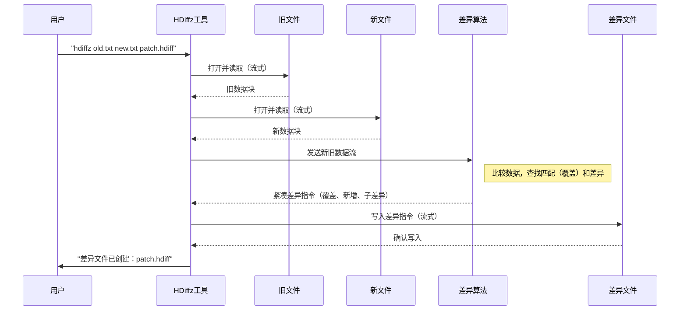

# 第二章：差异算法（hdiff）

欢迎回来

在[第一章：基于流的输入输出](01_stream_based_i_o_.md)中，我们学习了HDiffPatch如何通过分块读写数据高效处理大文件。现在，我们将深入探索HDiffPatch的核心智能：**差异算法（hdiff）**。这是精确识别数据两个版本间变化的"大脑"。

## 问题：如何共享变更而非整个文件？

假设我们有一个文档`report_v1.docx`，做了一些小修改后另存为`report_v2.docx`。现在需要将`report_v2.docx`发送给朋友。

我们可以发送整个`report_v2.docx`。但如果变更很小而文档很大（比如GB级别的游戏更新或大型数据库）呢？发送整个文件会浪费带宽和时间。

这就是差异算法要解决的问题：如何

> 用最紧凑的方式描述从`report_v1.docx`到`report_v2.docx`**仅变更的部分**？

## 解决方案：差异算法（hdiff）

HDiffPatch的`hdiff`算法如同超级智能的比对工具，主要目标是分析"旧"数据和"新"数据，确定：

1.  **"新"数据中哪些部分与"旧"数据完全相同？**（称为"匹配"或"覆盖"）
2.  **"新"数据中哪些部分是全新或已修改的？**（即真正的"差异"或"新增"）

确定这些后，它会生成特殊的"差异文件"（或称"补丁"）。该文件不包含完整的新数据，而是包含如下指令：
*   "从旧文件复制此部分"
*   "在此处添加这些新字节"
*   "通过微小调整修改这几个字节"

就像烹饪指导："用旧食谱，==但第三步==将1杯糖改为半杯，并新增步骤5a撒肉桂粉"。我们==不会重写整个==食谱，只需说明变更。

## 差异分析的核心概念

分解HDiffPatch差异分析过程的基本概念：

*   **旧数据**：文件或目录的原始版本
*   **新数据**：文件或目录的更新版本
*   **差异文件（补丁）**：`hdiff`算法的输出，包含==将旧数据转换为新数据的小文件指令==
*   **匹配（覆盖）**：寻找新旧版本间==相同==数据块的过程。HDiffPatch称这些为"覆盖"，因为它们用现有旧数据"覆盖"新数据的部分
*   **差异（新增/子差异）**：无法从旧数据复制的新数据部分，可能是全新段落或现有内容的修改

## 类比：乐高积木搭建

假设用乐高积木搭建了大型城堡（"旧数据"），之后改进并搭建了略有不同的新城堡（"新数据"）。

我们不会从头搭建新城堡，而是会：
1.  **复用旧城堡的许多部分**："从旧城堡取这面墙放在这里"（这是"匹配"或"覆盖"）
2.  **构建一些全新部分**："用这些新积木在此处建塔"（这是"新增"或"差异"）
3.  **修改某些现有部分**："取这面现有墙，但更换顶部的两块积木"（这是"子差异"——微小的算术差异）

"差异文件"就是紧凑的指令列表，说明如何使用这三类操作从旧城堡变成新城堡。

## HDiffPatch（hdiff）的实际工作流程

运行HDiffPatch创建差异时，会执行以下高层步骤：

1.  **加载数据**：读取"旧"文件和"新"文件。得益于[第一章：基于流的输入输出](01_stream_based_i_o_.md)，即使对超大文件也能高效处理，每次只加载小块到内存
2.  **查找匹配（覆盖）**：这是计算最密集的部分。算法扫描"新"数据，尝试找到与"旧"数据完全相同的最长字节序列，存储为`TOldCover`对象（定义`oldPos`、`newPos`和`length`）
3.  **优化覆盖**：精炼这些匹配，尝试合并相邻覆盖或扩展以覆盖更多数据，确保最紧凑的表示
4.  **生成差异指令**：对无法用旧数据覆盖的"新"数据部分（实际差异），计算如何高效表示。可能是原始新字节，或与旧数据对应字节的小数值差异（减法）
5.  **序列化为差异文件**：最后将所有指令（覆盖和差异）打包成紧凑的"差异文件"，并可选择压缩使文件更小

## 创建差异文件：简单示例

假设有两个文件`old_version.txt`和`new_version.txt`，要创建`patch.hdiff`文件。

使用`hdiffz`命令行工具（采用`hdiff`算法），命令如下：

```bash
hdiffz old_version.txt new_version.txt patch.hdiff
```

幕后，HDiffPatch库使用`create_compressed_diff`等函数。以下是可能使用的简化C++概念代码：

```c++
#include "file_for_patch.h" // 流类型
#include "libHDiffPatch/HDiff/diff.h" // create_compressed_diff
// ... 其他压缩插件等头文件

void create_my_diff(const char* oldFileName, const char* newFileName, 
                    const char* outDiffFileName, const hdiff_TCompress* compressPlugin) {
    hpatch_TFileStreamInput oldFileStream;
    hpatch_TFileStreamInput newFileStream;
    hpatch_TFileStreamOutput diffFileStream;

    // 1. 用基于流的I/O打开输入/输出文件
    hpatch_TFileStreamInput_init(&oldFileStream);
    hpatch_TFileStreamInput_init(&newFileStream);
    hpatch_TFileStreamOutput_init(&diffFileStream);

    hpatch_TFileStreamInput_open(&oldFileStream, oldFileName);
    hpatch_TFileStreamInput_open(&newFileStream, newFileName);
    hpatch_TFileStreamOutput_open(&diffFileStream, outDiffFileName, hpatch_kNullStreamPos);
    hpatch_TFileStreamOutput_setRandomOut(&diffFileStream, hpatch_TRUE); // 允许写入任意位置

    // 2. 调用核心差异算法函数
    //    读取oldFileStream和newFileStream，写入diffFileStream
    create_compressed_diff(&newFileStream.base, &oldFileStream.base, 
                           &diffFileStream.base, compressPlugin);

    // 3. 关闭文件
    hpatch_TFileStreamOutput_close(&diffFileStream);
    hpatch_TFileStreamInput_close(&newFileStream);
    hpatch_TFileStreamInput_close(&oldFileStream);
    
    printf("差异文件已创建：%s\n", outDiffFileName);
}

// 调用示例：
// create_my_diff("old_version.txt", "new_version.txt", "patch.hdiff", &myZlibCompressor);
```
**说明：**
*   使用[第一章：基于流的输入输出](01_stream_based_i_o_.md)介绍的`hpatch_TFileStreamInput`和`hpatch_TFileStreamOutput`对象处理文件操作
*   `create_compressed_diff`是执行`hdiff`算法的主函数，接收输入流指针（`newData`和`oldData`）、输出流（`diffFile`）和可选的压缩插件（将在[第四章：压缩器/解压器插件](04_compressor_decompressor_plugins_.md)详述）
*   `diffFileStream.base.streamSize`会被`create_compressed_diff`内部更新，反映生成的补丁最终大小

## 原理：差异算法数据流

简化调用`create_compressed_diff`时`hdiff`算法的数据旅程。



### 探索：查找与序列化覆盖

`create_compressed_diff`函数（定义于`libHDiffPatch/HDiff/diff.cpp`）是包装器，先调用`get_diff`再调用`serialize_compressed_diff`。

1.  **`get_diff`（匹配查找器）：**
    负责智能比对，扫描`newData`寻找与`oldData`任何部分相同的段落，找到后记录为"覆盖"。覆盖即一条信息："对此部分`new`数据（从`newPos`开始长`length`字节），从`old`数据的此部分（从`oldPos`开始）复制。"

    `libHDiffPatch/HDiff/diff.cpp`中的`TOldCover`结构表示：
    ```c++
    struct TOldCover {
        TInt   oldPos;   // 旧数据起始位置
        TInt   newPos;   // 新数据起始位置
        TInt   length;   // 匹配段落长度
        // ... 构造函数和辅助函数 ...
    };
    ```
    `get_diff`通过调用`search_and_dispose_cover`等内部搜索函数填充`std::vector<TOldCover>`。这里用到了复杂算法如后缀数组（将在[第八章：后缀数组/摘要匹配器](08_suffix_array___digest_matcher_.md)详述）来高效查找匹配。

2.  **`serialize_compressed_diff`（补丁打包器）：**
    `get_diff`找到所有覆盖后，`serialize_compressed_diff`（也在`libHDiffPatch/HDiff/diff.cpp`）接收这些覆盖及原始`oldData`和`newData`流，构建最终差异文件。它将数据组织为多个部分：

    *   **头部信息**：包含版本类型、`newData`和`oldData`大小、覆盖数量及压缩信息
    *   **覆盖数据**：`TOldCover`对象列表被高度紧凑编码。通常存储与前一个覆盖的*差值*（增量）而非绝对`oldPos`和`newPos`以节省空间
        ```c++
        // 简化自libHDiffPatch/HDiff/diff.cpp的serialize_compressed_diff
        // 打包覆盖数量、长度差值、新位置差值和旧位置差值
        packUInt(out_diff, (TUInt)coverCount);
        packUInt(out_diff, (TUInt)length_buf.size()); // 存储覆盖长度的缓冲区大小
        packUInt(out_diff, (TUInt)inc_newPos_buf.size()); // 存储newPos增量的缓冲区大小
        packUInt(out_diff, (TUInt)inc_oldPos_buf.size()); // 存储oldPos增量的缓冲区大小
        // ... 更多数据 ...
        pushBack(out_diff, length_buf);
        pushBack(out_diff, inc_newPos_buf);
        pushBack(out_diff, inc_oldPos_buf);
        // ... 更多数据 ...
        ```
        `libHDiffPatch/HDiff/private_diff/pack_uint.h`中的`packUInt`函数非常关键，它将无符号整数编码为尽可能少的字节。例如小数`5`可能占1字节，而大数`1,000,000`可能占4字节
    *   **子差异数据**：包含新旧数据相似但不相同的段落的逐字节差异（即`newData[i] - oldData[i]`）
    *   **新数据差异**：包含"新"数据中与"旧"数据毫无匹配部分的原始新字节

每个部分还可由所选压缩插件单独压缩，进一步减小最终差异文件。

## 总结

差异算法（`hdiff`）是HDiffPatch的智能引擎，它细致比较数据的旧版本和新版本，识别公共部分（`覆盖`），并紧凑编码差异（`子差异`和`新数据差异`），生成易于共享或==存储的微小"差异文件"==

巧妙的基于流I/O使该过程能扩展到超大文件而不会压垮内存。

现在我们理解了差异文件的创建过程，下一步自然是学习如何用差异文件从旧数据==重建==新数据。

[下一章：补丁算法（hpatch）](03_patch_algorithm__hpatch__.md)

