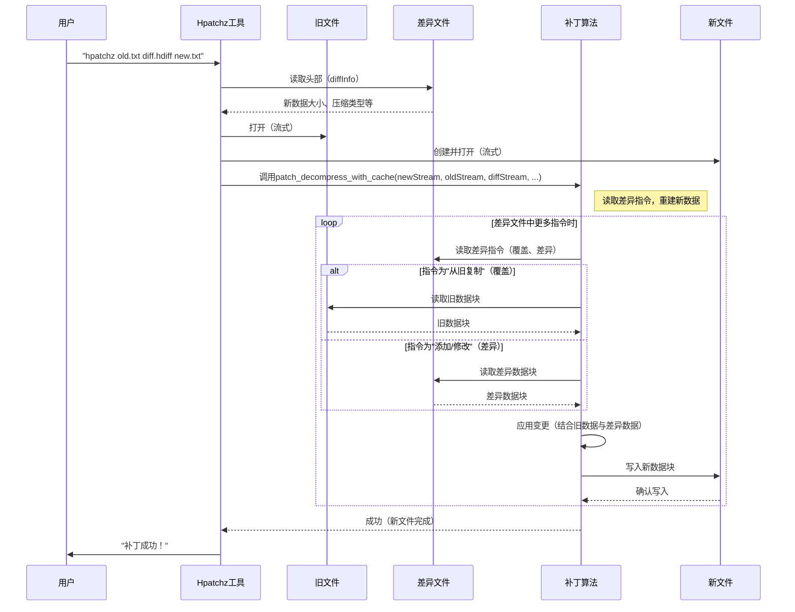

# 第三章：补丁算法（hpatch）

欢迎回来

在[第二章：差异算法（hdiff）](02_diff_algorithm__hdiff__.md)中，我们探索了HDiffPatch如何智能比较数据的两个版本（`旧`和`新`）以创建仅描述变更的紧凑"差异文件"。现在，我们将学习这项技术的另一半：**补丁算法（hpatch）**。

## 问题：如何获取新版本？

假设我们是软件应用的用户。开发者发布了更新，他们没有让我们下载完整的新版本（可能高达GB级别！），而是发送了一个小型"更新文件"（差异文件），并要求我们将其应用到当前安装版本。

我们的计算机如何使用HDiffPatch，通过"旧"应用数据和微小的"差异文件"重建"新"更新版应用？

这正是补丁算法解决的问题。它是差异生成的反向过程：==接收`旧`数据和`差异`指令，正确重建`新`数据==。

## 解决方案：补丁算法（hpatch）

HDiffPatch的`hpatch`算法如同遵循精确手册的建筑师，主要职责是：

1.  **读取`差异`文件**：理解`hdiff`算法生成的指令
2.  **访问`旧`数据**：按差异文件指示获取原始数据片段
3.  **构建`新`数据**：拼接新版本，执行如"从旧数据复制此部分"和"添加这些新字节"等指令

沿用上章的乐高城堡类比：如果差异文件是从旧城堡到新城堡的指令清单，补丁器就是严格执行这些指令的人：

*   "从**旧城堡**（`旧`数据）取这面墙放在**新城堡**（`新`数据）此处"（应用"匹配"或"覆盖"）
*   "用这些**新积木**（`新数据差异`字节）建造新塔"
*   "取这面现有墙，但通过**微调**（应用`子差异`）更换顶部的几块积木"

得益于[第一章：基于流的输入输出](01_stream_based_i_o_.md)，整个过程高效完成，仅读取必要的旧数据块并写入新数据块，适合处理超大文件。

## 补丁核心概念

*   **旧数据**：已有的原始文件或目录
*   **差异文件（补丁）**：`hdiff`算法创建的小文件，包含将旧数据变为新数据的指令
*   **新数据**：补丁器将创建的目标更新文件或目录
*   **覆盖（匹配）**：将`旧`数据特定位置的块直接复制到`新`数据特定位置的指令
*   **差异（新增/子差异）**：写入全新字节（`新数据差异`）或基于`旧`数据计算微调字节（`子差异`）的指令

## 应用补丁：简单示例

假设有`old_version.txt`文件和`patch.hdiff`文件，要创建`new_version.txt`。

使用`hpatchz`命令行工具，命令如下：

```bash
hpatchz old_version.txt patch.hdiff new_version.txt
```

**预期输出：**
成功后将创建`new_version.txt`，可能显示如下进度信息：

```
旧文件 : "old_version.txt"
差异文件: "patch.hdiff"
输出文件: "new_version.txt"
  输入旧数据大小: 1024
       差异数据大小: 128
       差异数据类型: HDiff
  保存旧数据大小: 1024
  保存新数据大小: 1050
       压缩类型: "zlib" (需解压4次)

  补丁进度: [==============================]  100.0%
  补丁成功!

hpatchz耗时: 0.005秒
```

### 补丁的C++概念代码

`hpatchz`命令背后，HDiffPatch库使用`patch_decompress_with_cache`等函数。以下是简化示例：

```c++
#include "file_for_patch.h" // 流类型
#include "libHDiffPatch/HPatch/patch.h" // patch_decompress_with_cache
#include "decompress_plugin_demo.h" // 示例解压器，如zlibDecompressPlugin

void apply_my_patch(const char* oldFileName, const char* diffFileName, 
                    const char* outNewFileName) {
    hpatch_TFileStreamInput oldFileStream;
    hpatch_TFileStreamInput diffFileStream;
    hpatch_TFileStreamOutput newFileStream;
    
    // 初始化流对象（第一章内容）
    hpatch_TFileStreamInput_init(&oldFileStream);
    hpatch_TFileStreamInput_init(&diffFileStream);
    hpatch_TFileStreamOutput_init(&newFileStream);

    // 1. 打开输入（旧、差异）和输出（新）文件
    hpatch_TFileStreamInput_open(&oldFileStream, oldFileName);
    hpatch_TFileStreamInput_open(&diffFileStream, diffFileName);

    // 打开newFileStream前需从差异文件获取其最终大小
    // getCompressedDiffInfo读取差异文件头部获取该信息
    hpatch_compressedDiffInfo diffInfo;
    getCompressedDiffInfo(&diffInfo, &diffFileStream.base); 

    hpatch_TFileStreamOutput_open(&newFileStream, outNewFileName, diffInfo.newDataSize);

    // 2. 准备解压插件（差异文件通常压缩）
    //    本例使用zlib，实际取决于差异文件的compressType
    hpatch_TDecompress decompressPlugin = zlibDecompressPlugin; // 假设使用zlib

    // 3. 分配临时内存缓存
    const size_t cacheSize = (size_t)1 << 23; // 8MB缓存
    unsigned char* temp_cache = (unsigned char*)malloc(cacheSize);
    
    // 4. 调用核心补丁算法函数
    //    从oldFileStream和diffFileStream读取，写入newFileStream
    patch_decompress_with_cache(&newFileStream.base, &oldFileStream.base,
                                   &diffFileStream.base, &decompressPlugin,
                                   temp_cache, temp_cache + cacheSize);

    // 5. 清理
    free(temp_cache);
    hpatch_TFileStreamOutput_close(&newFileStream);
    hpatch_TFileStreamInput_close(&diffFileStream);
    hpatch_TFileStreamInput_close(&oldFileStream);
    
    printf("补丁应用成功！\n");
}

// 调用示例：
// apply_my_patch("old_version.txt", "patch.hdiff", "new_version.txt");
```

**说明：**
*   再次使用[第一章：基于流的输入输出](01_stream_based_i_o_.md)的`hpatch_TFileStreamInput`和`hpatch_TFileStreamOutput`高效处理文件
*   `getCompressedDiffInfo`至关重要，读取差异文件的元数据（特别是`newDataSize`）后才能创建输出文件
*   `patch_decompress_with_cache`是HDiffPatch自有差异格式的主函数，接收`新`（输出）、`旧`（输入）、`差异`（输入）的流，解压插件（差异文件通常压缩）及临时内存缓存
*   `temp_cache`供补丁器内部缓冲数据，优化读写操作，可能缓存部分`旧`数据以加速访问

## 原理：补丁算法数据流

观察应用补丁时`hpatch`算法（特别是HDiffPatch自有格式的`patch_decompress_with_cache`）的工作流程。



### 探索：读取指令与重建数据

`patch_decompress_with_cache`（位于`libHDiffPatch/HPatch/patch.c`）的核心步骤：

1.  **读取差异头部（`read_diffz_head`）：**
    解析差异文件初始部分，获取关键信息如预期`oldDataSize`、`newDataSize`及差异文件各节使用的压缩类型，这对验证输入和设置解压至关重要。

    ```c
    // libHDiffPatch/HPatch/patch.c（简化）
    hpatch_BOOL read_diffz_head(hpatch_compressedDiffInfo* out_diffInfo, _THDiffzHead* out_head,
                                const hpatch_TStreamInput* compressedDiff) {
        TStreamCacheClip diffHeadClip; // 高效读取流的辅助工具
        // ... 初始化diffHeadClip ...
        // 读取版本类型、compressType
        // 解包newDataSize、oldDataSize、coverCount及压缩节大小
        // ...
        return hpatch_TRUE;
    }
    ```
    `TStreamCacheClip`是辅助工具（基于第一章概念），让补丁器分块从`diffStream`读取数据，按需更新内部缓冲区。

2.  **设置解压与流剪辑（`getStreamClip`）：**
    `差异`文件内部分为多节（如"覆盖数据"、"RLE控制数据"、"RLE编码数据"、"新数据差异"），每节可能单独压缩。`getStreamClip`为每节设置专用输入流，必要时自动处理解压。

    ```c
    // libHDiffPatch/HPatch/patch.c（简化）
    hpatch_BOOL getStreamClip(TStreamCacheClip* out_clip, _TDecompressInputStream* out_stream,
                              hpatch_StreamPos_t dataSize, hpatch_StreamPos_t compressedSize,
                              const hpatch_TStreamInput* stream, hpatch_StreamPos_t* pCurStreamPos,
                              hpatch_TDecompress* decompressPlugin, TByte* aCache, hpatch_size_t cacheSize) {
        // 如'compressedSize'为0，是未压缩数据；'out_clip'直接从'stream'读取
        // 如'compressedSize'>0，数据被压缩
        // 打开'decompressPlugin'在'out_clip'从'out_stream'读取时实时解压
        // 'pCurStreamPos'前进'dataSize'（未压缩）或'compressedSize'
        return hpatch_TRUE;
    }
    ```
    此函数创建`TStreamCacheClip`对象作为差异文件特定（可能压缩）节的"视图"，抽象了解压和字节获取的复杂性。

3.  **核心补丁逻辑（`patchByClip`）：**
    实际重建发生在此。它遍历`coverCount`（来自差异头部）并处理每条指令。

    ```c
    // libHDiffPatch/HPatch/patch.c（简化）
    static hpatch_BOOL patchByClip(_TOutStreamCache* outCache, // 输出新数据
                                   const hpatch_TStreamInput*  oldData, // 输入旧数据
                                   hpatch_TCovers* covers, // 覆盖指令流
                                   TStreamCacheClip* code_newDataDiffClip, // 新数据差异流
                                   struct _TBytesRle_load_stream* rle_loader, // RLE差异解码器
                                   TByte* temp_cache,hpatch_size_t cache_size) {
        hpatch_StreamPos_t newPosBack = 0;
        // 遍历每条覆盖指令
        while (covers->leave_cover_count(covers) > 0) {
            hpatch_TCover cover;
            covers->read_cover(covers, &cover); // 读取下条覆盖（oldPos, newPos, length）
            
            // 1. 处理覆盖间空隙的'新数据差异'
            if (newPosBack < cover.newPos) {
                hpatch_StreamPos_t copyLength = cover.newPos - newPosBack;
                _TOutStreamCache_copyFromClip(outCache, code_newDataDiffClip, copyLength);
                _rle_decode_skip(rle_loader, copyLength); // 跳过对应RLE数据
            }
            
            // 2. 应用'覆盖'（添加带RLE解码子差异的旧数据）
            _patch_add_old_with_rle(outCache, rle_loader, oldData, cover.oldPos, cover.length,
                                    temp_cache, cache_size);
            
            newPosBack = cover.newPos + cover.length;
        }
        // 处理文件末尾剩余的'新数据差异'
        // ...
        _TOutStreamCache_flush(outCache); // 将缓冲数据写入输出流
        return hpatch_TRUE;
    }
    ```
    *   `_TOutStreamCache_copyFromClip`：将`code_newDataDiffClip`（可能压缩）的原始字节直接写入输出`新`数据
    *   `_rle_decode_skip`：使用`_TBytesRle_load_stream`处理与`新数据差异`节对应的RLE编码数据，本质上消费差异流以保持同步，但不应用到输出数据
    *   `_patch_add_old_with_rle`：关键函数。从`oldData`流读取数据，然后通过加减RLE解码流（`rle_loader`）的值应用"子差异"变更，结果写入`outCache`

4.  **RLE解码（`_TBytesRle_load_stream`）：**
    HDiffPatch差异文件中的`子差异`和`新数据差异`数据通常经过RLE（游程编码）进一步压缩。`_TBytesRle_load_stream`管理此解码，可读取实际数据（`新数据差异`）或生成零/255字节序列，或单个重复字节（用于`子差异`操作如`+0`、`+5`、`-10`）。

    ```c
    // libHDiffPatch/HPatch/patch.c（简化）
    static hpatch_BOOL _TBytesRle_load_stream_decode_add(_TBytesRle_load_stream* loader,
                                                         TByte* out_data, hpatch_size_t decodeSize) {
        // 管理RLE解码内部状态（如相同字节序列的'memSetLength'，直接复制字节的'memCopyLength'）
        // 从内部剪辑解包RLE控制码和对应数据
        // 用重复值填充'out_data'或直接复制数据
        return hpatch_TRUE;
    }
    ```

## 支持其他差异格式

`patch_decompress_with_cache`用于HDiffPatch原生差异格式，但`hpatchz`命令行工具也能应用其他流行差异格式：

| 差异格式           | 描述                                                         | 核心补丁函数                                                 |
| :----------------- | :----------------------------------------------------------- | :----------------------------------------------------------- |
| **HDiffPatch原生** | HDiffPatch自身高度优化的格式，通常用插件（如Zlib、Zstd、LZMA）压缩。采用高级匹配和游程编码生成小差异文件。 | `patch_decompress_with_cache`或`patch_single_compressed_diff` |
| **BSDIFF4**        | 广泛使用的二进制差异格式，内部节使用Bzip2压缩。HDiffPatch包含应用此类差异的封装器。 | `bspatch_with_cache`                                         |
| **VCDIFF**         | 标准二进制差异格式（RFC 3284），也被Xdelta3和Google的`open-vcdiff`等工具使用。HDiffPatch提供封装器支持常见变体。 | `vcpatch_with_cache`                                         |

`hpatchz.c`中的主`hpatch`函数通过读取差异文件头部智能检测格式，然后分派到合适的补丁函数。

## 总结

补丁算法（`hpatch`）是差异生成过程的关键对应部分

它==严谨遵循紧凑差异文件的指令，结合现有旧数据，重建新的更新数据==。HDiffPatch的`hpatch`设计高效，处理多种差异格式，并借助基于流的I/O和可选内存缓存扩展到超大文件。

理解了差异的创建和应用后，让我们探索HDiffPatch如何定制差异文件中使用的压缩算法。

[下一章：压缩器/解压器插件](04_compressor_decompressor_plugins_.md)

