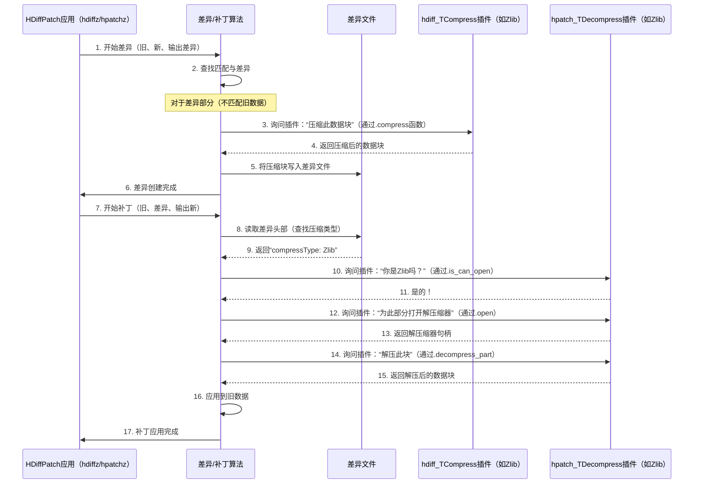

# 第4章：压缩/解压缩插件

欢迎回来

- 在[第2章：差异算法（hdiff）](02_diff_algorithm__hdiff__.md)中，我们学习了HDiffPatch的`hdiff`算法如何找到并编码两个版本数据之间的差异到一个紧凑的“差异文件”中
- 接着，在[第3章：补丁算法（hpatch）](03_patch_algorithm__hpatch__.md)中，我们看到了`hpatch`算法如何使用这个差异文件从旧数据重建新数据。

虽然差异算法本身非常智能地找到了共同部分，但实际的“差异”（新的字节或小的修改）仍然可能在差异文件中占用大量空间。为了==使这些差异文件尽可能小==，HDiffPatch使用了一个强大的功能：**压缩/解压缩插件**。

## 问题：如何让差异文件更小？

假设我们有一个巨大的软件更新。差异算法（`hdiff`）已经完成了它的工作，识别出新版本中99%的内容来自旧版本，只有1%是真正新增或修改的数据。但这1%可能仍然是几兆字节甚至几G字节，发送未压缩的差异文件仍然会很慢。

我们如何进一步缩小这1%（甚至包括“如何复制旧数据”的指令），以节省带宽和存储空间？

## 解决方案：压缩与插件系统

答案是**压缩**。就像我们在发送电子邮件之前可能会压缩一个文件夹一样，HDiffPatch可以压缩差异文件**内部**的内容。

但并非所有压缩方法都相同。有些（如Zlib）非常常见且速度合理；有些（如LZMA）可能实现更小的文件大小但压缩时间更长（有时解压时间也更长）；还有一些（如ZSTD或Brotli）在速度和压缩比之间提供了良好的平衡。

HDiffPatch并未硬编码单一的压缩方法，而是使用了**插件系统**。可以这样理解：

*   **差异文件内容**：我们想要打包的衣服。
*   **压缩算法（Zlib、LZMA、ZSTD等）**：不同的打包服务（有些打包更紧，有些更快，有些是通用的）。
*   **插件系统**：HDiffPatch灵活使用**任何**这些打包服务的方式，而无需更改其核心逻辑。我们只需“插入”想要的服务

这种系统使HDiffPatch能够：
*   **灵活**：根据具体需求选择最佳压缩算法（例如，频繁小更新的快速压缩，或归档的最大压缩）。
*   **可扩展**：轻松支持新的、更好的压缩算法，而无需重写HDiffPatch的主要代码。

## 压缩/解压缩插件的核心概念

1.  **压缩算法**：这些是缩小数据的底层技术。HDiffPatch==支持许多流行的算法==：
    *   **Zlib**：广泛使用的通用压缩库。
    *   **Bzip2**：通常比Zlib压缩更好，但速度更慢。
    *   **LZMA / LZMA2**：以极高的压缩比著称，但可能较慢。
    *   **ZSTD**：现代算法，提供出色的速度和良好的压缩比。
    *   **Brotli**：由Google开发，常用于Web内容，压缩效果良好。
    *   ……以及更多
2.  **`hdiff_TCompress`（压缩器接口）**：这是*任何*压缩插件在`hdiff`压缩数据时必须遵循的标准“蓝图”。它定义了诸如“告诉我你的名称”、“告诉我你输出的最大大小”和“压缩这些数据”等功能。
3.  **`hpatch_TDecompress`（解压缩器接口）**：这是解压缩的对应接口。它定义了诸如“你能解压这种类型的数据吗？”、“打开解压缩器”、“关闭它”和“解压部分数据”等功能。
4.  **插件实例**：对于每种支持的算法（如Zlib），都有一个`hdiff_TCompress`和`hpatch_TDecompress`的特定“实例”来实现这些蓝图。

## 在HDiffPatch中使用压缩：简单示例

当我们通过命令行工具（`hdiffz`和`hpatchz`）使用HDiffPatch时，通常会指定所需的压缩方式。

### 创建带压缩的差异

创建差异时，可以通过`-c`选项告诉`hdiffz`使用哪种压缩器。例如，使用Zlib

```bash
hdiffz -c-zlib old_version.txt new_version.txt patch.hdiff
```

或使用ZSTD（级别20）

```bash
hdiffz -c-zstd:20 old_version.txt new_version.txt patch.hdiff
```

在底层，`create_compressed_diff`函数（在[第2章：差异算法（hdiff）](02_diff_algorithm__hdiff__.md)中提到）接收一个指向`hdiff_TCompress`插件的指针。

以下是`create_my_diff`的概念性代码片段，特别突出了压缩部分：

```c++
#include "file_for_patch.h"
#include "libHDiffPatch/HDiff/diff.h"
#include "compress_plugin_demo.h" // 包含特定压缩器插件的定义（如zlibCompressPlugin）

void create_my_diff_with_compressor(const char* oldFileName, const char* newFileName,
                                    const char* outDiffFileName,
                                    const hdiff_TCompress* compressPlugin) { // <-- 这是关键变化！
    // ... （从第2章设置的流：oldFileStream、newFileStream、diffFileStream） ...

    // 核心差异函数现在使用提供的压缩插件
    create_compressed_diff(&newFileStream.base, &oldFileStream.base,
                           &diffFileStream.base, compressPlugin); // 在此传递插件

    // ... （关闭文件） ...

    printf("差异文件已创建：%s（使用压缩器：%s）\n", outDiffFileName, compressPlugin->compressType());
}

// 调用示例（使用Zlib）：
// extern const hdiff_TCompress zlibCompressPlugin; // 定义在compress_plugin_demo.h中
// create_my_diff_with_compressor("old.txt", "new.txt", "patch.hdiff", &zlibCompressPlugin);
```
**解释：**
*   `compressPlugin`参数是指向HDiffPatch压缩器插件实例的指针（例如`zlibCompressPlugin`、`lzmaCompressPlugin`）。
*   当`create_compressed_diff`需要压缩差异数据的某一部分时，它通过此插件指针调用`compress`函数。

### 应用带解压缩的补丁

应用补丁时，`hpatchz`不需要我们指定解压缩器。差异文件本身包含关于**使用哪种**压缩算法的信息

```bash
hpatchz old_version.txt patch.hdiff new_version.txt
```

在底层，`patch_decompress_with_cache`函数（来自[第3章：补丁算法（hpatch）](03_patch_algorithm__hpatch__.md)）需要一个`hpatch_TDecompress`插件。它通过读取差异文件的头部来确定使用哪个插件。

以下是`apply_my_patch`概念性代码片段的相关部分

```c++
#include "file_for_patch.h"
#include "libHDiffPatch/HPatch/patch.h"
#include "decompress_plugin_demo.h" // 包含特定解压缩器插件的定义

// 所有可用解压缩器插件的数组（在HDiffPatch项目的其他地方定义）
extern hpatch_TDecompress zlibDecompressPlugin;
extern hpatch_TDecompress lzmaDecompressPlugin;
extern hpatch_TDecompress zstdDecompressPlugin;
// ... 其他插件 ...
static hpatch_TDecompress* _allDecompressPlugins[] = {
    &zlibDecompressPlugin, &lzmaDecompressPlugin, &zstdDecompressPlugin,
    // ... 添加所有其他插件 ...
    0 // 哨兵空指针
};

void apply_my_patch(const char* oldFileName, const char* diffFileName,
                    const char* outNewFileName) {
    // ... （从第3章设置的流：oldFileStream、diffFileStream、newFileStream） ...

    hpatch_compressedDiffInfo diffInfo;
    getCompressedDiffInfo(&diffInfo, &diffFileStream.base); // 读取差异文件头部

    hpatch_TDecompress* foundDecompressPlugin = 0;
    // HDiffPatch遍历所有已知的解压缩器插件
    // 以找到可以处理diffInfo中指定的'compressType'的插件。
    for (int i = 0; _allDecompressPlugins[i] != 0; ++i) {
        if (_allDecompressPlugins[i]->is_can_open(diffInfo.compressType)) {
            foundDecompressPlugin = _allDecompressPlugins[i];
            break;
        }
    }

    if (foundDecompressPlugin == 0) {
        printf("错误：找不到类型为'%s'的解压缩器\n", diffInfo.compressType);
        return;
    }

    // ... （用diffInfo.newDataSize打开newFileStream） ...
    // ... （分配temp_cache） ...

    // 核心补丁函数现在使用自动检测到的解压缩插件
    patch_decompress_with_cache(&newFileStream.base, &oldFileStream.base,
                                &diffFileStream.base, foundDecompressPlugin, // 使用找到的插件
                                temp_cache, temp_cache + cacheSize);

    // ... （清理） ...
    printf("补丁应用成功（使用解压缩器：%s）！\n", diffInfo.compressType);
}

// 调用示例：
// apply_my_patch("old_version.txt", "patch.hdiff", "new_version.txt");
```
**解释：**
*   `getCompressedDiffInfo`读取差异文件的头部以发现`diffInfo.compressType`（例如“zlib”、“lzma”）
*   HDiffPatch然后搜索其`_allDecompressPlugins`列表。每个插件都有一个`is_can_open`函数来检查是否可以处理`compressType`
*   一旦找到正确的解压缩器插件，它会被传递给`patch_decompress_with_cache`，后者使用其`open`、`decompress_part`和`close`函数来提取原始数据

## 底层实现：插件接口

让我们看看`libHDiffPatch/HDiff/diff_types.h`和`libHDiffPatch/HPatch/patch_types.h`中这些插件接口的结构。

### `hdiff_TCompress`（压缩器）

此结构定义了HDiffPatch如何与任何压缩算法交互以**创建**差异：

```c
// libHDiffPatch/HDiff/diff_types.h（简化版）
typedef struct hdiff_TCompress{
    // 返回压缩器的类型标签（例如“zlib”、“lzma”）。
    const char*             (*compressType)(void);
    // 估计压缩数据的最大大小。
    hpatch_StreamPos_t (*maxCompressedSize)(hpatch_StreamPos_t dataSize);
    // 核心函数：将数据从'in_data'压缩到'out_code'。
    hpatch_StreamPos_t          (*compress)(const struct hdiff_TCompress* compressPlugin,
                                                const hpatch_TStreamOutput*   out_code,
                                                const hpatch_TStreamInput*    in_data);
    // ... 其他可选函数 ...
} hdiff_TCompress;
```

**示例Zlib压缩器初始化（概念性）：**
当我们使用Zlib压缩器时，它是`hdiff_TCompress`的一个实例，其中这些函数指针被设置为实际的Zlib特定函数。

```c
// 从compress_plugin_demo.h中简化的摘录，用于zlibCompressPlugin
extern const TCompressPlugin_zlib zlibCompressPlugin; // TCompressPlugin_zlib包含hdiff_TCompress
// ... 内部，zlibCompressPlugin.base.compress指向_zlib_compress ...

// _zlib_compress（compress指向的函数）的概念性代码片段
static hpatch_StreamPos_t _zlib_compress(/* ... 参数 ... */){
    z_stream s; // Zlib的内部状态
    // 设置Zlib压缩
    if (Z_OK != deflateInit2(&s, /* compress_level */, Z_DEFLATED, /* windowBits */, /* mem_level */, Z_DEFAULT_STRATEGY)) {
        // 处理错误
        return 0;
    }
    // 循环从`in_data`读取数据，用`deflate()`压缩，
    // 并将结果写入`out_code`流
    // ...
    deflateEnd(&s); // 清理
    return totalCompressedSize;
}
```
**解释：**
*   `zlibCompressPlugin`对象的`compress`函数指针被设置为名为`_zlib_compress`的函数。
*   当`create_compressed_diff`调用`compressPlugin->compress(...)`时，实际上是调用`_zlib_compress`，后者使用Zlib库（`deflateInit2`、`deflate`、`deflateEnd`）来完成压缩的重任

### `hpatch_TDecompress`（解压缩器）

此结构定义了HDiffPatch如何与任何解压缩算法交互以**应用**补丁：

```c
// libHDiffPatch/HPatch/patch_types.h（简化版）
typedef struct hpatch_TDecompress{
    // 检查此解压缩器是否可以处理给定的'compressType'字符串。
    hpatch_BOOL        (*is_can_open)(const char* compresseType);
    // 为特定数据块打开一个新的解压缩器实例。
    hpatch_decompressHandle   (*open)(struct hpatch_TDecompress* decompressPlugin,
                                          hpatch_StreamPos_t dataSize,
                                          const struct hpatch_TStreamInput* codeStream,
                                          hpatch_StreamPos_t code_begin,
                                          hpatch_StreamPos_t code_end);
    // 关闭并清理解压缩器实例。
    hpatch_BOOL              (*close)(struct hpatch_TDecompress* decompressPlugin,
                                          hpatch_decompressHandle decompressHandle);
    // 解压缩部分数据。
    hpatch_BOOL    (*decompress_part)(hpatch_decompressHandle decompressHandle,
                                          unsigned char* out_part_data,unsigned char* out_part_data_end);
    // ... 其他可选函数 ...
    volatile hpatch_dec_error_t decError; // 用于报告错误
} hpatch_TDecompress;
```

**示例Zlib解压缩器初始化（概念性）：**
类似地，Zlib解压缩器是`hpatch_TDecompress`的一个实例。

```c
// 从decompress_plugin_demo.h中简化的摘录，用于zlibDecompressPlugin
extern hpatch_TDecompress zlibDecompressPlugin;
// ... 内部，zlibDecompressPlugin.open指向_zlib_decompress_open ...

// _zlib_decompress_open（open指向的函数）的概念性代码片段
static hpatch_decompressHandle _zlib_decompress_open(/* ... 参数 ... */){
    _zlib_TDecompress* self = (_zlib_TDecompress*)malloc(sizeof(_zlib_TDecompress) + kDecompressBufSize);
    if (!self) return 0; // 内存分配错误

    // 初始化self（此解压缩器实例的内部数据）
    // ... 填充self->codeStream、self->code_begin、self->windowBits ...

    // 设置Zlib解压缩
    self->d_stream.zalloc = __zlib_dec_Alloc; // 自定义内存分配器
    self->d_stream.zfree = __dec_free;
    self->d_stream.opaque = self;
    
    int ret = inflateInit2(&self->d_stream, self->windowBits); // 初始化Zlib解压缩器
    if (ret != Z_OK) {
        free(self);
        return 0; // 错误
    }
    return self; // 返回初始化解压缩器的句柄
}
```
**解释：**
*   `zlibDecompressPlugin`对象的`open`函数指针被设置为`_zlib_decompress_open`。
*   当`patch_decompress_with_cache`调用`decompressPlugin->open(...)`时，它会调用`_zlib_decompress_open`，后者设置Zlib解压缩器（`inflateInit2`）。
*   `decompress_part`函数随后会重复调用`inflate`，将`codeStream`中的数据块解压缩到输出缓冲区。

### 插件流程的可视化



## HDiffPatch中常见的压缩/解压缩插件

HDiffPatch通常支持几种流行的压缩算法。每种算法在压缩比（文件能缩小多少）和速度（压缩/解压速度）之间有不同的权衡。

| 插件名称   | 类型标签 | 特性                                              | 典型用例                             |
| :--------- | :------- | :------------------------------------------------ | :----------------------------------- |
| **Zlib**   | `zlib`   | 平衡的速度和压缩比。广泛支持。                    | 通用，许多场景的良好默认选择。       |
| **PZlib**  | `pzlib`  | 并行Zlib，在多核CPU上更快。                       | 当`zlib`在大输入上太慢时。           |
| **LDef**   | `zlib`   | 比Zlib解压更快，仍兼容Zlib格式。                  | 优先考虑补丁应用速度与`zlib`兼容性。 |
| **PLDef**  | `zlib`   | 并行LDef，多线程下更快。                          | 最大补丁应用速度与`zlib`兼容性。     |
| **Bzip2**  | `bz2`    | 通常比Zlib压缩更好，但速度慢得多。                | 最小差异文件是关键，速度次之。       |
| **PBzip2** | `pbz2`   | 并行Bzip2，在多核CPU上更快。                      | 大输入的最小差异文件。               |
| **LZMA**   | `lzma`   | 极高的压缩比，通常较慢。                          | 长期存储的最小可能差异文件。         |
| **LZMA2**  | `lzma2`  | LZMA的改进，更好的多线程和流式处理。              | 类似于LZMA，通常优于普通LZMA。       |
| **LZ4**    | `lz4`    | 极快的压缩/解压，但压缩比较低。                   | 实时更新，极高速补丁应用。           |
| **ZSTD**   | `zstd`   | 速度和压缩比的优秀平衡，高度可配置。              | 现代通用，适用于大多数场景。         |
| **Brotli** | `brotli` | 良好的压缩比，通常与ZSTD竞争。                    | Web相关更新，平衡性能良好。          |
| **LZHAM**  | `lzham`  | 良好的压缩比，专注于游戏开发需求。                | 特定游戏更新场景。                   |
| **Tuz**    | `tuz`    | 专为极快的**小**差异数据压缩（Tinyuz）。          | 微小差异，即使小开销也很重要。       |
| **7zXZ**   | `7zXZ`   | 用于VCDIFF支持（例如，与`xdelta3 -S lzma`兼容）。 | 与其他差异工具的互操作性。           |

这种插件系统为HDiffPatch提供了极大的灵活性，使其能够通过简单地更换压缩引擎来适应各种性能和大小需求。

## 总结

压缩/解压缩插件系统是HDiffPatch效率的基石。

通过==抽象压缩逻辑，HDiffPatch可以利用Zlib、LZMA、ZSTD和Brotli等各种算法==，使差异文件尽可能小。这种灵活性确保无论我们优先考虑速度、文件大小还是特定算法特性，HDiffPatch都能在差异创建和补丁应用中提供最佳性能。

现在我们已经了解了HDiffPatch如何==处理差异文件的大小==，接下来我们将探讨它如何通过==校验==和确保数据的完整性和正确性。

[下一章：校验和插件](05_checksum_plugins_.md)

