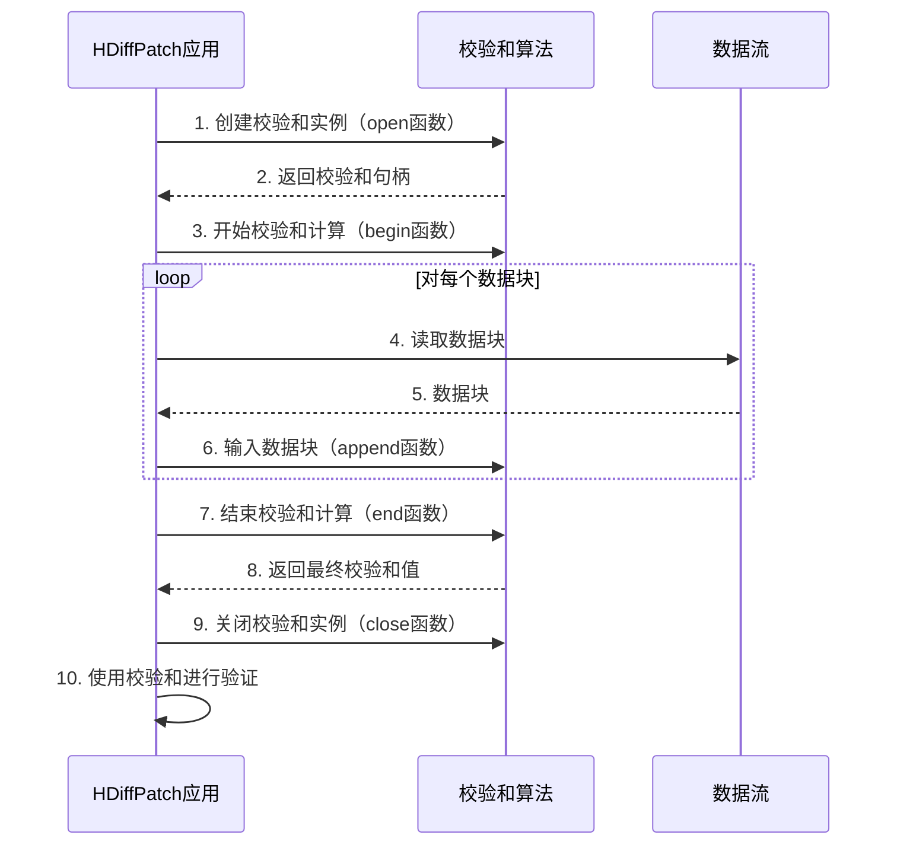

# 第5章：校验和插件

欢迎回来

在[第4章：压缩/解压缩插件](04_compressor_decompressor_plugins_.md)中，我们探讨了HDiffPatch如何通过多种压缩算法使差异文件尽可能小

现在，我们将深入探讨数据处理的另一个关键方面：使用**校验和插件**确保数据的**完整性**和**一致性**

## 问题：如何信任数据？

假设我们正在下载一个大型游戏更新。下载完成后，如何知道文件在传输过程中没有被损坏？或者在应用补丁时，HDiffPatch如何知道我们提供的“旧文件”正是它预期的版本，而生成的“新文件”是**完美**重建的？

这在目录同步或更新等场景中尤为重要。如果我们有两个大型目录，如何快速判断“old_dir”中的文件是否与“new_dir”中的文件**完全相同**，而无需逐字节比较？或者如何验证两个不同的文件是否实际包含**相同的数据**？

这些问题可以通过**校验和**来解决。

## 解决方案：校验和作为数据指纹

校验和就像数据的唯一“指纹”。它是从数据中计算出的一个短且固定长度的值。如果数据中的任何一位发生变化，校验和几乎肯定会改变。

HDiffPatch使用校验和主要有两个目的：

1.  **完整性验证**：确保数据未被损坏或篡改。下载文件或应用补丁后，可以重新计算其校验和并与预期值进行比较。如果匹配，则数据是完好的。
2.  **一致性验证**：在[第6章：目录差异/补丁（DirDiffPatch）](06_directory_diff_patch__dirdiffpatch_.md)中特别有用。比较目录时，HDiffPatch可以快速计算单个文件或块的校验和。如果两个文件的校验和相同，则它们很可能完全相同，从而避免HDiffPatch执行较慢的逐字节比较。

与压缩类似，HDiffPatch并未绑定到单一的校验和算法，而是采用了**插件架构**。这意味着我们可以根据需要选择合适的校验和算法：

*   **快速但安全性较低**：如CRC32，适用于快速完整性检查，主要关注意外损坏。
*   **较慢但安全性较高**：如SHA256，适用于需要强一致性验证的场景，可能涉及恶意篡改。

这种灵活性使我们能够在速度、安全性和校验和大小之间找到平衡。

## 校验和插件的核心概念

1.  **校验和**：从数据块计算出的一个短且固定长度的值。
2.  **校验和算法**：用于计算校验和的数学方法（如CRC32、MD5、SHA256、XXH3）。不同算法有不同的优势和速度。
3.  **`hpatch_TChecksum`（校验和接口）**：这是任何校验和插件必须遵循的标准“蓝图”。它定义了开始计算、输入数据和获取最终校验和的函数。
4.  **校验和插件**：针对不同算法的`hpatch_TChecksum`接口的具体实现。HDiffPatch内置了多种插件，包括：
    *   **CRC32**：快速，常用于错误检测。
    *   **MD5**：较旧的哈希算法，比SHA快，但存在已知的碰撞漏洞（安全性较低，但仍适用于完整性检查）。
    *   **SHA1/SHA256/SHA512**：加密强度高的哈希算法，抗碰撞能力强。速度较慢但安全性高。
    *   **XXH3/XXH128**：极快的非加密哈希算法，适用于性能关键的一致性检查。

## 在HDiffPatch中使用校验和：简单示例

校验和可以在创建差异时指定，并在应用补丁时用于验证，尤其是在目录操作中。

### 创建带校验和的差异

创建目录差异时（`hdiffz`用于目录的详细说明见[第6章：目录差异/补丁（DirDiffPatch）](06_directory_diff_patch__dirdiffpatch_.md)），可以通过`-C`选项告诉`hdiffz`使用哪种校验和算法进行文件识别或整体差异验证。

例如，使用`XXH3`进行内部目录文件比较，并嵌入整个生成的差异文件的`XXH3`校验和：

```bash
hdiffz -C-xxh3 old_dir new_dir patch.hdiff
```

在底层，`dir_diff`函数（来自`dir_diff/dir_diff.cpp`）使用选定的校验和插件。以下是概念性代码片段：

```c++
#include "dirDiffPatch/dir_diff/dir_diff.h"
#include "libHDiffPatch/HPatch/checksum_plugin.h" // 用于hpatch_TChecksum
// ... 其他包含 ...

// 示例校验和插件（如来自checksum_plugin_demo.h）
extern hpatch_TChecksum xxh3ChecksumPlugin;

void create_my_dir_diff(IDirDiffListener* listener, const TManifest& oldManifest,
                        const TManifest& newManifest, const hpatch_TStreamOutput* outDiffStream,
                        const hdiff_TCompress* compressPlugin,
                        hpatch_TChecksum* checksumPlugin) { // 校验和插件参数
    // ... （设置oldManifest、newManifest、outDiffStream、compressPlugin） ...

    // 将校验和插件传递给核心dir_diff函数
    dir_diff(listener, oldManifest, newManifest, outDiffStream,
             compressPlugin, checksumPlugin, // 传递选定的校验和插件
             hdiffSets, kMaxOpenFileNumber);

    // ... （清理） ...
    printf("使用校验和类型创建的目录差异：%s\n",
           checksumPlugin->checksumType());
}

// 调用示例（如使用XXH3）：
// extern hpatch_TChecksum xxh3ChecksumPlugin;
// create_my_dir_diff(myListener, oldManifest, newManifest,
//                    &diffStream, &zlibCompressor, &xxh3ChecksumPlugin);
```
**解释：**
*   `checksumPlugin`参数是指向`hpatch_TChecksum`实例的指针（如`xxh3ChecksumPlugin`）。
*   `dir_diff`（执行目录比较）在内部使用此`checksumPlugin`计算文件的哈希值。它会计算`oldRefChecksum`、`newRefChecksum`和`sameFileChecksum`（见`dir_diff.cpp`中的`CChecksumCombine`逻辑），并将这些校验和嵌入到差异文件的头部。

### 应用带校验和的补丁

对目录应用补丁时，`hpatchz`使用差异文件中嵌入的校验和验证数据。

```bash
hpatchz old_dir patch.hdiff new_dir
```

输出可能显示校验和验证：

```
old : "old_dir"
diff: "patch.hdiff"
out : "new_dir"
  [...]
  checksumType: "xxh3" (用于数据完整性)

  补丁进度: [==============================]  100.0%
  校验和验证通过！
  补丁应用成功！
```

如果校验和不匹配，`hpatchz`会报告错误，表明数据损坏或`old_dir`不正确。补丁程序会自动从差异文件头部检测校验和类型，并使用相应的`hpatch_TChecksum`插件。

## 底层实现：校验和插件接口

让我们看看`libHDiffPatch/HPatch/checksum_plugin.h`中`hpatch_TChecksum`接口的结构。

```c
// libHDiffPatch/HPatch/checksum_plugin.h（简化版）
typedef void*  hpatch_checksumHandle; // 用于内部状态的不透明句柄

typedef struct hpatch_TChecksum{
    // 返回校验和的类型标签（如"crc32"、"md5"）。
    const char*   (*checksumType)(void);
    // 返回最终校验和的字节大小（如CRC32为4字节，MD5为16字节）。
    hpatch_size_t (*checksumByteSize)(void);
    // 分配并初始化一个新的校验和计算内部状态。
    hpatch_checksumHandle (*open)(struct hpatch_TChecksum* plugin);
    // 释放由`open`分配的内部状态。
    void                 (*close)(struct hpatch_TChecksum* plugin,hpatch_checksumHandle handle);
    // 重置给定句柄的校验和计算（重新开始）。
    void                 (*begin)(hpatch_checksumHandle handle);
    // 将数据块输入到校验和计算中。
    void                (*append)(hpatch_checksumHandle handle,
                                      const unsigned char* part_data,const unsigned char* part_data_end);
    // 完成校验和计算并将结果写入`checksum`。
    void                   (*end)(hpatch_checksumHandle handle,
                                      unsigned char* checksum,unsigned char* checksum_end);
} hpatch_TChecksum;
```
**解释：**
*   `hpatch_checksumHandle`：这是一个`void*`指针，用作特定校验和计算的不透明标识符。实际指向的内存保存校验和算法的内部状态（如当前CRC值、MD5上下文）。
*   `checksumType`和`checksumByteSize`：这些函数提供插件的基本信息。
*   `open`/`close`：管理校验和计算实例的生命周期。`open`设置内部状态，`close`清理它。
*   `begin`/`append`/`end`：这些是计算校验和的核心流程。我们`begin`一个计算，`append`数据块（基于流式I/O原则），然后`end`以获取最终的哈希值。

### 示例：CRC32校验和插件实现

让我们看看`crc32ChecksumPlugin`（来自`checksum_plugin_demo.h`）如何实现此接口，依赖于外部`crc32`函数（如Zlib库中的函数）。

```c
// crc32ChecksumPlugin的简化概念性代码片段
#include "libHDiffPatch/HPatch/checksum_plugin.h"
#include <stdlib.h> // 用于malloc/free
#include <string.h> // 用于memcpy（常用于校验和输出）
#include "zlib.h"   // 用于zlib的crc32函数（uLong crc32(uLong crc, const Bytef *buf, uInt len)）

// 保存CRC32状态的内部类型
typedef hpatch_uint32_t _TCrc32State;

static hpatch_checksumHandle _crc32_open_impl(hpatch_TChecksum* plugin) {
    // 为CRC32状态分配内存
    return malloc(sizeof(_TCrc32State));
}

static void _crc32_close_impl(hpatch_TChecksum* plugin, hpatch_checksumHandle handle) {
    if (handle) free(handle); // 释放分配的内存
}

static void _crc32_begin_impl(hpatch_checksumHandle handle) {
    _TCrc32State* pv = (_TCrc32State*)handle;
    *pv = (hpatch_uint32_t)crc32(0, NULL, 0); // 初始化CRC32值
}

static void _crc32_append_impl(hpatch_checksumHandle handle,
                          const unsigned char* part_data, const unsigned char* part_data_end) {
    _TCrc32State* pv = (_TCrc32State*)handle;
    // 通过输入新数据更新CRC32值
    *pv = (hpatch_uint32_t)crc32(*pv, part_data, (uInt)(part_data_end - part_data));
}

static void _crc32_end_impl(hpatch_checksumHandle handle,
                       unsigned char* checksum, unsigned char* checksum_end) {
    _TCrc32State v = *(_TCrc32State*)handle;
    // 将最终的CRC32值写入输出缓冲区
    memcpy(checksum, &v, sizeof(_TCrc32State));
}

// 这些函数返回插件的信息
static const char* _crc32_checksumType_impl(void) { return "crc32"; }
static hpatch_size_t _crc32_checksumByteSize_impl(void) { return sizeof(_TCrc32State); }

// 实际的插件实例，链接函数
hpatch_TChecksum crc32ChecksumPlugin = {
    .checksumType = _crc32_checksumType_impl,
    .checksumByteSize = _crc32_checksumByteSize_impl,
    .open = _crc32_open_impl,
    .close = _crc32_close_impl,
    .begin = _crc32_begin_impl,
    .append = _crc32_append_impl,
    .end = _crc32_end_impl
};
```
**解释：**
*   `crc32ChecksumPlugin`对象将所有必要的函数（`checksumType`、`checksumByteSize`、`open`、`close`、`begin`、`append`、`end`）组合在一起。
*   当需要校验和计算时：
    1.  调用`_crc32_open_impl`为`_TCrc32State`（此处仅为`uint32_t`）分配内存，并将其作为`hpatch_checksumHandle`返回。
    2.  `_crc32_begin_impl`将此`uint32_t`初始化为起始CRC值。
    3.  `_crc32_append_impl`被重复调用，输入数据块和当前CRC值以更新它。
    4.  `_crc32_end_impl`将最终计算的`uint32_t`写入提供的`checksum`缓冲区。
    5.  `_crc32_close_impl`释放内存。

这展示了插件机制如何让HDiffPatch通过调用这些通用接口函数使用不同的校验和算法，而无需了解CRC32、MD5或SHA256的内部细节。

### 目录差异中的校验和（预览`dir_diff.cpp`）

在[第6章：目录差异/补丁（DirDiffPatch）](06_directory_diff_patch__dirdiffpatch_.md)中，校验和是优化差异过程的基础。`dir_diff.cpp`源代码展示了如何使用特定校验和预过滤文件。

```c++
// dirDiffPatch/dir_diff/dir_diff.cpp（简化版）
static std::string  cmp_hash_type    =  "fadler64"; // 内部比较的默认校验和
#define cmp_hash_value_t                uint64_t
// ... cmp_hash_begin、cmp_hash_append、cmp_hash_end、cmp_hash_combine的宏定义 ...

static cmp_hash_value_t getStreamHash(const hpatch_TStreamInput* stream,const std::string& errorTag){
    // ... 使用上述定义的cmp_hash_xxx宏 ...
    cmp_hash_value_t result;
    cmp_hash_begin(&result); // 调用fadler64的'begin'等效函数
    // 循环读取流中的数据块
    for (hpatch_StreamPos_t pos=0; pos<stream->streamSize;) {
        // ... 将数据读入缓冲区 ...
        cmp_hash_append(&result,mem.data(),readLen); // 调用'append'等效函数
        pos+=readLen;
    }
    cmp_hash_end(&result); // 调用'end'等效函数
    return result;
}
```
**解释：**
*   `dir_diff.cpp`文件默认使用`"fadler64"`（一种针对64位输出优化的快速Adler-32变体）作为`cmp_hash_type`。
*   `getStreamHash`函数在内部使用此配置的哈希。它从`hpatch_TStreamInput`（回顾[第1章：基于流的I/O](01_stream_based_i_o_.md)！）读取数据，并计算整个流的校验和。
*   当`dir_diff`比较两个目录时，它首先为所有文件计算这些`fadler64`校验和。如果两个文件的`fadler64`校验和不同，`dir_diff`立即知道它们不相同，从而跳过较慢的逐字节比较。这大大加快了目录分析速度。

### 校验和插件流程的可视化



## HDiffPatch中常见的校验和插件

HDiffPatch支持多种校验和算法，每种算法有不同的优势：

| 插件名称     | 类型标签   | 字节大小 | 特性                                                     | 典型用例                                              |
| :----------- | :--------- | :------- | :------------------------------------------------------- | :---------------------------------------------------- |
| **CRC32**    | `crc32`    | 4字节    | 快速、小巧，适合检测意外数据损坏。一致性验证安全性较低。 | 快速完整性检查，网络协议。                            |
| **Adler32**  | `adler32`  | 4字节    | 类似于CRC32，现代CPU上通常更快。                         | 快速完整性检查。                                      |
| **FAdler64** | `fadler64` | 8字节    | 快速的Adler-32变体，适合64位系统，滚动哈希更快。         | `dir_diff`中用于快速文件一致性预检查。                |
| **MD4**      | `md4`      | 16字节   | 较旧的加密哈希，非常快，但存在已知安全性漏洞。           | 特定遗留兼容性。                                      |
| **MD5**      | `md5`      | 16字节   | 常见的加密哈希，比SHA快，但易受碰撞攻击。                | 数据完整性，一致性验证安全性较低。                    |
| **SHA1**     | `sha1`     | 20字节   | 较旧的加密哈希，也有理论漏洞，但仍广泛使用。             | 兼容使用SHA1的系统。                                  |
| **SHA256**   | `sha256`   | 32字节   | 强加密哈希，广泛认为安全，速度较慢。                     | 强完整性和一致性验证。                                |
| **SHA512**   | `sha512`   | 64字节   | 更强的加密哈希，比SHA256更抗碰撞，速度最慢。             | 最高安全性需求，归档。                                |
| **Blake3**   | `blake3`   | 32字节   | 现代、极快且安全的加密哈希，专为并行计算设计。           | 高性能加密哈希。                                      |
| **XXH3**     | `xxh3`     | 8字节    | 极快的非加密哈希，适合性能关键的一致性检查。             | `dir_diff`和`hsyncz`等工具中的快速文件/块一致性验证。 |
| **XXH128**   | `xxh128`   | 16字节   | XXH3的128位版本，碰撞概率更低，仍极快。                  | 高保证快速一致性检查。                                |

这种广泛的选择使HDiffPatch适用于各种场景，从轻量级完整性检查到强大的加密验证。

## 总结

校验和插件为HDiffPatch提供了验证数据完整性和一致性的关键能力。通过像数字指纹一样工作，校验和确保数据未被损坏，文件或块确实是它们声称的内容。灵活的插件系统允许用户根据具体需求在速度、安全性和校验和大小之间找到平衡，从快速的XXH3用于目录匹配到安全的SHA256用于关键数据验证。

在了解了HDiffPatch如何确保数据完整性之后，我们现在可以结合差异和补丁知识来处理整个目录。

[下一章：目录差异/补丁（DirDiffPatch）](06_directory_diff_patch__dirdiffpatch__.md)

