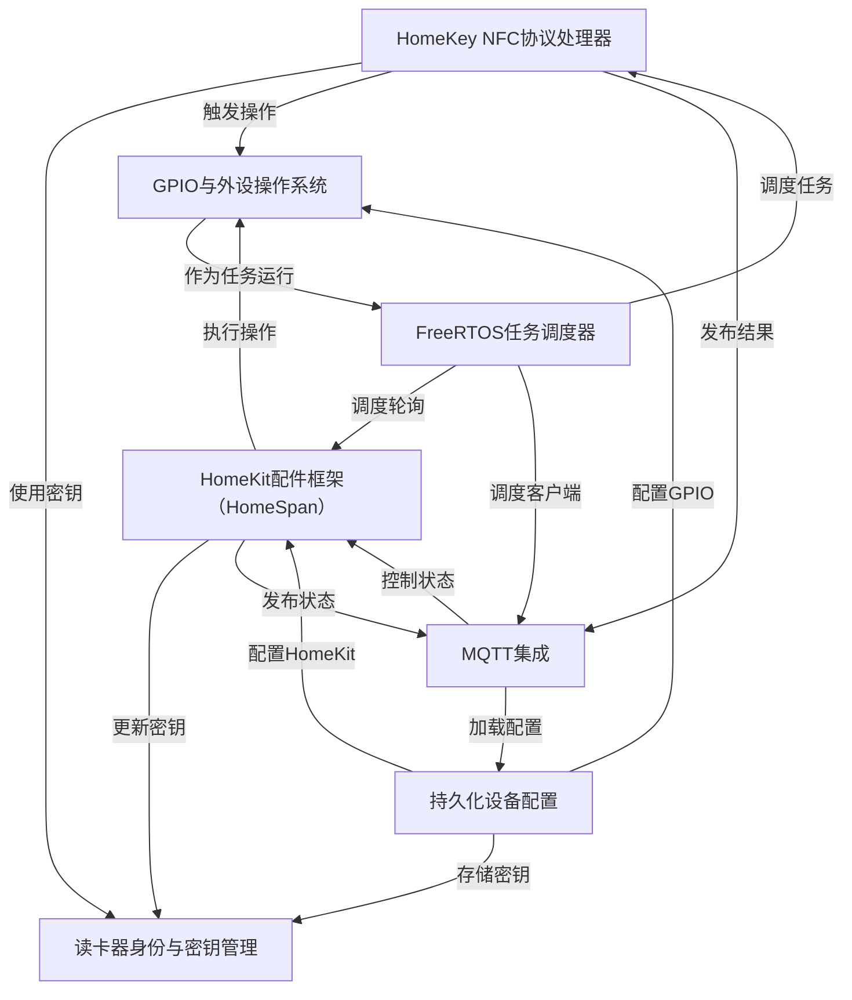
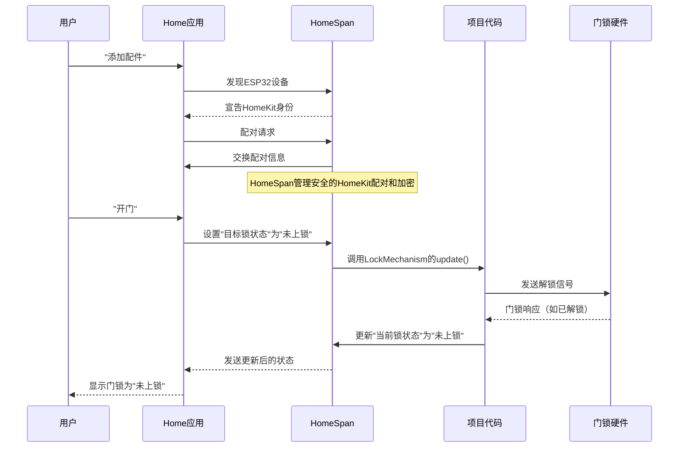

链接：[rednblkx/HomeKey-ESP32: ESP32 HomeKit Lock with support for Apple Home Key (reverse-engineered)](https://github.com/rednblkx/HomeKey-ESP32)

# docs：HomeKey-ESP32

`HomeKey-ESP32`项目将ESP32微控制器转变为支持**Apple HomeKey**的**智能门锁**

通过实现*HomeKey NFC协议*，用户可以使用iPhone或Apple Watch安全解锁门锁。

设备通过HomeKit与*Apple Home应用*集成，同时还能通过MQTT与*Home Assistant*等其他智能家居系统通信，==实现对物理门锁的灵活控制和自动化管理==。

## 可视化



## 章节

1. [HomeKit配件框架（HomeSpan）
](01_homekit_accessory_framework__homespan__.md)
2. [HomeKey NFC协议处理器
](02_homekey_nfc_protocol_handler_.md)
3. [MQTT集成
](03_mqtt_integration_.md)
4. [持久化设备配置
](04_persistent_device_configuration_.md)
5. [读卡器身份与密钥管理
](05_reader_identity_and_key_management_.md)
6. [GPIO与外设操作系统
](06_gpio_and_peripheral_action_system_.md)
7. [FreeRTOS任务调度器
](07_freertos_task_scheduler_.md)

---

# 第1章：HomeKit配件框架（HomeSpan）

我们将从理解让ESP32设备与Apple Home应用通信的"大脑"开始：HomeKit配件框架，即HomeSpan。

## 智能门锁的翻译官

假设我们有一个基于ESP32构建的智能门锁，但它只会说"ESP32语言"。而Apple Home应用只懂"HomeKit语言"。它们==无法直接交流==

这就是HomeSpan的用武之地。

**HomeSpan就像一个万能语言翻译器**。它将ESP32想要执行的操作（如上锁或解锁）翻译成Apple设备能理解的HomeKit语言。

反过来，当我们通过Siri说"打开前门"时，HomeSpan会将HomeKit命令翻译回ESP32能执行的指令。

**它解决的问题**：没有HomeSpan，ESP32智能门锁只是一个无法接入Apple Home生态的硬件设备。HomeSpan架起了这座桥梁，将简单的微控制器转变为完整的Apple HomeKit配件。

## HomeSpan如何让ESP32成为HomeKit设备

HomeSpan在幕后处理所有复杂工作，让我们可以专注于设备的独特功能。以下是它的核心职责：

1.  **HomeKit身份认证**：每个HomeKit设备都需要唯一身份标识。HomeSpan为ESP32提供这一标识，确保它能被Apple Home正确识别。
2.  **配对管理**：首次在Home应用中添加配件时需要进行配对。HomeSpan管理这个安全握手过程，将ESP32与家庭网络连接。
3.  **服务与特性**：HomeKit将设备功能组织为"服务"（设备功能，如"锁具机制"）和"特性"（服务的具体属性，如"当前锁状态"或"目标锁状态"）。HomeSpan让我们可以为智能门锁定义这些元素。

让我们看看如何通过代码告诉HomeSpan关于智能门锁的信息：

```cpp
// main/main.cpp

// 1. 启动HomeSpan并指定设备类型
homeSpan.begin(Category::Locks, "我的HomeKey门锁", "HK-", "HomeKey-ESP32");

// 2. 定义HomeKit配件（设备本身）
new SpanAccessory();

// 3. 添加智能门锁的主要功能：
new LockMechanism();     // 用于上锁和解锁
new NFCAccess();         // 用于HomeKey NFC功能（后续详述）

// 4. 处理配对事件（如新手机配对时）
homeSpan.setControllerCallback(pairCallback);
```

这段简单的`main/main.cpp`代码片段功能强大：
*   `homeSpan.begin()`：启动HomeSpan框架，声明设备属于`Category::Locks`类别，并命名为"我的HomeKey门锁"。
*   `new SpanAccessory()`：创建主HomeKit配件对象，相当于Home应用中物理门锁的数字代表。
*   `new LockMechanism()`：添加标准HomeKit"锁具机制"服务，告知Home应用设备支持上锁/解锁。
*   `new NFCAccess()`：为HomeKey功能添加的特殊服务，用于处理NFC凭证（第2章详述）。
*   `homeSpan.setControllerCallback(pairCallback)`：==设置配对成功时的回调函数==，这对管理门锁访问权限至关重要。

在`LockMechanism`服务内部，我们定义可变更的特性：

```cpp
// main/main.cpp (LockMechanism类内部)

LockMechanism() : Service::LockMechanism() {
  // 门锁当前状态（如已上锁、未上锁）
  lockCurrentState = new Characteristic::LockCurrentState(1, true); // 1表示已上锁
  // 我们希望门锁达到的目标状态
  lockTargetState = new Characteristic::LockTargetState(1, true);   // 1表示已上锁
  // ... 其他初始化代码 ...
}

boolean update() {
  int targetState = lockTargetState->getNewVal();
  // ... 执行物理门锁操作的代码 ...
  lockCurrentState->setVal(targetState); // 更新当前状态
  return true;
}
```

*   `Characteristic::LockCurrentState`：反映物理门锁的实际状态。
*   `Characteristic::LockTargetState`：表示期望状态。在Home应用中点击"解锁"时会变更此特性。
*   `boolean update()`：当`lockTargetState`变更时，HomeSpan会调用此函数。在此我们编写控制物理门锁的代码，并更新`lockCurrentState`反映最新状态。

## 幕后机制：HomeSpan如何解释命令

通过序列图展示用户通过Home应用与ESP32智能门锁交互时HomeSpan的角色：



1.  **发现与配对**：首次设置时，HomeSpan广播设备存在。Home应用发现设备后，HomeSpan处理安全配对流程。
2.  **用户指令**：通过Home应用或Siri交互。
3.  **HomeKit命令**：Home应用将操作转换为"将锁具机制服务的目标锁状态特性设为未上锁"命令。
4.  **HomeSpan翻译**：解密命令，理解需要变更`lockTargetState`，调用项目中定义的`update()`函数。
5.  **执行代码**：在`update()`中读取新状态，执行物理门锁控制代码。
6.  **硬件响应**：物理门锁执行操作（如解锁）。
7.  **状态更新**：代码更新`lockCurrentState`反映实际状态。
8.  **状态同步**：HomeSpan加密新状态并发送给Home应用。
9.  **用户反馈**：Home应用更新界面显示最新状态。

## 为HomeKey定制的HomeKit服务

除了标准服务，HomeSpan允许创建**自定义服务和特性**，这对实现HomeKey NFC等独特功能至关重要。

在`main/include/NFC_SERV_CHARS.h`中定义这些自定义元素：

```cpp
// main/include/NFC_SERV_CHARS.h

// 定义NFC配置状态的自定义特性
CUSTOM_CHAR(ConfigurationState, 263, PR+EV, UINT16, 0, 0, 1, true)

// 定义NFC访问的自定义服务
namespace Service
{
  struct NFCAccess : SpanService
  {
    NFCAccess() : SpanService{ "266","NFCAccess",true } {
      req.push_back(&_CUSTOM_ConfigurationState);
      req.push_back(&_CUSTOM_NFCAccessControlPoint);
      req.push_back(&_CUSTOM_NFCAccessSupportedConfiguration);
    }
  };
}
```

*   `CUSTOM_CHAR`：HomeSpan宏，帮助定义全新特性。`ConfigurationState`用于NFC设置。
*   `struct NFCAccess : SpanService`：创建名为`NFCAccess`的新HomeKit服务，包含所有HomeKey相关设置和交互。

这些自定义定义让Home应用能理解和显示智能门锁的HomeKey专属功能，如管理NFC卡或数字钥匙。

## 总结

本章我们了解到HomeSpan是让ESP32"说"HomeKit语言的基础框架。

它管理设备身份、处理配对，并提供将智能门锁功能暴露为标准和自定义HomeKit服务的结构。

它是使ESP32成为Home应用中智能配件的关键翻译官。

接下来，我们将深入项目的核心：[HomeKey NFC协议处理器](02_homekey_nfc_protocol_handler_.md)，探索门锁如何通过NFC与HomeKey交互。

