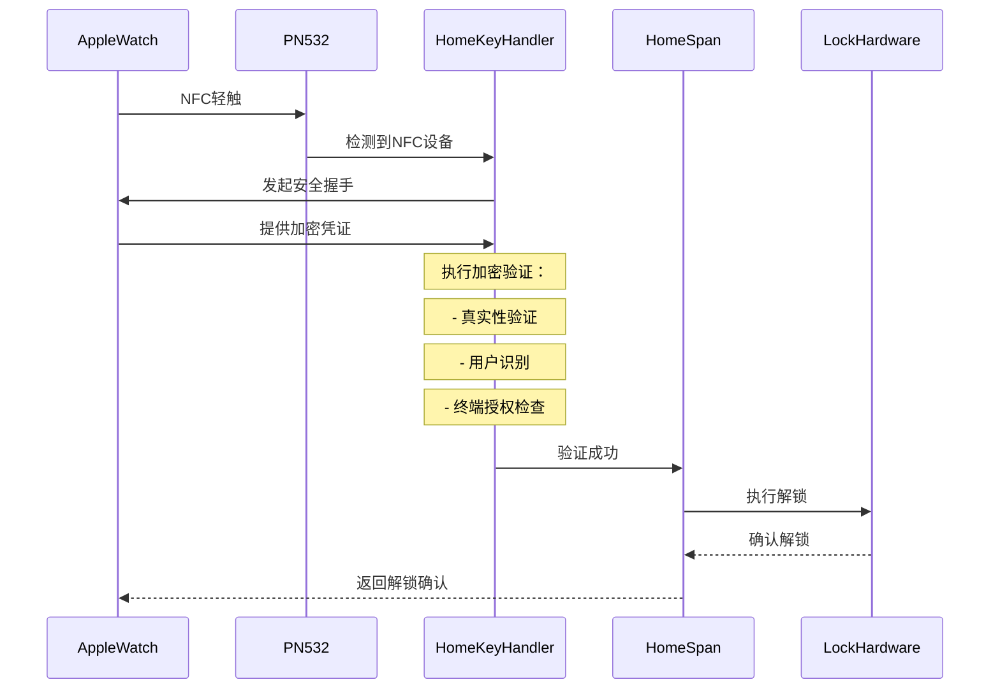

# 第2章：HomeKey NFC协议处理器

欢迎回来~

在[第1章：HomeKit配件框架（HomeSpan）](01_homekit_accessory_framework__homespan__.md)中，我们学习了HomeSpan如何作为通用翻译器，让ESP32智能门锁能与Apple Home应用"对话"。==HomeSpan处理常规的上锁/解锁命令==。

但当使用Apple HomeKey轻触门锁时会发生什么？这不仅仅是简单的"上锁"或"解锁"指令，而是一个高度安全的特殊交互。这就是**HomeKey NFC协议处理器**的用武之地。

## 智能门锁的安全守卫

想象你的智能门锁有一个VIP专属入口。HomeSpan可能是友好的门卫，但这个VIP入口需要训练有素的安全守卫。这个守卫的职责是：

1.  **识别特殊凭证**：理解Apple HomeKey的独特"语言"
2.  **验证真实性**：确保提供的HomeKey真实且未被篡改
3.  **识别访客**：知道*谁*在轻触（如John的iPhone、Jane的Apple Watch）
4.  **检查访客名单**：确认*这个特定钥匙*在*那个设备*上是否被授权进入*这扇门*

这个"安全守卫"就是我们的**HomeKey NFC协议处理器**，专门设计用于==处理Apple HomeKey卡片（或设备）轻触时的复杂流程==。

**它解决的问题**：标准NFC读卡器只能判断*某个*NFC标签是否存在并读取其基本ID。

它们不理解Apple HomeKey用于验证的复杂加密"握手"。没有这个处理器，门锁无法区分有效的HomeKey与普通NFC标签，甚至是伪造钥匙的恶意尝试。

这是让ESP32理解并响应HomeKey的核心大脑。

## 工作原理：HomeKey握手协议

当Apple设备轻触我们的`HomeKey-ESP32`门锁时，毫秒内就会完成一次复杂的安全对话，我们称之为**握手协议**。

关键概念

*   **NFC芯片交互**：ESP32使用PN532等NFC芯片物理检测Apple设备，这是守卫的"耳朵"和"嘴巴"
*   **加密验证**：HomeKey安全的核心，涉及高级数学（密码学）确保一切合法
    *   **真实性**：验证Apple设备提供的数字钥匙确实来自Apple安全生态
    *   **发行者（用户）识别**：确认与HomeKey关联的唯一"人"或"所有者"（HomeKit术语中的`Issuer`）
    *   **终端（虚拟钥匙）授权**：检查*特定终端钥匙*是否被授权操作*这个特定门锁*

这些检查在瞬间完成，实现无缝又极其安全的解锁体验。更多关于门锁身份和密钥管理的细节，请参考[第5章：读卡器身份与密钥管理](05_reader_identity_and_key_management_.md)。

## 守卫实战

通过序列图展示Apple Watch轻触解锁门锁的过程：



1.  **轻触检测**：Apple Watch发出NFC信号，被ESP32连接的PN532读卡器检测到
2.  **HomeKey握手**：协议处理器接管，与Apple Watch进行加密对话
3.  **授权结果**：所有检查通过后，向HomeSpan框架确认有效授权
4.  **门锁动作**：HomeSpan触发物理门锁解锁
5.  **反馈**：门锁物理解锁，并提供视觉/听觉反馈

## 代码实现

`HomeKey-ESP32`项目使用专用任务(`nfc_thread_entry`)持续轮询NFC读卡器。检测到HomeKey时触发认证流程：

```cpp
// main/main.cpp (简化版nfc_thread_entry函数)

void nfc_thread_entry(void* arg) {
  while (1) {
    bool passiveTarget = nfc->readPassiveTargetID(...); // 检测NFC标签
    
    if (passiveTarget) { // 检测到NFC卡片
      if (status && selectCmdRes[...] == 0x90) { // 确认是HomeKey
        // 创建认证上下文
        HKAuthenticationContext authCtx([...], readerData, savedData);
        
        // 执行安全握手和加密检查
        auto authResult = authCtx.authenticate(hkFlow);

        if (std::get<2>(authResult) != kFlowFailed) {
          // 认证成功：触发LED、解锁门锁、MQTT通知
        } else {
          // 认证失败处理
        }
      }
    }
    vTaskDelay(50 / portTICK_PERIOD_MS); // 短暂延迟后重新检测
  }
}
```

代码
1. `readPassiveTargetID`持续检测NFC标签
2. 通过特殊命令`0x00, 0xA4`选择HomeKey应用
3. `HKAuthenticationContext`创建认证上下文
4. `authenticate`执行核心加密验证
5. 根据结果触发相应操作

## 与HomeKit的交互

除了处理物理轻触，协议处理器还通过[第1章](01_homekit_accessory_framework__homespan__.md)介绍的`NFCAccess`服务，与Home应用交互管理HomeKey设置：

```cpp
// main/main.cpp (NFCAccess结构体简化)

struct NFCAccess : Service::NFCAccess {
  SpanCharacteristic* nfcControlPoint;

  NFCAccess() : Service::NFCAccess() {
    nfcControlPoint = new Characteristic::NFCAccessControlPoint();
  }

  boolean update() {
    TLV8 ctrlData(NULL, 0);
    nfcControlPoint->getNewTLV(ctrlData); // 获取HomeKit命令
    
    // 处理HomeKey特定操作（如配置新钥匙）
    HK_HomeKit hkCtx(readerData, savedData, "READERDATA", tlvData);
    std::vector<uint8_t> result = hkCtx.processResult();
    
    // 返回响应
    nfcControlPoint->setTLV(res, false);
    return true;
  }
};
```

**功能说明**：
- `nfcControlPoint`特性是Home应用发送命令的通道
- `update`处理来自Home应用的HomeKey管理请求
- `HK_HomeKit`执行与物理轻触相同的加密逻辑

## 总结

**HomeKey NFC协议处理器**是项目的核心安全组件，作为专业的"安全守卫"：
- 理解Apple HomeKey的复杂协议
- 执行加密验证确保真实性
- 识别授权用户和设备
- 处理来自物理轻触和Home应用的双向交互

这种安全机制是智能门锁系统可信度的基础。

下一步我们将探索如何通过[第3章：MQTT集成](03_mqtt_integration_.md)将验证结果通知其他智能家居系统。

