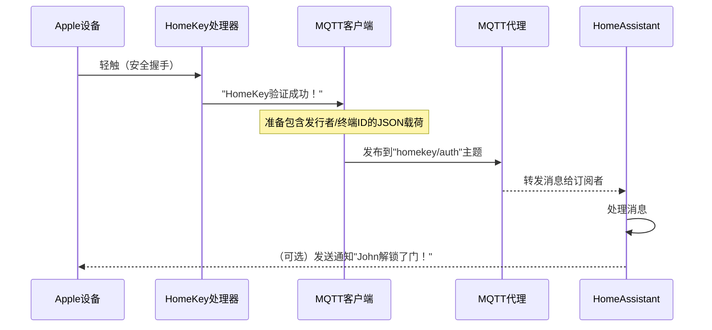
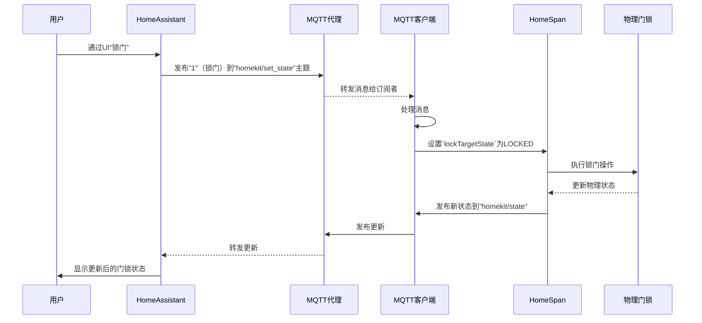

# 第3章：MQTT集成

欢迎回来

在上一章[HomeKey NFC协议处理器](02_homekey_nfc_protocol_handler_.md)中，我们学习了`HomeKey-ESP32`门锁如何安全验证Apple HomeKey。现在假设有人轻触iPhone且门锁成功验证了钥匙——这对门锁本身很棒，但如果想==让Home Assistant等智能家居系统知道是谁开了门==呢？或者想将门锁与其他设备联动、触发自动化，甚至通过非Apple Home的应用控制门锁？

这就是**MQTT集成**的用武之地。

## 智能家居的中央信息板

MQTT就像智能家居设备的高效信使服务。设备无需直接相互通信，而是通过称为**MQTT代理**的中央"信息板"交流。

**它解决的问题**：HomeKey处理器完成复杂的密钥验证后，需要简单灵活的方式向更广泛的智能家居世界宣告结果

MQTT提供了这种通用语言，让ESP32能分享状态（如"John解锁了门"）并接收命令（如"锁门"），与任何支持MQTT的智能家居系统（尤其是Home Assistant）交互。

> 没有MQTT，`HomeKey-ESP32`只是个优秀的HomeKit设备，却与智能家居==生态==隔离。

## MQTT核心概念

通过表格解析MQTT核心概念：

| 概念         | 类比             | 在`HomeKey-ESP32`中的作用                                    |
| :----------- | :--------------- | :----------------------------------------------------------- |
| **MQTT代理** | 中央邮局或信息板 | 服务器（如运行在Home Assistant上的服务），管理所有消息。ESP32通过它收发消息。 |
| **主题**     | 特定邮箱或频道   | 消息分类。例如`homekey/auth`发布HomeKey验证结果，`homekit/state`发布门锁状态。 |
| **发布**     | 向特定邮箱寄信   | ESP32向主题发送消息（如"HomeKey验证成功！"）。               |
| **订阅**     | 从特定邮箱收信   | ESP32监听主题以接收命令（如"锁门"）。Home Assistant也通过订阅获取更新。 |
| **载荷**     | 信件内容         | 消息中的实际数据，通常为JSON格式（如`{"issuerId":"...","homekey":true}`）。 |

## 建立MQTT连接

ESP32收发消息前需知道MQTT代理的位置和连接方式，这些信息通常存储在`main/include/config.h`中：

```cpp
// main/include/config.h (简化版)

// MQTT代理设置
#define MQTT_HOST "mqtt代理IP"  // MQTT代理的IP地址
#define MQTT_PORT 1883          // MQTT代理端口
#define MQTT_USERNAME "用户名"   // MQTT代理用户名
#define MQTT_PASSWORD "密码"     // MQTT代理密码

// MQTT主题
#define MQTT_AUTH_TOPIC "homekey/auth"      // HomeKey验证数据发布主题
#define MQTT_STATE_TOPIC "homekit/state"    // HomeKit门锁状态发布主题
#define MQTT_SET_STATE_TOPIC "homekit/set_state" // 门锁状态控制主题
```

## `HomeKey-ESP32`的MQTT流程

追踪两个典型场景：发布HomeKey验证事件和接收锁门/解锁命令。

### 场景1：发布HomeKey验证

当Apple设备轻触门锁且[HomeKey NFC协议处理器](02_homekey_nfc_protocol_handler_.md)成功验证后，ESP32需通知智能家居系统：



验证成功后发布结果的简化代码：

```cpp
// main/main.cpp (nfc_thread_entry函数简化版)

if (std::get<2>(authResult) != kFlowFailed) {
  json payload;
  payload["issuerId"] = hex_representation(std::get<0>(authResult)); // 用户ID
  payload["endpointId"] = hex_representation(std::get<1>(authResult)); // 钥匙ID
  payload["homekey"] = true; // HomeKey标志
  mqtt_publish(espConfig::mqttData.hkTopic, payload.dump(), 0, false); // 发布消息
}
```

### 场景2：接收锁门/解锁命令

通过Home Assistant移动应用或面板发送门锁控制命令：



MQTT初始化和消息处理的简化代码：

```cpp
// main/main.cpp (简化版)

// MQTT客户端初始化
static void mqtt_app_start() {
  esp_mqtt_client_config_t mqtt_cfg{};
  mqtt_cfg.broker.address.hostname = espConfig::mqttData.mqttBroker.c_str();
  client = esp_mqtt_client_init(&mqtt_cfg);
  esp_mqtt_client_start(client);
}

// 连接成功时订阅主题
void mqtt_connected_event(...) {
  esp_mqtt_client_subscribe(client, espConfig::mqttData.lockStateCmd.c_str(), 0);
  esp_mqtt_client_publish(client, espConfig::mqttData.lwtTopic.c_str(), "online", 6, 1, true);
}

// 处理收到的消息
void mqtt_data_handler(...) {
  std::string topic(event->topic, event->topic + event->topic_len);
  int state = atoi(event->data);
  
  if (topic == espConfig::mqttData.lockStateCmd) {
    lockTargetState->setVal(state); // 更新门锁目标状态
    // ...触发物理门锁动作...
  }
}
```

## Home Assistant自动发现

启用`MQTT_DISCOVERY`后，`HomeKey-ESP32`可自动向Home Assistant注册其功能（如门锁实体、HomeKey读卡器），无需手动配置：

```cpp
// main/main.cpp (mqtt_connected_event函数简化版)

if (espConfig::mqttData.hassMqttDiscoveryEnabled) {
  json payload;
  payload["name"] = "Lock";
  payload["state_topic"] = espConfig::mqttData.lockStateTopic.c_str();
  // ...其他门锁属性...
  esp_mqtt_client_publish(client, "homeassistant/lock/.../config", payload.dump().c_str(), payload.length(), 1, true);
}
```

## 总结

MQTT集成为`HomeKey-ESP32`提供了强大的通信骨干：
- 发布实时状态（如HomeKey验证结果）
- 接收来自Home Assistant等系统的控制命令
- 支持自动发现简化配置
- 实现跨平台智能家居联动

下一章我们将探索设备如何持久化关键配置：[第4章：持久化设备配置](04_persistent_device_configuration_.md)。

