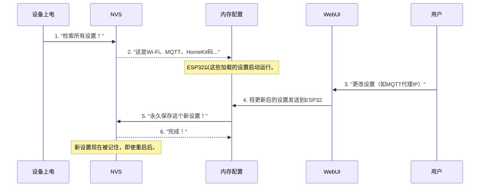
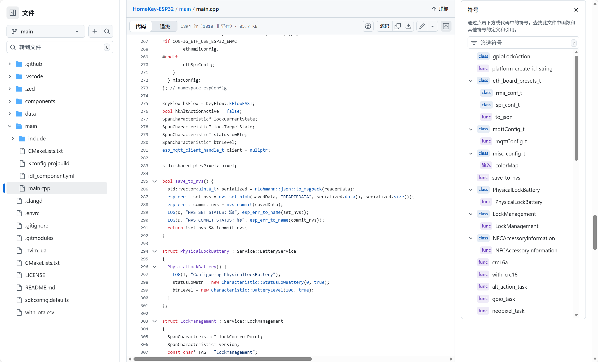

# 第4章：持久化设备配置

欢迎回来

在[第3章：MQTT集成](03_mqtt_integration_.md)中，我们探索了`HomeKey-ESP32`门锁如何通过MQTT与其他智能家居系统通信。我们看到了它如何==发布重要事件==（如成功的HomeKey轻触）并接收命令（如"锁门"）。但想象一下，我们费心配置了Wi-Fi网络、MQTT代理IP地址，甚至是唯一的HomeKit设置码。

如果断电或更新设备时拔掉插头，会发生什么？每次都需要从头重新输入所有信息吗？

当然不用~这就是**持久化设备配置**的用武之地。

## 设备的记忆银行

将`HomeKey-ESP32`智能门锁视为拥有一个特殊的"记忆银行"。这个记忆银行负责*记住*所有关键的、可定制的设置，这些设置让设备独一无二。它就像设备的大脑，即使在断电时也能保留重要信息。

**它解决的问题**：没有持久化配置，ESP32设备会患上"数字失忆症"。每次重启时，它会忘记Wi-Fi密码、MQTT服务器地址、谁被允许解锁门，甚至它的HomeKit身份。这将使设备使用起来极其令人沮丧，因为需要反复重新设置。

**我们的核心用例**：我们需要`HomeKey-ESP32`门锁记住其Wi-Fi凭证和HomeKit配对详情。如果设置一次Wi-Fi，每次上电时它都应自动连接。同样，一旦它与Apple Home应用配对，即使断电重启后也应保持配对状态。本章将展示项目如何实现这种"记忆"功能。

## 持久化设备配置的核心概念

为了让ESP32永久记住信息，我们依赖几个核心概念：

1.  **非易失性存储（NVS）**：这是ESP32内置的"硬盘"。与普通RAM（断电时丢失所有数据）不同，NVS使用一种特殊的内存（闪存），即使没有电源也能保持数据完整。所有重要设置都保存在这里。

2.  **配置桶（命名空间和键）**：为了保持组织性，设置被存储在NVS中的不同"桶"或类别中。在我们的项目中，主要使用：
    *   `READERDATA`：存储敏感的HomeKey相关信息，如注册用户的密钥和门锁自身的身份（更多内容见[第5章：读卡器身份与密钥管理](05_reader_identity_and_key_management_.md)）。
    *   `MQTTDATA`：存储所有MQTT代理设置（主机、端口、用户名、密码、主题名称）。
    *   `MISCDATA`：保存杂项设置，如设备名称、HomeKit设置码、LED或继电器的GPIO引脚分配，以及Web UI的认证详情。

3.  **结构化设置（C++对象）**：我们不仅保存原始文本，还将设置组织为结构化的C++对象（如`espConfig::mqttData`或`espConfig::miscConfig`）。这使得读取、修改和保存相关设置更加方便。

## 工作原理：加载和保存设置

假设我们通过Web界面配置了`HomeKey-ESP32`门锁的Wi-Fi和MQTT设置。以下是幕后的过程：



1.  **设备上电**：ESP32启动时，首先访问其NVS。
2.  **加载设置**：从NVS读取保存的配置，提取`MQTTDATA`、`MISCDATA`和`READERDATA`"桶"。
3.  **存入RAM**：这些设置被加载到ESP32 RAM中的活动C++对象（如`espConfig::mqttData`、`espConfig::miscConfig`、`readerData`）。设备现在知道所有关键参数，可以正常运行（连接Wi-Fi、MQTT等）。
4.  **用户更改**：通过HomeSpan内置的Web服务器访问设备的Web界面，修改设置（如MQTT代理的IP地址）。
5.  **更新RAM**：Web界面将新设置发送到ESP32。项目代码更新RAM中的相关C++对象（如`espConfig::mqttData`）。
6.  **保存到NVS**：为了永久保存更改，更新后的C++对象被转换为特殊的二进制格式，并写回NVS中的相应"桶"。这一操作将更改"提交"到设备的永久内存中。

## 代码

让我们看看`HomeKey-ESP32`项目中如何管理这个"记忆银行"。

### 1. 初始化NVS

在读取或写入NVS之前，我们需要打开它。这在设备设置期间进行一次。

```cpp
// main/main.cpp (setup()函数内部)

nvs_handle savedData; // 访问NVS的特殊句柄（类似指针）

// 打开名为"SAVED_DATA"的NVS分区用于读写。
// 如果不存在，将会创建。
nvs_open("SAVED_DATA", NVS_READWRITE, &savedData);

// 这行代码确保设备可以从非易失性存储中存储和检索数据。
```

**解释**：`nvs_open`函数就像在ESP32的闪存上打开一个特定的安全保险库，名为"SAVED_DATA"。`savedData`变量是一个句柄，允许我们与这个保险库交互以存储或检索项目。

### 2. 启动时加载配置

ESP32首次启动时，从NVS读取所有保存的设置到活动的C++对象中。

```cpp
// main/main.cpp (setup()函数内部，简化版)

size_t len; // 存储从NVS读取的数据长度的变量

// 尝试从NVS读取"MQTTDATA"桶
if (!nvs_get_blob(savedData, "MQTTDATA", NULL, &len)) {
    // 如果"MQTTDATA"存在，创建一个缓冲区保存其内容
    std::vector<uint8_t> dataBuf(len);
    // 将实际数据读入缓冲区
    nvs_get_blob(savedData, "MQTTDATA", dataBuf.data(), &len);

    // 将原始二进制数据（来自NVS）转换为结构化的JSON对象
    nlohmann::json data = nlohmann::json::from_msgpack(dataBuf);
    if (!data.is_discarded()) {
        // 将设置从JSON对象传输到活动的C++对象
        data.get_to<espConfig::mqttConfig_t>(espConfig::mqttData);
        LOG(I, "MQTT配置从NVS加载");
    }
}
// 类似的代码块用于将"MISCDATA"加载到espConfig::miscConfig，
// 以及将"READERDATA"加载到'readerData'对象。
```

**解释**：这段代码展示了ESP32如何加载其MQTT设置。
*   `nvs_get_blob(savedData, "MQTTDATA", NULL, &len)`：首先检查名为"MQTTDATA"的"blob"（二进制数据块）是否存在于"SAVED_DATA" NVS保险库中。如果存在，`len`将更新为其大小。
*   `nvs_get_blob(savedData, "MQTTDATA", dataBuf.data(), &len)`：如果数据存在，则将其读入名为`dataBuf`的`std::vector<uint8_t>`中。
*   `nlohmann::json::from_msgpack(dataBuf)`：使用`nlohmann/json`库将原始二进制数据转换为类似JSON的结构。这个库非常适合处理结构化数据。
*   `data.get_to<espConfig::mqttConfig_t>(espConfig::mqttData)`：最后，JSON数据自动映射并复制到RAM中的活动C++对象`espConfig::mqttData`中。这个对象现在保存了设备的所有活动MQTT设置。

### 3. 结构化配置对象

设备运行时，设置保存在结构化的C++对象中。

```cpp
// main/main.cpp (简化版，在espConfig命名空间内)

struct mqttConfig_t {
  std::string mqttBroker = MQTT_HOST;   // 存储MQTT代理的IP地址
  uint16_t mqttPort = MQTT_PORT;       // 存储MQTT代理的端口
  std::string mqttUsername = MQTT_USERNAME; // 存储MQTT的用户名
  std::string mqttPassword = MQTT_PASSWORD; // 存储MQTT的密码
  // ... 许多其他MQTT相关设置（主题、标志等）...

  // 这个宏来自nlohmann/json，帮助自动将此结构转换为/从JSON/MsgPack
  NLOHMANN_DEFINE_TYPE_INTRUSIVE_WITH_DEFAULT(mqttConfig_t, mqttBroker, mqttPort, mqttUsername, mqttPassword /*, ... */)
} mqttData; // 'mqttData'是RAM中保存所有MQTT设置的实际对象

struct misc_config_t {
  std::string deviceName = DEVICE_NAME; // HomeKit设备的名称
  std::string setupCode = SETUP_CODE;   // HomeKit配对设置码
  uint8_t nfcNeopixelPin = NFC_NEOPIXEL_PIN; // NeoPixel LED的GPIO引脚
  // ... 许多其他杂项设置（GPIO、定时、Web UI凭证等）...

  NLOHMANN_DEFINE_TYPE_INTRUSIVE_WITH_DEFAULT(misc_config_t, deviceName, setupCode, nfcNeopixelPin /*, ... */)
} miscConfig; // 'miscConfig'是RAM中保存各种设备设置的另一个对象
```

**解释**：
*   `mqttConfig_t`和`misc_config_t`：这些`struct`就像蓝图，定义了设备所需的所有设置的类型和名称。
*   `mqttData`和`miscConfig`：这些是这些蓝图的实例，存储在ESP32的RAM中。它们保存所有设置的*当前*值。
*   `NLOHMANN_DEFINE_TYPE_INTRUSIVE_WITH_DEFAULT`：这是`nlohmann/json`库的一个强大助手。它自动生成将C++对象（`mqttConfig_t`、`misc_config_t`）转换为紧凑的二进制格式（MsgPack，一种JSON变体）以保存到NVS所需的代码，反之亦然用于加载。这使得处理复杂配置更加简单。

### 4. 保存配置更改



当设置被修改（通常通过Web界面）时，需要将它们保存回NVS。

```cpp
// main/main.cpp

bool save_to_nvs() {
    // 将活动的'readerData' C++对象（包含HomeKey信息）
    // 使用MsgPack序列化转换为二进制格式。
    std::vector<uint8_t> serialized = nlohmann::json::to_msgpack(readerData);

    // 将此二进制数据写入NVS，键为"READERDATA"。
    esp_err_t set_nvs = nvs_set_blob(savedData, "READERDATA", serialized.data(), serialized.size());

    // 提交更改以使其永久保存在闪存上。
    esp_err_t commit_nvs = nvs_commit(savedData);

    // 记录NVS操作的状态。
    LOG(D, "NVS SET STATUS: %s", esp_err_to_name(set_nvs));
    LOG(D, "NVS COMMIT STATUS: %s", esp_err_to_name(commit_nvs));

    // 如果设置和提交都成功，返回true。
    return !set_nvs && !commit_nvs;
}
```

**解释**：`save_to_nvs`函数负责永久存储HomeKey相关数据（`readerData`）的当前状态。
*   `nlohmann::json::to_msgpack(readerData)`：这行代码将`readerData` C++对象（包含所有授权的HomeKey发行者和端点，如[第5章：读卡器身份与密钥管理](05_reader_identity_and_key_management_.md)所述）转换为适合存储的二进制表示。
*   `nvs_set_blob(savedData, "READERDATA", ...)`：这==将转换后的二进制数据写入NVS==，与"READERDATA"键关联。
*   `nvs_commit(savedData)`：这是关键步骤。它==告诉NVS系统将缓冲的更改实际写入物理闪存==。如果不提交，更改可能不会被永久保存。

保存`MQTTDATA`和`MISCDATA`的过程类似，通常在用户提交更改时由Web界面触发。

```cpp
// main/main.cpp (简化版，在setupWeb()函数的dataLoad->onRequest处理程序中)

dataLoad->onRequest([=](AsyncWebServerRequest* req) {
    // ...（接收和验证来自Web UI的新设置的代码）...

    // 这里的'configData'代表刚刚通过Web界面更新新值的espConfig::mqttData或espConfig::miscConfig。
    std::vector<uint8_t> vectorData = json::to_msgpack(configData);

    // 将更新后的配置写回NVS（如"MISCDATA"）
    esp_err_t set_nvs = nvs_set_blob(savedData, "MISCDATA", vectorData.data(), vectorData.size());
    esp_err_t commit_nvs = nvs_commit(savedData); // 提交更改

    if (set_nvs == ESP_OK && commit_nvs == ESP_OK) {
        LOG(I, "配置成功保存到NVS");
        // 如果更改了MQTT或网络等设置，通常需要重启以应用它们，
        // 因此设备可能在此处重启。
        // ESP.restart();
    } else {
        LOG(E, "出现问题，无法保存到NVS");
    }
});
```

**解释**：此代码片段展示了保存从Web界面接收的设置的核心逻辑。
*   当用户在Web UI中点击"保存"时，新设置被发送到ESP32。
*   项目将更新的`configData`（可能是`espConfig::mqttData`或`espConfig::miscConfig`，取决于保存的设置页面）转换为二进制`MsgPack`格式。
*   此二进制数据随后使用`nvs_set_blob`写入相应的NVS"桶"（如"MISCDATA"），并通过`nvs_commit`永久保存。
*   对于某些关键设置（如Wi-Fi、MQTT代理或设备名称），ESP32可能需要重启以正确应用新配置。

## 总结

持久化设备配置是`HomeKey-ESP32`项目中一个隐形但至关重要的层次

通过利用ESP32的非易失性存储（NVS）并将设置组织为逻辑C++对象，我们确保设备"记住"其身份和设置，提供一致且可靠的用户体验。这一关键能力意味着我们可以一次性设置智能门锁，即使电源闪烁，它也会保留其类似大脑的记忆。

这一基础对于管理与谁可以访问门锁相关的非常敏感的信息尤为重要。接下来，我们将探讨==设备如何识别自身并管理HomeKey的数字密钥==：[第5章：读卡器身份与密钥管理](05_reader_identity_and_key_management_.md)
