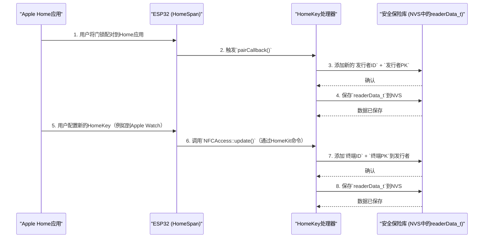

# 第5章：读卡器身份与密钥管理

欢迎回来

在上一章[持久化设备配置](04_persistent_device_configuration_.md)中，我们学习了`HomeKey-ESP32`门锁如何记住Wi-Fi凭证和HomeKit配对信息等关键设置，即使断电后也能恢复。这种"记忆"能力至关重要，尤其是在处理谁被允许解锁门这样的敏感信息时。

这让我们来到任何HomeKey设备安全的核心：**读卡器身份与密钥管理**。

## 数字密钥的保险库

想象一下，`HomeKey-ESP32`智能门锁不仅是一个硬件设备，更是一个高度安全的数字门卫。这个门卫有自己的身份证，更重要的是，它有一个安全、不可穿透的保险库。这个保险库中保存着：

1.  **自身ID和密钥**：就像门卫需要自己的徽章和秘密握手一样，我们的门锁有一个唯一的标识符和一组私密及公开的加密密钥。这是它的数字身份，允许它安全地"签署"通信并证明其真实性。
2.  **访客名单（授权用户）**：这是所有被允许与门锁交互的Apple HomeKit用户（我们称为"发行者"）的列表。对于每个用户，保险库存储其唯一的数字ID和公开加密密钥。
3.  **特定虚拟钥匙（终端）**：一个授权用户可能拥有多个HomeKey——一个在iPhone上，另一个在Apple Watch上，或许还有一个与家人共享。每个这样的数字钥匙都是一个"终端"。保险库也存储这些虚拟钥匙的ID和公开密钥。

**它解决的问题**：当有人用iPhone轻触HomeKey门锁时，门锁需要立即且安全地回答这些问题："这是一个真实的Apple HomeKey吗？""这个人是谁？"以及"*这把特定的钥匙*是否被授权打开*这扇特定的门*？"本章解释门锁如何管理自己的身份以及所有授权用户及其钥匙的身份，并以安全且持久的方式存储这些关键信息。没有这个系统，门锁将无法区分有效的HomeKey和伪造的钥匙，也不知道轻触的人是否被允许访问。

## 身份与密钥管理的核心概念

为了让这个"安全保险库"工作，我们依赖几个核心概念：

| 概念                    | 类比                        | 在`HomeKey-ESP32`中的作用                                    |
| :---------------------- | :-------------------------- | :----------------------------------------------------------- |
| **读卡器身份**          | 门锁自己的护照和密钥。      | 一个唯一的ID（`reader_id`）、一个组ID（`reader_gid`）和一对加密密钥（公开`reader_pk`，私密`reader_sk`）用于门锁本身。安全通信的关键。 |
| **发行者**              | 访客名单上的授权VIP。       | 一个被授权管理或使用此门锁HomeKey的唯一Apple HomeKit用户（绑定到Apple ID）。存储其ID（`issuer_id`）和公开密钥（`issuer_pk`）。 |
| **终端**                | 属于VIP访客的特定授权钥匙。 | 一个特定的数字HomeKey（例如，你iPhone上的钥匙，或你配偶Apple Watch上的钥匙）被授权用于此门锁。存储其ID（`endpoint_id`）和公开密钥（`endpoint_pk`）。 |
| **`readerData_t`结构**  | 物理安全保险库本身。        | 一个C++对象，保存上述所有信息：读卡器的身份，以及所有授权`发行者`及其`终端`的列表。 |
| **非易失性存储（NVS）** | 保险库的深层永久记忆。      | `readerData_t`结构被安全保存在ESP32闪存中的位置，即使断电后也能记住（[第4章：持久化设备配置](04_persistent_device_configuration_.md)解释了NVS）。 |

## 工作原理：管理身份与密钥

让我们追踪这些身份和密钥从初始设置到日常使用的管理过程：



1.  **初始设置与门锁自身身份**：当ESP32首次启动且[NVS](04_persistent_device_configuration_.md)中没有保存`READERDATA`时，系统为门锁生成一个全新的唯一标识符（`reader_id`、`reader_gid`）和一对新的加密密钥（`reader_pk`、`reader_sk`）。这是门锁的出生证明和密钥对。
2.  **与HomeKit配对（添加发行者）**：
    *   当首次将`HomeKey-ESP32`门锁添加到Apple Home应用时，HomeSpan框架处理配对过程（[第1章：HomeKit配件框架（HomeSpan）](01_homekit_accessory_framework__homespan__.md)）。
    *   成功配对后，触发一个特殊函数`pairCallback()`。
    *   在`pairCallback()`内部，系统获取Apple设备（"控制器"）的公开密钥，并用它生成唯一的`issuer_id`。
    *   这个新的`issuer_id`和控制器的公开密钥被添加到"安全保险库"的`readerData.issuers`列表中。这告诉门锁："这个特定的Apple ID现在是授权用户。"
    *   最后，整个`readerData`对象被保存回NVS，使这一更改永久化。
3.  **配置HomeKey（添加终端）**：
    *   门锁配对后，使用Apple Home应用将数字HomeKey配置到iPhone、Apple Watch或与他人共享。
    *   这些操作通过`NFCAccess` HomeKit服务（[第1章：HomeKit配件框架（HomeSpan）](01_homekit_accessory_framework__homespan__.md)和[第2章：HomeKey NFC协议处理器](02_homekey_nfc_protocol_handler_.md)）与ESP32通信。该服务中的`update()`函数处理这些命令。
    *   `HomeKey处理器`提取新虚拟钥匙的唯一ID（`endpoint_id`）及其公开密钥（`endpoint_pk`）。
    *   然后将这个新`终端`添加到`readerData.issuers`列表中对应的`发行者`下。这就像在访客名单中为特定访客添加一把特定的钥匙。
    *   再次将更新的`readerData`保存到NVS。
4.  **轻触HomeKey（认证）**：
    *   当带有HomeKey的Apple设备轻触时，[HomeKey NFC协议处理器](02_homekey_nfc_protocol_handler_.md)启动。
    *   它使用门锁自己的私钥（`reader_sk`）以及存储的`发行者`和`终端`的公开密钥执行复杂的加密握手。
    *   如果所有加密检查通过，并且在`readerData`中找到并授权了轻触的`endpoint_id`，则允许访问！

## 深入代码：`readerData_t`结构

所有这些关键的身份和密钥信息都组织在一个特殊的C++结构`readerData_t`中。这个结构在内存中充当我们的"安全保险库"。

```cpp
// main/main.cpp (简化版，在readerData_t内部)

// 此结构保存所有与HomeKey相关的身份和密钥数据
struct readerData_t {
    // 门锁自身用于HomeKey的唯一标识符
    std::vector<uint8_t> reader_id;
    // 门锁的组标识符（用于系统中的多个门锁）
    std::vector<uint8_t> reader_gid;
    // 门锁的公开加密密钥
    std::vector<uint8_t> reader_pk;
    // 门锁的私密加密密钥（保持秘密！）
    std::vector<uint8_t> reader_sk;

    // 所有授权HomeKit用户（发行者）的列表
    std::vector<hkIssuer_t> issuers;

    // 辅助宏，支持自动保存/加载到NVS（来自nlohmann/json）
    NLOHMANN_DEFINE_TYPE_INTRUSIVE_WITH_DEFAULT(
        readerData_t, reader_id, reader_gid, reader_pk, reader_sk, issuers
    )
} readerData; // 'readerData'是我们保险库在RAM中的实际实例

// 每个授权HomeKit用户的结构
struct hkIssuer_t {
    std::vector<uint8_t> issuer_id;   // Apple HomeKit用户的唯一ID
    std::vector<uint8_t> issuer_pk;   // 用户控制器的公开密钥
    std::vector<hkEndpoint_t> endpoints; // 此用户的虚拟钥匙列表

    NLOHMANN_DEFINE_TYPE_INTRUSIVE_WITH_DEFAULT(
        hkIssuer_t, issuer_id, issuer_pk, endpoints
    )
};

// 每个特定虚拟HomeKey的结构
struct hkEndpoint_t {
    std::vector<uint8_t> endpoint_id; // 此特定虚拟钥匙的唯一ID
    std::vector<uint8_t> endpoint_pk; // 此虚拟钥匙的公开密钥

    NLOHMANN_DEFINE_TYPE_INTRUSIVE_WITH_DEFAULT(
        hkEndpoint_t, endpoint_id, endpoint_pk
    )
};
```

**解释**：
*   `readerData_t`：这是主要容器。它保存关于*此特定门锁*的所有信息。
*   `reader_id`、`reader_gid`、`reader_pk`、`reader_sk`：这些`std::vector<uint8_t>`存储门锁自身身份和密钥的原始字节数据。使用`std::vector<uint8_t>`是因为加密密钥只是字节序列。
*   `issuers`：这是一个`hkIssuer_t`对象的列表（`std::vector`）。每个`hkIssuer_t`代表一个授权的Apple Home用户。
*   `hkIssuer_t`：包含`issuer_id`（HomeKit控制器公开密钥的哈希）和`issuer_pk`（实际的公开密钥）。它还有自己的`endpoints`列表。
*   `endpoints`：这是一个`hkEndpoint_t`对象的列表（`std::vector`）。每个`hkEndpoint_t`代表一个单独的虚拟HomeKey。
*   `hkEndpoint_t`：包含一个特定虚拟钥匙的`endpoint_id`和`endpoint_pk`。
*   `NLOHMANN_DEFINE_TYPE_INTRUSIVE_WITH_DEFAULT`：这个宏来自`nlohmann/json`库，非常有用。它自动允许我们将这些C++结构转换为紧凑的二进制格式（MsgPack）以保存到[NVS](04_persistent_device_configuration_.md)，并在加载时重建它们。这大大简化了复杂数据的持久化存储。

## 启动时加载读卡器数据

与其他设置一样，`readerData`在设备启动时从[NVS](04_persistent_device_configuration_.md)加载。如果没有找到数据（例如首次启动），则生成新的密钥。

```cpp
// main/main.cpp (setup()函数内部，简化版)

nvs_open("SAVED_DATA", NVS_READWRITE, &savedData); // 打开NVS（我们的永久记忆）

size_t len;
if (!nvs_get_blob(savedData, "READERDATA", NULL, &len)) { // 检查READERDATA是否存在
    // 如果存在，从NVS读取数据
    std::vector<uint8_t> savedBuf(len);
    nvs_get_blob(savedData, "READERDATA", savedBuf.data(), &len);

    // 将NVS中的原始二进制数据转换回我们的readerData_t C++对象
    nlohmann::json data = nlohmann::json::from_msgpack(savedBuf);
    if (!data.is_discarded()) {
        data.get_to<readerData_t>(readerData);
        LOG(I, "从NVS加载读卡器数据");
    }
}
// 如果READERDATA不存在，'readerData'对象将为空，
// 稍后如果需要会生成新的密钥。
```

**解释**：这段代码与其他配置的加载方式类似（[第4章：持久化设备配置](04_persistent_device_configuration_.md)）。它尝试从NVS检索`READERDATA` blob。如果成功，它将二进制数据反序列化为`readerData`对象，填充所有身份和密钥信息。

## 管理发行者（HomeKit配对）

当HomeKit控制器（如你的iPhone）与门锁配对时，调用我们的`pairCallback()`函数。它确保控制器的身份被添加到`readerData.issuers`中。

```cpp
// main/main.cpp (简化版pairCallback()函数)

void pairCallback() {
  if (HAPClient::nAdminControllers() == 0) {
    // 如果没有配对的控制器，出于安全考虑删除所有HomeKey数据。
    deleteReaderData(NULL);
    return;
  }

  for (auto it = homeSpan.controllerListBegin(); it != homeSpan.controllerListEnd(); ++it) {
    std::vector<uint8_t> id = getHashIdentifier(it->getLTPK(), 32); // 从控制器的公开密钥创建发行者ID
    hkIssuer_t* foundIssuer = nullptr;
    for (auto&& issuer : readerData.issuers) {
      if (std::equal(issuer.issuer_id.begin(), issuer.issuer_id.end(), id.begin())) {
        LOG(D, "发行者 %s 已添加，跳过", red_log::bufToHexString(issuer.issuer_id.data(), issuer.issuer_id.size()).c_str());
        foundIssuer = &issuer;
        break;
      }
    }
    if (foundIssuer == nullptr) { // 如果是新发行者，添加他们
      LOG(D, "添加新发行者 - ID: %s", red_log::bufToHexString(id.data(), 8).c_str());
      hkIssuer_t newIssuer;
      newIssuer.issuer_id = std::vector<uint8_t>{ id.begin(), id.begin() + 8 };
      newIssuer.issuer_pk.insert(newIssuer.issuer_pk.begin(), it->getLTPK(), it->getLTPK() + 32);
      readerData.issuers.emplace_back(newIssuer); // 将新发行者添加到我们的列表
    }
  }
  save_to_nvs(); // 将所有更改永久保存到NVS
}
```

**解释**：
*   `HAPClient::nAdminControllers() == 0`：如果所有HomeKit配对都被移除，系统安全地删除所有存储的HomeKey数据，实质上是重置门锁的"访客名单"。
*   `homeSpan.controllerListBegin()`：HomeSpan保留所有配对HomeKit控制器的列表。我们遍历它们。
*   `getHashIdentifier(it->getLTPK(), 32)`：对于每个控制器，我们取其长期公开密钥（LTPK）并通过哈希生成唯一的8字节`issuer_id`。这个`issuer_id`是我们识别Apple用户的方式。
*   代码然后检查这个`issuer_id`是否已经在我们的`readerData.issuers`列表中。
*   如果是*新*发行者，则创建一个带有其`issuer_id`和`issuer_pk`的`hkIssuer_t`对象，并将其添加到`readerData.issuers`。
*   `save_to_nvs()`：任何更改后，调用这个关键函数将更新的`readerData`写入[NVS](04_persistent_device_configuration_.md)，确保更改是永久的。

## 管理终端（HomeKey配置）

当你从Apple Home应用配置一个新的HomeKey时，`NFCAccess`服务（来自[第1章：HomeKit配件框架（HomeSpan）](01_homekit_accessory_framework__homespan__.md)）处理交互。它的`update()`函数调用`HK_HomeKit`类，负责用新的终端详情更新`readerData`。

```cpp
// main/main.cpp (简化版NFCAccess::update()函数)

struct NFCAccess : Service::NFCAccess {
  // ...（特性定义）...

  boolean update() {
    // 1. 从Home应用获取HomeKit命令（例如，"添加一个新的HomeKey"）
    TLV8 ctrlData(NULL, 0);
    nfcControlPoint->getNewTLV(ctrlData);
    std::vector<uint8_t> tlvData(ctrlData.pack_size());
    ctrlData.pack(tlvData.data());

    if (tlvData.size() == 0) return false;

    // 2. HK_HomeKit类处理此命令并更新readerData
    //    （例如，添加一个新的终端到readerData.issuers中的一个发行者）
    HK_HomeKit hkCtx(readerData, savedData, "READERDATA", tlvData);
    std::vector<uint8_t> result = hkCtx.processResult();

    // 处理后，如果读卡器的组ID被更新，应用它
    if (readerData.reader_gid.size() > 0) {
      // ...（用新的reader_gid更新内部ECP数据的代码）...
    }

    // 3. 将响应发送回Home应用
    TLV8 res(NULL, 0);
    res.unpack(result.data(), result.size());
    nfcControlPoint->setTLV(res, false);
    return true;
  }
};
```

**解释**：
*   `nfcControlPoint->getNewTLV(ctrlData)`：这检索从Home应用发送的命令（例如，添加一个HomeKey）。
*   `HK_HomeKit hkCtx(readerData, savedData, "READERDATA", tlvData)`：这行创建一个`HK_HomeKit`对象，传递给它我们的`readerData`保险库引用、用于保存的`nvs_handle`和HomeKit命令数据。
*   `hkCtx.processResult()`：这是魔法发生的地方！`HK_HomeKit`类理解用于HomeKey管理的复杂HomeKit命令。它执行必要的加密操作，并且如果正在配置一个新的HomeKey，*通过添加一个新的`终端`到正确的`发行者`来修改`readerData`对象*。
*   关键的是，`HK_HomeKit`类（内部）将在成功添加或修改`readerData`中的任何密钥数据后调用`save_to_nvs()`，确保更改被保存到NVS。

这个系统保证`readerData`始终包含最新的、完整的授权HomeKey用户及其特定虚拟钥匙的"访客名单"，所有信息都安全且持久地存储。

## 总结

**读卡器身份与密钥管理**系统是我们`HomeKey-ESP32`门锁的安全核心。它精心处理门锁自身的数字身份，并作为一个警惕的保险库，存储所有授权Apple HomeKit用户（发行者）及其特定虚拟HomeKey（终端）的ID和加密密钥。通过利用持久化存储和强大的加密过程，这个系统确保只有合法且授权的HomeKey才能解锁你的门，提供最高级别的安全和安心。

现在我们的门锁可以识别和管理数字钥匙，我们需要将这些数字操作连接到物理世界。在下一章[第6章：GPIO与外设操作系统](06_gpio_and_peripheral_action_system_.md)中，我们将探索ESP32如何控制LED、继电器和蜂鸣器等物理输出，以响应HomeKey事件。

