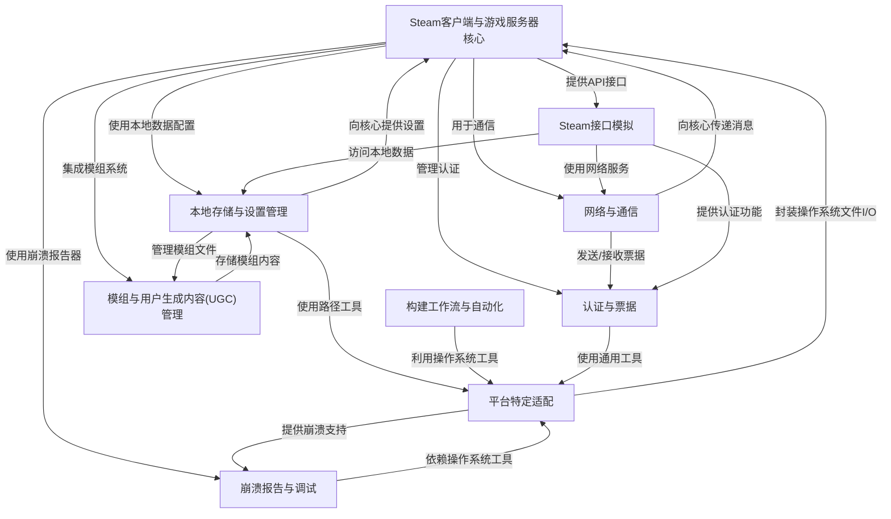
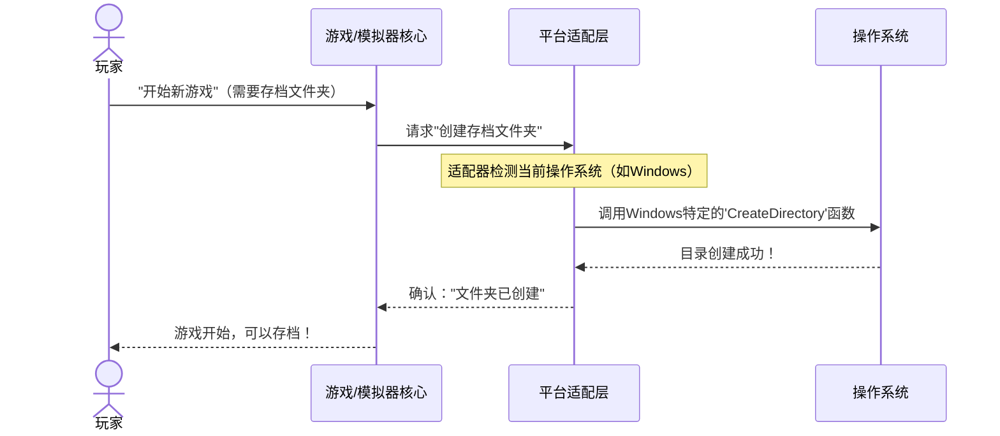

链接：[Goldberg / goldberg_emulator · GitLab](https://gitlab.com/Mr_Goldberg/goldberg_emulator)

# docs：gbe_fork

`gbe_fork`项目是一个**Steam模拟器**，允许游戏无需官方Steam客户端即可运行。

*模拟了Steam的核心功能*，如用户认证、好友列表、用户统计数据和多人游戏匹配。

该模拟器支持*局域网在线多人游戏*和*离线游戏*，并将玩家数据和游戏配置存储在本地。该项目通过*平台特定适配*确保在不同操作系统上的兼容性，为需要实时Steam环境的游戏提供无缝体验。

## 可视化



## 章节

1. [平台特定适配
](01_platform_specific_adaptations_.md)
2. [本地存储与设置管理
](02_local_storage_and_settings_management_.md)
3. [认证与票据
](03_authentication_and_tickets_.md)
4. [模组与用户生成内容(UGC)管理
](04_mod_and_ugc__user_generated_content__management_.md)
5. [崩溃报告与调试
](05_crash_reporting_and_debugging_.md)
6. [网络与通信
](06_networking_and_communication_.md)
7. [Steam接口模拟
](07_steam_interface_emulation_.md)
8. [Steam客户端与游戏服务器核心
](08_steam_client___gameserver_core_.md)
9. [构建工作流与自动化
](09_build_workflows_and_automation_.md)

---

# 第1章：平台特定适配

想象你有一台全新的游戏主机，但它只能使用特定国家的电源插头。如果你出国旅行，就需要一个特殊的转换器，对吧？软件开发也面临类似的挑战。

我们的项目`gbe_fork`是一个模拟器，和许多软件一样，它需要在不同的"国家"——或者说不同的**操作系统（OS）**（如Windows和Linux）上运行。

这就是"平台特定适配"的用武之地。它就像是内置于我们==模拟器中的万能转换器==。这个转换器确保`gbe_fork`的核心部分能够"说正确的语言"并"使用正确的插头"，无论当前运行在哪个操作系统上。这样一来，我们就不需要为每个操作系统重写整个模拟器，节省了大量时间和精力

### 挑战：跨操作系统工作

考虑一个常见任务：为游戏存档创建新文件夹或查找模拟器的安装位置。

*   在**Windows**上，路径可能类似于`C:\Users\YourName\Documents\gbe_fork\saves`。
*   在**Linux**上，相同的路径可能是`/home/YourName/.config/gbe_fork/saves`。

注意到区别了吗？Windows的盘符`C:`、反斜杠`\`，以及Linux的正斜杠`/`，加上用户文件的不同标准位置。如果我们的代码只假设一种风格，就会在另一个操作系统上崩溃

平台特定适配通过提供智能工具==自动处理这些差异==来解决这个问题。

### 适配的核心概念

让我们分解`gbe_fork`如何实现这种"万能转换器"魔法：

1.  **操作系统（OS）检测**：代码首先需要知道它运行在*哪个*操作系统上。是Windows还是Linux？知道这一点后，它可以选择正确的"规则"或"翻译"。

2.  **文件路径管理**：这涉及能够正确构建、分析和使用文件路径的函数，无论操作系统的特定格式如何（斜杠、盘符等）。如果操作系统使用不同的内部方式表示文件名，它还会处理文本格式的转换。

3.  **系统级API调用**：操作系统为创建文件夹、读取文件或管理内存等任务提供特殊的"指令"（称为API——应用程序编程接口）。这些指令在Windows和Linux之间通常差异很大。适配层确保调用正确的操作系统特定指令。

### 用例：管理文件路径

让我们看看`gbe_fork`如何管理文件路径，特别是在创建目录或查找现有文件时。

#### 创建目录

假设`gbe_fork`需要为游戏存档创建一个目录。它使用抽象掉操作系统差异的函数。

以下是使用`common_helpers::create_dir`函数创建目录的方式：

```cpp
// 来自common_helpers.cpp
// ...
bool common_helpers::create_dir(std::string_view filepath)
{
    // 使用std::filesystem，它处理操作系统差异
    const auto parent(std::filesystem::u8path(filepath).parent_path());
    return create_dir_impl(parent);
}
// ...
```
这段代码展示了`create_dir`接收文件路径（作为`std::string_view`）。魔法发生在`std::filesystem::u8path`和`create_dir_impl`内部，它们知道如何为当前操作系统创建目录。

**输入示例及发生的情况**：

*   **输入（Windows）**：`common_helpers::create_dir("C:\\Users\\Player\\gbe_saves\\mygame.sav")`
*   **输出**：代码会正确识别父路径`C:\Users\Player\gbe_saves`，如果不存在则创建它，使用Windows特定的系统调用。

*   **输入（Linux）**：`common_helpers::create_dir("/home/player/.config/gbe_saves/mygame.sav")`
*   **输出**：代码会识别父路径`/home/player/.config/gbe_saves`，如果不存在则创建它，使用Linux特定的系统调用。

重要的是，**作为使用`gbe_fork`的开发者，你不需要为Windows和Linux编写单独的代码**来调用`create_dir`。它会为你处理！

#### 检查文件或目录是否存在

类似地，检查文件或目录是否存在也由适配层处理：

```cpp
// 来自common_helpers.cpp
// ...
bool common_helpers::file_exist(const std::string &filepath)
{
    if (filepath.empty()) return false;
    return file_exist(std::filesystem::u8path(filepath)); // 使用std::filesystem
}

bool common_helpers::dir_exist(const std::string &dirpath)
{
    if (dirpath.empty()) return false;
    return dir_exist(std::filesystem::u8path(dirpath)); // 使用std::filesystem
}
// ...
```
这些函数利用`std::filesystem`执行与操作系统无关的检查，这意味着无论底层操作系统如何，它们的工作方式都相同。

### 幕后：适配的工作原理

让我们揭开"万能转换器"的构建方式。

#### 文件操作的高级工作流

以下是模拟器执行创建目录等文件操作时的简化事件序列：



1.  **游戏/模拟器核心**（我们的`gbe_fork`项目）请求执行任务，比如创建文件夹。它不知道也不关心运行在哪个操作系统上。
2.  **平台适配层**（我们的"万能转换器"）接收此请求。
3.  **操作系统检测**：适配器首先检查当前运行的操作系统。
4.  **翻译**：根据检测到的操作系统，适配器将请求翻译为操作系统理解的特定指令。
5.  **操作系统交互**：适配器将此操作系统特定指令发送给**操作系统**。
6.  **响应**：操作系统执行任务并将响应发送回适配器。
7.  **结果返回核心**：适配器处理操作系统的响应，并向游戏/模拟器核心发送通用的"成功"或"失败"消息。

这确保核心逻辑保持干净和通用，而混乱的操作系统特定细节由适配层处理。

#### 代码深入：操作系统检测

第一步是知道我们运行在哪个操作系统上。`gbe_fork`使用预处理器指令（`#if defined(...)`）在编译时实现这一点。

**文件：** `helpers/common_helpers/os_detector.h`

```cpp
#ifndef __INCLUDED_OS_DETECTOR__
#define __INCLUDED_OS_DETECTOR__

#if defined(WIN64) || defined(_WIN64) || defined(__MINGW64__)
    #define __WINDOWS_64__
#elif defined(WIN32) || defined(_WIN32) || defined(__MINGW32__)
    #define __WINDOWS_32__
#endif

#if defined(__WINDOWS_32__) || defined(__WINDOWS_64__)
    #define __WINDOWS__ // 此宏表示"是Windows！"
#endif

#if defined(__linux__) || defined(linux)
    #if defined(__x86_64__)
        #define __LINUX_64__
    #else
        #define __LINUX_32__
    #endif
#endif

#if defined(__LINUX_32__) || defined(__LINUX_64__)
    #define __LINUX__ // 此宏表示"是Linux！"
#endif

// ... 其他操作系统如macOS
#if defined(__APPLE__) || defined(macintosh) || defined(Macintosh) || defined(__MACH__)
    #define __MACOS__
#endif

#endif
```
**说明：**
此文件使用特殊的C++预处理器命令。在代码被编译成可运行程序之前，这些`#define`行根据代码构建的系统创建标志（`__WINDOWS__`、`__LINUX__`等）。当`gbe_fork`项目在Windows上编译时，`__WINDOWS__`将被激活。如果在Linux上编译，`__LINUX__`将被激活。代码的其他部分可以使用这些标志来包含或排除操作系统特定的代码。

#### 代码：字符串转换

Windows通常使用`wchar_t`（宽字符）作为文件路径和系统函数，而Linux通常使用`char`（标准字符），通常编码为UTF-8。`common_helpers`提供函数在这些格式之间转换，确保路径始终被底层操作系统正确理解。

**文件：** `helpers/common_helpers.cpp`

```cpp
// ...
std::wstring common_helpers::to_wstr(std::string_view str)
{
    if (str.empty() || !utf8::is_valid(str)) {
        return {};
    }
    std::wstring wstr{};
    // 将std::string（UTF-8）转换为std::wstring（Windows上通常为UTF-16）
    utf8::utf8to16(str.begin(), str.end(), std::back_inserter(wstr));
    return wstr;
}

std::string common_helpers::to_str(std::wstring_view wstr)
{
    if (wstr.empty()) {
        return {};
    }
    std::string str{};
    // 将std::wstring（UTF-16）转换为std::string（UTF-8）
    utf8::utf16to8(wstr.begin(), wstr.end(), std::back_inserter(str));
    return str;
}
// ...
```
**说明：**
这些函数对于文本翻译至关重要。例如，如果你的模拟器核心将路径存储为标准`std::string`（这在跨平台代码中很常见），但Windows API函数需要`std::wstring`，`to_wstr`会处理转换。这可以防止在与操作系统交互时文件名损坏或错误。

#### 代码：操作系统特定文件处理（Windows示例）

让我们看看`gbe_fork`如何在Windows上获取其可执行文件的路径。

**文件：** `helpers/pe_helpers.cpp`（PE代表可移植可执行文件，Windows上可执行文件的格式）

```cpp
// ...
const std::string& pe_helpers::get_current_exe_path()
{
    static std::recursive_mutex path_mtx{};
    if (path_a.empty()) {
        std::lock_guard lk(path_mtx);
        if (path_a.empty()) {
            std::wstring path_w(8192, '\0');
            // 这是Windows特定的API调用
            DWORD read_chars = GetModuleFileNameW(GetModuleHandleW(nullptr), &path_w[0], (DWORD)path_w.size());
            // ...（省略错误处理和调整大小的代码）...

            // 将宽字符串（Windows原生）转换为标准字符串（供gbe_fork核心使用）
            path_a = common_helpers::to_str(path_w.substr(0, modulename_idx));
        }
    }
    return path_a;
}
// ...
```
**说明：**
这个函数是Windows特定适配的完美例子。`GetModuleFileNameW`和`GetModuleHandleW`是Windows API调用，在Linux上根本不存在。这个函数使用它们来查找模拟器在Windows上的安装路径，然后使用`common_helpers::to_str`将结果`std::wstring`转换为`std::string`，以便模拟器的其余部分可以统一使用。

#### 代码：操作系统特定文件处理（Linux示例）

Linux系统对文件路径有不同的约定，包括大小写敏感和符号链接。`gbe_fork`提供包装器来标准化文件的访问方式，特别是对于Steam相关的路径，这可能很棘手。

**文件：** `dll/wrap.cpp`（此文件包含许多Linux特定的包装器）

```cpp
#if defined(__LINUX__) // 此代码块仅在Linux上编译！
// ...
const char *get_steam_path()
{
    char *home_path = getenv("HOME"); // Linux获取主目录的方式
    char steam_path[STEAM_PATH_CACHE_SIZE];
    // 构建路径，如"/home/user/.steam/steam"
    snprintf(steam_path, STEAM_PATH_CACHE_SIZE, "%s/.steam/steam", home_path);
    // ...（省略内存分配和realpath处理的代码）...
    return steam_realpath; // 返回Linux风格的路径
}

// ...
STEAMAPI_API FILE *__wrap_fopen(const char *path, const char *modes)
{
    // 此函数作为Linux上标准C函数'fopen'的包装器
    // 它首先使用lowercase_path处理路径
    bool is_writable = strpbrk(modes, "wa+") != 0;
    const char *path_lowercased = lowercase_path(path, is_writable, true);
    FILE *result = fopen(path_lowercased, modes); // 调用实际的Linux 'fopen'
    if (path_lowercased != path) {
        free((void *)path_lowercased);
    }
    return result;
}
// ...
#endif
```
**说明：**
这部分代码（`wrap.cpp`）专门为Linux编译（注意`#if defined(__LINUX__)`）。
*   `get_steam_path()`展示了如何在Linux上确定Steam的安装目录，这涉及使用`getenv("HOME")`（Linux获取用户主目录的方式）并使用正斜杠构建路径。
*   `__wrap_fopen`函数是"拦截"或"包装器"的例子。当Linux上的`gbe_fork`尝试使用`fopen`打开文件时，它实际上首先调用`__wrap_fopen`。这个包装器然后获取提供的`path`，可能使用`lowercase_path`将其转换为小写（因为Linux文件系统区分大小写，而Windows不区分），然后使用调整后的路径调用原始的`fopen`函数。这确保与可能期望Windows风格不区分大小写路径的游戏有更好的兼容性。

### 结论

"平台特定适配"是使`gbe_fork`成为多功能且健壮的模拟器的基础。

通过==智能检测操作系统==、==管理文件路径==以及在操作系统特定调用之间进行翻译，`gbe_fork`确保用户无论使用Windows还是Linux都能获得一致的体验。

> 这个抽象层就像建筑物的地基；它确保其他一切都能稳固地建立起来，无论建立在什么基础上。

接下来，我们将探讨`gbe_fork`如何处理==数据的保存和加载==，包括游戏存档和模拟器设置。这直接建立在我们对平台适配的理解之上，因为存储数据也需要跨操作系统工作

[下一章：本地存储与设置管理](02_local_storage_and_settings_management_.md)

