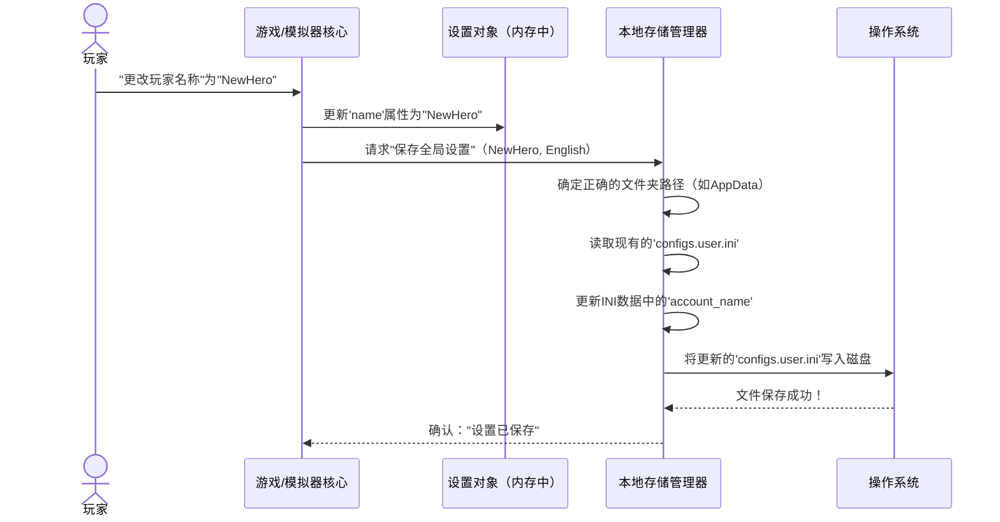

# 第2章：本地存储与设置管理

在[第1章：平台特定适配](01_platform_specific_adaptations_.md)中，我们学习了`gbe_fork`如何巧妙地调整自身以在Windows和Linux等不同操作系统上流畅运行

这个"万能转换器"至关重要，因为既然我们知道*身处何处*，就需要一种可靠的方式来跟踪*玩家数据*和*游戏行为*。

想象`gbe_fork`是你游戏的专属图书管理员。这位管理员不仅知道如何将书籍（文件）放在Windows书架或Linux书架上；他们还知道如何组织你的所有笔记、偏好和游戏进度，以便你以后可以轻松找到它们，甚至无需互联网连接。这就是**本地存储与设置管理**的工作。

本章将教你`gbe_fork`如何扮演这位图书管理员，组织所有玩家特定数据和游戏配置。这是你的游戏记住玩家名称、所选语言、上次存档位置以及所有特殊偏好的方式。

### 问题：记住一切

每次玩游戏时，你希望它记住以下内容：

*   **角色进度**：存档位置、物品栏、得分。
*   **偏好设置**：屏幕分辨率、音量、按键绑定。
*   **模拟器特定内容**：Steam ID、启用的模组。

> 如果`gbe_fork`无法保存这些内容，每次都需要从头开始！这个系统确保你的旅程、选择和设置始终存在。

### ==本地存储==的核心概念

让我们分解`gbe_fork`存储和管理这些信息的主要思路：

1.  **专用文件柜（存储位置）**：就像你可能有一个文件柜放个人文档，另一个放工作文档一样，`gbe_fork`使用计算机上的特定文件夹存储不同类型的数据。
    *   **游戏目录（便携存档）**：用于与游戏本身紧密相关的文件，通常位于游戏可执行文件所在位置。这对于"便携式"设置非常有用，比如将游戏文件夹移动到另一个驱动器。
    *   **全局应用数据文件夹（用户特定）**：用于与*你*（玩家）和你的系统相关的设置和存档。通常位于操作系统的标准位置（如Windows的`AppData`或Linux的`~/.local/share`）。这确保你的数据与游戏安装本身分开。

2.  **文件组织（结构化数据）**：如何保持这些信息整洁？
    *   **INI文件**：可以看作简单的"名称 = 值"对列表。适合存储如`PlayerName = "YourHero"`或`Volume = 80`等简单设置。
    *   **JSON文件**：类似于更高级的嵌套列表和字典。适合复杂数据结构，如所有成就列表、详细的模组信息或复杂的游戏存档状态。

3.  **读写操作（文件I/O）**：这个系统的核心是执行两个基本操作：
    *   **读取**：打开文件并从中获取信息。
    *   **写入**：打开文件并将信息保存到其中。

4.  **确保安全（文件名清理）**：不同操作系统对文件名允许的字符有不同规则。想象在Windows上尝试保存名为`My/Game:Save.txt`的文件——这会失败，因为`/`和`:`通常是禁止的！`gbe_fork`会"清理"文件名，确保它们有效且不会跨平台引发问题。

### 用例：保存和加载玩家设置

让我们聚焦一个常见任务：`gbe_fork`需要知道你的玩家名称和首选语言。这些是基本的设置，会在游戏会话之间保留。

#### 1. 初始化存储和设置系统

当`gbe_fork`启动时，它会设置其"图书管理员"（`Local_Storage`）并将所有初始设置加载到内存（`Settings`）中。这是通过一个名为`create_localstorage_settings`的函数完成的。

```cpp
// 来自dll/settings_parser.cpp，简化版
// ...
uint32 create_localstorage_settings(Settings **settings_client_out, Settings **settings_server_out, Local_Storage **local_storage_out)
{
    // 首先，从各种配置文件中加载所有设置
    load_all_config_settings();

    // 确定保存用户特定数据的位置
    std::string save_path(Local_Storage::get_user_appdata_path());
    
    // 创建Local_Storage对象，告诉它存储位置
    Local_Storage *local_storage = new Local_Storage(save_path);
    
    // 确定游戏的唯一ID（AppID）
    uint32 appid = parse_steam_app_id(Local_Storage::get_program_path());
    local_storage->setAppId(appid); // 告诉存储系统这是为哪个游戏服务的

    // 解析玩家特定设置（如名称和Steam ID）
    std::string name(parse_account_name(local_storage));
    CSteamID user_id = parse_user_steam_id(local_storage);
    std::string language(parse_current_language(local_storage));
    
    // 为客户端和服务器创建Settings对象（稍后详述）
    Settings *settings_client = new Settings(user_id, CGameID(appid), name, language, false);
    // ... 服务器设置初始化 ...

    *settings_client_out = settings_client;
    *settings_server_out = settings_server;
    *local_storage_out = local_storage;

    return appid; // 返回游戏的AppID
}
// ...
```
**说明**：此函数是起点。它确定用户数据应存储的位置（`save_path`），创建一个`Local_Storage`对象来管理文件，确定游戏的ID（`appid`），然后将用户设置（如玩家`name`和`language`）加载到`Settings`对象中。

#### 2. 获取和设置玩家信息

一旦创建了`Settings`对象，`gbe_fork`的其他部分可以轻松获取或更改玩家名称或首选语言等信息。

```cpp
// 来自dll/settings.h和.cpp，简化版
class Settings {
private:
    std::string name;      // 存储玩家名称
    std::string language;  // 存储首选语言
    // ... 其他设置 ...

public:
    // 构造函数（首次创建Settings时调用）
    Settings(CSteamID steam_id, CGameID game_id, const std::string &name, const std::string &language, bool offline);

    // 获取玩家名称
    const char *get_local_name() {
        return name.c_str();
    }

    // 设置新玩家名称
    void set_local_name(const char *new_name) {
        this->name = new_name;
    }

    // 获取当前语言
    const char *get_language() {
        return language.c_str();
    }

    // 设置新语言
    void set_language(const char *new_language) {
        this->language = new_language;
    }
    // ...
};
```
**说明**：`Settings`类保存所有不同的配置值。`get_local_name()`简单地返回存储的名称，而`set_local_name()`更新它。当`gbe_fork`需要知道谁在玩游戏时，它会询问`Settings`对象。

#### 3. 将更新的设置保存到磁盘

更改设置后（例如玩家输入新名称），我们需要永久保存它，以便下次记住。

```cpp
// 来自dll/settings_parser.cpp，简化版
// ...
void save_global_settings(class Local_Storage *local_storage, const char *name, const char *language)
{
    // 将更新的名称保存到用户的设置文件
    save_global_ini_value(
        local_storage,
        config_ini_user, // 文件名（如"configs.user.ini"）
        "user::general", // INI文件中的部分
        "account_name",  // 部分中的键
        IniValue(name),  // 新值
        "user account name" // INI文件的注释
    );
    
    // 保存更新的语言
    save_global_ini_value(
        local_storage,
        config_ini_user,
        "user::general",
        "language",
        IniValue(language),
        "the language reported to the game..."
    );
}
// ...
```
**说明**：`save_global_settings`使用另一个辅助函数`save_global_ini_value`将玩家的名称和语言写入INI文件。此文件通常位于用户的全局应用数据文件夹中，确保这些设置在使用`gbe_fork`的不同游戏或模拟器实例之间保存。

### 幕后：数据管理方式

让我们揭开`gbe_fork`如何使用我们讨论的概念处理保存和加载数据的幕后细节。

#### 保存设置的高级工作流


**说明**：当你在游戏中更改设置时，`gbe_fork`内存中的`Settings`对象首先更新。然后，请求`本地存储管理器`保存这些更改。它找到计算机上的正确位置，仔细更新配置文件中的特定设置，并通过`操作系统`将更新后的文件写回磁盘。

#### 代码：获取应用路径

我们之前看到了`get_user_appdata_path()`。此函数使用[平台特定适配](01_platform_specific_adaptations_.md)来查找当前操作系统的正确应用数据文件夹。

```cpp
// 来自dll/local_storage.cpp，简化版
std::string Local_Storage::get_user_appdata_path()
{
    std::string user_appdata_path("SAVE"); // 默认回退
#if defined(STEAM_WIN32) // 如果为Windows编译
    WCHAR szPath[MAX_PATH] = {};
    // Windows特定的函数获取AppData文件夹
    HRESULT hr = SHGetFolderPathW(NULL, CSIDL_APPDATA, NULL, 0, szPath);
    if (SUCCEEDED(hr)) {
        user_appdata_path = utf8_encode(szPath); // 将宽字符串转换为UTF-8
    }
#else // 如果为Linux编译
    char *datadir = getenv("XDG_DATA_HOME"); // Linux获取数据主目录的方式
    if (datadir) {
        user_appdata_path = datadir;
    } else { // 如果未设置XDG_DATA_HOME则回退
        char *homedir = getenv("HOME");
        if (homedir) {
            user_appdata_path = std::string(homedir) + "/.local/share";
        }
    }
#endif
    return user_appdata_path.append(PATH_SEPARATOR).append(get_saves_folder_name()).append(PATH_SEPARATOR);
}
```
**说明**：此代码片段清晰地展示了平台适配的工作方式。在Windows上，它使用`SHGetFolderPathW`查找`AppData\Roaming`文件夹。在Linux上，它尝试`XDG_DATA_HOME`或回退到`~/.local/share`。`PATH_SEPARATOR`（`\`或`/`）也被正确添加。这确保`gbe_fork`始终知道在哪里找到你的重要设置，无论操作系统如何。

#### 代码：清理文件名

为了防止无效字符引发问题，`gbe_fork`使用`sanitize_file_name`函数。

```cpp
// 来自dll/local_storage.cpp，简化版
static std::string sanitize_file_name(std::string name)
{
    if (name.empty()) return name;

    // 处理特殊的前导字符（如果存在）
    if (name[0] == '.' && name.size() > 2 && (name[1] == '\\' || name[1] == '/')) {
        name.erase(0, 2);
    }

    // 替换操作系统特定的路径分隔符以确保一致性
#if defined(STEAM_WIN32)
    name = replace_with(name, "/", PATH_SEPARATOR); // 在Windows上，将正斜杠替换为反斜杠
#else
    name = replace_with(name, "\\", PATH_SEPARATOR); // 在Linux上，将反斜杠替换为正斜杠
#endif

    // 将其他常见问题字符替换为安全替代品
    name = replace_with(name, "|", ".V_SLASH.");
    name = replace_with(name, ":", ".COLON.");
    name = replace_with(name, "*", ".ASTERISK.");
    name = replace_with(name, "\"", ".QUOTE.");
    name = replace_with(name, "?", ".Q_MARK.");
    name = replace_with(name, "%", ".PERCENT.");

    return name;
}
```
**说明**：此函数接收一个字符串（预期为文件名），并替换可能在不同操作系统或上下文中引发问题的字符。例如，它将斜杠转换为当前操作系统的标准，并将`|`或`*`等符号替换为文本等效项（如`.V_SLASH.`），以确保文件名始终有效且安全。还有一个对应的`desanitize_file_name`函数在读取时将它们转换回来。

#### 代码：读写文件（INI示例）

`gbe_fork`使用名为`SimpleIni`的库处理INI文件，使加载和保存设置变得简单。`save_global_ini_value`函数是一个很好的例子。

```cpp
// 来自dll/settings_parser.cpp，简化版
static void save_global_ini_value(class Local_Storage *local_storage, const char *filename, const char *section, const char *key, IniValue val, const char *comment = nullptr) {
    CSimpleIniA new_ini{}; // 创建一个SimpleIni对象
    new_ini.SetUnicode();

    // 检查文件是否已存在并加载其内容
    auto sz = local_storage->data_settings_size(filename);
    if (sz > 0) {
        std::vector<char> ini_file_data(sz);
        local_storage->get_data_settings(filename, &ini_file_data[0], static_cast<unsigned int>(ini_file_data.size()));
        new_ini.LoadData(&ini_file_data[0], ini_file_data.size()); // 加载现有数据
    }

    // 设置或更新特定值
    switch (val.type) {
        case IniValue::Type::STR:
            new_ini.SetValue(section, key, val.val_str, comment);
            break;
        // ... 其他类型如BOOL、DOUBLE、LONG ...
        default: break;
    }

    // 将整个INI内容保存回字符串缓冲区
    std::string ini_buff{};
    if (new_ini.Save(ini_buff, false) == SI_OK) {
        // 使用Local_Storage将缓冲区实际写入磁盘
        local_storage->store_data_settings(filename, &ini_buff[0], static_cast<unsigned int>(ini_buff.size()));
    }
}
```
**说明**：此函数展示了如何更新INI文件。它首先加载整个INI文件（如果存在），然后将`section`中的`key`更新为`val`。最后，它使用`local_storage->store_data_settings`将修改后的内容保存回磁盘。`store_data_settings`函数处理低级的磁盘写入，确保数据正确保存到指定的文件。

#### 代码：处理JSON文件

对于更复杂的数据，`gbe_fork`使用JSON。`nlohmann::json`库使处理JSON数据变得简单。

```cpp
// 来自dll/local_storage.cpp，简化版
bool Local_Storage::load_json(const std::string &full_path, nlohmann::json& json)
{
    // 打开文件
    std::ifstream inventory_file(std::filesystem::u8path(full_path), std::ios::in | std::ios::binary);
    if (inventory_file) {
        try {
            json = nlohmann::json::parse(inventory_file); // 将文件内容解析为JSON对象
            return true;
        } catch (const std::exception& e) {
            // 如果JSON格式错误则处理错误
            PRINT_DEBUG("解析'%s' json时出错: %s", full_path.c_str(), e.what());
        }
    }
    return false;
}

bool Local_Storage::write_json_file(std::string folder, std::string const&file, nlohmann::json const& json)
{
    // 确保文件夹存在
    std::string inv_path(save_directory + appid + folder);
    create_directory(inv_path); // 使用与操作系统无关的目录创建

    // 构造完整文件路径
    std::string full_path(inv_path + file);

    // 打开文件进行写入（如果存在则截断）
    std::ofstream inventory_file(std::filesystem::u8path(full_path), std::ios::trunc | std::ios::out | std::ios::binary);
    if (inventory_file) {
        inventory_file << std::setw(2) << json; // 将格式化的JSON写入文件
        return true;
    }
    PRINT_DEBUG("无法打开文件'%s'写入json", full_path.c_str());
    return false;
}
```
**说明**：这些函数展示了`gbe_fork`如何读写JSON文件。`load_json`打开文件并使用`nlohmann::json::parse`将其内容转换为内存中的`json`对象。`write_json_file`接收一个`json`对象并将其保存到文件，首先确保目录存在，然后写入格式化的JSON数据。这使得`gbe_fork`能够存储和检索复杂的数据结构。

### 结论

"本地存储与设置管理"是`gbe_fork`记住你游戏体验中所有重要内容的方式

通过智能决定数据存储位置、使用适当的格式（如INI和JSON）以及在不同操作系统上小心处理文件操作，`gbe_fork`确保你的玩家名称、语言、游戏存档和其他偏好始终保留。

这个健壮的系统直接建立在我们之前讨论的[平台特定适配](01_platform_specific_adaptations_.md)之上，为模拟器的功能提供了坚实的基础。

接下来，我们将探讨`gbe_fork`如何处理玩家==身份和安全==，探索认证和票据的概念

[下一章：认证与票据](03_authentication_and_tickets_.md)

