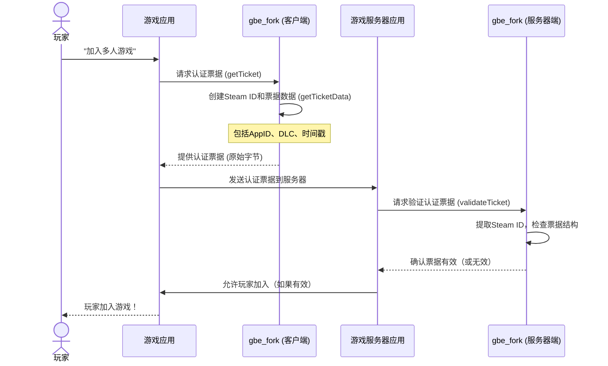

# 第3章：认证与票据

在[第2章：本地存储与设置管理](02_local_storage_and_settings_management_.md)中，我们学习了`gbe_fork`如何记住你的偏好和游戏进度

但知道*你是谁*和知道*你的偏好*同样重要！当你加入多人游戏时，游戏服务器如何确认你是合法玩家而非作弊者，并且拥有你尝试使用的游戏和DLC？

这就是**认证与票据**的用武之地。将`gbe_fork`的这一部分想象成一个特殊的身份验证办公室。它的工作是创建和检查称为"认证票据"的独特数字通行证，向游戏服务器证明你的身份。这就像获得一张特殊的VIP通行证，告诉所有人："这位玩家已获授权，可以访问这些特定内容！"

本章将向你介绍`gbe_fork`的"身份验证办公室"，展示它如何生成你的独特身份并创建这些特殊的数字通行证，确保你可以合法地加入游戏并使用你拥有的内容。

### 问题：在数字世界中证明你的身份

当你玩游戏时，尤其是线上游戏，会出现以下问题：

*   **你是谁？** 服务器需要每个玩家的唯一ID。
*   **你被允许玩吗？** 你拥有这款游戏吗？你被禁了吗？
*   **你拥有什么？** 你有这场比赛所需的特殊角色或地图包（DLC）吗？

如果没有可靠的方式回答这些问题，线上游戏将一片混乱

> `gbe_fork`通过模拟Steam的身份和所有权验证系统来解决这个问题。

### 认证与票据的核心概念

让我们分解`gbe_fork`管理数字身份的主要思路：

1.  **Steam ID**：这是你在Steam生态系统中的独特数字指纹。`gbe_fork`为你生成一个唯一的"虚假"Steam ID，让游戏认为你是真正的Steam玩家。
2.  **认证票据**：这是实际的数字通行证。它是一个信息包，证明你的身份以及你被允许做什么。它包含你的Steam ID、你正在玩的游戏（AppID）以及你拥有的任何DLC的信息。
3.  **签发票据**：当游戏需要证明你的身份时（例如加入服务器），`gbe_fork`会创建一个认证票据。这包括将所有必要信息组合在一起并"数字签名"以防止篡改。
4.  **验证票据**：当游戏服务器从玩家那里收到认证票据时，它需要检查票据是否真实以及玩家是否被授权。`gbe_fork`为服务器（或另一个`gbe_fork`实例）提供了执行此检查的工具。

### 用例：加入多人游戏服务器

假设你正在尝试加入游戏中的多人服务器。以下是`gbe_fork`的认证系统如何帮助你：

1.  游戏向`gbe_fork`请求你的"认证票据"。
2.  `gbe_fork`创建此票据，包括你的唯一（模拟的）Steam ID以及关于游戏和你拥有的DLC的详细信息。
3.  游戏将此票据发送到多人服务器。
4.  服务器使用`gbe_fork`的验证工具检查票据。如果有效，你被允许加入！

#### 1. 获取认证票据

当游戏需要证明你的身份时，它会调用一个函数来获取认证票据。`gbe_fork`为此提供了`Auth_Manager::getTicket`。

```cpp
// 来自dll/auth.cpp，简化版
HAuthTicket Auth_Manager::getTicket( void *pTicket, int cbMaxTicket, uint32 *pcbTicket )
{
    // ... (检查票据大小) ...

    // 此函数实际创建所有票据数据
    Auth_Data ticket_data = getTicketData(pTicket, cbMaxTicket, pcbTicket, true);

    if (*pcbTicket == 0) {
        return k_HAuthTicketInvalid; // 票据创建失败
    }

    // ... (回调通知游戏票据已生成) ...
    return (HAuthTicket)ticket_data.number; // 返回票据的唯一ID
}
```
**说明**：当游戏请求票据时，`getTicket`准备所有信息，将其放入`ticket_data`结构，然后"序列化"它（转换为字节流）以放入`pTicket`。`ticket_data.number`是此特定票据的唯一ID。

#### 2. `getTicketData`函数（票据构建器）

构建票据的实际工作发生在`getTicketData`内部。此函数收集你的Steam ID、游戏ID、IP地址、创建时间以及关于你的DLC的详细信息。

```cpp
// 来自dll/auth.cpp，简化版的getTicketData逻辑
Auth_Data Auth_Manager::getTicketData( void *pTicket, int cbMaxTicket, uint32 *pcbTicket, bool add_session_header )
{
    Auth_Data ticket_data{};
    CSteamID steam_id = settings->get_local_steam_id(); // 获取你的本地Steam ID

    // 用各种详细信息填充ticket_data结构
    ticket_data.id = steam_id;
    ticket_data.number = generate_steam_ticket_id(); // 此票据的唯一ID
    ticket_data.Ticket.Version = 4; // 最新票据版本
    ticket_data.Ticket.id = steam_id;
    ticket_data.Ticket.AppId = settings->get_local_game_id().AppID(); // 游戏的ID

    // ... (添加IP地址、创建/过期日期) ...
    
    // 添加你"拥有"的许可证和DLC
    ticket_data.Ticket.Licenses.push_back(0); // 示例许可证
    unsigned int dlcCount = settings->DLCCount();
    for (unsigned i = 0; i < dlcCount; ++i) {
        DLC dlc;
        AppId_t appid; // DLC的唯一ID
        // ... (从设置中获取DLC信息) ...
        dlc.AppId = (uint32_t)appid;
        ticket_data.Ticket.DLCs.push_back(dlc);
    }
    
    // 将ticket_data转换为字节序列
    std::vector<uint8_t> serialized_ticket = ticket_data.Serialize();
    
    // 将序列化的票据复制到提供的缓冲区
    // ... (复制和大小检查) ...
    
    return ticket_data;
}
```
**说明**：此函数是"票据打印机"。它获取你的`gbe_fork`设置（如[本地存储与设置管理](02_local_storage_and_settings_management_.md)中存储的Steam ID和拥有的DLC），并将它们格式化为`Auth_Data`结构。重要的是，它调用`ticket_data.Serialize()`将此结构化数据转换为可以通过网络发送的原始字节。

#### 3. 验证认证票据

当游戏服务器从客户端收到票据时，它需要验证其真实性。`gbe_fork`使用`Auth_Manager::validateTicket`进行此操作。

```cpp
// 来自dll/auth.cpp，简化版
Auth_Data Auth_Manager::validateTicket(const void *pAuthTicket, uint32 cbAuthTicket, CSteamID fallbackID, CSteamID *pSteamIDUser)
{
    if (cbAuthTicket < STEAM_TICKET_MIN_SIZE)
        return {}; // 票据太小，无效

    Auth_Data data;
    // ... (检测不同票据格式的逻辑：SmartSteamEmu、RevEmu或Gbe_fork自己的) ...
    
    if (*(uint32 *)pAuthTicket == STEAM_APPTICKET_GCLen) { // 这是gbe_fork的标准票据
        PRINT_DEBUG("检测到标准票据");
        uint32 number;
        memcpy(&number, ((char *)pAuthTicket) + 0x08, sizeof(number)); // 读取票据编号
        uint64 id;
        memcpy(&id, (char *)pAuthTicket + 0x0c, sizeof(id)); // 读取Steam ID
        data.id = CSteamID(id);
        data.number = number;
    } else {
        PRINT_DEBUG("无法识别的票据格式，拒绝或使用备用ID");
        data.id = fallbackID; // 如果票据未知，使用备用ID
        data.number = 0;
    }
    
    if (pSteamIDUser) *pSteamIDUser = data.id; // 返回票据中的SteamID
    return data;
}
```
**说明**：`validateTicket`函数充当"票据检查员"。它接收传入票据的原始字节（`pAuthTicket`）并尝试理解其格式。如果识别出`gbe_fork`票据，它会提取Steam ID和票据编号。如果格式未知或无效，它可能会拒绝票据或使用默认身份。

### 幕后：票据的构建与检查

让我们看看`gbe_fork`认证系统的内部工作原理。

#### 加入游戏的高级工作流


**说明**：此图展示了认证票据的旅程。运行在客户端的`gbe_fork`（GBE_Client）创建票据，游戏将其发送到服务器。运行在服务器的`gbe_fork`（GBE_Server）然后检查并验证此票据。

#### 代码：生成虚假Steam ID

`gbe_fork`需要为每个玩家提供唯一的Steam ID。它生成这些ID，通常基于预定义范围或使用随机数。

```cpp
// 来自dll/auth.cpp，简化版
static CSteamID generate_steam_anon_user()
{
    // 生成唯一的、非Steam控制的Steam ID
    static uint64 s_AuthAnonIdCounter = 0x0110000100000000ULL | (uint64_t)generate_random_int();
    s_AuthAnonIdCounter++;
    return CSteamID(s_AuthAnonIdCounter, k_EUniversePublic, k_EAccountTypeIndividual);
}

// 来自dll/settings.cpp
CSteamID Settings::get_local_steam_id()
{
    if (steam_id.IsValid()) {
        return steam_id; // 返回已设置的Steam ID
    }
    steam_id = generate_steam_anon_user(); // 如果未设置，生成新的
    return steam_id;
}
```
**说明**：`generate_steam_anon_user`创建一个带有唯一64位数字的`CSteamID`对象。`get_local_steam_id`确保每个`gbe_fork`实例（对应一个玩家）有一个一致但唯一的Steam ID。此ID随后被包含在认证票据中。

#### 代码：AppTicket结构

`gbe_fork`新认证系统的核心是`AppTicket`结构。它设计用于以特定顺序保存所有必要信息，类似于Steam真实票据的结构。`Auth_Data`对象然后将此`AppTicket`与其他细节（如游戏协调器（GC）信息）结合。

**来自`dev.notes/interesting things about the new auth ticket.md`和`dll/auth.h`：**

| 字段名称                    | 描述                                   | 类型               |
| :-------------------------- | :------------------------------------- | :----------------- |
| `TheTicketLenght`           | 票据数据的总长度                       | `uint32_t`         |
| `Version`                   | 当前票据版本（例如4）                  | `uint32_t`         |
| `id` (SteamID)              | 玩家的唯一Steam ID                     | `CSteamID`         |
| `AppId`                     | 正在玩的游戏的ID                       | `uint32_t`         |
| `ExternalIP`, `InternalIP`  | 玩家的外部和内部IP地址                 | `uint32_t`         |
| `TicketGeneratedDate`       | 票据创建时间（纪元秒）                 | `uint32_t`         |
| `TicketGeneratedExpireDate` | 票据失效时间（纪元秒）                 | `uint32_t`         |
| `Licenses`                  | 拥有的游戏许可证列表                   | `vector<uint32_t>` |
| `DLCs`                      | 拥有的DLC列表，每个都有其AppID和许可证 | `vector<DLC>`      |

**说明**：此表展示了打包到`AppTicket`中的关键信息。当`gbe_fork`创建票据时，它用你的详细信息填充这些字段。当它验证票据时，它读取这些字段以确认身份和所有权。

#### 代码：序列化票据

`Auth_Data::Serialize()`函数获取结构化的票据信息并将其转换为连续的字节流。这很重要，因为票据作为原始数据通过网络发送。它还包括"签名"票据的关键步骤。

```cpp
// 来自dll/auth.cpp，简化版的Auth_Data序列化方法
std::vector<uint8_t> Auth_Data::Serialize() const
{
    // ... (计算票据各部分的大小) ...

    std::vector<uint8_t> buffer;
    buffer.resize(final_buffer_size); // 为整个票据分配内存

    uint8_t* pBuffer = &buffer[0];

    // --- 第一部分：游戏协调器（GC）和会话数据（如果启用） ---
    if (HasGC) {
        std::vector<uint8_t> GCData = GC.Serialize(); // 序列化GC数据
        memcpy(pBuffer, GCData.data(), GCData.size());
        pBuffer += GCData.size();
        // ... (如果有会话数据则序列化) ...
        uint32_t remaining_length = (uint32_t)(final_buffer_size - gc_data_layout_length);
        // *reinterpret_cast<uint32_t*>(pBuffer) = remaining_length; pBuffer += 4; // 添加剩余长度
    }

    // --- 第二部分：主AppTicket数据 ---
    std::vector<uint8_t> tickedData = Ticket.Serialize(); // 序列化AppTicket本身
    uint32_t ticket_data_layout_length = (uint32_t)tickedData.size() + sizeof(uint32_t);
    // *reinterpret_cast<uint32_t*>(pBuffer) = ticket_data_layout_length; pBuffer += 4; // 添加票据数据长度
    memcpy(pBuffer, tickedData.data(), tickedData.size());
    pBuffer += tickedData.size();

    // --- 第三部分：数字签名 ---
    std::vector<uint8_t> signature = sign_auth_data(app_ticket_key, tickedData, total_size_without_siglen);
    if (signature.size() == STEAM_APPTICKET_SIGLEN) {
        memcpy(pBuffer, signature.data(), signature.size()); // 附加签名
    } else {
        PRINT_DEBUG("签名大小 [%zu] 无效", signature.size());
    }

    return buffer; // 票据的完整字节数组
}
```
**说明**：此代码展示了认证数据的不同部分（`GCData`、`SessionData`、`tickedData`）如何被序列化（转换为原始字节）并组合到一个`buffer`中。关键的是，它使用`sign_auth_data`创建数字签名。此签名就像一个防篡改印章，确保票据在创建后未被修改。`app_ticket_key`是用于此数字签名的特殊私钥。

#### 代码：处理票据中的DLC

`DLC`结构及其`Serialize`方法负责将你拥有的可下载内容的详细信息直接添加到认证票据中。

```cpp
// 来自dll/auth.cpp，简化版的DLC::Serialize()
std::vector<uint8_t> DLC::Serialize() const
{
    // ... (计算此DLC数据所需的总大小) ...
    std::vector<uint8_t> buffer{};
    buffer.resize(total_size);
    uint8_t* pBuffer = &buffer[0];

    // 添加DLC的AppID
    // *reinterpret_cast<uint32_t*>(pBuffer) = AppId; pBuffer += sizeof(AppId);
    
    // 添加此特定DLC的许可证数量
    uint16_t dlcs_licenses_count = (uint16_t)Licenses.size();
    // *reinterpret_cast<uint16_t*>(pBuffer) = dlcs_licenses_count; pBuffer += sizeof(dlcs_licenses_count);

    // 为DLC添加每个许可证ID
    for(uint32_t dlc_license : Licenses) {
        // *reinterpret_cast<uint32_t*>(pBuffer) = dlc_license; pBuffer += sizeof(dlc_license);
    }
    return buffer;
}
```
**说明**：此函数获取DLC的`AppId`和任何关联的许可证，然后将它们序列化为字节。当`Auth_Data::Serialize()`构建主票据时，它为每个拥有的DLC调用此`DLC::Serialize()`，将所有信息嵌入最终的认证票据中。这样，游戏服务器就知道你可以访问哪些DLC。

### 结论

"认证与票据"对于`gbe_fork`模拟真实Steam客户端的身份和所有权验证至关重要

通过生成唯一的Steam ID、构建详细的认证票据（包括DLC信息和数字签名）以及提供验证机制，`gbe_fork`为玩家提供了安全合法的体验。此系统充当数字护照，让你在模拟环境中自信地加入游戏和访问内容。

接下来，我们将探讨`gbe_fork`==如何管理额外内容==，如用户创建的模组，这些内容通常依赖于你的身份和游戏所有权

[下一章：模组与用户生成内容（UGC）管理](04_mod_and_ugc__user_generated_content__management_.md)

