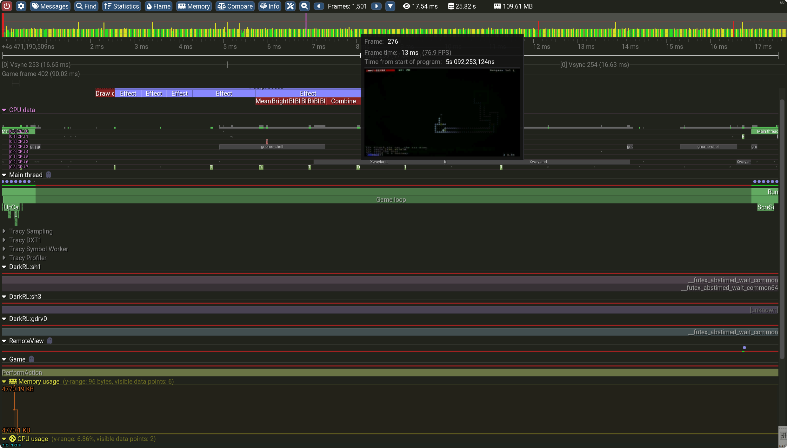
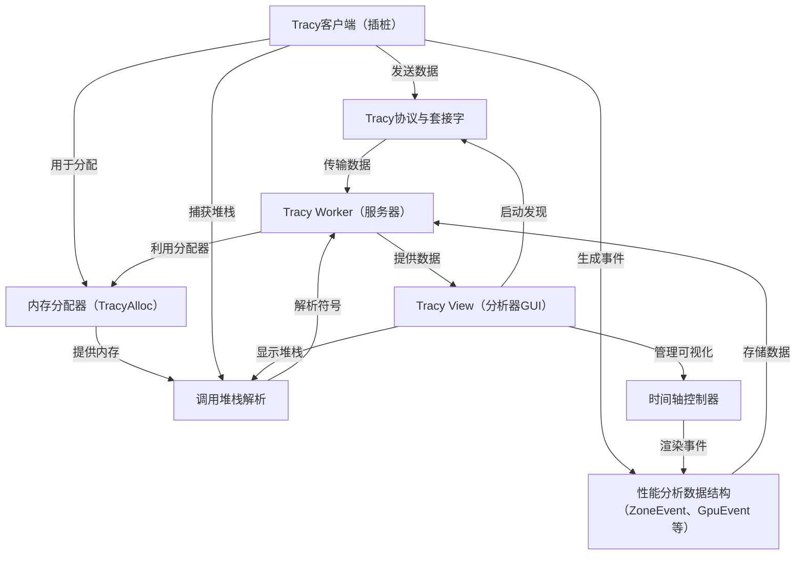

链接：[Tracy Profiler](https://tracy.nereid.pl/)

在cuda课程中的lec9做过类似的性能分析，amazing

# docs：tracy

Tracy是一个**实时性能分析器**，旨在帮助开发者识别应用程序中的性能瓶颈。

通过==在我们的代码中嵌入一个*轻量级客户端*来自动收集性能分析数据==，例如**函数执行时间**和**内存分配**

然后，这些原始遥测数据通过*套接字*安全地流式==传输到专用的**服务器（worker）**==，该服务器高效地处理和存储信息。最后，一个**图形用户界面（GUI）**在==*交互式时间轴*上可视化==这些复杂的性能数据，提供关于应用程序行为和**调用堆栈**的详细洞察，从而实现有针对性的优化。

## 可视化

## 章节

1. [Tracy View（分析器GUI）
](01_tracy_view__profiler_gui__.md)
2. [Tracy客户端（插桩）
](02_tracy_client__instrumentation__.md)
3. [Tracy Worker（服务器）
](03_tracy_worker__server__.md)
4. [Tracy协议与套接字
](04_tracy_protocol___sockets_.md)
5. ==[性能分析数据结构（ZoneEvent、GpuEvent等）
](05_profiling_data_structures__zoneevent__gpuevent__etc___.md)==
6. [时间轴控制器
](06_timeline_controller_.md)
7. [调用堆栈解析
](07_callstack_resolution_.md)
8. ==[内存分配器（TracyAlloc）
](08_memory_allocator__tracyalloc__.md)==

---

