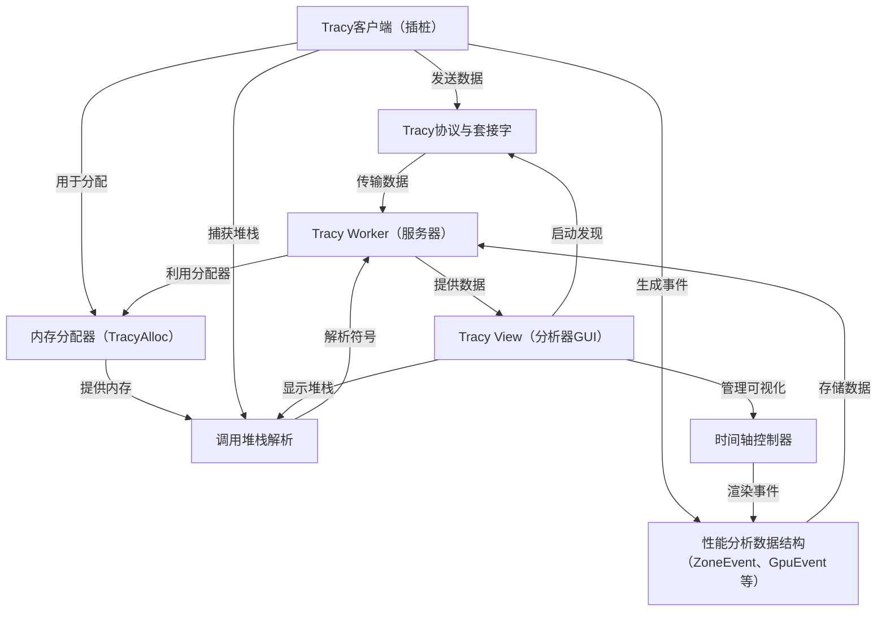
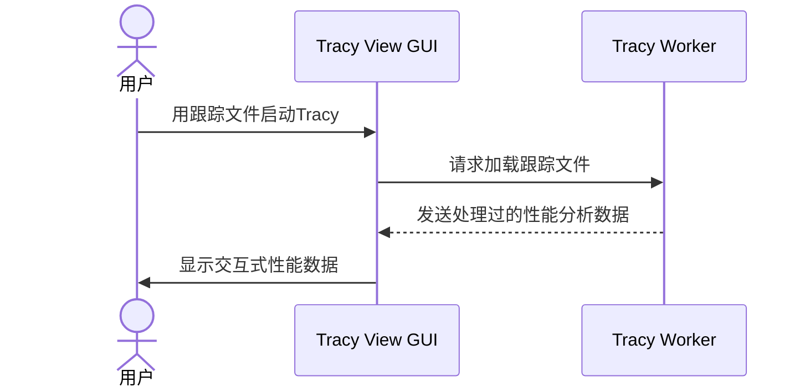

链接：[Tracy Profiler](https://tracy.nereid.pl/)


在cuda课程中的lec9做过类似的性能分析，amazing

# docs：tracy

Tracy是一个**实时性能分析器**，旨在帮助开发者识别应用程序中的性能瓶颈。

通过==在我们的代码中嵌入一个*轻量级客户端*来自动收集性能分析数据==，例如**函数执行时间**和**内存分配**

然后，这些原始遥测数据通过*套接字*安全地流式==传输到专用的**服务器（worker）**==，该服务器高效地处理和存储信息。最后，一个**图形用户界面（GUI）**在==*交互式时间轴*上可视化==这些复杂的性能数据，提供关于应用程序行为和**调用堆栈**的详细洞察，从而实现有针对性的优化。


## 可视化



## 章节

1. [Tracy View（分析器GUI）
](01_tracy_view__profiler_gui__.md)
2. [Tracy客户端（插桩）
](02_tracy_client__instrumentation__.md)
3. [Tracy Worker（服务器）
](03_tracy_worker__server__.md)
4. [Tracy协议与套接字
](04_tracy_protocol___sockets_.md)
5. ==[性能分析数据结构（ZoneEvent、GpuEvent等）
](05_profiling_data_structures__zoneevent__gpuevent__etc___.md)==
6. [时间轴控制器
](06_timeline_controller_.md)
7. [调用堆栈解析
](07_callstack_resolution_.md)
8. ==[内存分配器（TracyAlloc）
](08_memory_allocator__tracyalloc__.md)==

---

# 第1章：Tracy View（分析器GUI）

我们将通过探索我们通常会首先交互的组件来开始我们的旅程：**Tracy View**，也称为分析器GUI（图形用户界面）。

## 什么是Tracy View？

想象一下我们正在驾驶一辆高性能赛车。我们不会只是听引擎的声音；我们会不断检查仪表板上的关键信息，如速度、转速、燃油量和发动机温度。Tracy View正是我们应用程序的这样一个仪表板。

它是我们用户直接与Tracy交互的图形界面。它的工作是获取从我们的应用程序收集的所有复杂性能数据，并以易于理解的可视化格式呈现给我们。这使我们能够快速发现问题——比如CPU使用率的突然飙升或资源的长时间等待——并理解它们*为什么*会发生，这样我们就可以使我们的代码更快、更高效。

**它解决的主要问题：** 使复杂的性能数据对人类来说易于理解和可操作。

## 我们的第一个用例：打开性能跟踪

让我们从一个非常常见的场景开始：我们已经用Tracy对我们的游戏或应用程序进行了插桩，运行了它，现在我们有了一个**``.tracy文件——一个保存的性能跟踪`**。我们如何实际*打开*这个文件并查看发生了什么？本章将指导我们理解Tracy View如何使这成为可能。

## Tracy View的核心组件（我们的性能仪表板）

Tracy View不只是一个大屏幕；它是一组专门的工具，每个工具都像我们仪表板上的不同仪表或显示器：

1.  **时间轴：** 这是Tracy View的核心。它随时间可视化我们应用程序中的事件，向我们展示事情*何时*发生以及*花费了多长时间*。`我们会看到不同的线程、CPU活动（称为"zones"）、GPU事件等，所有这些都按时间顺序排列`。把它想象成一个非常详细的音乐编辑器，显示每个声音、乐器及其持续时间。

2.  **火焰图：** 这些强大的图表帮助我们理解我们的应用程序在代码的调用堆栈中花费了大部分时间在哪里。它们以`可视化方式堆叠函数调用，更宽的"火焰"表示消耗更多时间的函数`，使我们能够一目了然地识别性能瓶颈。想象一个分层蛋糕，其中每一层都是一个函数调用，层的宽度显示它花费了多少时间。

3.  **统计表：** 对于那些喜欢数字的人，Tracy View提供了各种表格来总结我们的性能分析数据。我们可以看到不同事件的平均持续时间、最小值、最大值和总计数，帮助我们量化性能特征。这就像有一个详细的电子表格，分解我们赛车的所有性能指标。

还有许多其他窗口用于特定数据，如内存使用、调用堆栈和CPU核心数据

## 解决用例：如何打开跟踪文件

当我们有一个`.tracy`文件时，启动Tracy View来检查它很简单：

1.  **启动Tracy可执行文件：** 打开我们的命令行或终端。
2.  **提供文件路径：** 输入`tracy`后跟我们的`.tracy`文件的路径。

    ```bash
    tracy /path/to/your/game_trace.tracy
    ```

    运行此命令后，Tracy View GUI将启动，显示我们文件中的性能数据！

一旦GUI打开，我们就可以开始探索：
-   **平移和缩放：** 点击并拖动我们的鼠标在时间轴上移动。使用滚轮放大和缩小，显示更多或更少的细节。
-   **悬停查看详细信息：** 将我们的鼠标移动到时间轴上的任何彩色条（一个"zone"）上，以查看有关该特定事件的详细信息，如其名称、持续时间和线程。
-   **打开窗口：** 使用GUI顶部的按钮（例如，"Statistics"、"Flame"）打开不同的分析窗口，并探索我们应用程序性能的特定方面。

## 底层机制：Tracy View如何工作

Tracy View从外部看起来很简单，但幕后发生了很多事情才能使它顺利工作。

### 流程

以下是我们打开跟踪文件时的简化事件序列：

1.  **用户操作：** 我们用一个`.tracy`文件启动`tracy`可执行文件。
2.  **GUI初始化：** `tracy`可执行文件启动并创建主窗口（Tracy View）。
3.  **数据加载：** Tracy View告诉核心性能分析引擎[Tracy Worker](03_tracy_worker__server__.md)加载和处理`.tracy`文件。
4.  **数据处理：** [Tracy Worker](03_tracy_worker__server__.md)读取原始二进制数据，解释它，并将其组织成有意义的结构。对于大文件，这可能需要一些时间。
5.  **数据请求：** Tracy View持续向[Tracy Worker](03_tracy_worker__server__.md)请求它需要显示的处理过的数据。
6.  **渲染：** Tracy View获取这些数据并将其绘制到我们的屏幕上，创建交互式时间轴、图表和表格。

这是一个最小的序列图来说明这一点：



### 代码

Tracy View由几个关键组件构建：

-   **`main.cpp`：** 这是Tracy Profiler应用程序的起点。它解析我们的命令行参数（如跟踪文件名），设置窗口系统，然后创建`Tracy View`对象。

    ```cpp
    // --- 文件：profiler/src/main.cpp ---
    // ...
    int main( int argc, char** argv )
    {
        // ... (参数解析，配置加载) ...

        // 创建特定于平台的窗口和图形后端
        Backend backend( title, DrawContents, ScaleChanged, IsBusy, &mainThreadTasks );
        bptr = &backend;

        // 如果提供了文件，创建Tracy View来加载它
        if( initFileOpen )
        {
            view = std::make_unique<tracy::View>( RunOnMainThread, *initFileOpen, SetWindowTitleCallback, SetupScaleCallback, AttentionCallback, s_achievements );
        }
        // ... (或连接到客户端) ...

        backend.Show(); // 使窗口可见
        backend.Run();  // 启动主GUI事件循环

        // ...
        return 0;
    }
    ```
    这个`main`函数是Tracy View应用程序正式开始的地方。它设置窗口系统（`Backend`），然后创建`tracy::View`对象，这是实际的图形分析器。最后，`backend.Run()`启动主循环，持续绘制GUI。

-   **`Backend*.cpp`（例如，`BackendGlfw.cpp`）：** 这些文件处理创建和管理GUI窗口、处理鼠标和键盘输入以及设置图形（使用OpenGL）的底层细节。Tracy支持不同操作系统的不同"后端"（例如，桌面的GLFW，Web的Emscripten）。

    ```cpp
    // --- 文件：profiler/src/BackendGlfw.cpp ---
    // ...
    void Backend::Run()
    {
        while( !glfwWindowShouldClose( s_window ) ) // 循环直到窗口关闭
        {
            glfwPollEvents(); // 处理输入事件（鼠标点击，按键）
            s_redraw();       // 告诉GUI绘制新帧
            // ... (其他任务) ...
        }
    }
    ```
    `Backend::Run()`函数包含GUI的主循环。在每次迭代中，它检查用户输入，然后调用`s_redraw()`。这个`s_redraw()`函数在`main.cpp`中定义，负责调用`tracy::View`对象的核心渲染逻辑。

-   **`profiler/src/profiler/TracyView.cpp`：** 此文件包含主`View`类，它编排所有GUI元素。它管理不同的子窗口（时间轴、统计、火焰图），与[Tracy Worker](03_tracy_worker__server__.md)协调以获取数据，并处理影响整体视图的用户交互。

    ```cpp
    // --- 文件：profiler/src/profiler/TracyView.cpp ---
    // ...
    View::View( void(*cbMainThread)(const std::function<void()>&, bool), FileRead& f, SetTitleCallback stcb, SetScaleCallback sscb, AttentionCallback acb, AchievementsMgr* amgr )
        : m_worker( f ) // 用跟踪文件初始化Tracy Worker
        // ... (其他成员初始化) ...
        , m_tc( *this, m_worker, s_config.threadedRendering ) // 初始化时间轴控制器
        // ...
    {
        // ... (设置内部GUI状态) ...
        Achieve( "loadTrace" ); // 标记加载跟踪的成就
    }

    bool View::Draw()
    {
        // ... (处理连接状态，弹出窗口) ...
        ImGui::NewFrame(); // 开始新的ImGui帧
        // ... (处理全局快捷键，计算UI尺寸) ...

        DrawFrames();    // 绘制帧概览
        // ... (为子窗口设置停靠空间) ...
        DrawTimeline();  // 绘制主时间轴
        // ... (绘制其他窗口，如Info、Statistics、Flame Graph) ...

        return keepOpen; // 返回true以保持窗口打开
    }
    ```
    `View`构造函数是创建`m_worker`（我们的[Tracy Worker](03_tracy_worker__server__.md)对象）并传递跟踪文件的地方。`View::Draw()`方法是GUI渲染逻辑的核心。它被`Backend::Run()`循环重复调用，以绘制分析器的所有不同部分，包括帧、时间轴和各种分析窗口。

-   **`profiler/src/profiler/TracyView_Timeline.cpp`：** 此文件专门关注在Tracy View中绘制和管理主交互式时间轴显示。它处理事件的绘制方式、我们如何缩放和平移，以及我们的鼠标交互如何影响视图。

    ```cpp
    // --- 文件：profiler/src/profiler/TracyView_Timeline.cpp ---
    // ...
    void View::DrawTimeline()
    {
        // ... (初始化渲染上下文) ...
        const auto timespan = m_vd.zvEnd - m_vd.zvStart; // 计算当前可见的时间范围
        auto pxns = w / double( timespan ); // 每纳秒的像素数
    
        // 处理鼠标交互（平移、缩放、选择范围）
        HandleTimelineMouse( timespan, ImGui::GetCursorScreenPos(), w );
    
        // ... (绘制背景元素，帧头) ...
    
        // 使用TimelineController管理和绘制单个时间轴项目（线程、图表等）
        m_tc.Begin();
        // ... (添加各种时间轴项目，如GPU数据、CPU数据、线程、图表) ...
        m_tc.End( pxns, wpos, hover, vcenter, yMin, yMax ); // 渲染收集的时间轴项目
        // ... (绘制注释、高亮) ...
    }
    ```
    `View::DrawTimeline()`专门负责绘制主时间轴。它计算如何将时间映射到像素（`pxns`），处理我们的鼠标输入以进行平移和缩放（`HandleTimelineMouse`），然后使用`Timeline Controller`（将在[时间轴控制器](06_timeline_controller_.md)中讨论）在时间轴上绘制所有单个事件和线程。

## 结论

在本章中，我们了解到**Tracy View**是Tracy Profiler的图形界面。它充当我们应用程序的性能仪表板，通过`交互式时间轴、火焰图和统计表等组件可视化复杂数据`。我们现在知道如何`打开保存的性能跟踪文件，并对GUI如何从不同的代码模块构建有了基本的了解`。

Tracy View依赖于获取组织良好的性能数据。这些数据由另一个称为[Tracy Worker](03_tracy_worker__server__.md)的关键组件准备。但在worker可以处理任何东西之前，原始性能数据必须首先从我们正在运行的应用程序中收集。

在[下一章](02_tracy_client__instrumentation__.md)中，我们将探讨**Tracy Client**，这是我们直接集成到代码中以`收集所有性能信息`的Tracy部分

[下一章：Tracy Client（插桩）](02_tracy_client__instrumentation__.md)

