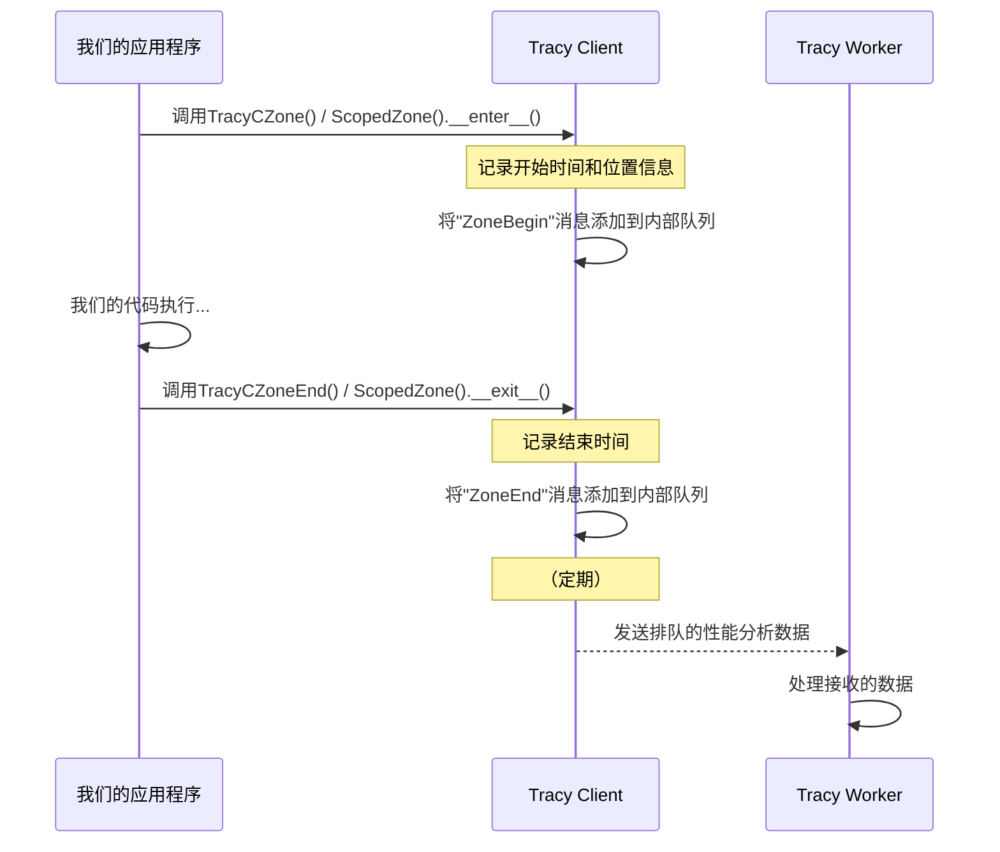

# 第2章：Tracy Client（插桩）

欢迎回来

在[第1章：Tracy View（分析器GUI）](01_tracy_view__profiler_gui__.md)中，我们了解到Tracy View是我们应用程序的仪表板，以用户友好的方式显示性能数据。但所有这些宝贵的数据从哪里来？

这就是**Tracy Client**的作用

## 什么是Tracy Client？

想象一下我们有一支由微小、超高效的记者组成的团队，==直接嵌入在我们的应用程序内部==。他们的工作是不断观察我们代码的特定部分，测量正在发生的事情，并静默地将这些报告发送给Tracy进行分析。

Tracy Client就是那支记者团队。它是我们直接集成到自己应用程序中的一小段代码。它的目的是**插桩**（测量和记录）我们代码中的各种事件，例如：

*   一个函数执行需要多长时间。
*   何时以及分配或释放了多少内存。
*   我们想在时间轴上看到的自定义事件或消息。

**它解决的主要问题：** ==从我们正在运行的应用程序中收集原始性能数据==。没有Client，Tracy就没有任何数据可以向我们展示

## 我们的核心用例：测量函数执行时间

假设我们的游戏或应用程序中有一个执行复杂计算的函数，比如`calculate_player_path()`。我们怀疑这个函数可能会拖慢速度，但我们不确定它实际需要多少时间或何时运行。

本章将向我们展示如何使用Tracy Client来精确测量`calculate_player_path()`运行多长时间，使我们能够在Tracy时间轴上看到它的持续时间。

## Tracy Client插桩的关键概念

要有效使用Tracy Client，让我们理解几个核心思想：

1.  **插桩：** 这是==向我们的应用程序添加特殊代码（Tracy的报告宏或函数）的行为==。我们正在"插桩"我们的代码，使其可以被Tracy观察。
2.  **Zones：** 在Tracy中，"zone"是基于时间的测量。它表示在特定时间开始并在另一个时间结束的代码块。当我们`测量函数的执行时间时，我们正在创建一个zone。`
3.  **宏/函数：** Tracy提供易于使用的宏（用于C/C++）和函数（用于Python和其他语言），为我们处理所有复杂的报告。我们只需==将它们放在我们想要测量的代码周围==。

## 解决用例：插桩一个函数

让我们看看如何使用Tracy插桩我们的`calculate_player_path()`函数。

### C/C++示例

如果我们的应用程序是用C或C++编写的，我们通常会包含`tracy/TracyC.h`（用于C）或`tracy/Tracy.hpp`（用于C++）。

以下是我们如何测量`calculate_player_path`函数：

```cpp
#include <stdio.h>
#include <thread>
#include <chrono>

#include "tracy/TracyC.h" // 用于C风格的插桩

void calculate_player_path() {
    // TracyCZone需要一个唯一的变量名，例如'pathCalcCtx'
    TracyCZone(pathCalcCtx, 1); // 启动一个以函数命名的zone，激活（1）

    // 模拟一些工作
    std::this_thread::sleep_for(std::chrono::milliseconds(50));

    TracyCZoneEnd(pathCalcCtx); // 结束zone
}

int main() {
    TracyCSetThreadName("Main Thread"); // 命名我们的线程
    printf("Starting profiling example...\n");

    for (int i = 0; i < 3; ++i) {
        calculate_player_path();
        std::this_thread::sleep_for(std::chrono::milliseconds(100));
    }

    printf("Profiling example finished.\n");
    return 0;
}
```

**解释：**

*   `TracyCZone(pathCalcCtx, 1);`：此宏标记我们zone的**开始**。
    *   `pathCalcCtx`是此zone上下文的唯一变量名。
    *   `1`表示zone是"激活的"（即，应该收集数据）。
*   `TracyCZoneEnd(pathCalcCtx);`：此宏标记我们zone的**结束**，使用相同的上下文变量。
*   `TracyCSetThreadName("Main Thread");`：这是一个有用的宏，用于命名我们的线程，使它们在Tracy View中更容易识别。

当我们运行这个插桩的应用程序并连接到Tracy View时，我们==将在时间轴上看到彩色条，每个条代表`calculate_player_path()`的一次执行，显示其持续时间==

对于C++用户，有一个更方便的宏：`ZoneScoped`。它在作用域（如函数）开始时自动启动zone，并在作用域退出时结束它。

```cpp
#include "tracy/Tracy.hpp" // 用于C++特定的插桩

void AnotherFunction() {
    ZoneScoped; // 自动为此函数创建zone
    // ... 代码 ...
}
```

### Python示例

Tracy还为Python提供绑定，允许我们插桩Python代码。

```python
import time
from tracy_client.tracy import ScopedZone, thread_name, program_name

def calculate_player_path_py():
    with ScopedZone("calculate_player_path_py", color=0x00FF00): # 绿色
        # 模拟一些工作
        time.sleep(0.05)

if __name__ == "__main__":
    program_name("Python Profiling Example")
    thread_name("Main Python Thread")
    print("Starting profiling example (Python)...")

    for i in range(3):
        calculate_player_path_py()
        time.sleep(0.1)

    print("Profiling example finished (Python).\n")
```

**解释：**

*   `with ScopedZone("calculate_player_path_py", color=0x00FF00):`：在Python中，`ScopedZone`是用作上下文管理器的类。它在调用`__enter__`时启动zone（在`with`语句处），并在调用`__exit__`时自动结束它（当`with`块完成时）。
*   `program_name()`和`thread_name()`：与C/C++类似，这些函数允许我们命名我们的程序和线程。

同样，运行此Python代码并连接到Tracy View将在时间轴上向我们显示`calculate_player_path_py`的执行时间。

## 底层机制：Tracy Client如何工作

现在我们知道如何使用它，让我们窥探幕后，了解当我们使用Tracy Client宏或函数时会发生什么。

### 流程

当我们的应用程序调用Tracy Client函数（如启动zone）时，以下是简化的事件序列：

1.  **事件触发：** 我们应用程序的代码执行Tracy插桩宏/函数（例如，`TracyCZone`）。
2.  **时间戳和上下文收集：** 嵌入在我们应用程序中的Tracy Client立即记录当前的高分辨率时间戳（确切的时刻）并收集有关代码位置的信息（文件、行、函数名）。
3.  **数据序列化：** 然后将这些收集的信息打包成一个小的、优化的二进制消息（序列化）。
4.  **消息排队：** 消息被添加到Tracy Client内的一个特殊的快速队列中。此队列设计得非常高效，最大限度地减少对我们应用程序性能的影响。
5.  **数据传输：** Tracy Client内的一个单独的后台线程定期通过网络连接将这些累积的消息发送到[Tracy Worker](03_tracy_worker__server__.md)（通常在同一台机器或远程机器上运行）。
6.  **Zone结束：** 当我们的代码退出插桩块时（例如，`TracyCZoneEnd`），Client记录另一个时间戳，打包它，并将其排队等待传输。



### 代码

Tracy Client的C/C++实现的核心可以在`public/tracy/TracyC.h`及其相应的C++实现文件中找到。

#### C/C++核心函数

> 当我们使用`TracyCZone`时，它会扩展为对`___tracy_emit_zone_begin`和`___tracy_emit_zone_end`等函数的调用。
>

首先，创建一个静态的`___tracy_source_location_data`结构来存储有关zone在我们代码中*位置*的详细信息：

```cpp
// --- 来自：public/tracy/TracyC.h ---
struct ___tracy_source_location_data
{
    const char* name;       // zone的名称（例如，"calculate_player_path"）
    const char* function;   // 函数的名称（__func__）
    const char* file;       // 源文件名（__FILE__）
    uint32_t line;          // 行号（__LINE__）
    uint32_t color;         // zone的可选颜色
};

// ... 在TracyCZone宏内 ...
static const struct ___tracy_source_location_data TracyConcat(__tracy_source_location,TracyLine) = { NULL, __func__,  TracyFile, (uint32_t)TracyLine, 0 };
```

这个`___tracy_source_location_data`结构填充了有关我们源代码中当前位置的信息。然后，调用实际的`begin`函数：

```cpp
// --- 来自：public/tracy/TracyC.h ---
// （简化的宏扩展）
TracyCZoneCtx ctx = ___tracy_emit_zone_begin_callstack( &TracyConcat(__tracy_source_location,TracyLine), TRACY_CALLSTACK, active );
// ...
___tracy_emit_zone_end( ctx );
```

*   `___tracy_emit_zone_begin_callstack`：此函数是启动zone的实际入口点。它接受`srcloc`（源位置数据）、可选的调用堆栈深度以及zone是否激活。它返回一个`TracyCZoneCtx`（zone上下文），用于标识此特定zone实例。
*   `___tracy_emit_zone_end`：此函数接受`TracyCZoneCtx`以发出zone结束的信号。

这些==`___tracy_emit_zone_begin`和`___tracy_emit_zone_end`函数==（在其他Tracy Client源文件中实现，为简洁起见此处未显示）负责：

1.  获取当前的高分辨率时间戳。
2.  创建包含此时间戳和zone的ID（从源位置派生）的"消息"。
3.  将此消息放入内部的每线程缓冲区或队列中。

#### Python绑定

对于Python，`tracy_client`库使用`pybind11`创建到底层C++ Tracy Client代码的绑定。

Python中的`ScopedZone`类（`python/tracy_client/scoped.py`）如下所示：

```python
# --- 来自：python/tracy_client/scoped.py ---
class ScopedZone(_ScopedZone):
    def __init__(
        self,
        name: Optional[str] = None,
        color: Color = 0,
        depth: Optional[int] = None,
        active: bool = True,
    ) -> None:
        frame = sys._getframe(1)
        _ScopedZone.__init__(
            self,
            name,
            int(color),
            depth,
            active,
            frame.f_code.co_name,     # 函数名
            frame.f_code.co_filename, # 文件名
            frame.f_lineno,           # 行号
        )

    def __enter__(self):
        self.enter() # 调用C++绑定
        return self

    def __exit__(self, *args):
        self.exit()  # 调用C++绑定
```

这个Python类`ScopedZone`继承自`_ScopedZone`，后者由`pybind11`从C++端（`python/bindings/Module.cpp`）生成。`__init__`方法捕获Python源位置（函数名、文件、行）并向下传递。然后`enter()`和`exit()`方法调用C++绑定函数，这些函数反过来调用我们之前看到的`___tracy_emit_zone_begin`和`___tracy_emit_zone_end`函数。

这种分层方法允许Tracy支持各种语言的插桩，同时使用高性能的C/C++核心。

## 超越基本Zones

虽然使用zones测量函数执行时间是主要用途，但Tracy Client可以做更多：

*   **内存分配：** 跟踪`malloc`/`free`调用以查看内存使用模式。
    *   `TracyCAlloc(ptr, size);`
    *   `TracyCFree(ptr);`
*   **帧标记：** 标记帧的开始和结束（例如，用于游戏）以分析帧率。
    *   `TracyCFrameMark;`
    *   `TracyCFrameMarkStart("Frame X");`
    *   `TracyCFrameMarkEnd("Frame X");`
*   **消息：** 发送任意文本消息以显示在时间轴上。
    *   `TracyCMessageL("Something interesting happened!");`
*   **图表：** 报告随时间变化的数值，显示为折线图。
    *   `TracyCPlot("Health", 75.0);`
*   **线程命名：** 为我们的线程提供有意义的名称。
    *   `TracyCSetThreadName("Physics Thread");`

所有这些功能都==由类似的"emit"函数提供支持，这些函数打包数据并将其发送到[Tracy Worker](03_tracy_worker__server__.md)==。

## 结论

我们现在已经成功学习了**Tracy Client**

它是驻留在我们应用程序内部的关键组件，通过**插桩**点（如**zones**）收集性能数据。我们已经看到==使用简单的宏和函数向我们的C/C++或Python代码添加这些“记者”==，并且我们对它在底层如何工作有了基本的了解，打包时间戳和位置数据以进行传输。

这些原始性能数据需要在Tracy View可以显示它之前进行处理和组织。在[下一章](03_tracy_worker__server__.md)中，我们将探索**Tracy Worker**，这是从我们的应用程序接收这些消息并为分析做好准备的服务器组件。

[下一章：Tracy Worker（服务器）](03_tracy_worker__server__.md)

