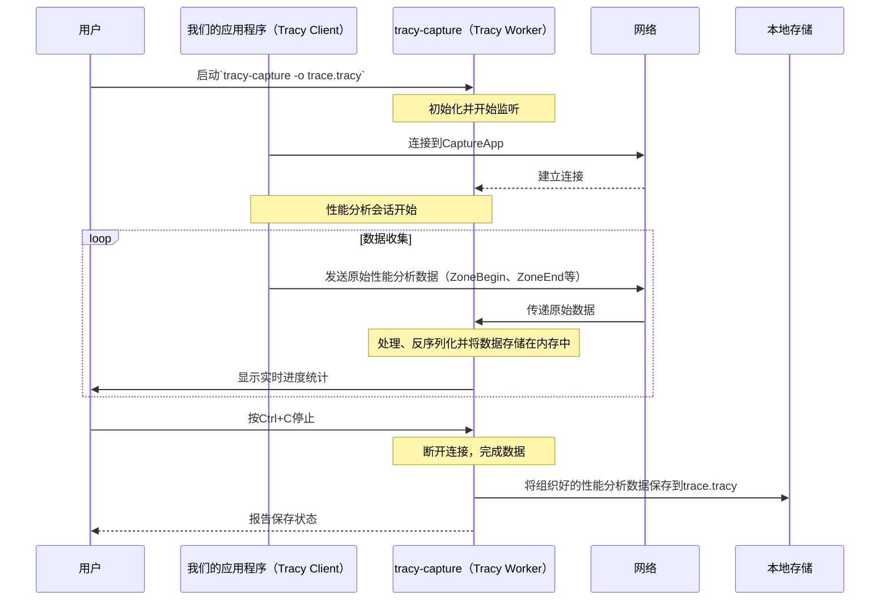

# 第3章：Tracy Worker（服务器）

欢迎回来

在[第2章：Tracy Client（插桩）](02_tracy_client__instrumentation__.md)中，我们了解到Tracy Client驻留在我们的应用程序内部，勤奋地从我们的代码中收集原始性能数据并将其发送出去。

但所有这些原始的、未处理的数据去哪里了？

这就是**Tracy Worker**的作用

## 什么是Tracy Worker？

想象一下Tracy Client就像一支由微小的现场记者组成的团队，从我们应用程序的各个部分向我们发送持续的原始笔记流。这些笔记非常详细，但它们只是原始笔记、时间戳和ID。我们无法直接理解它们。

Tracy Worker是这些笔记的"大脑"或**中央档案管理员**。它是一个单独的程序（或主Tracy Profiler GUI中的一个组件），在后台运行。它的工作是：

1.  **监听：** 等待来自任何插桩应用程序（Tracy Clients）的传入数据。
2.  **接收：** 从网络接收原始二进制数据流。
3.  **处理：** 解密、反序列化（从原始字节转换为有意义的对象）并高效地组织这些数据。
4.  **存储：** 将这些组织好的数据保存在内存中，使其准备好供[Tracy View（分析器GUI）](01_tracy_view__profiler_gui__.md)查询或保存到文件。

**它解决的主要问题：** ==理解==原始的、传入的性能数据，并将其==组织==成一个连贯的、可搜索的数据库。没有Worker，原始客户端数据将无法使用

## 我们的核心用例：将实时性能分析数据捕获到文件

假设我们正在运行我们的游戏，其中的Tracy Client正在主动发送性能数据。我们想要在==特定持续时间内`捕获`这些数据并将其`保存到.tracy`文件中==，以便我们稍后可以使用[Tracy View（分析器GUI）](01_tracy_view__profiler_gui__.md)分析它（可能在不同的机器上）。

本章将指导我们理解Tracy Worker（特别是`tracy-capture`实用程序）如何使这成为可能。

## 🎢Tracy Worker的关键概念

要理解Tracy Worker如何运作，让我们分解其核心功能：

1.  **服务器角色：** ==Worker充当服务器==。它打开一个特定的网络端口，耐心等待Tracy Clients连接并发送它们的数据。
2.  **数据流解释：** 来自客户端的数据是连续的二进制消息流（如"zone开始"、"zone结束"、"内存分配"）。Worker智能地==解析==这个流，理解每条消息的含义。
3.  **时间同步：** 客户端可能在不同的机器上，或者它们的内部时钟可能漂移。Worker帮助==同步时间戳==，以确保所有事件都正确放置在统一的时间轴上。
4.  **高效的数据结构：** 为了处理可能数十亿的事件，Worker将处理过的数据存储在==高度优化的数据结构中==，允许[Tracy View](01_tracy_view__profiler_gui__.md)进行快速查询和导航。

## 解决用例：使用`tracy-capture`捕获

Tracy提供了一个名为`tracy-capture`的命令行实用程序，它体现了Tracy Worker的服务器角色，允许我们捕获实时性能分析数据。

### 示例：捕获跟踪

首先，确保我们的应用程序（嵌入了Tracy Client）正在运行。然后，打开我们的终端或命令提示符并运行`tracy-capture`。

```bash
# 在我们的终端中，启动捕获实用程序
tracy-capture -o my_game_session.tracy

# 控制台中的预期输出：
# Connecting to 127.0.0.1:8086...
# Timer resolution: 1.00 ns
# ... (显示Mbps、压缩比、内存使用的进度更新) ...
# (按Ctrl+C停止捕获)
```

**解释：**

*   `tracy-capture`：这是以独立模式运行Tracy Worker的可执行文件。
*   `-o my_game_session.tracy`：此标志告诉Worker将它接收的所有性能分析数据保存到名为`my_game_session.tracy`的文件中。
*   输出`Connecting to...`显示Worker正在尝试连接到客户端（默认情况下，在`127.0.0.1`和端口`8086`上）。
*   一旦连接，它将持续显示有关数据传输和处理的实时统计信息。
*   当我们收集了足够的数据后，可以在终端中按`Ctrl+C`停止捕获。然后Worker将完成并保存`.tracy`文件。

捕获完成后，我们可以使用[Tracy View](01_tracy_view__profiler_gui__.md)打开`my_game_session.tracy`来分析我们应用程序的性能。

## 底层机制：Tracy Worker如何工作

让我们看看Tracy Worker（作为`tracy-capture`运行时）如何运作的简化流程：

### 流程

以下是我们运行`tracy-capture`时发生的事情：

1.  **Worker初始化：** 我们启动`tracy-capture`并告诉它在哪里保存输出文件。
2.  **网络设置：** Tracy Worker初始化其网络组件，并开始在特定端口（默认8086）上监听[Tracy Client](02_tracy_client__instrumentation__.md)连接。
3.  **客户端连接：** 一个插桩的应用程序（我们的游戏）启动并尝试连接到Tracy Worker。
4.  **数据接收：** 一旦连接，[Tracy Client](02_tracy_client__instrumentation__.md)持续通过网络向Worker发送原始性能分析数据（时间戳、zone ID、消息）。
5.  **处理和存储：** Tracy Worker接收这些原始字节，将它们反序列化为有意义的事件（例如，带有开始时间、结束时间和源位置的`ZoneEvent`），并将它们存储在其内部内存结构中。它还跟踪内存使用和线程名称等内容。
6.  **进度显示：** 在处理时，Worker向控制台打印实时统计信息（如传输速度、内存使用），以通知用户。
7.  **终止和保存：** 当我们停止`tracy-capture`实用程序时（例如，按`Ctrl+C`），Worker完成处理任何剩余数据，然后将其整个内部数据集序列化到指定的`.tracy`文件中并保存到磁盘。



### 代码

`tracy-capture`实用程序是一个使用`tracy::Worker`类的单独应用程序。我们可以在`capture/src/capture.cpp`中找到其`main`函数。

1.  **Worker实例化：**
    `tracy-capture`实用程序的核心是创建`tracy::Worker`类的实例。这个`Worker`对象处理网络通信和数据处理的所有繁重工作。

    ```cpp
    // --- 文件：capture/src/capture.cpp ---
    // ...
    #include "../../server/TracyWorker.hpp" // 包含Worker头文件
    // ...
    int main( int argc, char** argv )
    {
        // ... (地址、端口、输出文件等的参数解析) ...
    
        printf( "Connecting to %s:%i...", address, port );
        fflush( stdout );
    
        // 创建Tracy Worker实例
        tracy::Worker worker( address, port, memoryLimit );
    
        // ... (处理握手状态并等待数据) ...
    }
    ```
    这里，`tracy::Worker worker( address, port, memoryLimit );`创建Worker。它被赋予要监听的IP `address`和`port`，以及可选的`memoryLimit`，用于它可以使用多少RAM。

2.  **数据处理循环：**
    一旦连接，`tracy-capture`程序进入一个循环，不断检查worker是否仍然连接。在这个循环内，`tracy::Worker`对象（在其自己的后台线程中运行）处理传入的数据。

    ```cpp
    // --- 文件：capture/src/capture.cpp ---
    // ...
    // 循环直到worker断开连接
    while( worker.IsConnected() )
    {
        // 检查用户中断（Ctrl+C）
        if( s_disconnect.load( std::memory_order_relaxed ) )
        {
            worker.Disconnect(); // 告诉worker断开连接
            s_disconnect.store(false, std::memory_order_relaxed );
            break;
        }
    
        // 获取并显示实时统计信息，如Mbps、压缩比、内存使用
        // ... (显示进度的代码) ...
    
        std::this_thread::sleep_for( std::chrono::milliseconds( 100 ) ); // 短暂睡眠
    }
    // ...
    ```
    注意，`while`循环主要处理用户输入（`s_disconnect`）和显示进度。`worker`对象本身在后台持续接收和处理数据。

3.  **保存跟踪：**
    在`while`循环之后（当捕获停止时），Worker累积的数据被写入指定的`.tracy`文件。

    ```cpp
    // --- 文件：capture/src/capture.cpp ---
    // ...
    printf( "\nFrames: %" PRIu64 "\nTime span: %s\nZones: %s\nElapsed time: %s\nSaving trace...",
        // ... (打印摘要统计) ...
        );
    fflush( stdout );
    
    // 打开输出文件进行写入
    auto f = std::unique_ptr<tracy::FileWrite>( tracy::FileWrite::Open( output, tracy::FileCompression::Zstd, 3, 4 ) );
    if( f )
    {
        worker.Write( *f, false ); // 告诉worker将所有收集的数据写入文件
        AnsiPrintf( ANSI_GREEN ANSI_BOLD, " done!\n" );
        f->Finish();
        // ... (打印压缩统计) ...
    }
    else
    {
        AnsiPrintf( ANSI_RED ANSI_BOLD, " failed!\n");
    }
    // ...
    ```
    `worker.Write(*f, false);`调用至关重要。它告诉`tracy::Worker`将其所有组织好的内存中性能分析数据序列化到`FileWrite`对象中，然后该对象处理将其保存到`.tracy`文件。

重要的是要注意，主[Tracy View（分析器GUI）](01_tracy_view__profiler_gui__.md)在连接到实时客户端时也在内部包含一个`tracy::Worker`对象。这意味着GUI本身执行相同的数据接收和处理任务。`tracy-capture`实用程序只是一个专注于将数据保存到文件的独立版本。

```cpp
// --- 来自：profiler/src/profiler/TracyView.cpp（简化）---
// 连接到实时客户端时的构造函数
View::View( void(*cbMainThread)(const std::function<void()>&, bool), const char* addr, uint16_t port, SetTitleCallback stcb, SetScaleCallback sscb, AttentionCallback acb, AchievementsMgr* amgr )
    : m_worker( addr, port, s_config.memoryLimit == 0 ? -1 : ( s_config.memoryLimitPercent * tracy::GetPhysicalMemorySize() / 100 ) )
    // ... 其余初始化 ...
{
    // m_worker成员在这里初始化，连接到客户端
    // 然后它在后台线程中持续接收和处理数据。
}

// 打开保存的跟踪文件时的构造函数
View::View( void(*cbMainThread)(const std::function<void()>&, bool), FileRead& f, SetTitleCallback stcb, SetScaleCallback sscb, AttentionCallback acb, AchievementsMgr* amgr )
    : m_worker( f ) // 用跟踪文件初始化Tracy Worker
    // ... 其余初始化 ...
{
    // 在这种情况下，m_worker从文件而不是实时客户端加载数据。
}
```
正如我们所看到的，`tracy::Worker`是一个核心组件，无论我们是使用像`tracy-capture`这样的专用实用程序捕获数据，还是在GUI中实时查看它。

## 结论

我们现在已经揭示了**Tracy Worker**的角色，这是从我们插桩的应用程序接收、处理和组织原始性能数据的关键"大脑"。

我们已经看到像`tracy-capture`这样的独立实用程序如何==使用Worker将实时性能分析会话保存到`.tracy`文件以供以后分析==，以及[Tracy View（分析器GUI）](01_tracy_view__profiler_gui__.md)如何==在内部利用`tracy::Worker`进行实时连接==。

所有这些数据传输，从[Tracy Client](02_tracy_client__instrumentation__.md)到Tracy Worker，都依赖于结构化的通信方式。在[下一章](04_tracy_protocol___sockets_.md)中，我们将探讨**Tracy协议与套接字**，以了解用于这种高效通信的语言和通道

[下一章：Tracy协议与套接字](04_tracy_protocol___sockets_.md)

