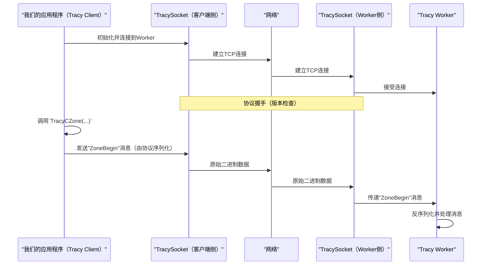
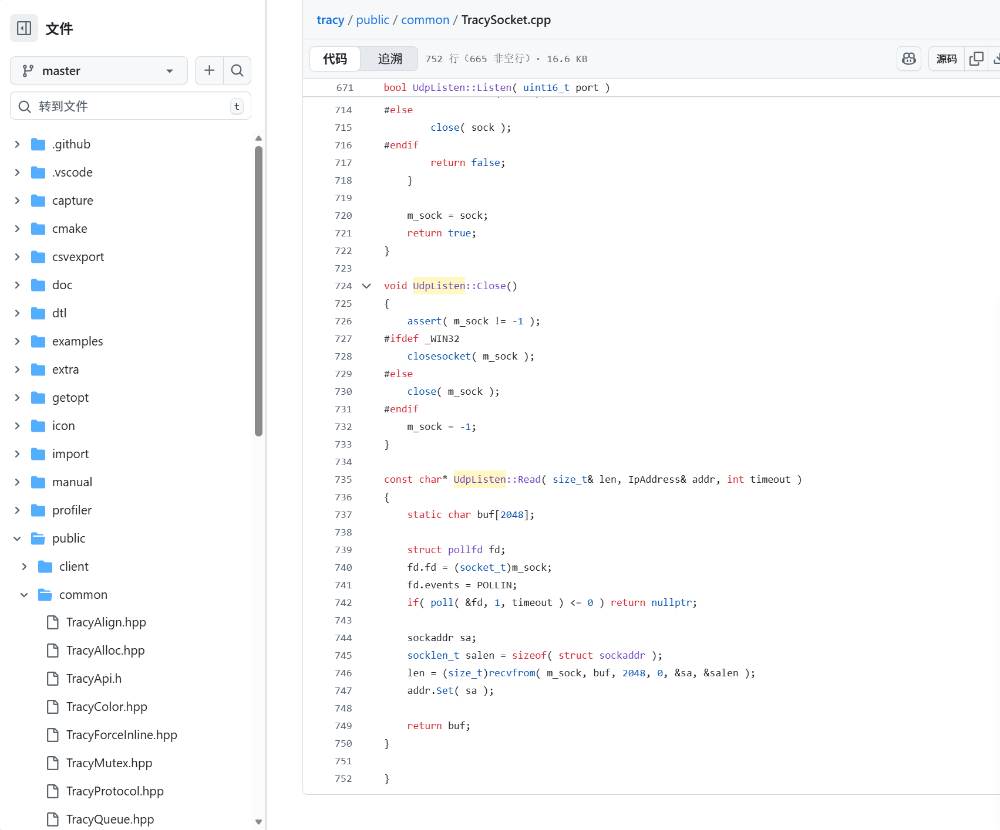
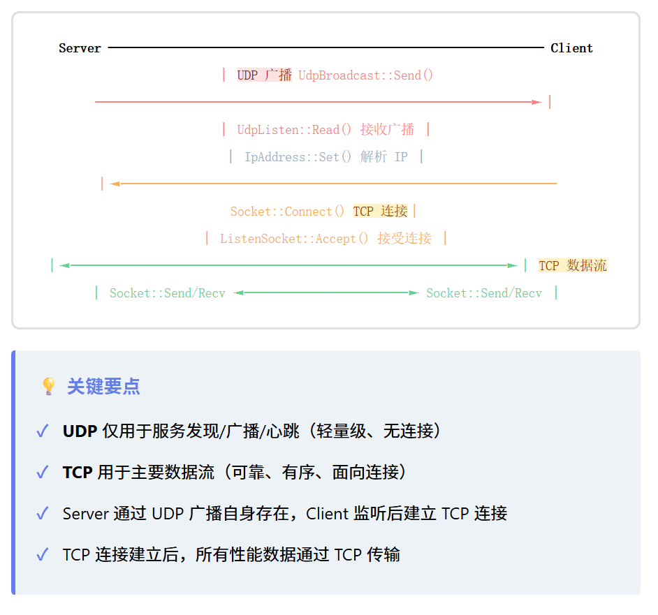

# 第4章：Tracy协议与套接字

欢迎回来

在[第3章：Tracy Worker（服务器）](03_tracy_worker__server__.md)中，我们看到Tracy Worker如何充当中央大脑，从我们插桩的应用程序接收、处理和组织原始性能数据。但这些原始数据究竟如何从我们的应用程序（[Tracy Client](02_tracy_client__instrumentation__.md)）*传输*到Tracy Worker，以及双方如何相互理解？

这就是**Tracy协议与套接字**发挥作用的地方

## 什么是Tracy协议与套接字？

想象一下向另一个城市的朋友发送一条非常重要的消息。我们需要两样东西：

1.  **可靠的发送方式：** 就像邮政服务，确保我们的信件从我们家送到朋友家。这就是**套接字**为Tracy提供的——可靠的网络通道。
2.  **共同的语言：** 我们和我们的朋友需要说同一种语言（也许还要就特定的信件格式达成一致），这样消息才有意义。这就是**Tracy协议**定义的——Tracy Clients和Workers用于通信的特定格式和数据序列。

它们一起构成了Tracy的完整通信系统。`TracySocket`处理实际的网络连接，确保数据包可靠地发送和接收，而"协议"定义了这些数据包的特定格式和序列，以便双方相互理解，就像语言词典和语法规则一样。

> **它们解决的主要问题：** 在[Tracy Client](02_tracy_client__instrumentation__.md)（我们的应用程序）和[Tracy Worker](03_tracy_worker__server__.md)（服务器/分析器GUI）之间实现清晰、高效和可靠的数据交换。没有它们，客户端只会发送乱码，而worker不知道该如何处理

## 我们的核心用例：发送"Zone Begin"事件

让我们重温[第2章：Tracy Client（插桩）](02_tracy_client__instrumentation__.md)中的`calculate_player_path()`示例。当这个函数开始时，Tracy Client需要告诉Tracy Worker："嘿，一个新的'calculate_player_path' zone刚刚开始，这是它发生的确切时间"

本章将解释这条消息如何==被打包（协议）并通过网络（套接字）从客户端发送到worker==。

## Tracy协议与套接字的关键概念

让我们分解这两个基本组件：

### 1. 套接字：网络通道

将套接字想象成连接Tracy Client和Tracy Worker的"管道"或"电话线"。它们是允许应用程序通过网络发送和接收数据的编程接口。

*   **面向连接（TCP）：** Tracy主要使用TCP（传输控制协议）套接字。TCP就像电话呼叫——一旦连接，它就是一个专用的、可靠的通道，确保数据按顺序到达且没有错误。如果数据包丢失，TCP会自动尝试重新发送。
*   **监听与连接：**
    *   **Tracy Worker**使用**"监听套接字"**等待传入连接，就像电话等待呼叫一样。
    *   **Tracy Client**使用**"连接套接字"**发起与Worker的连接，就像拨打号码一样。
*   **`TracySocket`：** 这是==Tracy对操作系统网络套接字函数的内部包装器。它提供了一种一致的方式来连接、发送和接收数据==，无论Tracy是在Windows、Linux还是macOS上运行。

### 2. 协议：数据语言和规则

一旦建立了套接字连接，客户端和worker需要"说"同一种语言。Tracy协议定义：

*   **消息类型：** 正在发送什么类型的信息（例如，"zone开始"、"zone结束"、"内存分配"、"线程名称"）。每种类型都有唯一的ID。
*   **数据格式：** 对于每种消息类型，它包含什么数据，以什么顺序？（例如，对于"zone开始"，可能是：`[消息类型ID] [时间戳] [源位置ID]`）。
*   **排序：** 消息发送和期望的顺序。例如，`ZoneBegin`消息通常必须在同一zone的`ZoneEnd`消息之前。
*   **版本兼容性：** 随着Tracy的发展，协议可能会改变。协议包括机制，通过检查协议版本，确保较旧的客户端仍然可以在某种程度上与较新的worker通信（反之亦然）。

## 解决用例：发送"Zone Begin"事件

当我们的`calculate_player_path()`函数开始时，以下是Tracy协议和套接字如何促进发送该"zone begin"事件：

1.  **客户端连接：** 我们应用程序中的[Tracy Client](02_tracy_client__instrumentation__.md)建立与[Tracy Worker](03_tracy_worker__server__.md)的`TracySocket`连接。
2.  **协议握手：** 双方交换消息以就它们都能理解的协议版本达成一致。
3.  **数据序列化（协议）：** 当调用`TracyCZone`（或`ZoneScoped`）时，Client收集当前时间戳、源文件信息和zone名称。然后根据Tracy协议对"zone begin"事件的规范将其格式化为紧凑的二进制消息。
4.  **数据传输（套接字）：** 然后通过已建立的`TracySocket`连接发送此二进制消息。
5.  **数据接收（套接字）：** Worker通过其`TracySocket`接收这些原始字节。
6.  **数据反序列化（协议）：** Worker使用商定的Tracy协议解释这些字节，将它们转换回有意义的数据结构（如`ZoneEvent`开始记录）。

## 底层机制：通信如何工作

让我们看看客户端如何连接和发送数据的简化流程：



### 代码

Tracy网络通信的核心由`TracySocket`类处理，主要位于`public/common/TracySocket.cpp`中。

#### 1. 初始化和连接套接字

在客户端侧，连接到worker：

```cpp
// --- 文件：public/common/TracySocket.cpp（简化的客户端侧用法）---
// ...
#include "TracySocket.hpp"

// 在我们的Tracy Client的后台线程逻辑中：
void ConnectToWorker(const char* address, uint16_t port) {
    tracy::Socket socket; // 创建TracySocket对象

    // 尝试连接到指定的地址和端口
    if (socket.ConnectBlocking(address, port)) {
        printf("Successfully connected to Tracy Worker!\n");
        // 连接已建立，现在可以发送数据
    } else {
        printf("Failed to connect to Tracy Worker.\n");
    }
    // ... 稍后，完成时：socket.Close();
}
```
`tracy::Socket`构造函数准备套接字，`ConnectBlocking`尝试建立到指定`address`和`port`的TCP连接。如果成功，`socket`现在准备好发送和接收数据。

在worker侧，监听连接：

```cpp
// --- 文件：public/common/TracySocket.cpp（简化的Worker侧用法）---
// ...
#include "TracySocket.hpp"
#include "TracyAlloc.hpp" // 用于tracy_malloc

// 在我们的Tracy Worker的主循环中：
void StartListeningForClients(uint16_t port) {
    tracy::ListenSocket listenSocket; // 创建监听套接字对象

    if (listenSocket.Listen(port, 4)) { // 在端口上监听，积压为4
        printf("Tracy Worker listening on port %d...\n", port);
        // 定期检查新的客户端连接
        while (true) {
            tracy::Socket* clientSocket = listenSocket.Accept();
            if (clientSocket) {
                printf("New client connected!\n");
                // 现在我们有一个连接的clientSocket可以交互
                // 我们通常会将其交给新线程进行通信
                // 不要忘记稍后用tracy_free(clientSocket)删除clientSocket！
            }
            // ... 处理现有客户端数据或其他任务 ...
        }
    } else {
        printf("Failed to start listening on port %d.\n", port);
    }
    // ... 稍后，完成时：listenSocket.Close();
}
```
`tracy::ListenSocket`专门用于监听。`Listen(port, backlog)`告诉它打开一个端口并等待。`Accept()`检查客户端是否尝试连接，如果是，则返回该特定客户端连接的新`tracy::Socket`对象。

#### 2. 发送数据（客户端到Worker）

一旦连接，Client使用`Socket::Send`通过网络管道推送数据：

```cpp
// --- 文件：public/common/TracySocket.cpp（简化的客户端侧发送）---
// ... socket.ConnectBlocking成功后 ...
void SendZoneBeginMessage(tracy::Socket& socket, uint64_t timestamp, uint32_t srclocId) {
    // 这是一个简化的示例。实际的Tracy消息更复杂。
    // 让我们想象一个简单的协议：
    // 字节0：消息类型（例如，0x01表示ZoneBegin）
    // 字节1-8：时间戳（8字节）
    // 字节9-12：源位置ID（4字节）

    char buffer[13];
    buffer[0] = 0x01; // 示例：ZoneBegin消息类型
    memcpy(buffer + 1, &timestamp, sizeof(timestamp));
    memcpy(buffer + 9, &srclocId, sizeof(srclocId));

    int bytesSent = socket.Send(buffer, sizeof(buffer));
    if (bytesSent == -1) {
        printf("Error sending data!\n");
    } else {
        printf("Sent %d bytes for ZoneBegin.\n", bytesSent);
    }
}
```
`socket.Send()`函数接受指向我们数据缓冲区的指针及其长度。它使用操作系统的`send`调用处理通过网络发送这些字节的底层细节。Tracy的内部Client代码将在调用`Send`之前将实际的性能分析数据序列化到这样的缓冲区中。

#### 3. 接收数据（Worker从Client）

Worker需要读取客户端发送的数据：

```cpp
// --- 文件：public/common/TracySocket.cpp（简化的Worker侧接收）---
// ... 在Tracy Worker对连接的clientSocket的循环中 ...
void RecvAndProcessMessage(tracy::Socket& clientSocket) {
    char buffer[2048]; // 接收数据的缓冲区
    int bytesReceived = clientSocket.RecvBuffered(buffer, sizeof(buffer), 100); // 尝试接收100毫秒

    if (bytesReceived > 0) {
        // 假设第一个字节是消息类型（协议的一部分）
        uint8_t messageType = buffer[0];

        if (messageType == 0x01) { // 我们的示例ZoneBegin
            uint64_t timestamp;
            uint32_t srclocId;
            memcpy(&timestamp, buffer + 1, sizeof(timestamp));
            memcpy(&srclocId, buffer + 9, sizeof(srclocId));
            printf("Worker received ZoneBegin: Timestamp %" PRIu64 ", SrcLoc %u\n", timestamp, srclocId);
            // 现在worker可以使用这些反序列化的数据来创建ZoneEvent
        }
        // ... 处理其他消息类型 ...
    } else if (bytesReceived == 0) {
        printf("Client disconnected.\n");
        // 清理clientSocket
    } else {
        // 错误或超时
    }
}
```
Worker使用`clientSocket.RecvBuffered()`接收数据。它读取到内部缓冲区以提高效率，并向调用者提供数据。然后Worker检查接收到的字节，根据Tracy协议的规则将它们*反序列化*回有意义的值。

#### 4. 协议版本控制

`Tracy协议`随着时间的推移而发展。Tracy需要确保使用不同版本的客户端和服务器仍然可以有效通信。这通过协议历史来处理，确保兼容性。

```cpp
// --- 文件：profiler/src/profiler/TracyProtoHistory.cpp ---
#include "TracyFileHeader.hpp"
#include "TracyProtoHistory.hpp"

namespace tracy
{

constexpr ProtocolHistory_t ProtocolHistoryArr[] = {
    { 76, FileVersion( 0, 13, 0 ) },
    { 74, FileVersion( 0, 12, 0 ), FileVersion( 0, 12, 2 ) },
    // ... 更多条目 ...
    { 1, FileVersion( 0, 4, 1 ) },
    {} // 哨兵值
};

const ProtocolHistory_t* ProtocolHistory = ProtocolHistoryArr;

}
```
这个`ProtocolHistoryArr`是已知协议版本和使用它们的Tracy软件版本的列表。当[Tracy Client](02_tracy_client__instrumentation__.md)连接到[Tracy Worker](03_tracy_worker__server__.md)时，它们执行"握手"以找出它们都支持的最高公共协议版本。这确保即使我们有较旧的客户端和较新的分析器GUI，它们仍然可以相互通信，使用它们都理解的最旧的公共"语言"。

我们在后面 还可以发现还有udp连接 这是为什么呢~



因为这个库同时需要可靠的流式连接（用 TCP）和轻量/广播式的发现或信号（用 UDP）。

文件里实现了两类套接字以满足不同用途：

- TCP（类：Socket / ListenSocket）
  - 用来建立可靠、面向连接的通道，传输大量、顺序敏感的探测/分析数据（比如 profiler 的主要数据流、命令、文件等）。
  - 代码里有 Connect / ConnectBlocking / Send / Recv 等，实现了阻塞/非阻塞连接、缓冲读取、accept/listen 等服务器端逻辑。
- UDP（类：UdpBroadcast / UdpListen）
  - 用于==广播==/发现与轻量消息：UDP 无连接、延迟低且支持广播（SO_BROADCAST），适合用来在局域网内发现正在运行的 tracy 服务器或发送心跳、简短通知等，不需要建立完整 TCP 连接也能被多个主机接收。
  - 代码里有 Open/Send（broadcast）和 Listen/Read（接收 broadcast）的实现，使用 recvfrom/sendto 和 SO_BROADCAST、bind 到 INADDR_ANY 等。

具体可在文件中对应位置看到：
- Socket / ListenSocket：TCP 相关（连接、监听、accept、send/recv、缓冲）
- UdpBroadcast / UdpListen / IpAddress：UDP 广播与监听、IP 文本/数值处理



## 结论

我们现在已经了解了基本的**Tracy协议与套接字**

套接字（`TracySocket`）为通信提供可靠的网络通道，就像我们性能分析数据的邮政服务。协议定义了"语言"——[Tracy Client](02_tracy_client__instrumentation__.md)和[Tracy Worker](03_tracy_worker__server__.md)都理解的二进制消息（如"Zone Begin"）的特定格式、类型和序列。这个强大的系统确保我们宝贵的性能数据被正确收集、传输和解释。

随着数据成功发送和接收，[Tracy Worker](03_tracy_worker__server__.md)然后需要将这些信息存储在有组织的结构中。在[下一章](05_profiling_data_structures__zoneevent__gpuevent__etc___.md)中，我们将探讨**性能分析数据结构（ZoneEvent、GpuEvent等）**，以了解==Tracy实际上如何保存所有这些丰富的性能数据==。

[下一章：性能分析数据结构（ZoneEvent、GpuEvent等）](05_profiling_data_structures__zoneevent__gpuevent__etc___.md)

