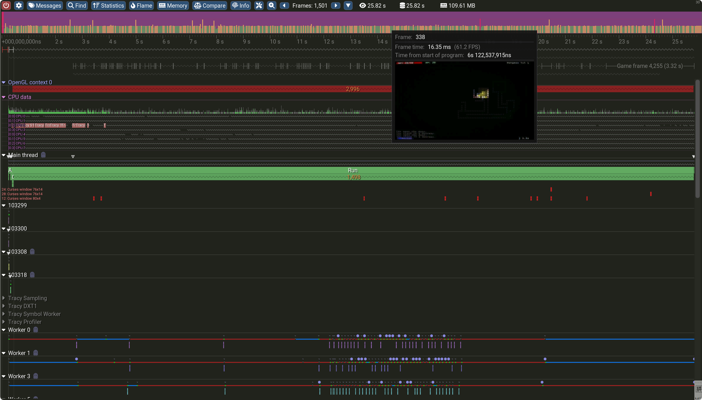
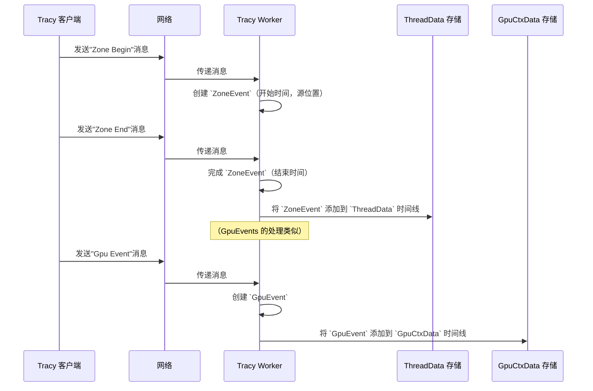

# 第 5 章：性能分析数据结构（ZoneEvent、GpuEvent 等）

欢迎回来

在[第 4 章：Tracy 协议与套接字](04_tracy_protocol___sockets_.md)中，我们探讨了原始性能数据如何通过网络套接字，使用定义的二进制协议，从已插桩的应用程序（[Tracy 客户端](02_tracy_client__instrumentation__.md)）传输到 [Tracy Worker（服务器）](03_tracy_worker__server__.md)。

现在 [Tracy Worker](03_tracy_worker__server__.md) 已经成功接收了所有这些原始字节，它会用这些数据*做什么*呢？

它不能只是向我们显示原始的时间戳和 ID。它需要==将这些数据组织成有意义的结构化对象==，以便 [Tracy View（分析器 GUI）](01_tracy_view__profiler_gui__.md) 可以使用它们来绘制时间线、火焰图和统计信息

这就是**性能分析数据结构**发挥作用的地方

## 什么是性能分析数据结构？

想象一下，我们正在记录繁忙一天中发生的所有事情。我们不会只是随意涂写单词；我们会用标题、项目符号和时间戳来组织笔记。我们会为"会议"、"任务"或"电话"设置特定的部分，每个部分都有自己的详细信息。

Tracy 的性能分析数据结构正是如此。它们是 [Tracy Worker](03_tracy_worker__server__.md) 内部高度组织化的"文件柜"和"日志条目"，用于存储从应用程序接收到的所有原始信息。Tracy 不是处理原始字节，而是将它们转换为专门的对象，如 `ZoneEvent`（用于 CPU 代码）和 `GpuEvent`（用于 GPU 操作）。每个对象都包含描述特定性能事件所需的所有详细信息，使 [Tracy View](01_tracy_view__profiler_gui__.md) 能够轻松显示和分析。

**它们解决的主要问题：** 将原始的、碎片化的二进制数据转换为连贯的、可查询的、可视化表示的应用程序性能内部数据库。没有这些结构，性能分析数据将是一团乱麻

## 我们的核心用例：表示函数的执行时间

让我们回顾一下[第 2 章：Tracy 客户端（插桩）](02_tracy_client__instrumentation__.md)中的 `calculate_player_path()` 函数。当这个函数开始和结束时，[Tracy 客户端](02_tracy_client__instrumentation__.md)会向 [Tracy Worker](03_tracy_worker__server__.md) 发送"Zone Begin"和"Zone End"消息。

本章将向我们展示 [Tracy Worker](03_tracy_worker__server__.md) 如何接收这些消息并创建一个 `ZoneEvent` 对象，将该函数的执行表示为单个独立的数据条目。我们还将涉及用于 GPU 任务的 `GpuEvent`。

## 关键性能分析数据结构

Tracy 使用几个核心数据结构来存储不同类型的性能分析信息：

### 1. `ZoneEvent`（CPU 计时）

这是最常见的性能分析事件。`ZoneEvent` 表示 CPU 代码的计时部分，如函数调用或用 `ZoneScoped` 标记的任何代码块。

*   **它包含什么：**
    *   **开始/结束时间：** 代码块开始和结束时的精确时间戳。
    *   **源位置：** 对源代码中定义此区域*位置*的引用（文件、行、函数名）。
    *   **线程 ID：** 执行此区域的 CPU 线程。
    *   **父/子关系：** 如果此区域在另一个区域内调用，Tracy 会跟踪这种层次结构，允许嵌套视图。
    *   **颜色/名称：** 区域的可选自定义颜色或动态名称。

*   **类比：** `ZoneEvent` 就像精心组织的个人日记中的一个单独的、清晰标记的条目："在[开始时间]，我开始处理[任务名称]（位于[文件:行]）。我花了[持续时间]完成，在[结束时间]结束。这个任务是[父任务]的一部分。"

### 2. `GpuEvent`（GPU 计时）

与 `ZoneEvent` 类似，但专门为在 GPU 上执行的操作设计。现代应用程序通常将繁重的渲染或计算任务卸载到 GPU，`GpuEvent` 有助于跟踪这些任务的性能。

*   **它包含什么：**
    *   **GpuStart/GpuEnd：** GPU 操作开始和结束时的时间戳（这些通常与 CPU 时间在不同的时钟域中）。
    *   **CpuStart/CpuEnd：** CPU *提交*和*完成* GPU 工作时的相应 CPU 时间戳。这有助于关联 CPU 和 GPU 活动。
    *   **源位置：** 就像 `ZoneEvent` 一样，它引用启动 GPU 任务的代码位置。
    *   **线程 ID：** 提交此 GPU 工作的 CPU 线程。
    *   **父/子关系：** 如果 GPU 命令结构是层次化的，则支持嵌套 GPU 事件。

*   **类比：** `GpuEvent` 就像工厂日志中的特殊条目："在[CPU 提交时间]，我将[任务名称]（来自[文件:行]）发送到 GPU。GPU 在[GPU 开始时间]开始它，工作了[GPU 持续时间]，并在[GPU 结束时间]完成。我在[CPU 完成时间]收到确认。"

### 3. `SourceLocation`

这个==辅助数据结构存储有关应用程序源代码中事件插桩位置的元数据==。它被 `ZoneEvent` 和 `GpuEvent` 引用。

*   **它包含什么：** `文件名`、`行号`和`函数名`。这对于从分析器导航代码至关重要。

### 4. 容器：`ThreadData` 和 `GpuCtxData`

`ZoneEvent` 和 `GpuEvent` 不是随意浮动的。它们被组织到更大的容器中：

*   **`ThreadData`：** [Tracy Worker](03_tracy_worker__server__.md) 为应用程序中的每个唯一 CPU 线程维护一个 `ThreadData` 对象。此对象保存在该特定线程上发生的所有 `ZoneEvent` 和其他 CPU 相关事件的列表（或"时间线"）。
*   **`GpuCtxData`：** 对于每个 GPU 上下文（例如，DirectX 设备、OpenGL 上下文），Worker 存储一个 `GpuCtxData` 对象。它包含按提交它们的 CPU 线程组织的 `GpuEvent` 列表。

(可恶 还有DirectX 和OpenGL的专栏可以继续往下写，死去的坑突然开始攻击我...)

## 解决用例：表示 `calculate_player_path()`

当 `calculate_player_path()` 运行时，[Tracy 客户端](02_tracy_client__instrumentation__.md)发送一个"Zone Begin"消息，然后是一个"Zone End"消息。以下是 [Tracy Worker](03_tracy_worker__server__.md) 如何将这些转换为 `ZoneEvent`：

1.  **接收"Zone Begin"：** Worker 接收包含区域唯一 ID（基于其源位置）和开始时间戳的==消息==。
2.  **创建（或查找）`SourceLocation`：** 如果这是 Tracy 第一次看到此区域的源位置，它会==创建==一个 `SourceLocation` 条目（例如，对于 `my_game.cpp`，第 123 行，`calculate_player_path`）。
3.  **部分创建 `ZoneEvent`：** Worker 分配一个新的 `ZoneEvent` 对象，填充其开始时间、对其 `SourceLocation` 的引用和线程 ID。如果它是嵌套的，它也可能将其==链接==到其父区域。
4.  **接收"Zone End"：** Worker 接收包含相同唯一区域 ID 和结束时间戳的消息。
5.  **完成 `ZoneEvent`：** ==使用 ID，Worker 找到部分创建的 `ZoneEvent` 并填入其结束时间戳并计算其持续时间==。
6.  **存储在 `ThreadData` 中：** 完成的 `ZoneEvent` 然后被添加到与执行 `calculate_player_path()` 的线程对应的 `ThreadData` 对象内的 `timeline` 列表中。

现在，`calculate_player_path()` 事件作为结构化的 `ZoneEvent` 对象存在，准备好让 [Tracy View](01_tracy_view__profiler_gui__.md) 在时间线上将其显示为彩色条



## 底层原理：如何管理数据结构

让我们在简化的序列图中查看该过程：



### 代码

`ZoneEvent`、`GpuEvent`、`SourceLocation`、`ThreadData` 和 `GpuCtxData` 的实际定义位于 Tracy 的服务器端代码中，通常在 `server/` 目录和公共头文件中。

#### 1. 定义事件

让我们看看 `ZoneEvent` 和 `GpuEvent` 结构的简化版本。这些都针对内存和速度进行了高度优化。

```cpp
// --- 简化自 Tracy 的 server/TracyZone.hpp 和 server/TracyGpu.hpp ---
struct SourceLocation
{
    // 函数名称字符串表的 ID
    // 文件名字符串表的 ID
    // 文件中的行号
    // 此位置区域的可选默认颜色
    uint33_t name;
    uint33_t function;
    uint33_t file;
    uint32_t line;
    uint32_t color;
};

struct ZoneEvent
{
    // 开始和结束时间戳
    int64_t start;
    int64_t end;

    // SourceLocation 定义的索引
    uint32_t srcloc;

    // 可选：子区域的索引
    int32_t child;

    // 简化：还有更多内部字段，如动态名称、调用栈等。
};

struct GpuEvent
{
    // GPU 开始和结束时间戳
    int64_t gpuStart;
    int64_t gpuEnd;

    // CPU 开始和结束时间戳（提交/完成工作时）
    int64_t cpuStart;
    int64_t cpuEnd;

    // SourceLocation 定义的索引
    uint32_t srcloc;

    // 简化：更多字段，如线程 ID、子索引、上下文 ID 等。
};
```
这些结构捕获每个事件的基本计时和位置信息。请注意 `srcloc`（源位置）是指向 `SourceLocation` 对象的 ID，而不是直接存储字符串，这节省了大量内存。

#### 2. 在 `ThreadData` 和 `GpuCtxData` 中存储事件

[Tracy Worker](03_tracy_worker__server__.md) 收集这些单独的事件并将它们存储在每个线程或每个 GPU 上下文的列表中。

```cpp
// --- 简化自 Tracy 的 server/TracyWorker.hpp 和 profiler/src/profiler/TracyTimelineItemThread.cpp ---
#include "TracyThread.hpp" // 用于 ThreadData 定义
#include "TracyGpu.hpp"    // 用于 GpuCtxData 定义

struct ThreadData
{
    uint64_t id; // 此线程的唯一 ID
    const char* name; // 线程名称（例如，"主线程"）

    // 此线程所有 CPU 区域的向量（列表）
    // `short_ptr` 是用于紧凑存储的优化指针类型
    Vector<short_ptr<ZoneEvent>> timeline;

    // 其他事件，如消息、内存分配、采样等。
    // ...
};

struct GpuCtxData
{
    uint33_t name; // GPU 上下文名称字符串表的 ID
    uint64_t thread; // 与此 GPU 上下文关联的主 CPU 线程

    // 用于存储 GPU 事件的映射，由提交它们的 CPU 线程索引
    unordered_flat_map<uint32_t, GpuThreadData> threadData;

    // 其他 GPU 上下文元数据
    // ...
};

struct GpuThreadData
{
    // 此线程提交的所有 GPU 事件的向量（列表）
    Vector<short_ptr<GpuEvent>> timeline;
};
```
`ThreadData::timeline` 直接存储 `ZoneEvent` 对象（或通过 `short_ptr` 指向它们的指针）

对于 GPU 事件，`GpuCtxData` 保存它们，进一步按提交 GPU 命令的 CPU 线程组织（`GpuThreadData::timeline`）。

#### 3. 访问数据以供显示（来自 [Tracy View](01_tracy_view__profiler_gui__.md) 的示例）

当 [Tracy View](01_tracy_view__profiler_gui__.md) 需要绘制时间线时，它会遍历这些组织化的数据结构。例如，要绘制 CPU 线程的区域：

```cpp
// --- 简化自 profiler/src/profiler/TracyTimelineItemThread.cpp ---
// 此函数帮助准备在时间线上绘制的区域
template<typename Adapter, typename V>
int TimelineItemThread::PreprocessZoneLevel( const TimelineContext& ctx, const V& vec, int depth, bool visible, const uint32_t inheritedColor )
{
    // 循环遍历 'vec' 中的所有 ZoneEvents（即 `m_thread->timeline`）
    for( auto it = vec.begin(); it != vec.end(); ++it )
    {
        Adapter a; // 帮助从 `short_ptr` 或直接 `Vector` 访问 ZoneEvent
        auto& ev = a(*it); // 获取当前 ZoneEvent

        const auto end = m_worker.GetZoneEnd( ev ); // 获取事件结束时间
        const auto zsz = end - ev.Start(); // 计算持续时间

        // 决定区域是否太小而无法单独绘制（折叠它）
        if( zsz < MinVisNs )
        {
            // 将"折叠"（组合）条目添加到绘图列表
            // m_draw.emplace_back( TimelineDraw { TimelineDrawType::Folded, ... } );
        }
        else
        {
            // 如果它有子项，递归处理它们以获取最大深度
            if( ev.HasChildren() ) { /* ... 为子项调用 PreprocessZoneLevel ... */ }

            // 将单个区域条目添加到绘图列表
            // m_draw.emplace_back( TimelineDraw { TimelineDrawType::Zone, ... } );
        }
    }
    return maxdepth; // 返回绘图达到的最大深度
}
```
这段简化的代码展示了 `TimelineItemThread` 中的 `PreprocessZoneLevel` 函数（[Tracy View](01_tracy_view__profiler_gui__.md) 的一个组件）如何遍历存储在 `ThreadData` 中的 `Vector<short_ptr<ZoneEvent>>`。它检查每个 `ZoneEvent`，确定其持续时间以及是否有子项，然后准备渲染。在 `TracyTimelineItemGpu.cpp` 中对 `GpuEvent` 进行类似的处理。

这些内部结构设计用于极快的访问和遍历，这对于像 Tracy 这样需要流畅处理数百万甚至数十亿事件的交互式分析器至关重要。

## 结论

我们现在已经迈出了理解 Tracy "内部机制"的关键一步

我们了解了基本的**性能分析数据结构**，如 `ZoneEvent`（用于 CPU 计时）和 `GpuEvent`（用于 GPU 计时），它们是所有性能分析信息的构建块

我们还看到了 `SourceLocation` 如何提供重要的元数据，以及 [Tracy Worker](03_tracy_worker__server__.md) 如何在 `ThreadData` 和 `GpuCtxData` 中组织这些事件，以实现高效的存储和检索。这些组织化的数据使 [Tracy View](01_tracy_view__profiler_gui__.md) 中丰富的可视化成为可能。

现在数据已经结构化并存储，下一个挑战是 [Tracy View](01_tracy_view__profiler_gui__.md) 实际上*如何*获取这些事件并在时间线上以视觉方式布局它们。在[下一章](06_timeline_controller_.md)中，我们将探索**时间线控制器**，这是负责==将这些事件渲染到我们在 GUI 中看到的交互式时间线的组件==。

[下一章：时间线控制器](06_timeline_controller_.md)


