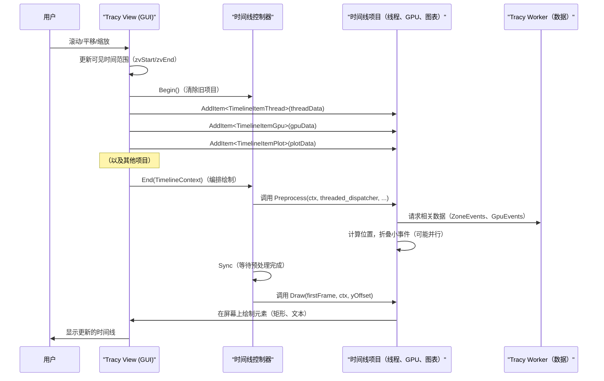
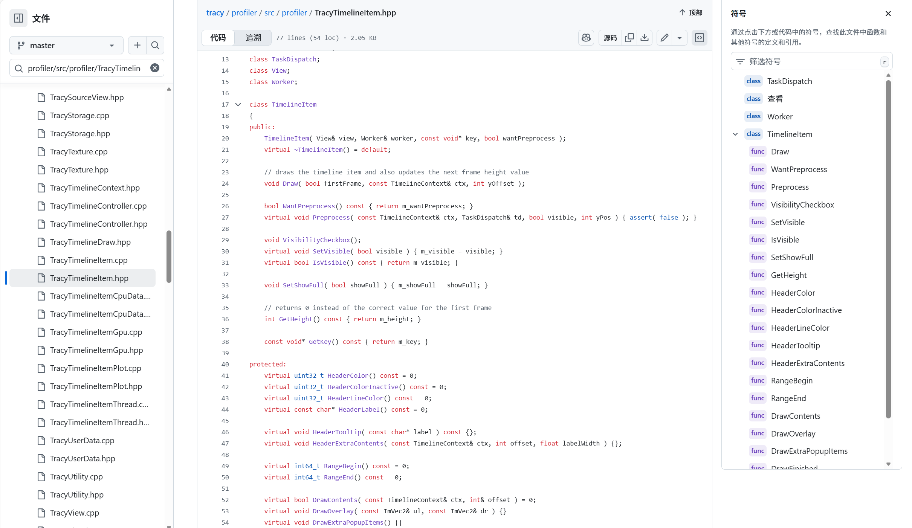

# 第 6 章：时间线控制器

欢迎回来

在[第 5 章：性能分析数据结构（ZoneEvent、GpuEvent 等）](05_profiling_data_structures__zoneevent__gpuevent__etc___.md)中，我们了解了 [Tracy Worker（服务器）](03_tracy_worker__server__.md)如何接收原始性能分析消息并将它们组织成整洁的结构化对象，如 `ZoneEvent` 和 `GpuEvent`。现在我们拥有了所有这些完美组织的数据，最大的问题是：[Tracy View（分析器 GUI）](01_tracy_view__profiler_gui__.md)实际上如何获取这些对象并将它们转换为我们在屏幕上看到的交互式、美观的时间线？

这就是**时间线控制器**发挥作用的地方

## 什么是时间线控制器？

想象一个拥有许多不同乐器的大型管弦乐队：小提琴、长笛、鼓等等。每种乐器都有自己的乐谱并演奏自己的部分。要演奏出美妙的音乐，我们需要一位**指挥**站在前面，引导每个声部，设定节奏，确保每个人都同步，并决定何时某些部分应该更响亮或更柔和。

Tracy 中的时间线控制器就像 GUI 中主时间线视图的指挥。它不是创建 `ZoneEvent` 数据的那个（那是 [Tracy 客户端](02_tracy_client__instrumentation__.md)和 [Tracy Worker](03_tracy_worker__server__.md)），也不是基本的绘图工具。相反，它的工作是**协调**所有不同类型的性能数据（CPU 区域、GPU 事件、图表、上下文切换）如何在屏幕上*准备*和*渲染*。它管理缩放、平移，并确保即使有数百万个事件，显示也保持流畅和响应。

**它解决的主要问题：** 在 GUI 的主时间线上高效且交互式地显示大量多样化的、基于时间的性能数据，同时处理用户交互，如缩放和平移。

## 我们的核心用例：交互式显示所有时间线事件

让我们想象一下，我们已经将一个大型 `.tracy` 文件加载到 [Tracy View](01_tracy_view__profiler_gui__.md) 中。这个文件包含数千个 CPU 区域、一些 GPU 事件、可能还有一些图表和上下文切换信息。我们想看到所有这些数据按时间顺序排列，放大到特定区域，并上下滚动以查看不同的线程。

本章将解释时间线控制器如何设法将所有这些整合在一起并在我们的屏幕上流畅地显示。

## 时间线控制器的关键概念

要理解我们的指挥，让我们看看它的核心职责：

### 1. 多样化数据类型的编排

时间线不仅仅是一种类型的事件。它结合了：
*   **CPU 区域：** 由 `ZoneScoped` 测量的代码块。
*   **GPU 事件：** 在显卡上运行的操作。
*   **图表：** 显示随时间变化的数值的折线图（例如，帧率、内存使用）。
*   **上下文切换：** CPU 在不同任务或线程之间切换的时刻。

时间线控制器确保所有这些不同的元素都绘制在正确的位置和层级上。

### 2. `TimelineContext`：指挥的指挥棒

在绘制任何内容之前，控制器需要知道性能的"规则"。这被捕获在一个 `TimelineContext` 对象中。它就像指挥的指挥棒，发出信号：

*   **可见时间范围：** 我们当前正在查看什么时间段（`vStart`、`vEnd`）？
*   **缩放级别（`pxns`）：** 多少屏幕像素代表一纳秒的时间？（当我们缩放时这会改变）。
*   **屏幕区域：** 时间线在屏幕上的位置在哪里，它的宽度（`w`）是多少？
*   **悬停状态：** 鼠标当前是否悬停在时间线上？

这个上下文被传递给所有单独的绘图组件，以便它们知道如何正确渲染自己。

### 3. `TimelineItem`：管弦乐队的各个声部

时间线由许多"行"或"轨道"组成。这些轨道中的每一个都由一个 `TimelineItem` 对象表示。这些是抽象基类，针对不同的数据有专门的版本：

*   **`TimelineItemThread`：** 表示单个 CPU 线程并保存其所有 `ZoneEvent`。
*   **`TimelineItemGpu`：** 表示 GPU 上下文及其 `GpuEvent`。
*   **`TimelineItemPlot`：** 表示绘制折线图的图表。
*   **`TimelineItemCpuData`：** 显示 CPU 核心使用情况和上下文切换数据。

时间线控制器管理这些 `TimelineItem` 的列表，告诉每一个*何时*准备其数据（`Preprocess`）以及*何时*绘制自己（`Draw`）。

### 4. 使用线程渲染的高效预处理

每帧在屏幕上完美绘制数百万个小事件可能会很慢。为了保持 GUI 的响应性，时间线控制器对 `TimelineItem` 使用了一种巧妙的两步方法：

1.  **`Preprocess`：** 每个 `TimelineItem` 首先"预处理"其数据。这涉及计算，如确定哪些事件可见，将非常小的事件组合（或"折叠"）成单个条形，以及计算项目所需的高度。至关重要的是，许多这些 `Preprocess` 步骤可以使用任务调度器（`m_td`）在单独的线程上**并行**进行，使其非常快速。
2.  **`Draw`：** 在所有预处理完成并同步后，主 GUI 线程然后快速遍历预处理的数据并将所有内容绘制到屏幕上。这种分离防止主 GUI 线程被繁重的计算所拖累。

### 5. 缩放和平移：响应式交互

时间线控制器与主 [Tracy View](01_tracy_view__profiler_gui__.md) 密切合作以处理用户输入：

*   **缩放：** 当我们滚动鼠标滚轮时，可见时间范围（`vStart`、`vEnd`）会改变，这反过来会更新 `pxns`。然后控制器告诉所有 `TimelineItem` 以新的比例重新绘制。
*   **平移：** 当我们拖动鼠标时，可见时间范围会移动（`vStart` 和 `vEnd` 都以相同的量改变），导致时间线水平滚动。

## 解决用例：时间线控制器如何显示事件

让我们追踪时间线控制器如何设法显示所有我们的性能分析事件：

1.  **初始化：** 当创建 [Tracy View](01_tracy_view__profiler_gui__.md) 时，它初始化 `TimelineController`（`m_tc`）并让它访问 `View` 本身和 `Worker`（它保存所有原始的 `ZoneEvent`、`GpuEvent` 等）。

    ```cpp
    // 来自：profiler/src/profiler/TracyView.cpp（简化的构造函数）
    View::View(...)
        : m_worker( f ) // 初始化 Tracy Worker
        , m_tc( *this, m_worker, s_config.threadedRendering ) // 初始化时间线控制器
    {
        // ...
    }
    ```
    这设置了指挥（`m_tc`）并让它访问管弦乐队（`View`）和乐谱（`Worker` 的数据）。

2.  **开始绘制周期：** 在每一帧中，都会调用 `View::DrawTimeline()` 函数。它首先调用 `m_tc.Begin()` 来清除任何先前的绘图指令。

    ```cpp
    // 来自：profiler/src/profiler/TracyView_Timeline.cpp（简化）
    void View::DrawTimeline()
    {
        // ...（处理鼠标和键盘输入以进行缩放/平移）...

        m_tc.Begin(); // 为时间线开始新的绘制周期
        // ...（直接绘制帧头，在 tc 控制之外）...
    ```

3.  **收集时间线项目：** 然后 `View::DrawTimeline()` 将所有必要的 `TimelineItem` 添加到控制器。这些是管弦乐队的"声部"：

    ```cpp
    // 来自：profiler/src/profiler/TracyView_Timeline.cpp（简化）
    // ...
    if( m_vd.drawGpuZones )
    {
        for( auto& v : m_worker.GetGpuData() )
        {
            m_tc.AddItem<TimelineItemGpu>( v ); // 添加 GPU 轨道
        }
    }
    if( m_vd.drawCpuData && m_worker.HasContextSwitches() )
    {
        m_tc.AddItem<TimelineItemCpuData>( &uptr ); // 添加 CPU 核心数据轨道
    }
    if( m_vd.drawZones )
    {
        // 将每个 CPU 线程添加为时间线项目
        for( const auto& v : m_threadOrder )
        {
            m_tc.AddItem<TimelineItemThread>( v );
        }
    }
    if( m_vd.drawPlots )
    {
        for( const auto& v : m_worker.GetPlots() )
        {
            m_tc.AddItem<TimelineItemPlot>( v ); // 添加图表轨道
        }
    }
    ```
    在这里，`AddItem` 告诉 `TimelineController`"我想显示这个线程"、"我想显示这个 GPU 上下文"等等。`TimelineController` 保留这些项目的列表。

4.  **指挥发号施令（`TimelineController::End`）：** 最后，`View::DrawTimeline()` 调用 `m_tc.End()`，传递给它关键的 `TimelineContext`（缩放级别 `pxns`、屏幕位置 `wpos` 等）。这就是编排发生的地方。

    ```cpp
    // 来自：profiler/src/profiler/TracyView_Timeline.cpp（简化）
    // ...
    // 计算显示参数（pxns、可见 Y 范围）
    const auto yMin = ImGui::GetCursorScreenPos().y;
    const auto yMax = linepos.y + lineh;
    const auto vcenter = verticallyCenterTimeline && drawMouseLine && m_viewMode == ViewMode::Paused;
    
    // 核心编排调用
    m_tc.End( pxns, wpos, hover, vcenter, yMin, yMax );
    ```
    这个 `End` 调用在 `TimelineController` 内部触发以下步骤：
    *   **预处理循环：** 控制器遍历其所有 `TimelineItem`，对于每个可见的项目，调用其 `Preprocess()` 方法。这是后台线程（`m_td`）可以加速计算的地方。
    *   **同步：** 它等待所有后台预处理任务完成（`m_td.Sync()`）。
    *   **绘制循环：** 然后它*再次*遍历 `TimelineItem`，在主线程上调用它们的 `Draw()` 方法。这确保了快速渲染，因为所有繁重的计算都已经完成。
    *   **滚动管理：** 它根据用户交互或内部逻辑计算并设置垂直滚动位置。

通过遵循这些步骤，时间线控制器确保所有事件都被高效地准备和绘制，以创建交互式时间线体验。

## 底层原理：时间线控制器如何工作

让我们看看简化的流程：



### 代码

#### 1. `TimelineController` 的 `Begin()` 和 `End()`

`TimelineController` 本身（`profiler/src/profiler/TracyTimelineController.cpp`）管理整体流程。

```cpp
// --- 来自：profiler/src/profiler/TracyTimelineController.cpp ---
TimelineController::TimelineController( View& view, Worker& worker, bool threading )
    : m_view( view )
    , m_worker( worker )
    , m_td( threading ? /*num_threads*/ : 0, "Render" ) // 用于并行预处理的任务调度器
{
    // ...
}

void TimelineController::Begin()
{
    m_items.clear(); // 为新帧清除 TimelineItems 列表
}

void TimelineController::End( double pxns, const ImVec2& wpos, bool hover, bool vcenter, float yMin, float yMax )
{
    // 1. 创建 TimelineContext（绘制的"规则"）
    TimelineContext ctx;
    ctx.pxns = pxns;
    // ...（填充其他上下文参数，如 vStart、vEnd、wpos、hover）...

    // 2. 预处理可见项目（可能并行）
    int yOffset = 0;
    for( auto& item : m_items )
    {
        if( item->WantPreprocess() && item->IsVisible() )
        {
            item->Preprocess( ctx, m_td, /*visible_on_screen*/, /*y_position*/ );
        }
        yOffset += m_firstFrame ? 0 : item->GetHeight(); // 累积高度
    }
    m_td.Sync(); // 等待所有并行预处理完成！

    // 3. 绘制所有项目（在主线程上）
    yOffset = 0;
    for( auto& item : m_items )
    {
        item->Draw( m_firstFrame, ctx, yOffset );
        yOffset += item->GetHeight(); // 为下一个项目更新当前 Y 偏移
    }

    // 4. 处理垂直滚动和居中
    if( const auto scrollY = CalculateScrollPosition() )
    {
        ImGui::SetScrollY( *scrollY );
    }
    // ...（更新滚动条的总高度）...
}
```
这个简化的 `End` 函数显示了关键步骤：创建 `TimelineContext`，==循环遍历所有 `TimelineItem` 以 `Preprocess` 它们（使用 `m_td` 任务调度器实现并行性==），同步，然后再次循环以 `Draw` 它们。最后，它调整 ImGui 滚动条。

#### 2. 抽象的 `TimelineItem`



==每种特定类型的时间线数据（线程、GPU、图表）都派生自 `TimelineItem`==（`profiler/src/profiler/TracyTimelineItem.hpp`）：

```cpp
// --- 来自：profiler/src/profiler/TracyTimelineItem.hpp ---
class TimelineItem
{
public:
    TimelineItem( View& view, Worker& worker, const void* key, bool wantPreprocess );

    // 在预处理阶段由 TimelineController::End 调用
    virtual void Preprocess( const TimelineContext& ctx, struct TaskDispatch& td, bool visible, float yPos ) = 0;

    // 在绘制阶段由 TimelineController::End 调用
    virtual void Draw( bool firstFrame, const TimelineContext& ctx, int yOffset );

    // ...（其他用于可见性、高度等的辅助函数）...

protected:
    // 辅助函数，用于调整项目的动画高度
    void AdjustThreadHeight( bool firstFrame, int yBegin, int yEnd );
    // ...
};
```
> ==`Preprocess` 方法是纯虚拟的，这意味着每个特定的 `TimelineItem`（如 `TimelineItemThread`）*必须*提供自己的实现==，说明如何准备其数据。`Draw` 方法更通用，但也可以被覆盖。

#### 3. 绘制区域（示例：`DrawZoneList`）

在绘制过程的深处，在特定的 `TimelineItem` 内（如 `TimelineItemThread` 调用 `View::DrawZoneList`），最终渲染单个性能分析事件。

```cpp
// --- 来自：profiler/src/profiler/TracyView_ZoneTimeline.cpp（简化）---
void View::DrawZoneList( const TimelineContext& ctx, const std::vector<TimelineDraw>& drawList, int _offset, uint64_t tid, int maxDepth, double margin )
{
    auto draw = ImGui::GetWindowDrawList(); // ImGui 绘图列表
    const auto wpos = ctx.wpos; // 窗口屏幕位置
    const auto pxns = ctx.pxns; // 每纳秒像素数（缩放级别）
    const auto ty = ctx.ty;     // 文本行高

    for( auto& v : drawList ) // 遍历预处理的绘图指令
    {
        if( v.type == TimelineDrawType::Zone ) // 如果是单个 CPU 区域
        {
            auto& ev = *(const ZoneEvent*)v.ev.get(); // 获取 ZoneEvent 数据
            const auto end = m_worker.GetZoneEnd( ev ); // 获取其结束时间

            // 计算区域条的屏幕坐标
            const auto pr0 = ( ev.Start() - ctx.vStart ) * pxns;
            const auto pr1 = ( end - ctx.vStart ) * pxns;
            const auto offset = _offset + ty * v.depth; // 基于其深度的 Y 位置

            // 为区域条绘制填充的矩形
            draw->AddRectFilled( wpos + ImVec2( pr0, offset ), wpos + ImVec2( pr1, offset + ty ), GetZoneColor(ev) );

            // 获取区域名称并计算其大小
            const char* zoneName = m_worker.GetZoneName( ev );
            auto tsz = ImGui::CalcTextSize( zoneName );

            // 绘制区域文本，可能被缩短或裁剪
            // 简化：DrawZoneText( color, zoneName, tsz, pr0, pr1, px0, px1, offset );
        }
        // ...（处理 TimelineDrawType::Folded 用于折叠区域等）...
    }
}
```
这显示了最后一步：使用 `TimelineContext` 和预先计算的 `TimelineDraw` 指令，使用 ImGui 的绘图功能在屏幕上绘制矩形和文本。这是原始 `ZoneEvent` 数据最终成为时间线上可见条形的地方

## 结论

我们现在已经探索了**时间线控制器**，这是在 Tracy 的 GUI 中编排复杂时间线视图的无名英雄

我们了解到它像指挥一样，管理多样化的数据类型，使用 `TimelineContext` 作为绘制规则，组织 `TimelineItem`，利用线程化的 `Preprocess` 提高效率，并与 [Tracy View](01_tracy_view__profiler_gui__.md) 协调以进行缩放和平移。这种复杂的舞蹈确保数百万个性能分析事件可以交互式且流畅地可视化。

时间线显示了大量信息，包括区域的调用栈。但是 Tracy 如何知道正在调用哪些函数，特别是在处理发布版本或剥离的可执行文件时？在[下一章](07_callstack_resolution__.md)中，我们将==研究**调用栈解析**，以了解 Tracy 如何理解这些代码执行路径==。

[下一章：调用栈解析](07_callstack_resolution__.md)

