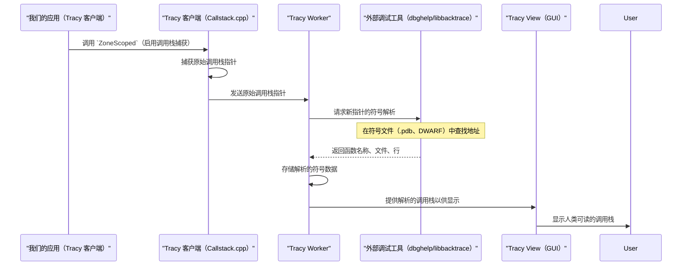

# 第 7 章：调用栈解析

欢迎回来~

在[第 6 章：时间线控制器](06_timeline_controller_.md)中，我们了解了 Tracy 的 GUI 如何高效地组织和显示交互式时间线上的所有性能分析事件。当我们在时间线中点击一个 `ZoneEvent` 时，我们不仅看到它的持续时间；我们通常还会看到该区域运行时活动的函数列表——这被称为**调用栈**。

但是 Tracy 如何知道这些函数的名称、它们所在的文件以及确切的行号呢？毕竟，我们计算机的内存只保存原始的数字地址。

这就是**调用栈解析**发挥作用的地方

## 什么是调用栈解析？

想象一下，我们是一名侦探，正在查看犯罪现场。我们发现了一系列看似随机的数字（原始内存地址）。如果我们能==将这些数字翻译成有意义的线索==，比如"嫌疑人在 `Main.cpp` 的第 123 行，然后在 `Graphics.cpp` 的第 45 行调用了 `RenderScene()`，接着在 `Mesh.cpp` 的第 78 行调用了 `DrawMesh()`"，那将非常有帮助

调用栈解析是 Tracy 内置的侦探系统。它的工作是：

1.  **翻译原始地址：** 获取从应用程序调用栈中捕获的原始内存地址。
2.  **转换为人类可读的信息：** 将这些地址转换为实际的函数名称、源代码文件的名称（`.cpp`、`.h`）以及这些文件中的精确行号。

**它解决的主要问题：** 通过向我们展示性能事件或采样在源代码中*确切发生的位置*，使复杂的性能数据变得可操作，即使在优化的发布版本中也是如此。如果没有解析，我们只会看到一列神秘的内存地址，这并不是很有用

## 我们的核心用例：查看函数的调用栈

假设我们使用 `ZoneScoped`（来自[第 2 章：Tracy 客户端（插桩）](02_tracy_client__instrumentation__.md)）对函数 `calculate_player_path()` 进行了插桩，并且我们已经配置 Tracy 在该区域运行时捕获调用栈。

当我们在 [Tracy View（分析器 GUI）](01_tracy_view__profiler_gui__.md)中查看这个 `ZoneEvent` 时，我们希望看到一个清晰的列表，如：

```
0. MyGame::calculate_player_path() (Player.cpp:120)
1. MyGame::UpdateGameLogic() (Game.cpp:500)
2. main() (Main.cpp:15)
```

本章将指导我们理解 Tracy 如何获取此调用栈的原始地址并将它们转换为这些有意义的条目

## 调用栈解析

要执行这项侦探工作，Tracy 依赖于几个关键概念：

### 1. 原始调用栈指针

当 Tracy 捕获调用栈时，它本质上记录了一系列内存地址。每个地址指向当时活动的函数内的一条指令。

*   **类比：** 这些就像没有地图的 GPS 坐标——只是数字。

### 2. 符号信息（符号文件）

要翻译这些地址，Tracy 需要一个"地图"，将内存地址链接到人类可读的名称。这个地图包含在**符号文件**中。

*   **Windows：** `.pdb` 文件（程序数据库文件）。
*   **Linux/macOS：** DWARF 调试信息（通常直接嵌入在可执行文件中或在单独的 `.debug` 文件中）。

这些文件包含由编译器和链接器生成的信息。它们对于调试和性能分析至关重要，因为它们在机器代码和源代码之间架起了桥梁。

### 3. 外部调试工具

Tracy 不会重新实现读取符号文件的复杂逻辑。相反，它将此任务委托给强大的、特定于平台的调试库：

*   **Windows：** `dbghelp.dll`（调试帮助库）。这个库是操作系统的一部分，被 Visual Studio 等调试器使用。
*   **Linux/macOS：** `libbacktrace`。这是一个可以集成到应用程序中以解析调用栈的库。它通常依赖于底层系统设施，如 `dladdr` 和读取 DWARF 信息

> 这些工具知道如何解析符号文件，查找地址，并返回函数名称、文件和行号。

### 4. 实时与离线解析

Tracy 支持两种主要方式来解析调用栈：

*   **实时解析：** 当应用程序实时连接到 [Tracy Worker](03_tracy_worker__server__.md)（或 GUI）时，Worker 本身在*分析机器*（或运行客户端的机器，如果启用了远程解析）上使用外部调试工具来解析传入的地址。
*   **离线解析：** 有时，我们可能从没有符号文件或调试工具的机器上捕获了一个 `.tracy` 文件。在这种情况下，Tracy 允许我们*稍后*在*确实*可以访问可执行文件及其符号文件的机器上使用单独的实用程序（如 `tracy-update`）解析符号。此过程将解析的信息写回 `.tracy` 文件。

## 解决用例：Tracy 如何解析和显示调用栈

让我们追踪从 `calculate_player_path()` 函数开始的调用栈的旅程：

1.  **客户端捕获原始指针：** 当 `calculate_player_path()` 启动并配置为捕获调用栈（`TracyCZone(..., TRACY_CALLSTACK, ...)` 或 `ZoneScopedC(..., TRACY_CALLSTACK)`）时，[Tracy 客户端](02_tracy_client__instrumentation__.md)使用低级操作系统函数（例如，Windows 上的 `RtlWalkFrameChain`，Linux 上的 `backtrace`）来获取栈上活动函数的原始内存地址。这些原始地址被发送到 [Tracy Worker](03_tracy_worker__server__.md)。

2.  **Worker 请求解析（实时）：** [Tracy Worker](03_tracy_worker__server__.md) 接收这些原始地址。对于它以前没有见过的每个唯一地址，它会启动解析请求。

3.  **外部工具完成工作：**
    *   在 **Windows** 上，Worker 调用 `dbghelp.dll` 中的函数（如 `SymFromAddr` 和 `SymGetLineFromAddr64`）。它告诉 `dbghelp` 原始地址并请求函数名称、文件和行号。然后 `dbghelp` 在与可执行文件关联的 `.pdb` 文件中查找这些信息。
    *   在 **Linux/macOS** 上，Worker 使用 `libbacktrace` 函数（如 `backtrace_pcinfo`）来实现相同的目的。`libbacktrace` 查询可执行文件或单独的调试文件中的 DWARF 调试信息。

4.  **Worker 存储解析的数据：** 一旦外部工具返回人类可读的信息，[Tracy Worker](03_tracy_worker__server__.md) 就会在内部存储这个映射（原始地址 -> 函数名称、文件、行）。它不会再次请求解析相同的地址。

5.  **View 显示解析的调用栈：** 当我们在 [Tracy View](01_tracy_view__profiler_gui__.md) 中点击 `calculate_player_path()` 区域时，它从 [Tracy Worker](03_tracy_worker__server__.md) 请求该区域的调用栈。Worker 提供先前解析的、人类可读的条目，然后 View 在"调用栈"窗口中绘制它们。

## 底层原理：调用栈解析如何工作

这是一个简化的事件序列：



### 代码

调用栈解析涉及客户端和服务器端的组件，以及独立工具。

#### 1. 客户端调用栈捕获（`public/client/TracyCallstack.cpp`）

客户端（`TracyCallstack.cpp`）包含实际捕获原始内存地址的特定于平台的代码。负责此操作的主要函数通常隐藏在宏后面。此文件还包含 `DecodeCallstackPtr`，它*要么*由客户端本身使用（如果 `TRACY_SYMBOL_OFFLINE_RESOLVE` 关闭），*要么*由 `tracy-update` 用于离线解析。

让我们看看 `DecodeCallstackPtr` 的简化部分（使用 `dbghelp` 的 Windows 示例）：

```cpp
// --- 简化自 public/client/TracyCallstack.cpp（Windows）---
CallstackEntryData DecodeCallstackPtr( uint64_t ptr )
{
    // ... 设置 SYMBOL_INFO 和 IMAGEHLP_LINE64 结构 ...

    // 使用 SymFromAddr 获取函数名称
    SymFromAddr( GetCurrentProcess(), ptr, nullptr, si );
    // 使用 SymGetLineFromAddr64 获取文件和行号
    SymGetLineFromAddr64( GetCurrentProcess(), ptr, &displacement, &line );

    // 将解析的数据存储在 CallstackEntry 中
    cb_data[0].name = CopyStringFast( si->Name, si->NameLen );
    cb_data[0].file = CopyStringFast( line.FileName );
    cb_data[0].line = line.LineNumber;

    // ... 处理内联帧、模块名称等 ...
    return { cb_data, num_frames, moduleName };
}
```
这个片段展示了如何使用 `SymFromAddr` 来获取符号（函数名称），使用 `SymGetLineFromAddr64` 从原始 `ptr`（内存地址）获取源文件和行号。这是使用 Windows 的 `dbghelp.dll` 执行的核心翻译步骤。Linux/macOS 上的 `libbacktrace` 存在类似的逻辑。

#### 2. Worker 端数据管理（`profiler/src/profiler/TracyView_Callstack.cpp`）

[Tracy Worker](03_tracy_worker__server__.md) 从客户端接收原始调用栈 ID。然后它使用内部结构来存储解析的调用栈帧。然后 `View` 查询 `Worker` 以获取这些数据。

```cpp
// --- 简化自 profiler/src/profiler/TracyView_Callstack.cpp ---
// 此函数准备要在 GUI 的调用栈表中显示的数据
void View::DrawCallstackTable( uint32_t callstack, bool globalEntriesButton )
{
    // 从 worker 获取原始调用栈 ID
    auto& cs = m_worker.GetCallstack( callstack );

    int fidx = 0;
    for( auto& entry : cs ) // 遍历调用栈中的每一帧
    {
        // 从 worker 请求解析的帧数据
        auto frameData = m_worker.GetCallstackFrame( entry );
        if( !frameData )
        {
            // 如果未解析，显示原始指针
            ImGui::Text( "%p", (void*)m_worker.GetCanonicalPointer( entry ) );
        }
        else
        {
            // 如果已解析，提取并显示名称、文件、行、映像
            const auto& frame = frameData->data[0]; // 为简单起见，假设每个条目一帧
            auto functionName = m_worker.GetString( frame.name );
            auto fileName = m_worker.GetString( frame.file );
            uint32_t lineNumber = frame.line;

            // 在 ImGui 表中显示
            ImGui::TableNextRow();
            ImGui::TableNextColumn(); ImGui::Text( "%i", fidx++ );
            ImGui::TableNextColumn(); ImGui::TextUnformatted( functionName );
            ImGui::TableNextColumn(); ImGui::Text( "(%s:%u)", fileName, lineNumber );
            // ... （显示映像名称，处理内联等）...
        }
    }
}
```
在这个 `DrawCallstackTable` 函数中，`TracyView` 使用 `m_worker.GetCallstackFrame(entry)` 向 `m_worker`（[Tracy Worker](03_tracy_worker__server__.md) 实例）请求解析的 `CallstackFrame` 数据。worker 从其内部缓存（由 `dbghelp`/`libbacktrace` 调用填充）中检索这些数据。然后 GUI 获取这些人类可读的字符串和数字，并在表中显示它们。

#### 3. 离线符号解析（`update/src/OfflineSymbolResolver.h`）

对于离线解析，`tracy-update` 实用程序执行与 `DecodeCallstackPtr` 类似的角色，但是在保存的 `.tracy` 文件上。它从文件中读取原始地址，使用外部工具（如 `dbghelp` 或 Linux 上的 `addr2line`）解析它们，然后将解析的数据写回 `.tracy` 文件。

```cpp
// --- 简化自 update/src/OfflineSymbolResolver.h ---
// 用于保存单个解析符号条目的数据结构
struct SymbolEntry
{
    std::string name; // 函数名称
    std::string file; // 源文件路径
    int line = 0;     // 行号
};

// 为给定映像（可执行文件/DLL/SO）解析符号的函数
bool ResolveSymbols( const std::string& imagePath, // 可执行文件/DLL/SO 的路径
                     const FrameEntryList& inputEntryList, // 原始符号偏移列表
                     SymbolEntryList& resolvedEntries ); // 解析符号的输出列表

// 用解析的符号修补 Tracy Worker 数据的函数
void PatchSymbols( tracy::Worker& worker,
                   const std::vector<std::string>& pathSubstitutionsStrings,
                   bool verbose = false );
```
`ResolveSymbols` 函数（在 Windows 的 `OfflineSymbolResolverDbgHelper.cpp` 或 Linux 的 `OfflineSymbolResolverAddr2Line.cpp` 中实现）封装了对特定于平台的工具（`dbghelp` 或 `addr2line`）的调用，以从指定的 `imagePath` 解析地址。`PatchSymbols` 函数（未显示，但概念上类似）然后获取这些 `resolvedEntries` 并更新 `tracy::Worker` 的内部数据。

## 结论

我们现在已经理解了**调用栈解析**，这是将原始内存地址转换为 Tracy 中人类可读的函数名称、文件名和行号的关键系统。我们已经看到它如何像侦探一样，使用特定于平台的调试工具，如 `dbghelp`（Windows）或 `libbacktrace`（Linux/macOS）以及符号文件（`.pdb`、DWARF）来拼凑代码*在哪里*执行

这种能力对于精确定位性能瓶颈和理解应用程序中的执行流程至关重要。

接下来，我们将把焦点转移到应用程序性能的另一个关键方面：内存管理。在[下一章](08_memory_allocator__tracyalloc__.md)中，我们将研究**内存分配器（TracyAlloc）**，以了解 Tracy 如何跟踪和可视化应用程序的内存使用情况。

[下一章：内存分配器（TracyAlloc）](08_memory_allocator__tracyalloc__.md)

