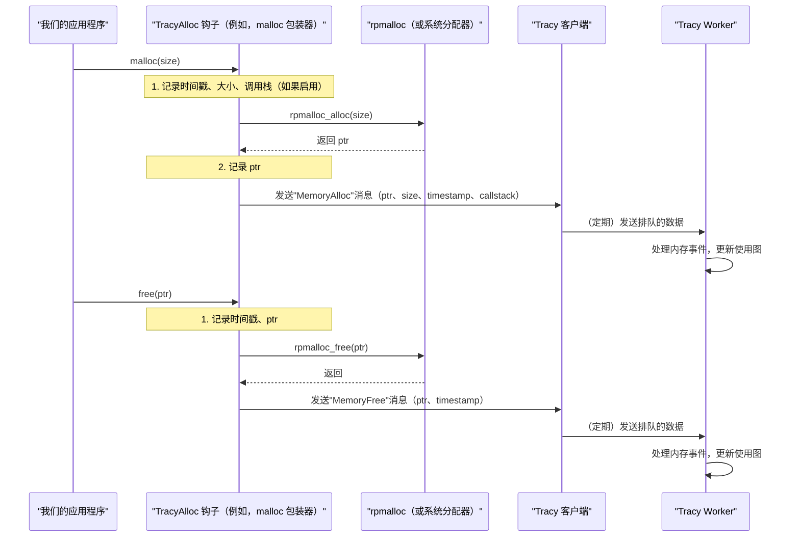

# 第 8 章：内存分配器（TracyAlloc）

欢迎回来

在[第 7 章：调用栈解析](07_callstack_resolution__.md)中，我们揭示了 Tracy 如何通过将神秘的内存地址转换为人类可读的函数名称和文件位置来理解代码执行路径

现在，我们将焦点转移到应用程序性能的另一个重要方面：内存管理。

就像理解*什么*代码在运行一样，了解应用程序*如何*以及*何时*分配和释放内存对于优化至关重要。这就是**内存分配器（TracyAlloc）**发挥作用的地方

## 什么是 TracyAlloc？

想象一下，我们的应用程序是一个繁忙的厨房，不断准备菜肴。每道菜都需要食材（内存）。如果厨房工作人员（我们的代码）不小心，他们可能会：
*   **浪费食材：** 分配超过需要的量。
*   **空间不足：** 不释放已使用的空间，导致"内存泄漏"。
*   **速度慢：** 花费太多时间从储藏室取食材。

`TracyAlloc` 就像一个专业的、超高效的储藏室管理员和应用程序的细致库存跟踪器。它有两个主要角色：

1.  **Tracy 自己的内存：** 它管理 Tracy *本身*在==将所有性能分析数据发送到 [Tracy Worker](03_tracy_worker__server__.md) 之前需要存储的内存==。这被设计为极其快速和安全，因此 Tracy 的操作不会减慢*我们的*应用程序。
2.  **应用程序内存跟踪：** 它==提供钩子来*监控==和记录**我们的应用程序*进行的所有内存分配和释放。这是分析我们的游戏或软件内存使用情况的关键部分。

**它解决的主要问题：** 最小化 Tracy 自己的内存开销，并提供对应用程序内存使用模式的详细、高性能视图，帮助我们识别泄漏、过度分配或低效的内存访问。

## 我们的核心用例：跟踪应用程序内存分配

假设我们的游戏频繁创建和销毁临时对象（例如，敌人 AI 寻路数据、粒子效果）。我们怀疑这些临时分配可能发生得太频繁或大量突发，导致性能卡顿或内存碎片。

本章将向我们展示如何==配置 `TracyAlloc` 来跟踪应用程序的内存分配==（`malloc`、`free`、`new`、`delete`）并在 [Tracy View（分析器 GUI）](01_tracy_view__profiler_gui__.md)中可视化它们

## TracyAlloc 

要理解这个专业内存管理器的工作原理，让我们分解其核心思想：

1.  **自定义分配器（用于 Tracy 的内部使用）：**
    *   Tracy 需要内存来存储 `ZoneEvent` 数据、`Callstack` 信息和其他性能分析消息。它不能依赖应用程序的标准 `malloc`/`free`，因为这可能会干扰性能分析，甚至在应用程序的分配器处于不良状态时（例如，在错误信号处理程序期间）崩溃。
    *   `TracyAlloc` 为 Tracy 的内部需求提供了一个专用的、健壮的内存池，确保性能分析本身始终是轻量级和安全的。

2.  **==包装第三方分配器==（`rpmalloc`）：**
    *   `TracyAlloc` 不是重新发明原始内存管理的轮子，而是经常包装高度优化的、生产就绪的第三方分配器。Tracy 经常为此目的使用 `rpmalloc`。
    *   `rpmalloc` 是一个无锁的、可扩展的内存分配器，以其在多线程环境中的出色性能而闻名。通过集成 `rpmalloc`，`TracyAlloc` 确保其*自己的*内存操作和*被跟踪应用程序的*分配（如果已钩住）都尽可能快。
        *   (rpmalloc之后有机会看看源码😋)
    
3.  **==应用程序内存钩住==：**
    *   为了让 `TracyAlloc` 跟踪*我们的应用程序的*内存，它"钩住"我们的标准内存分配函数。这意味着当我们的代码调用 `malloc`、`free`、`new` 或 `delete` 时，会调用 Tracy 的自定义版本。
    *   这些钩子执行两个操作：
        *   它们调用*实际的*底层内存分配器（如 `rpmalloc` 或系统的 `malloc`）。
        *   它们记录分配/释放事件（指针、大小、时间戳）并将其作为消息发送到 [Tracy Worker](03_tracy_worker__server__.md)。

4.  **信号处理程序安全：**
    *   `TracyAlloc` 自定义设计的一个关键方面是它在信号处理程序中的安全性（例如，当应用程序崩溃时）。标准 `malloc` 在这种上下文中调用可能不安全。`TracyAlloc` 被构建为可重入和安全的，允许它即使在关键故障期间也能收集最少的崩溃信息。

## 解决用例：跟踪应用程序内存

要为应用程序启用内存跟踪，我们通常在编译期间启用特定的 Tracy 宏或显式使用 Tracy 的分配函数。

### 示例：在 C/C++ 中显式跟踪分配

如果我们想手动跟踪特定的分配，我们可以使用 `TracyCAlloc` 和 `TracyCFree`。然而，更常见的是，Tracy 被配置为自动钩住我们的标准 `malloc`/`free`（以及 `new`/`delete`）。

```cpp
#include <stdio.h>
#include <vector>
#include <chrono>
#include <thread>

#include "tracy/TracyC.h" // 用于 C 风格插桩
#include "tracy/TracyAlloc.hpp" // 用于显式 TracyAlloc 调用

void generate_temporary_data() {
    TracyCZone(tempDataZone, 1); // 区域，用于查看何时发生

    size_t size = 1024 * 64; // 分配 64KB
    void* ptr = tracy_malloc(size); // 使用 Tracy 的分配器分配内存
    // （或者如果启用了钩子，这将是常规的 'malloc'）

    // 模拟对已分配内存的一些工作
    std::this_thread::sleep_for(std::chrono::milliseconds(10));

    tracy_free(ptr); // 释放内存
    // （或者如果启用了钩子，这将是常规的 'free'）

    TracyCZoneEnd(tempDataZone);
}

int main() {
    TracyCSetThreadName("Main Thread with Memory");
    printf("Starting memory profiling example...\n");

    for (int i = 0; i < 5; ++i) {
        generate_temporary_data();
        std::this_thread::sleep_for(std::chrono::milliseconds(50));
    }

    printf("Memory profiling example finished.\n");
    return 0;
}
```

**解释：**

*   `tracy_malloc(size)`：此函数执行 `TracyAlloc` 将专门跟踪的分配。
*   `tracy_free(ptr)`：此函数执行 `TracyAlloc` 将跟踪的释放。

当我们运行这个插桩的应用程序（启用 Tracy 客户端）并在 [Tracy View（分析器 GUI）](01_tracy_view__profiler_gui__.md)中打开它时，我们将看到：
*   **内存图：** 一个折线图，显示应用程序随时间变化的总内存使用情况，峰值和谷值对应于我们的 `generate_temporary_data` 调用。
*   **分配表：** 关于每个分配的详细统计信息（大小、计数、发生的调用栈，如果启用）。
*   **时间线注释：** 时间线上每个 `malloc`/`free` 事件的小标记，通常链接到 `generate_temporary_data` 区域。

**自动钩住：** 更常见的是，对于 C/C++ 应用程序，Tracy 提供 `TRACY_ENABLE_MEMORY_PROFILING`（或类似的构建标志），在编译期间自动用 Tracy 的跟踪版本替换系统的 `malloc`/`free`。这意味着我们不需要在任何地方将 `malloc` 更改为 `tracy_malloc`！

## 底层原理：TracyAlloc 如何工作（用于应用程序内存跟踪）

让我们看看当应用程序发出内存分配请求并且 Tracy 跟踪它时的简化流程。

### 高级流程（应用程序内存跟踪）

1.  **应用程序调用：** 我们的代码调用标准分配函数（例如，`malloc(size)`）。
2.  **Tracy 钩子拦截：** 因为启用了 Tracy 的内存性能分析，==此调用被 Tracy 的自定义 `malloc` 钩子拦截==。
3.  **记录事件：** 钩子立即记录 `size` 和高分辨率 `timestamp`。如果配置了，它还可能捕获 `Callstack`。
4.  **实际分配：** 然后==钩子将请求转发==到底层的、高度优化的分配器（例如，`rpmalloc_alloc(size)` 或原始系统 `malloc`）。
5.  **获取指针：** 底层分配器返回指向==新分配内存==的指针 `ptr`。
6.  **记录指针并发送消息：** 钩子记录 `ptr` 以及时间戳和大小。然后它将此信息打包到"内存分配"消息中，==并将其添加到 [Tracy 客户端](02_tracy_client__instrumentation__.md)的内部消息队列中==。
7.  **释放（类似流程）：** 当调用 `free(ptr)` 时，Tracy 的 `free` 钩子记录 `ptr` 和时间戳，调用底层的 `rpmalloc_free(ptr)`，并发送"内存释放"消息。
8.  **Worker 处理：** [Tracy Worker](03_tracy_worker__server__.md) 接收这些消息并使用它们构建其内部内存使用图和分配表。



### 代码

提供的 `public/client/TracyAlloc.cpp` 代码片段专门处理为 Tracy *自己的内部内存管理*设置 `rpmalloc`。

#### 1. 为 Tracy 的内部使用初始化 `rpmalloc`

`InitRpmallocPlumbing` 函数是 Tracy 如何设置其自己的快速内存分配器（`rpmalloc`）的关键部分。这确保了 Tracy 的内部操作得到高度优化。

```cpp
// --- 文件：public/client/TracyAlloc.cpp（简化）---
#include "../common/TracyAlloc.hpp"
#ifdef TRACY_USE_RPMALLOC
#include <atomic>
#include "../common/TracyYield.hpp" // 用于 YieldThread()

namespace tracy
{
// ...（RpThreadInitDone、RpInitDone、RpInitLock 的声明）...

tracy_no_inline static void InitRpmallocPlumbing()
{
    // 检查 rpmalloc 是否已全局初始化
    if( !RpInitDone.load( std::memory_order_acquire ) )
    {
        // 使用锁确保只有一个线程执行全局初始化
        // 而其他线程等待。
        // 这确保 rpmalloc_initialize() 只被调用一次。
        // ...（使用 RpInitLock 的锁定机制）...
        if( !RpInitDone.load( std::memory_order_acquire ) )
        {
            rpmalloc_initialize(); // 全局初始化 rpmalloc
            RpInitDone.store( 1, std::memory_order_release );
        }
        // ...（解锁机制）...
    }
    rpmalloc_thread_initialize(); // 为当前线程初始化 rpmalloc
    RpThreadInitDone = true;     // 标记此线程的 rpmalloc 已初始化
}

TRACY_API void InitRpmalloc()
{
    if( !RpThreadInitDone ) InitRpmallocPlumbing(); // 如果此线程未初始化则调用
}

} // namespace tracy
#endif // TRACY_USE_RPMALLOC
```
这段代码确保 `rpmalloc` 全局初始化一次（`rpmalloc_initialize()`），然后每个线程初始化一次（`rpmalloc_thread_initialize()`），以优化该特定线程的内存访问。这是 Tracy 自己高效内存使用的基础。

#### 2. 🎢应用程序内存钩住如何工作

实际钩住应用程序的 `malloc`/`free`/`new`/`delete` 通常通过==构建系统魔法（例如，链接器标志、预处理器宏）完成==，用 Tracy 的版本替换标准库函数。这些钩子本身的代码看起来类似于这个概念性示例：

```cpp
// --- 概念性：Tracy 如何钩住 malloc ---
// 这不是实际的 Tracy 源代码，但演示了概念
extern "C" void* __real_malloc(size_t); // 指向原始 malloc 的指针
extern "C" void __real_free(void*);     // 指向原始 free 的指针

extern "C" void* malloc(size_t size) {
    void* ptr = __real_malloc(size); // 调用原始 malloc
    if (ptr) {
        // 在这里，Tracy 的客户端代码将记录分配：
        // ___tracy_emit_alloc(ptr, size, TRACY_CALLSTACK);
    }
    return ptr;
}

extern "C" void free(void* ptr) {
    if (ptr) {
        // 在这里，Tracy 的客户端代码将记录释放：
        // ___tracy_emit_free(ptr, TRACY_CALLSTACK);
    }
    __real_free(ptr); // 调用原始 free
}
```
实际上，Tracy 使用更复杂的技术（如 Linux 上的 `ld --wrap` 或 C++ 中的自定义 `new`/`delete` 覆盖）来实现这种钩住。

- `___tracy_emit_alloc` 和 `___tracy_emit_free` 函数（类似于我们在[第 2 章：Tracy 客户端（插桩）](02_tracy_client__instrumentation__.md)中看到的区域函数）然后负责将这些事件打包成消息并发送到 [Tracy Worker](03_tracy_worker__server__.md)。

- 然后 [Tracy Worker](03_tracy_worker__server__.md) 收集这些 `MemoryAlloc` 和 `MemoryFree` 消息，并结合其他数据结构（如[第 5 章：性能分析数据结构（ZoneEvent、GpuEvent 等）](05_profiling_data_structures__zoneevent__gpuevent__etc___.md)中提到的那些），构建在 [Tracy View（分析器 GUI）](01_tracy_view__profiler_gui__.md)中显示的交互式内存图和表。

理解

| 概念                | 解释                                       |
| ------------------- | ------------------------------------------ |
| **`__real_malloc`** | 系统原装的 malloc（真货）                  |
| **`malloc`**        | Tracy 假扮的 malloc（假货，但会调用真货）  |
| **拦截**            | 你以为调用系统 malloc，实际调用了 Tracy 的 |
| **记录**            | Tracy 偷偷记下所有内存操作                 |
| **透明**            | 你的程序完全感觉不到 Tracy 的存在          |

## 结论

我们现在已经成功地浏览了**内存分配器（TracyAlloc）**的世界

我们了解了它如何作为 Tracy 本身的高性能、安全的内存管理器（通常利用 `rpmalloc`），以及至关重要的是，它如何钩住应用程序的内存分配调用，以提供对软件内存使用模式的详细跟踪。

这个强大的功能对于调试内存泄漏、优化内存占用以及理解被分析应用程序的动态内存行为至关重要。

这结束了我们对 Tracy 分析器核心组件的探索之旅。我们探索了从图形界面到使 Tracy 成为性能分析强大工具的低级通信协议和数据结构的所有内容。

END *★,°*:.☆(￣▽￣)/.°★* 。