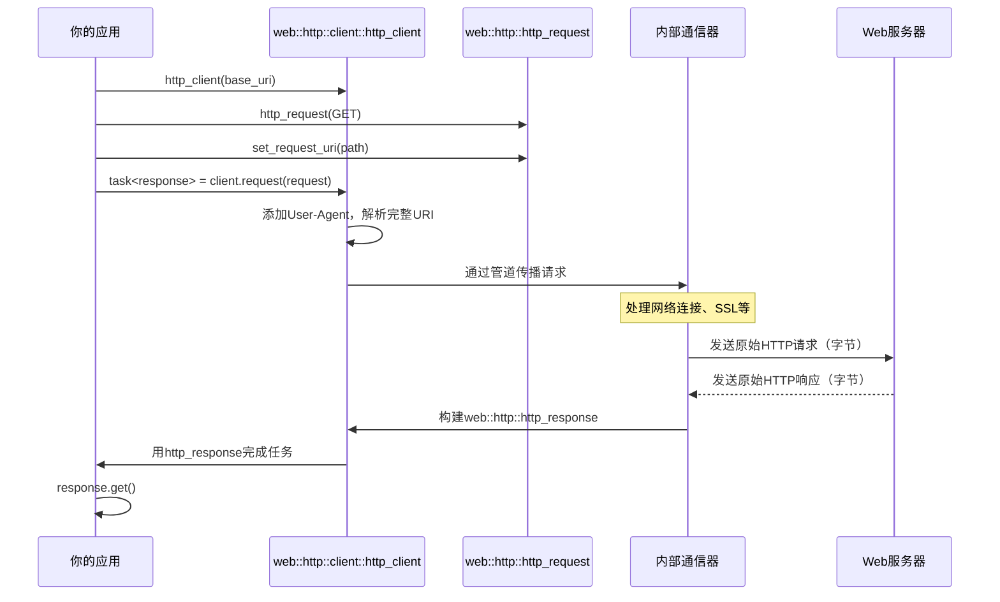

# 第3章：HTTP客户端（`http_client`）

欢迎回来

在[第2章：HTTP消息（`http_request`，`http_response`，`http_headers`）](02_http_messages___http_request____http_response____http_headers___.md)中，构建了`http_request`对象（我们的消息）和理解`http_response`对象（回复）。

我们知道如何指定目标URI、操作（GET、POST）、在头部添加特殊指令以及在正文中包含数据。

但知道如何写信并不意味着能把它送到全国各地，需要一个信使服务。在`cpprestsdk`中，你的程序在互联网上的信使服务是`web::http::client::http_client`类。本章将介绍这个关键组件，展示如何实际==发送构建的HTTP请求并从Web服务器接收响应==。

## 问题：通过网络发送和接收消息

假设已经构建了一个完美的`http_request`来获取伦敦的天气预报：`GET https://api.weather.com/forecast?city=London`。你有URI、方法和获取数据的愿望。但这个请求如何从你的C++程序实际传输到`api.weather.com`服务器，服务器的回复又如何返回到你的应用程序？

手动处理网络套接字、连接重试、超时和数据流是一项复杂且容易出错的任务。你需要：
1. **==解析服务器地址==**：将`api.weather.com`转换为IP地址。
2. **建立连接**：打开到该IP地址和端口（HTTP为80，HTTPS为443）的TCP/IP连接。
3. **发送原始字节**：将你的`http_request`对象转换为字节流并通过连接发送。
4. **监听回复**：等待服务器发送其响应字节。
5. **解析原始字节**：从传入的字节流中重建`http_response`对象。
6. **处理错误**：如果服务器宕机怎么办？如果连接中断怎么办？如果耗时过长怎么办？

`http_client`类解决了所有这些麻烦。它==提供了一个高级、易用的接口来执行HTTP通信，让你专注于消息内容而不是网络协议的底层细节==。

## 介绍`http_client`：网络信使服务

`web::http::client::http_client`是发送HTTP请求的核心类。创建一个`http_client`对象，通常配置一个**基础URI**（通过该客户端发送的所有请求的共同起始地址）。

然后使用它的`request()`方法发送`http_request`对象。

以下是其关键组件的分解：

1. **构造函数（`http_client(uri base_uri, ...)`）**：通过提供你想与之通信的Web服务的基础地址来创建`http_client`。这通常是协议（http/https）和域名（例如`https://api.weather.com`）。
2. **`request()`方法**：这是核心方法。你传递给它一个`http_request`对象，它返回一个`pplx::task<http_response>`。这个`pplx::task`是一个特殊的`cpprestsdk`对象，表示一个将*异步*完成的操作（意味着你的程序可以在等待时做其他事情）。我们将在[第4章：PPLX任务（异步编程模型）](04_pplx_tasks__asynchronous_programming_model__.md)中详细介绍`pplx::task`，但现在我们将使用简单的`.get()`调用来等待结果。
3. **`http_client_config`（可选）**：这个类允许你自定义`http_client`的各种设置，如超时、代理设置和证书验证。

让我们深入探讨如何发送请求

## 使用`http_client`发送第一个Web请求

我们将使用我们的天气预报示例。我们的目标是从`https://api.weather.com/forecast?city=London&days=3`获取数据。

```cpp
#include "cpprest/http_client.h" // 用于http_client和http_client_config
#include "cpprest/uri.h"         // 用于第1章的uri
#include "cpprest/http_msg.h"    // 用于第2章的http_request, http_response
#include <iostream>

int main() {
    // 1. 定义天气API的基础URI
    // 这是地址的共同部分。
    web::uri base_api_uri(U("https://api.weather.com"));

    // 2. 创建一个http_client对象
    // 它被配置为与'https://api.weather.com'通信
    web::http::client::http_client client(base_api_uri);

    // 3. 定义我们特定预报的相对路径和查询
    // 这部分附加到基础URI上。
    web::uri_builder uri_path_builder(U("/forecast"));
    uri_path_builder.append_query(U("city"), U("London"));
    uri_path_builder.append_query(U("days"), 3);

    // 4. 创建一个http_request对象（如第2章所学）
    web::http::http_request request(web::http::methods::GET);
    request.set_request_uri(uri_path_builder.to_uri()); // 设置完整的相对URI

    std::wcout << L"发送请求到: " << client.base_uri().to_string() 
               << request.relative_uri().to_string() << std::endl;

    // 5. 发送请求并等待响应
    // client.request()返回一个'pplx::task'。.get()等待其完成。
    pplx::task<web::http::http_response> response_task = client.request(request);
    
    // 为了演示，我们将阻塞并等待响应
    // （更多关于任务的异步编程在第4章！）
    web::http::http_response response = response_task.get();

    // 6. 处理响应（如第2章所学）
    std::wcout << L"收到响应，状态码: " 
               << response.status_code() << std::endl;

    // 检查请求是否成功（HTTP 200 OK）
    if (response.status_code() == web::http::status_codes::OK) {
        // 将响应的正文提取为字符串
        utility::string_t body = response.extract_string().get();
        std::wcout << L"响应正文:\n" << body << std::endl;
    } else {
        std::wcout << L"请求失败，错误: " << response.reason_phrase() << std::endl;
    }

    return 0;
}
```

**运行这段代码会发生什么？**
如果`api.weather.com`是一个真实可访问的API，返回伦敦3天预报的JSON，你可能会看到如下输出（实际输出取决于真实API）：

```
发送请求到: https://api.weather.com/forecast?city=London&days=3
收到响应，状态码: 200
响应正文:
{"city":"London","forecast":[{"day":"Today","temp":"15C","conditions":"Cloudy"}, {"day":"Tomorrow","temp":"18C","conditions":"Sunny"}]}
```

这个简单示例展示了整个流程：
1. 我们定义了目标Web服务的`base_uri`。
2. 我们创建了一个`http_client`来与该服务通信。
3. 我们构建了预报请求的特定`uri`。
4. 我们创建了一个`http_request`对象，设置其方法和目标URI。
5. 我们使用`client.request(request).get()`发送请求并阻塞直到收到响应。
6. 最后，我们检查`http_response`的状态码并提取其正文。

### 关于相对URI的说明

注意，当我们创建`http_client`时，我们给它`https://api.weather.com`。然后，当我们设置`http_request`的URI时，我们提供`/forecast?city=London&days=3`。

`http_client`巧妙地组合了这些：
- 它使用自己的`base_uri`（`https://api.weather.com`）。
- 它附加`http_request`的`relative_uri`（`/forecast?city=London&days=3`）。
- 结果是网络上发送的完整URI：`https://api.weather.com/forecast?city=London&days=3`。

这种模式允许你为一个服务创建一个`http_client`，然后向该服务的不同“端点”（路径）发送多个请求，而无需重复完整的基础地址。

## 使用`http_client_config`自定义`http_client`

`web::http::client::http_client_config`类允许你微调客户端的行为。常见的配置是设置超时。默认情况下，操作可能会无限期等待或等待很长的默认时间，这对于响应式应用程序来说并不理想。

以下是你可以为请求设置超时的方法：

```cpp
#include "cpprest/http_client.h"
#include "cpprest/uri.h"
#include "cpprest/http_msg.h"
#include <iostream>
#include <chrono> // 用于std::chrono::seconds

int main() {
    web::uri base_api_uri(U("http://example.com")); // 使用example.com作为占位符

    // 1. 创建一个http_client_config对象
    web::http::client::http_client_config config;

    // 2. 将超时设置为5秒
    // 如果服务器在5秒内没有响应，请求将失败。
    config.set_timeout(std::chrono::seconds(5));

    // 3. 使用我们的自定义配置创建http_client
    web::http::client::http_client client(base_api_uri, config);

    // 4. 创建并发送一个简单的GET请求
    web::http::http_request request(web::http::methods::GET);
    request.set_request_uri(U("/slow_endpoint")); // 假设这个端点非常慢

    std::wcout << L"发送带有5秒超时的请求..." << std::endl;

    try {
        web::http::http_response response = client.request(request).get();
        std::wcout << L"收到响应，状态码: " 
                   << response.status_code() << std::endl;
    } catch (const web::http::http_exception& e) {
        // 超时可能会抛出http_exception
        std::wcout << L"请求因HTTP异常失败: " 
                   << e.what() << std::endl;
    } catch (const std::exception& e) {
        std::wcout << L"请求因一般异常失败: " 
                   << e.what() << std::endl;
    }

    return 0;
}
```

**运行这段代码会发生什么？**
如果`http://example.com/slow_endpoint`响应时间超过5秒，你可能会看到如下输出：

```
发送带有5秒超时的请求...
请求因HTTP异常失败: 连接尝试失败，因为连接方在一段时间后未正确响应，或建立的连接失败，因为连接的主机未能响应
```
（确切的错误消息可能因操作系统和网络条件而异）。

这展示了`http_client_config`如何让你控制客户端的行为，这对于构建健壮的应用程序至关重要。其他有用的设置包括`set_proxy()`用于代理服务器详情，以及`set_validate_certificates()`用于控制SSL证书检查。

## `http_client`的工作原理

当你创建一个`http_client`并发送请求时，幕后会发生一系列复杂的步骤来管理网络通信。

### 概述

1. **客户端初始化**：当你用`base_uri`和`config`创建`http_client`时，`cpprestsdk`首先验证URI（例如检查"http://"或"https://"）。然后设置一个内部“管道”或处理程序链来处理你的请求。这个管道的最后一个阶段是平台特定的网络通信器（例如在Windows上使用WinHTTP，在其他平台上使用Boost.Asio）。
2. **请求准备**：当你调用`client.request(your_http_request_obj)`时，`http_client`准备你的请求：
   - 添加默认的`User-Agent`头部（例如`cpprestsdk/2.10.0`）。
   - 将其`base_uri`与你的请求的`relative_uri`组合成最终的绝对URI。
   - 关联一个`pplx::cancellation_token`，允许你稍后取消请求。
3. **管道处理**：准备好的`http_request`然后开始在客户端的内部管道中移动。管道的每个阶段可以检查、修改甚至短路请求/响应。例如，OAuth处理程序可能添加授权头部，或重定向处理程序可能自动跟随HTTP重定向。
4. **网络传输**：最终，请求到达平台特定的网络通信阶段。这个组件处理：
   - **DNS解析**：查找目标主机的IP地址（例如`api.weather.com`）。
   - **TCP连接**：建立原始网络连接。对于HTTPS，它还执行SSL/TLS握手。
   - **发送请求**：将`http_request`的方法、URI、头部和正文作为原始字节写入网络流。
   - **接收响应**：读取服务器响应的原始字节。
   - **解析响应**：将原始响应字节转换为`http_response`对象（状态码、头部、正文流）。
   - **错误/超时处理**：如果出现任何问题（例如网络错误、连接超时），它会捕获问题并将其转换为你的`pplx::task`的异常。
5. **任务完成**：一旦`http_response`完全接收（或发生错误），与你的`client.request()`调用关联的`pplx::task`完成，你可以检索`http_response`（或捕获异常）。

以下是GET请求的简化序列图：



### `http_client`代码

让我们看看`http_client`如何构造以及如何处理`request()`的简化版本。

#### `http_client`构造函数

当你创建`http_client`时，它主要设置基础URI和内部通信管道。

文件：`Release/src/http/client/http_client.cpp`

```cpp
// 简化自cpprestsdk源码
http_client::http_client(const uri& base_uri, const http_client_config& client_config) {
    std::shared_ptr<details::_http_client_communicator> final_pipeline_stage;

    // 验证URI方案（http/https）和主机。
    // 如果方案缺失，可能会添加默认值（例如"http"）。
    if (base_uri.scheme().empty()) {
        // ... （添加默认方案的逻辑） ...
    } else {
        verify_uri(base_uri); // 确保URI对HTTP客户端有效
    }
    
    // 创建实际的网络通信层（例如WinHTTP、Boost.Asio）
    final_pipeline_stage = details::create_platform_final_pipeline_stage(
        uri(base_uri), http_client_config(client_config));

    // 'm_pipeline'管理处理程序链（如认证、重定向）
    // 'final_pipeline_stage'是网络I/O前的最后一步。
    m_pipeline = std::make_shared<http_pipeline>(std::move(final_pipeline_stage));

    // 如果配置了，添加内置处理程序如OAuth。
    // ...
}
```
这个构造函数确保你的`base_uri`有效，并初始化负责实际数据传输的核心网络组件（`_http_client_communicator`）。`m_pipeline`是`cpprestsdk`可扩展性的关键部分，允许在发送请求之前进行中间步骤（处理程序）。

#### `http_client::request()`方法

这个方法负责接收你的`http_request`，准备它，并启动其在管道中的旅程。

文件：`Release/src/http/client/http_client.cpp`

```cpp
// 简化自cpprestsdk源码
pplx::task<http_response> http_client::request(http_request request, const pplx::cancellation_token& token) {
    // 如果用户没有设置User-Agent头部，添加一个默认的。
    if (!request.headers().has(header_names::user_agent)) {
        request.headers().add(header_names::user_agent, U("cpprestsdk/X.Y.Z")); // 简化版本字符串
    }

    // 在请求上设置基础URI（用于解析相对URI）。
    request._set_base_uri(base_uri());
    // 将取消令牌附加到请求上。
    request._set_cancellation_token(token);

    // 通过内部管道传播请求。
    // 这是请求开始其异步旅程的地方。
    return m_pipeline->propagate(request);
}
```
`request()`方法确保每个请求都有必要的头部和正确的基础URI上下文。`m_pipeline->propagate(request)`调用是进入异步处理和网络通信逻辑的入口点。返回的`pplx::task<http_response>`最终将保存服务器的回复或异常（如果出现问题）。

## 总结

在本章中，我们学习了如何使用`cpprestsdk`通过网络实际发送HTTP消息：

| 特性         | `web::http::client::http_client`             | `web::http::client::http_client_config` |
| :----------- | :------------------------------------------- | :-------------------------------------- |
| **目的**     | 程序发送HTTP请求的信使                       | 配置`http_client`的行为。               |
| **初始化**   | 使用`base_uri`和可选的`http_client_config`。 | 默认构造函数，然后设置属性。            |
| **核心操作** | `request(http_request)`发送请求。            | `set_timeout()`、`set_proxy()`等。      |
| **返回**     | `pplx::task<http_response>`                  | 配置未来`http_client`的行为。           |
| **类比**     | 邮政服务或快递公司。                         | 快递员的指令（例如“5秒内送达”）。       |

你现在掌握了以下工具：
1. 使用`web::uri`定义Web服务的基础地址。
2. 使用`http_client_config`配置客户端的行为。
3. 创建`http_client`实例。
4. 构建`http_request`对象。
5. 使用`client.request()`发送这些请求并接收`http_response`对象。

`request()`方法返回一个`pplx::task`，这是`cpprestsdk`异步特性的基础。虽然我们使用`.get()`来简化示例，但理解如何与这些任务配合是编写高效、非阻塞C++应用程序的关键

在[下一章](04_pplx_tasks__asynchronous_programming_model__.md)中，我们将全面探索`pplx::task`和`pplx::task_completion_event`，这是`cpprestsdk`强大的==异步编程模型==，允许程序执行网络操作而不会冻结应用程序

