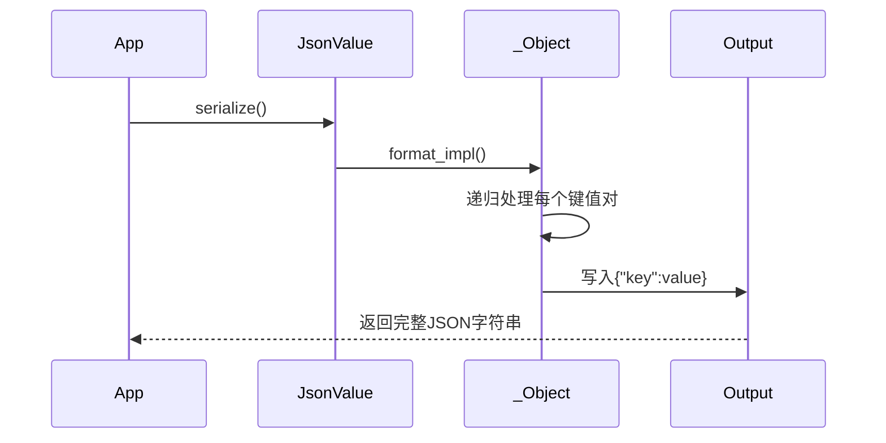

# 第五章：JSON (`json::value`, `json::object`, `json::array`)

在[第四章：PPLX任务（异步编程模型）](04_pplx_tasks__asynchronous_programming_model__.md)中，我们掌握了异步收发HTTP消息的技术，让应用能在网络操作时保持响应

现在我们知道如何与Web服务器通信而不阻塞程序，这很棒！

但当`http_client`获取到`http_response`后，如何处理其中的数据？

通常服务器回复中最有用的部分是**消息体**，其中包含结构化数据。以天气应用为例，服务器可能返回`{"city": "London", "temperature": "15C", "conditions": "Cloudy"}`这样的字符串。

> 如何在C++代码中轻松提取"London"、"15C"和"Cloudy"？

手动解析这类字符串既繁琐又易错。这正是**JSON**（JavaScript对象表示法）的用武之地。`cpprestsdk`==提供了一套强大的类来简化JSON数据处理==：`json::value`、`json::object`和`json::array`。

## 核心JSON类

### `json::value`：通用容器
可存储任意JSON数据类型：
- 数值（整数/浮点）
- 布尔值（true/false）
- 字符串
- 空值（null）
- 对象（键值对集合）
- 数组（有序值列表）

### `json::object`：字典结构
类似`std::map<utility::string_t, json::value>`，用于表示如天气数据中的层级结构：
```json
"temperature": 
{
    "value": 15,
    "unit": "C"
}
```

### `json::array`：列表结构
类似`std::vector<json::value>`，适合存储如天气状况列表：
```json
"conditions": ["Cloudy", "Windy"]
```

## 实战指南

### 1. JSON解析
```cpp
utility::string_t json_str = U(R"({"city":"London","temp":15})");
web::json::value weather = web::json::value::parse(json_str);
std::wcout << L"城市: " << weather.at(U("city")).as_string();
```

### 2. 数据访问
```cpp
// 访问嵌套对象
double temp = weather.at(U("temperature")).at(U("value")).as_double();

// 遍历数组
auto conditions = weather.at(U("conditions")).as_array();
for (auto& cond : conditions) {
    std::wcout << cond.as_string() << L",";
}
```

### 3. 动态构建JSON
```cpp
web::json::value forecast;
forecast[U("city")] = web::json::value::string(U("Paris"));
forecast[U("days")] = web::json::value::array();
forecast[U("days")][0] = web::json::value::string(U("Sunny"));
```

### 4. 序列化输出
```cpp
utility::string_t output = forecast.serialize();
// 输出: {"city":"Paris","days":["Sunny"]}
```

## 完整HTTP交互示例
```cpp
pplx::task<web::json::value> fetch_data() {
    return client.request(web::http::methods::GET, U("/api/weather"))
        .then([](web::http::http_response resp) {
            return resp.extract_json(); // 自动转换响应体为JSON
        });
}

// 发送JSON数据
web::json::value payload;
payload[U("sensor")] = web::json::value::string(U("temp-01"));
client.request(web::http::methods::POST, U("/api/data"))
    .set_body(payload); // 自动设置Content-Type为application/json
```

## 实现原理

### 核心设计
1. **==类型擦除模式==**：`json::value`通过`std::unique_ptr`持有`details::_Value`基类指针
2. **多态派生类**：`_Number`、`_String`等子类实现具体类型存储
3. **延迟构造**：`operator[]`在null值时自动初始化对象/数组

### 序列化流程


## 总结对比

| 功能         | `json::value`                             | `json::object`                      | `json::array`                   |
| ------------ | ----------------------------------------- | ----------------------------------- | ------------------------------- |
| **创建方式** | `parse()`/`number()`/`string()`等工厂方法 | 通过`value::object()`或`operator[]` | 通过`value::array()`            |
| **类型安全** | 提供`is_xxx()`类型检查和`as_xxx()`转换    | 继承`value`的类型安全机制           | 同左                            |
| **遍历访问** | 需先转换为具体类型                        | `for(auto& kv : obj)`==键值遍历==   | `for(auto& elem : arr)`索引访问 |

掌握这些JSON处理技术后，我们已能：
1. 高效解析网络API返回的复杂数据结构
2. 动态构建符合业务需求的JSON消息
3. 实现完整的HTTP请求-响应闭环处理

接下来，在[第六章：异步流处理](06_asynchronous_streams__e_g____basic_istream____basic_ostream____streambuf___.md)中，我们将探索大容量数据流的高效处理方法。

