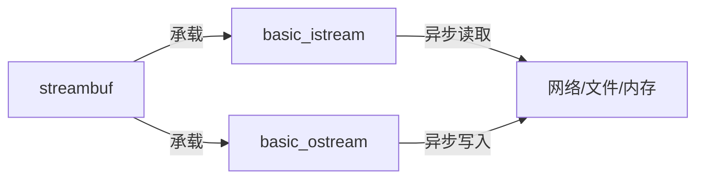

# 第六章：异步流处理（如`basic_istream`、`basic_ostream`、`streambuf`）

在[第五章：JSON处理](05_json___json__value____json__object____json__array___.md)中，我们掌握了JSON数据的解析与构建技术，这为结构化网络通信提供了强大支持

但当面对非JSON数据（如大文件、二进制图像或需逐块处理的原始文本）时，如何实现无需全量加载的高效流式处理？这正是**异步流**的用武之地

## 核心组件

### 异步流架构模型


### 内存流实战
#### 写入
```cpp
auto os = concurrency::streams::wstringstream::open_ostream();
os.print(U("数据写入"))
  .then([]{
      std::wcout << L"写入完成";
  }).wait();
```

#### 读取
```cpp
auto is = concurrency::streams::wstringstream::open_istream(U("测试数据"));
is.read_to_end(target_stream)
  .then([](size_t bytes){
      std::wcout << L"读取字节数: " << bytes;
  }).wait();
```

### 文件流操作
#### 异步写入文件
```cpp
concurrency::streams::file_stream<wchar_t>::open_ostream(L"data.txt")
  .then([](auto os){
      return os.print(U("文件内容"));
  }).wait();
```

#### 异步读取文件
```cpp
concurrency::streams::file_stream<wchar_t>::open_istream(L"data.txt")
  .then([](auto is){
      return is.read_to_end(memory_stream);
  }).then([](size_t bytes){
      std::wcout << L"文件大小: " << bytes;
  }).wait();
```

## 底层机制

### 核心接口设计
```cpp
// streambuf抽象基类
template<typename CharType>

class basic_streambuf {
public:
    virtual pplx::task<int_type> getc() = 0;  // 异步读取
    virtual pplx::task<size_t> putn(const CharType*, size_t) = 0; // 异步写入
    //...
};
```

### 文件流实现片段
```cpp
size_t _getn_fsb(_file_info* info, void* ptr, size_t count) {
    if(info->m_buffer_size > 0) {
        // 缓冲读取逻辑
    } else {
        return _read_file_async(info, ptr, count); // 平台特定异步IO
    }
}
```

## 技术总结

| 组件                 | 功能特点                                        | 典型应用场景            |
| -------------------- | ----------------------------------------------- | ----------------------- |
| **streambuf**        | 底层字节管道，支持缓冲管理和平台适配            | 自定义流实现/性能优化   |
| **basic_istream**    | 提供read/peek等异步读取接口，支持链式回调       | 大文件下载/网络流式接收 |
| **basic_ostream**    | 提供print/write等异步写入接口，自动处理类型转换 | 文件上传/日志记录       |
| **container_stream** | 内存流实现，基于STL容器                         | 数据转换/测试模拟       |
| **file_stream**      | 封装异步文件IO，支持跨平台操作                  | 大文件分块处理          |

## 进阶
掌握异步流处理后，接下来可深入：
1. **生产者-消费者模式**：结合`producer_consumer_buffer`实现高效数据管道
2. **自定义流适配器**：继承`basic_streambuf`实现特定协议解析
3. **性能调优**：通过缓冲策略和并行处理提升吞吐量

异步流处理为构建高性能IO密集型应用提供了关键基础设施，使开发者能够以声明式风格处理各类数据流，同时保持应用的响应性和资源效率

END *★,°*:.☆(￣▽￣)/*.°★* 。