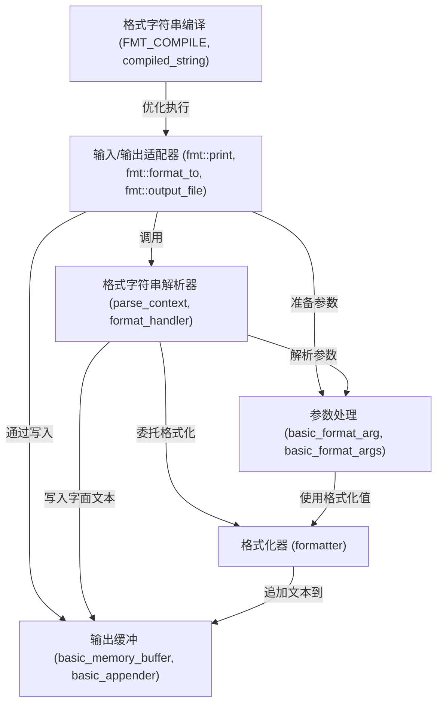

链接：[{fmt}](https://fmt.dev/12.0/)

# docs：fmt

`fmt` 项目是一个**现代 C++ 格式化库**，专为*速度、安全性和易用性*而设计

它允许开发者使用灵活的、类似 Python 的语法==从各种数据类型创建格式化字符串==。主要功能包括*编译时格式字符串验证*、高效处理参数，以及优化输出到不同目标（如控制台或文件）。

## 可视化

## 章节

1. [输入/输出适配器 (`fmt::print`, `fmt::format_to`, `fmt::output_file`)
](01_input_output_adapters___fmt__print____fmt__format_to____fmt__output_file___.md)
2. [参数处理 (`basic_format_arg`, `basic_format_args`)
](02_argument_handling___basic_format_arg____basic_format_args___.md)
3. [格式字符串解析器 (`parse_context`, `format_handler`)
](03_format_string_parser___parse_context____format_handler___.md)
4. [格式化器 (`formatter<T, Char>`)
](04_formatter___formatter_t__char____.md)
5. [输出缓冲 (`basic_memory_buffer`, `basic_appender`)
](05_output_buffering___basic_memory_buffer____basic_appender___.md)
6. [格式字符串编译 (`FMT_COMPILE`, `compiled_string`)
](06_format_string_compilation___fmt_compile____compiled_string___.md)

---

