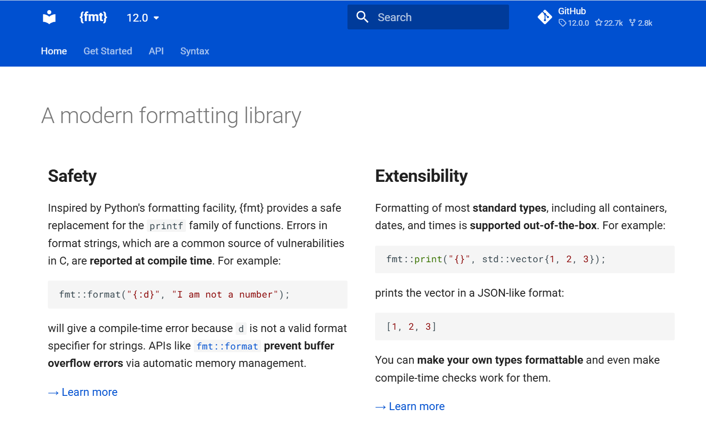
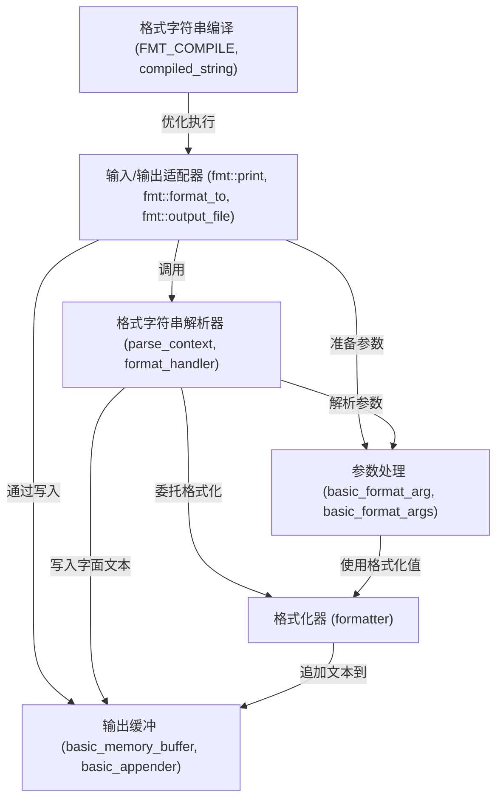
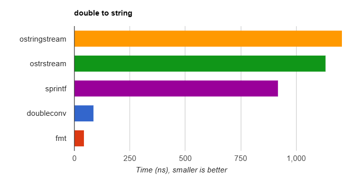

链接：[{fmt}](https://fmt.dev/12.0/)



# docs：fmt

`fmt` 项目是一个**现代 C++ 格式化库**，专为*速度、安全性和易用性*而设计

它允许开发者使用灵活的、类似 Python 的语法==从各种数据类型创建格式化字符串==。主要功能包括*编译时格式字符串验证*、高效处理参数，以及优化输出到不同目标（如控制台或文件）。


## 可视化



## 章节

1. [输入/输出适配器 (`fmt::print`, `fmt::format_to`, `fmt::output_file`)
](01_input_output_adapters___fmt__print____fmt__format_to____fmt__output_file___.md)
2. [参数处理 (`basic_format_arg`, `basic_format_args`)
](02_argument_handling___basic_format_arg____basic_format_args___.md)
3. [格式字符串解析器 (`parse_context`, `format_handler`)
](03_format_string_parser___parse_context____format_handler___.md)
4. [格式化器 (`formatter<T, Char>`)
](04_formatter___formatter_t__char____.md)
5. [输出缓冲 (`basic_memory_buffer`, `basic_appender`)
](05_output_buffering___basic_memory_buffer____basic_appender___.md)
6. [格式字符串编译 (`FMT_COMPILE`, `compiled_string`)
](06_format_string_compilation___fmt_compile____compiled_string___.md)

---

# 现代格式化库

## 安全性
受Python格式化工具的启发，{fmt}为printf系列函数提供了安全替代方案。

格式字符串中的错误（这是C语言中常见的漏洞来源）会在编译时被检测并报告。例如：

```cpp
fmt::format("{:d}", "我不是数字");
```

这将产生编译时错误，因为`d`不是字符串的有效格式说明符。像`fmt::format`这样的API通过自动内存管理防止了缓冲区溢出错误。

## 扩展性
支持大多数标准类型的开箱即用格式化，包括所有容器、日期和时间。例如：

```cpp
fmt::print("{}", std::vector{1, 2, 3});
```

以类似JSON的格式打印向量：
```
[1, 2, 3]
```

（i like it🥰）

可以使自己的类型支持格式化，甚至可以为它们实现编译时检查。

## 性能
{fmt}的性能比iostreams和sprintf快30%到20-30倍不等，特别是在数字格式化方面。该库最大限度地减少了动态内存分配，并可选地将格式字符串编译为最优代码。



## Unicode支持
{fmt}在主要操作系统上通过UTF-8和char字符串提供可移植的Unicode支持。例如：

```cpp
fmt::print("Слава Україні!");
```

无论代码页设置如何，都能在Linux、macOS甚至Windows控制台上正确打印。

默认情况下与区域设置无关，但您可以选择启用本地化格式化。{fmt}使其与Unicode兼容，解决了标准库中的问题。

## 快速编译
该库广泛使用类型擦除来实现快速编译。`fmt/base.h`提供了API的一个子集，具有最小的包含依赖关系，并提供足够的功能来替代所有*printf的使用。

使用{fmt}的代码通常比等效的iostreams代码编译速度快几倍。虽然printf编译仍然更快，但这个差距正在缩小。

## 小二进制占用
类型擦除还用于防止模板膨胀，从而生成紧凑的每调用二进制代码。

例如，使用单个参数调用`fmt::print`只需几条指令，与printf相当（尽管增加了运行时安全性），比等效的iostreams代码小得多。

该库本身的二进制占用空间很小，对于资源受限的设备，可以禁用某些组件（如浮点格式化）以进一步减小体积。

## 可移植性
{fmt}具有小型自包含的代码库，核心仅由三个头文件组成，没有外部依赖。

该库具有高度可移植性，只需要GCC 4.9、Clang 3.6、MSVC 19.10（2017）及更高版本中可用的C++11功能子集。如果可用，会使用更新的编译器和标准库功能，并启用额外功能。

在可能的情况下，格式化函数的输出在各个平台上保持一致。

## 开源
{fmt}是GitHub上排名前100的开源C++库之一，拥有数百位历史贡献者~

该库在宽松的MIT许可证下分发，并被许多开源项目依赖，包括Blender、PyTorch、Apple的FoundationDB、Windows Terminal、MongoDB等

