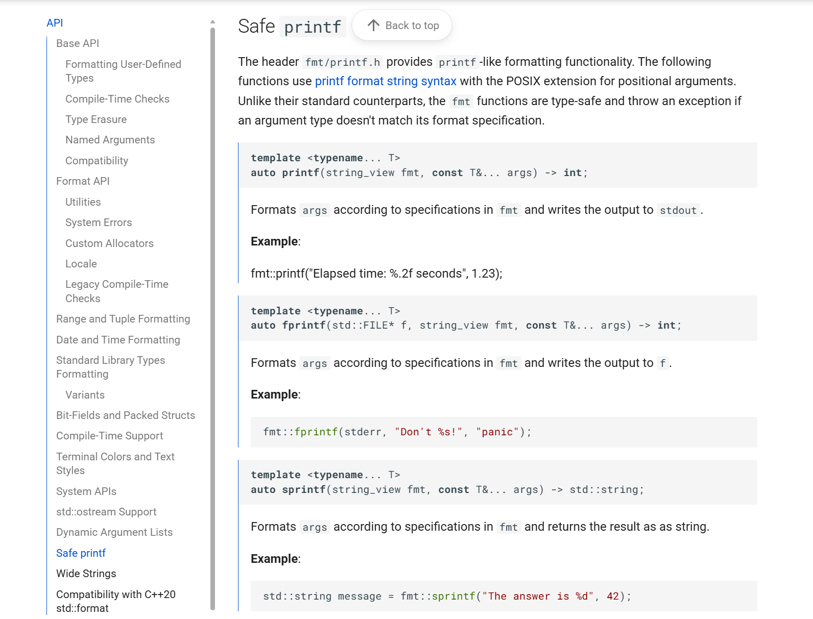
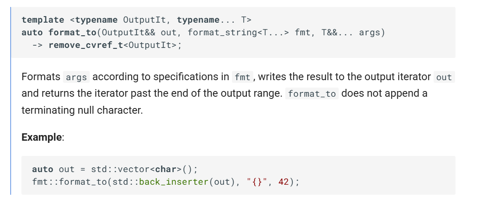
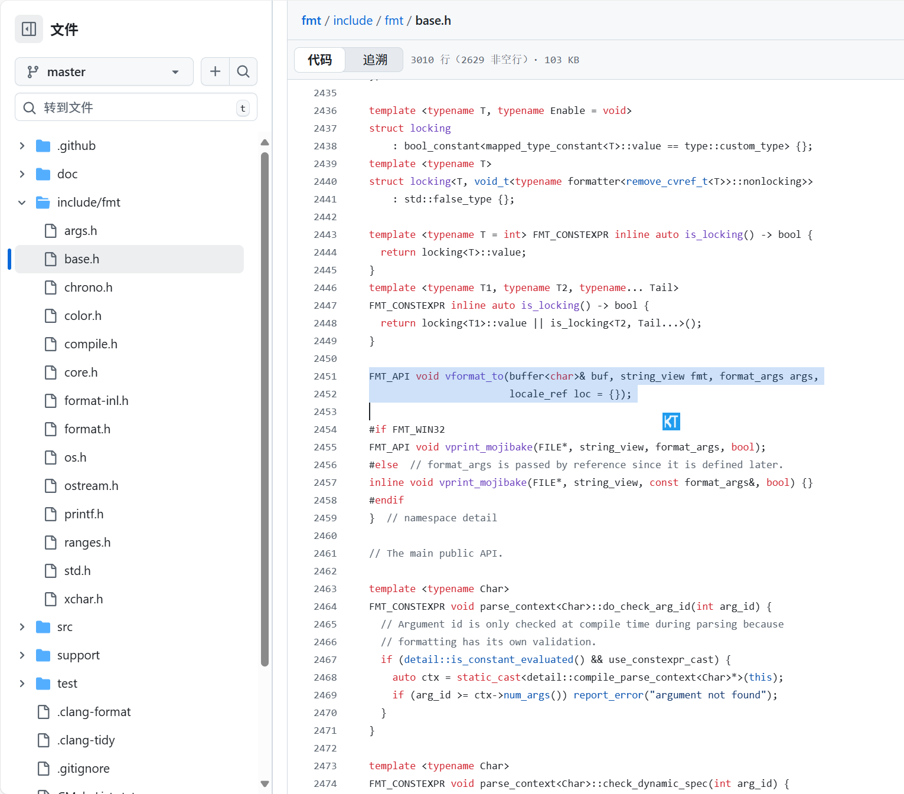
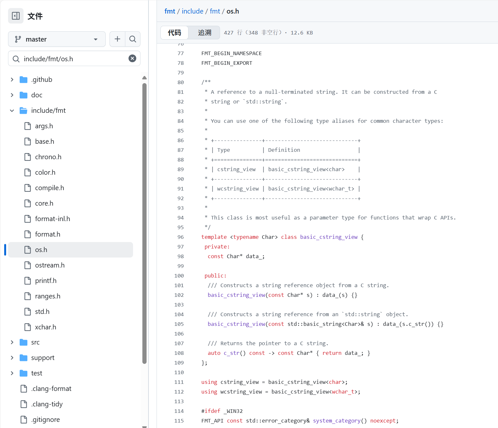

# 第1章：输入/输出适配器（`fmt::print`、`fmt::format_to`、`fmt::output_file`）

想象一下，你刚刚精心编写了一条完美的消息——可能是一条问候语、一份数据摘要，或者一份详细的错误报告。

现在，你需要将这条消息传递到某个地方。

它应该去哪里？显示在电脑屏幕上？写入文件？或者你可能希望将其构建在程序的内存中以便后续使用？

这正是 `fmt` 库中的*输入/输出适配器*解决的问题。

它们是关键的桥梁，将你==格式化的文本传递到最终目的地==。可以将它们视为消息的“快递服务”！

在 C++ 中，你可能熟悉 `std::cout` 用于打印到控制台，或者 `std::ofstream` 用于写入文件。

`fmt` 库提供了一套自己的 I/O 适配器，这些适配器基于 `fmt` 强大的格式化功能，设计得更高效、类型安全且灵活。

让我们深入了解三个主要的适配器：`fmt::print`、`fmt::format_to` 和 `fmt::output_file`。

## 1. `fmt::print`：控制台信使

当希望将格式化消息直接显示到标准输出（通常是控制台或终端窗口）时，`fmt::print` 是你的首选工具。它就像一个信使，接过你的消息并立即大声朗读出来，让所有人都能看到。

### 如何使用 `fmt::print`



`fmt::print` 的使用方式与 C 中的 `printf` 或 C++ 中的 `std::cout` 非常相似，但采用了 `fmt` 的用户友好格式字符串语法。

```cpp
#include <fmt/format.h> // 引入 fmt::print

int main() {
    int answer = 42;
    // 向控制台打印一条简单消息
    fmt::print("答案是 {}。\n", answer);

    std::string name = "Alice";
    // 也可以打印多个参数
    fmt::print("你好，{}！欢迎来到第 {} 章。\n", name, 1);
    return 0;
}
```

**输出：**
```
答案是 42。
你好，Alice！欢迎来到第 1 章。
```

`fmt::print` 还有一个变体 `fmt::println`，它会自动在消息末尾添加换行符（`\n`），因此你无需手动添加。

```cpp
#include <fmt/format.h> // 引入 fmt::println

int main() {
    // 打印 "Hello!" 并自动换行
    fmt::println("Hello!");
    // 等效于 fmt::print("World!\n");
    fmt::println("World!");
    return 0;
}
```

**输出：**
```
Hello!
World!
```

你还可以将 `fmt::print` 定向到现有的 C 风格文件流，例如 `stderr` 用于错误消息：

```cpp
#include <cstdio>      // 引入 stderr
#include <fmt/format.h> // 引入 fmt::print

int main() {
    // 将错误消息打印到标准错误
    fmt::print(stderr, "错误：值 {} 出现问题。\n", 100);
    return 0;
}
```

**输出（到 stderr）：**
```
错误：值 100 出现问题。
```

## 2. `fmt::format_to`：在内存中构建消息



有时，你并不希望立即显示消息，而是希望在程序的==内存中构建一个格式化字符串==。这个字符串可以用于多种用途，例如通过网络发送、存储到数据库，或者作为更大计算的一部分。

`fmt::format_to` 就是为此设计的。它将格式化文本写入*输出迭代器*。输出迭代器就像一支“笔”，知道如何将字符写入不同类型的“笔记本”——可以是动态数组（如 `std::vector<char>`）或固定大小的字符缓冲区。

### 如何使用 `fmt::format_to`

一个常见的“笔记本”是 `fmt::memory_buffer`。这是 `fmt` 提供的一种特殊缓冲区类型，可以动态增长，类似于 `std::string`，但==专为高效字符追加而设计==。

```cpp
#include <fmt/format.h> // 引入 fmt::format_to, fmt::memory_buffer
#include <string>      // 引入 std::string

int main() {
    fmt::memory_buffer buffer; // 我们的灵活内存“笔记本”

    // 使用 std::back_inserter 写入缓冲区
    fmt::format_to(std::back_inserter(buffer), "用户：{}", "Bob");
    fmt::format_to(std::back_inserter(buffer), "，年龄：{}", 30);

    // 将缓冲区内容转换为标准字符串以便使用
    std::string result_string = fmt::to_string(buffer);
    fmt::print("格式化字符串：{}\n", result_string); // 输出：格式化字符串：用户：Bob，年龄：30
    return 0;
}
```

**输出：**
```
格式化字符串：用户：Bob，年龄：30
```

注意，我们使用了 `std::back_inserter(buffer)`。这会创建一个对象，告诉 `fmt::format_to` 如何逐个字符地将内容追加到 `fmt::memory_buffer` 的末尾。

还可以写入固定大小的 `char` 数组，这在希望避免动态内存分配时非常有用：

```cpp
#include <fmt/format.h> // 引入 fmt::format_to_n
#include <string_view>  // 引入 std::string_view

int main() {
    char fixed_buffer[20]; // 固定大小的数组用于写入
    // 确保缓冲区以空字符结尾，以便安全创建 string_view
    fixed_buffer[sizeof(fixed_buffer) - 1] = '\0';

    // format_to_n 最多写入 'n' 个字符
    auto result = fmt::format_to_n(fixed_buffer, sizeof(fixed_buffer) - 1,
                                   "数据：{}, 值：{}", "Test", 123);

    // 'result.out' 指向写入数据的末尾
    // 'result.size' 是总大小，即使被截断
    fmt::print("写入内容：'{}', 总大小：{}\n",
               std::string_view(fixed_buffer, result.out - fixed_buffer),
               result.size);
    // 输出：写入内容：'数据：Test, 值：123', 总大小：22
    // 注意：示例字符串 "数据：Test, 值：123" 长度为 22 字符。
    // 如果 fixed_buffer 更小（例如 10），则会写入 '数据：Test'，result.size 仍为 22。

    return 0;
}
```

**输出：**
```
写入内容：'数据：Test, 值：123', 总大小：22
```
`fmt::format_to_n` 特别适用于控制写入的数据量，防止固定大小缓冲区溢出。

## 3. `fmt::output_file`：直接写入文件

如果你的格式化消息需要直接写入文件，`fmt::output_file` 是你的专用工具。它提供了一种方便且高效的方式来创建和写入文件。

### 如何使用 `fmt::output_file`

通过指定文件名创建 `fmt::output_file` 对象。然后，你可以使用其 `print` 方法，它的工作方式与 `fmt::print` 类似，但会将内容写入关联的文件。

```cpp
#include <fmt/os.h>     // 引入 fmt::output_file
#include <fmt/format.h> // 引入 fmt::print（在 output_file 中使用）

int main() {
    // 创建或打开名为 "log.txt" 的文件用于写入
    // 默认情况下，如果文件存在，会截断（清空）文件
    auto log_file = fmt::output_file("log.txt");
 //！！！！将 文件包装为一个对象 来进行操作

    // 将格式化消息直接写入文件
    log_file.print("日志事件：{}。\n", "用户登录");
    log_file.print("时间戳：{}。\n", 1678886400); // Unix 时间戳示例

    // 文件在 log_file 超出作用域时自动关闭，
    // 或者可以显式关闭：
    log_file.close();

    fmt::print("消息已写入 log.txt\n");
    return 0;
}
```

**输出（到控制台）：**
```
消息已写入 log.txt
```

**`log.txt` 内容：**
```
日志事件：用户登录。
时间戳：1678886400。
```

`fmt::output_file` 还可以接受参数来控制文件打开行为，例如指定缓冲区大小或追加模式：

```cpp
#include <fmt/os.h> // 引入 fmt::output_file, fmt::file
#include <fmt/format.h> // 引入 fmt::print

int main() {
    // 以追加模式打开 "append.log"（如果存在则在末尾添加内容）
    // 并使用自定义缓冲区大小
    auto file_appender = fmt::output_file("append.log", fmt::file::APPEND, fmt::buffer_size = 1024);
    file_appender.print("在 {} 追加的消息。\n", "now");
    file_appender.close();
    return 0;
}
```

这里，`fmt::file::APPEND` 是一个标志，告诉操作系统将新内容添加到文件末尾而不是清空文件。`fmt::buffer_size` 允许你调整内部缓冲区大小以优化性能。

## 原理：适配器如何工作

让我们快速揭开帷幕，看看这些适配器是如何实际传递你的消息的。当你调用 `fmt` 格式化函数（如 `fmt::print`）时，通常会经历以下几个步骤：

1.  **准备**：`fmt` 库接收你的格式字符串和提供的参数（例如 `"{}"`、`answer`）。
2.  **格式化**：处理这些内容，将数字转换为文本，将值插入正确的位置，并处理任何格式规范（如对齐或精度）。格式化后的文本临时存储在内部内存区域中，通常是 `[输出缓冲（basic_memory_buffer, basic_appender）](05_output_buffering___basic_memory_buffer____basic_appender___.md)`。
3.  **传递**：最后，我们的 I/O 适配器之一从内部缓冲区获取准备好的文本，并将其传递到目标位置。

以下是事件的简化顺序：

```mermaid
sequenceDiagram
    participant 代码 as 你的代码 ["你的 C++ 代码"]
    participant FmtFunc as Fmt函数 ["fmt::print / fmt::format_to / fmt::output_file"]
    participant FmtInt as Fmt内部 ["fmt 库内部"]
    participant Dest as 目标 ["控制台 / 内存 / 文件"]

    代码 ->> FmtFunc: 调用格式字符串和参数
    FmtFunc ->> FmtInt: 传递格式化请求及参数
    Note over FmtInt: 根据提供的格式字符串和参数进行处理。
                      包括但不限于：参数解析、类型转换、应用格式规范（如宽度、对齐方式等）。
    FmtInt ->> FmtInt: 在内部缓冲区构建格式化文本
    FmtInt -->> FmtFunc: 返回构建好的格式化文本
    FmtFunc ->> Dest: 将格式化后的文本输出到目标位置
    Note over Dest: 根据不同的输出目标（控制台、内存或文件），执行相应的写入操作。
    Dest -->> 代码: （如果适用）间接地通过系统反馈确认操作结果，例如写入文件后返回状态。
```

### 深入代码



让我们看看 `fmt::print` 在 `fmt/base.h` 中如何与内部格式化机制挂钩：

```cpp
// 来自 include/fmt/base.h
// ...
FMT_API void vprint(string_view fmt, format_args args); // 声明 vprint

template <typename... T>
FMT_INLINE void print(format_string<T...> fmt, T&&... args) {
  vargs<T...> va = {{args...}}; // 收集参数
  // 调用内部 vprint 函数，可能根据参数优化
  return detail::is_locking<T...>() ? vprint_buffered(stdout, fmt.str, va)
                                    : vprint(fmt.str, va);
}
// ...
```

这个 `print` 函数最终会调用 `vprint`（或线程安全的 `vprint_buffered`，这超出了本章范围）来处理实际的写入。

- `vprint` 函数（也在 `fmt/base.h` 中）本身依赖于 `detail::vformat_to` 来完成核心格式化工作。

```cpp
// 来自 include/fmt/base.h
// ...
FMT_API void vformat_to(buffer<char>& buf, string_view fmt, format_args args,
                        locale_ref loc = {}); // 核心格式化逻辑

FMT_API void vprint(FILE* f, string_view fmt, format_args args); // 向 FILE* 的 vprint

// ... 实现细节 ...
void vprint(FILE* f, string_view fmt, format_args args) {
  auto buf = memory_buffer(); // 创建临时缓冲区
  detail::vformat_to(buf, fmt, args, {}); // 格式化到缓冲区
  detail::write_buffer(f, buf); // 将缓冲区内容写入 FILE*
}
// ...
```

`fmt::print`（以及内部的 `vprint`）首先将文本格式化到 `fmt::memory_buffer`（`[输出缓冲（basic_memory_buffer, basic_appender）](05_output_buffering___basic_memory_buffer____basic_appender___.md)` 的示例），然后将该缓冲区的内容复制到 `stdout` 或指定的 `FILE*`。

> 这种两步过程（格式化到缓冲区，然后将缓冲区写入目标）是 `fmt` 灵活性和效率的关键。

对于 `fmt::format_to`，过程非常相似，但它不是写入 `FILE*`，而是直接写入你提供的输出迭代器。

```cpp
// 来自 include/fmt/base.h
// ...
template <typename OutputIt,
          FMT_ENABLE_IF(detail::is_output_iterator<remove_cvref_t<OutputIt>,
                                                   char>::value)>
auto vformat_to(OutputIt&& out, string_view fmt, format_args args)
    -> remove_cvref_t<OutputIt> {
  // 为输出迭代器获取适当的缓冲区包装器
  auto&& buf = detail::get_buffer<char>(out);
  // 实际格式化到缓冲区
  detail::vformat_to(buf, fmt, args, {});
  // 获取写入后的最终迭代器位置
  return detail::get_iterator(buf, out);
}
// ...
```
在这里，`detail::get_buffer<char>(out)` 智能地将你的 `OutputIt`（如 `std::back_inserter<fmt::memory_buffer>`）包装为兼容的 `buffer` 类型，使 `detail::vformat_to` 始终能够写入 `buffer<char>&`。

最后，`fmt::output_file`（定义在 `fmt/os.h` 中）包装了一个底层的 `fmt::file` 对象，并管理自己的内部 `fmt::memory_buffer` 以实现高效的文件写入。

```cpp
// 来自 include/fmt/os.h
// ...
class FMT_API ostream : private detail::buffer<char> 
{
 private:
  file file_; // 实际的文件描述符包装器

  ostream(cstring_view path, const detail::ostream_params& params); // 构造函数

  // 内部函数用于扩展缓冲区
  static void grow(buffer<char>& buf, size_t);

 public:
  // ... 构造函数、赋值运算符等 ...

  inline void flush() {
    if (size() == 0) return;
    file_.write(data(), size() * sizeof(data()[0])); // 将缓冲区内容写入文件
    clear(); // 清空缓冲区
  }

  // ... 其他方法 ...

  template <typename... T> void print(format_string<T...> fmt, T&&... args) {
    // 直接格式化到 ostream 的内部缓冲区
    vformat_to(appender(*this), fmt.str, vargs<T...>{{args...}});
  }
};

// 辅助函数用于创建 ostream
template <typename... T>
inline auto output_file(cstring_view path, T... params) -> ostream {
  return {path, detail::ostream_params(params...)};
}
// ...
```


当调用 `log_file.print(...)` 时，格式化文本首先写入 `fmt::ostream` 的内部缓冲区。

当缓冲区满、调用 `flush()` 或 `fmt::ostream` 对象销毁时，该==缓冲区会高效地刷新到磁盘==（使用 `file_.write(...)`）。这种缓冲策略最小化了系统调用并提高了性能。

## 结论

> （学习到了借助 缓冲区的设计 减少io）

在本章中，我们探讨了 `fmt` 库的基础*输入/输出适配器*：`fmt::print`、`fmt::format_to` 和 `fmt::output_file`。你学到了：

*   **`fmt::print`** 是将格式化文本显示到控制台或 C 风格 `FILE*` 流的直接工具。
*   **`fmt::format_to`** 提供了细粒度控制，可以在内存中构建格式化字符串，写入各种输出迭代器（如 `fmt::memory_buffer` 或固定大小的数组）。
*   **`fmt::output_file`** 简化了将格式化内容直接写入文件的过程，并提供了控制文件访问和缓冲的选项。

这些适配器之所以重要，是因为它们通过传递最终消息来完成格式化过程。它们依赖于其他核心 `fmt` 组件（如内部缓冲区）来高效地准备和传输数据。

现在你了解了格式化消息的去向，下一步自然是理解 `fmt` 如何处理你想要格式化的值本身。在下一章中，我们将深入探讨 [参数处理（basic_format_arg, basic_format_args）](02_argument_handling___basic_format_arg____basic_format_args___.md)，看看 `fmt` 如何在消息到达这些适配器之前处理你的输入。

