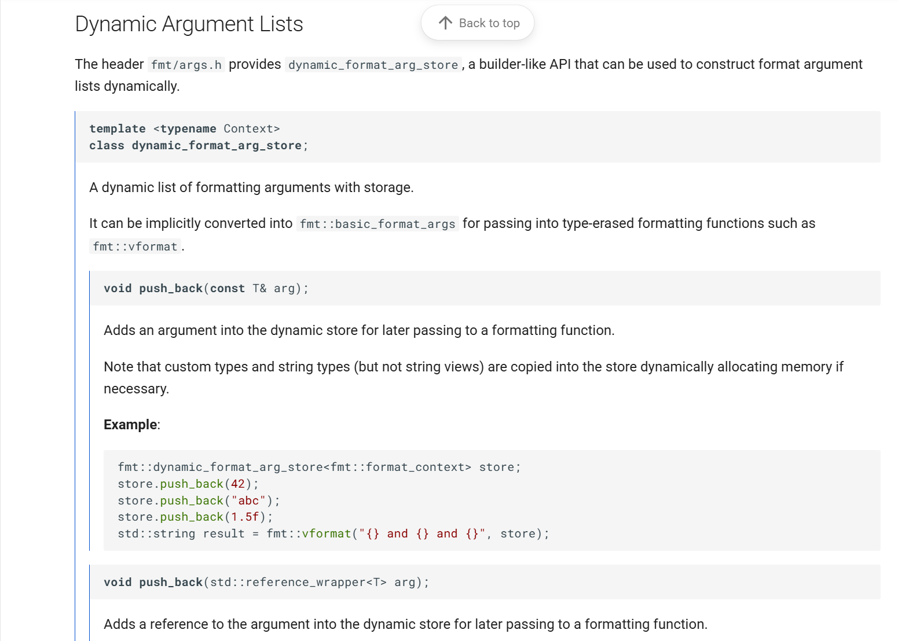
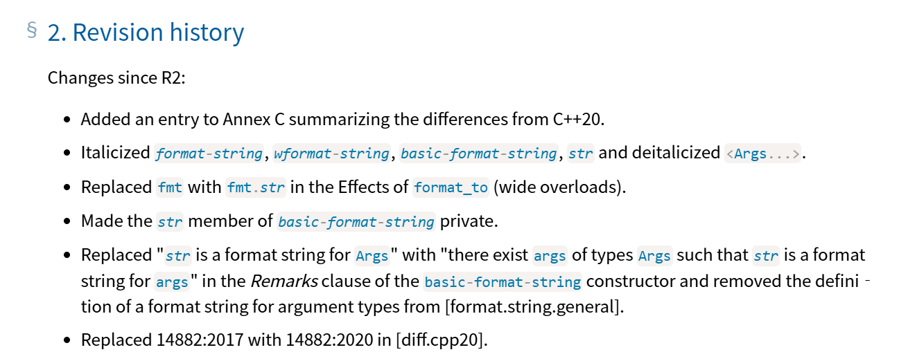
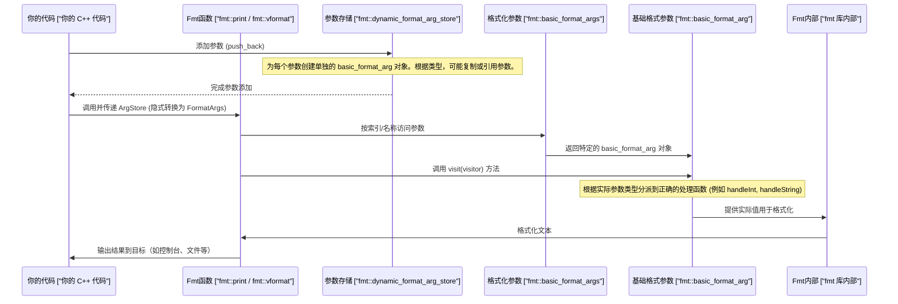

# 第2章：参数处理（`basic_format_arg`，`basic_format_args`）

在[前一章：输入/输出适配器（`fmt::print`，`fmt::format_to`，`fmt::output_file`）](01_input_output_adapters___fmt__print____fmt__format_to____fmt__output_file___.md)中，我们学习了如何将精心格式化的消息传递到控制台或文件等不同目的地。

但在`fmt`能够传递消息之前，它首先需要理解你提供的*原料*（你的数据）以及如何准备它们。

想象你正在烹饪，决定烤一个蛋糕。你告诉`fmt`（你的厨房助手）"我需要一个用`面粉`、`糖`和`鸡蛋`做的蛋糕"。你的助手不仅需要知道"面粉"是什么，还需要知道它的*类型*（它是一种粉末）和*值*（比如500克）。它还需要一种方法来跟踪所有这些原料以便制作食谱。

这正是`fmt`库中"参数处理"的工作。它是组织和理解你想要格式化的每一块数据的系统——无论是数字、文本还是你自己的自定义数据类型。它确保==无论给`fmt`什么，它都知道*它是什么*以及*如何将其转换为文本*==。

## 核心工具：`basic_format_arg`和`basic_format_args`

将这两个概念视为管理你的"原料"的构建块：

*   **`basic_format_arg`**：这就像一张完美标记的原料卡片。它保存了*一个*参数的**类型**（例如`int`，`std::string`，`float`）和**值**（例如`42`，`"Hello"`，`3.14`）。它标准化了一切，以便`fmt`可以一致地处理任何数据。
*   **`basic_format_args`**：这是完整的食谱列表，是所有`basic_format_arg`卡片的集合。它允许`fmt`轻松查找和处理每个参数，无论你是通过位置（如"第一个原料"）还是名称（如"黄油"）引用它们。

大多数情况下，作为初学者，你不会直接创建`basic_format_arg`或`basic_format_args`对象。`fmt`会自动为你完成这些工作

### 初学者的好帮手：`dynamic_format_arg_store`



然而，有一个特殊的助手叫做`fmt::dynamic_format_arg_store`，它允许你在运行时动态构建参数列表。这在你不提前知道所有参数时非常有用。

假设你正在构建一个日志系统。有时你只用一个代码记录错误，有时用代码和消息，有时甚至用更多细节。你不能简单地写`fmt::print("Error {}: {}", code, message)`，如果`message`并不总是存在。这就是`dynamic_format_arg_store`的用武之地！它让你在参数可用时收集它们，然后将整个集合传递给格式化函数。

以下是使用方法：

```cpp
#include <fmt/core.h> // 引入 fmt::dynamic_format_arg_store
#include <fmt/format.h> // 引入 fmt::vformat, fmt::print

int main() {
    // 1. 创建动态原料组织器
    fmt::dynamic_format_arg_store<fmt::format_context> store;

    // 2. 逐个添加原料（参数）
    store.push_back(42);                // 整数
    store.push_back("Hello, fmt!");    // 字符串字面量
    store.push_back(3.14f);             // 浮点数

    // 3. 使用 fmt::vformat 格式化收集的参数。
    //    `store` 自动转换为 `fmt::format_args`。
    std::string result = fmt::vformat("答案: {} | 消息: {} | PI: {}", store);

    fmt::println("{}", result);
    // 输出: 答案: 42 | 消息: Hello, fmt! | PI: 3.14
    return 0;
}
```

**解释：**

1.  我们声明了一个`fmt::dynamic_format_arg_store`。这是我们的灵活容器。
2.  使用`push_back`添加不同类型的数据。每个`push_back`内部创建一个`basic_format_arg`。
3.  当我们将`store`传递给`fmt::vformat`时，它会自动转换为`basic_format_args`对象，`fmt::vformat`知道如何处理它。格式字符串`"{}"`使用位置参数，这与`push_back`添加它们的方式兼容。

### 通过引用处理参数

如果参数的值在添加到存储后但在格式化之前可能发生变化怎么办？默认情况下，`fmt::dynamic_format_arg_store`会复制某些类型（如`std::string`或自定义对象）到其内部存储中。对于简单类型如`int`，`float`，`char*`，这通常没问题。

然而，如果你希望格式化器看到对象的最新值，可以告诉`fmt`存储一个*引用*而不是副本。这是通过`std::cref`（常量引用包装器）完成的。

```cpp
#include <fmt/core.h>
#include <fmt/format.h>
#include <string> // 引入 std::string
#include <functional> // 引入 std::cref

int main() {
    fmt::dynamic_format_arg_store<fmt::format_context> store;

    std::string user_name = "Alice";
    int user_age = 25;

    // 添加对 user_name 的引用
    store.push_back(std::cref(user_name));

    // 添加 user_age 的副本（基本类型通常直接复制或优化）
    store.push_back(user_age);

    // 在通过引用添加到存储后修改原始 user_name
    user_name = "Bob";
    user_age = 30; // 如果 user_age 被复制，此更改不会被看到

    std::string result = fmt::vformat("姓名: {} | 年龄: {}", store);
    fmt::println("{}", result);
    // 输出: 姓名: Bob | 年龄: 25

    return 0;
}
```

**解释：**

*   ==`std::cref(user_name)`告诉`fmt`存储对`user_name`变量的引用==。当调用`fmt::vformat`时，它会查看`user_name`变量的*当前*内容，即"Bob"。
*   对于`user_age`，因为它是一个简单的`int`，`push_back`可能会直接复制其值（或对小类型进行内部优化）。`push_back`后对`user_age`的更改不会被反映。

### 使用命名参数

`fmt`还支持命名参数，这使你的格式字符串更易读。你也可以在`dynamic_format_arg_store`中使用`fmt::arg`。

```cpp
#include <fmt/core.h>
#include <fmt/format.h>
#include <string>

int main() {
    fmt::dynamic_format_arg_store<fmt::format_context> store;

    // 添加命名参数
    store.push_back(fmt::arg("city", "New York"));
    store.push_back(fmt::arg("temp", 20.5f)); // 浮点参数

    // 仍然可以混合位置参数
    store.push_back("sunny"); // 这是一个位置参数（索引0）

    // 格式字符串同时使用命名和位置参数
    std::string weather_report = fmt::vformat(
        "今日{city}的天气预报是{}。温度: {temp:.1f}°C", store);

    fmt::println("{}", weather_report);
    // 输出: 今日New York的天气预报是sunny。温度: 20.5°C

    return 0;
}
```

**解释：**

*   `fmt::arg("city", "New York")`==创建一个命名参数==。字符串字面量`"city"`作为名称被复制到`dynamic_arg_store`中。
*   然后`store`与`fmt::vformat`一起使用。格式字符串可以引用`"{city}"`，`"{temp}"`和`"{}"`（位置参数）。
*   注意`temp`的`:.1f`。这是一个格式说明符，我们将在后面的章节中介绍，但它展示了这些参数如何为高级格式化做好准备。



## 内部机制：参数如何处理

让我们揭开`fmt`如何管理这些"原料卡片"和"食谱列表"的面纱。

### 流程

当你将参数传递给`fmt::print`，`fmt::format`或`fmt::vformat`时，以下是简化的流程：

1.  **参数收集**：`fmt`获取你提供的所有参数（如`42`，`"Hello"`，`std::cref(name)`）。
2.  **类型擦除**：对于每个参数，它确定其类型（`int`，`string_view`，`custom_type`）和值。然后将这些信息打包到一个`basic_format_arg`对象中。这个过程称为"类型擦除"，因为`basic_format_arg`可以保存*任何*类型，而无需在创建时知道具体的编译时类型。
3.  **列表组装**：所有这些`basic_format_arg`对象被收集到一个`basic_format_args`对象中，作为整个参数集的统一容器。
4.  **格式化**：之后，当格式字符串解析器遇到`{}`时，`fmt`要求`basic_format_args`检索相关的`basic_format_arg`。
5.  **值检索**：`basic_format_arg`然后允许`fmt`以类型安全的方式"访问"其实际值，以便`fmt`知道如何将其转换为文本。



### 探讨：`basic_format_arg`结构

`basic_format_arg`的魔力在于它能够以==标准化方式存储不同类型的数据==。它通过使用==`union`和枚举来跟踪实际类型==实现这一点。

让我们看看`fmt::detail::value`（`basic_format_arg`的一部分）的简化版本，来自`include/fmt/base.h`：

```cpp
// 来自 include/fmt/base.h
// ...
template <typename Context> class value {
 public:
  using char_type = typename Context::char_type;

  union {
    monostate no_value;
    int int_value;
    unsigned uint_value;
    // ... 其他内置类型如 long long, float, double ...
    char_type char_value;
    const void* pointer;
    string_value<char_type> string; // 用于 fmt::string_view
    custom_value<Context> custom;   // 用于具有自定义格式化器的用户定义类型
    // ...
  };
  // ... 每种类型的构造函数重载 ...
};

template <typename Context> class basic_format_arg {
 private:
  detail::value<Context> value_; // 在 union 中保存实际值
  detail::type type_;            // 枚举以知道 union 中哪个成员是活动的
  // ...
 public:
  // ... visit 方法和其他函数 ...
};
// ...
```

**表：`detail::type`枚举示例**

| `detail::type` 值    | 描述                             | 对应的 `value_` 成员 (`union`)           |
| :------------------- | :------------------------------- | :--------------------------------------- |
| `type::int_type`     | 标准 `int` 或 `short`            | `int_value`                              |
| `type::uint_type`    | 标准 `unsigned`                  | `uint_value`                             |
| `type::bool_type`    | 布尔 `true` 或 `false`           | `bool_value`                             |
| `type::char_type`    | 单个字符 (`char_type`)           | `char_value`                             |
| `type::float_type`   | 单精度浮点数 (`float`)           | `float_value`                            |
| `type::double_type`  | 双精度浮点数 (`double`)          | `double_value`                           |
| `type::string_type`  | 字符串视图 (`basic_string_view`) | `string` (保存 `data` 和 `size`)         |
| `type::pointer_type` | 通用指针 (`const void*`)         | `pointer`                                |
| `type::custom_type`  | 具有 `formatter` 的用户定义类型  | `custom` (保存 `void*` 和 `format` 函数) |
| `type::none_type`    | 无参数 / 空                      | `no_value`                               |

当创建一个`basic_format_arg`（通常是间接的），==`fmt`初始化`union`的正确成员并设置`type_`枚举==。之后，`visit`方法使用`type_`的`switch`语句调用存储类型的正确函数==重载==。这样，`fmt`始终确切知道它正在处理什么类型的数据。

对于自定义类型（将在后面的章节中介绍：[格式化器 (`formatter<T, Char>`)](04_formatter___formatter_t__char____.md)），`basic_format_arg`存储一个指向实际对象的指针和一个知道如何格式化该特定类型的函数指针（`custom.format`）。

### `dynamic_format_arg_store`内存管理

`dynamic_format_arg_store`（来自`include/fmt/args.h`）在存储参数时非常聪明：

```cpp
// 来自 include/fmt/args.h
// ...
template <typename Context> class dynamic_format_arg_store {
 private:
  // 存储 basic_format_arg 对象。
  std::vector<basic_format_arg<Context>> data_;
  // 存储命名参数的信息。
  std::vector<detail::named_arg_info<char_type>> named_info_;

  // 存储需要自己存储的参数的副本（如 std::string）。
  detail::dynamic_arg_list dynamic_args_;
  // ...
};
// ...
```

*   `data_`：这个`std::vector`存储`basic_format_arg`对象本身。这些对象很小，只包含`union`和`type`枚举。对于被复制的参数（如直接推送的`std::string`或自定义对象），`data_`保存一个`basic_format_arg`，其内部的`value_` union指向`dynamic_args_`。
*   `named_info_`：如果你使用命名参数（`fmt::arg`），这个向量存储关于它们的元数据（名称字符串和参数在`data_`中的索引）。
*   `dynamic_args_`：这是实际存储需要自己内存的参数的副本的地方。通常用于`std::string`或未通过`std::cref`传递的自定义对象。它设计为在不移动现有元素的情况下增长，这很关键，因为`data_`中的项可能直接指向它。

这种灵活的存储机制使`fmt::dynamic_format_arg_store`能够==高效地处理混合参数类型和生命周期==。

## 结论

在本章中，我们探讨了`fmt`如何理解和组织你想要格式化的数据，使用：

*   **`basic_format_arg`**：保存单个参数类型和值的"原料卡片"。
*   **`basic_format_args`**：收集所有参数卡片以进行处理的"食谱列表"。
*   **`dynamic_format_arg_store`**：用于在运行时==动态构建参数列表==的"原料组织器"，支持位置和命名参数，并通过`std::cref`控制复制与引用。

理解`fmt`如何通过联合和枚举的类型擦除来管理这些参数，有助于揭示其强大和灵活性的奥秘。

现在`fmt`知道了*你的参数是什么*，下一步是理解它如何*读取指令*（格式字符串）来放置和样式化这些参数。在下一章中，我们将深入探讨[格式字符串解析器 (`parse_context`, `format_handler`)](03_format_string_parser___parse_context____format_handler___.md)。

