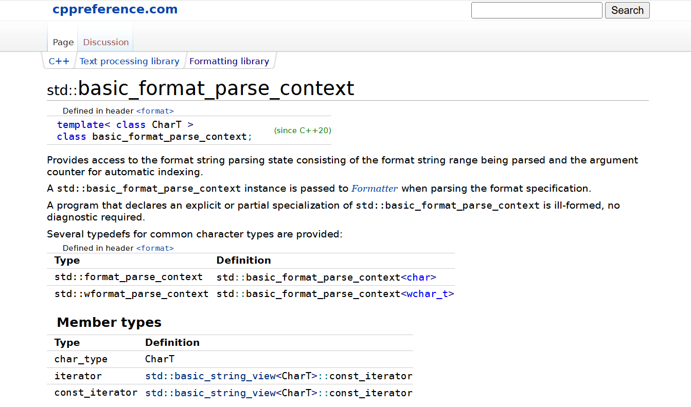
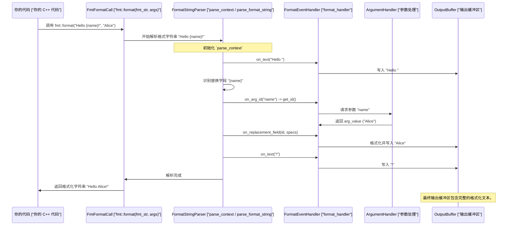
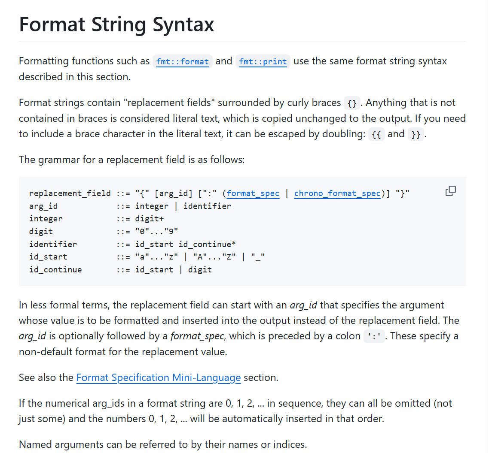

# 第3章：格式字符串解析器（`parse_context`，`format_handler`）

在[前一章：参数处理（`basic_format_arg`，`basic_format_args`）](02_argument_handling___basic_format_arg____basic_format_args___.md)中，我们学习了`fmt`如何高效地组织你想要包含在消息中的所有"原料"（你的数据）。

现在，假设你有一份详细的食谱，所有原料都已准备妥当。接下来的关键步骤是*仔细阅读食谱说明*，理解每一步，然后恰当地使用这些原料。

这正是`fmt`库中**格式字符串解析器**的工作。它就像一位目光敏锐的厨师，仔细阅读你的"格式字符串"（你的消息模板），以确定：

*   哪些部分是纯文本，需要原样复制。
*   哪些部分是"替换字段"，应该放入某个原料（参数）。
*   哪个原料放在哪里（例如第一个参数，或名为"age"的参数）。
*   每个原料应用哪些特殊样式指令（如对齐、精度或数值基数）。

格式字符串解析器确保你的食谱（格式字符串）是有效的，并指导整个格式化过程，确保每个原料按照你的意图放置和样式化。

## 核心工具：`parse_context`和`format_handler`



虽然作为使用`fmt`的初学者，你通常不会直接与它们交互，但理解它们有助于你掌握`fmt`在幕后的工作原理。它们是格式字符串解析故事中的两个主要角色：

1.  **`parse_context`**：将`parse_context`视为**"食谱书阅读器"**，它带有一个书签。它的主要工作是跟踪格式字符串中的当前位置，并告诉`fmt`==接下来是什么字符==。它知道如何遍历字符串，识别不同部分（纯文本、参数ID、格式规范），并管理参数索引（例如决定`{}`是指第一个还是第二个参数）。

2.  **`format_handler`**：这是**"执行者"**或"厨师"，它监听`parse_context`。当`parse_context`读取格式字符串的一部分时，它会告诉`format_handler`它发现了什么。`format_handler`随后知道==要执行什么操作==：打印一些纯文本、获取特定参数、应用格式化规则等。

它们一起确保`fmt`理解你的格式化请求的每一个细节。

### 来看一个例子：

假设你写了以下`fmt::print`调用：

```cpp
#include <fmt/core.h> // 引入 fmt::print 和 fmt::arg

int main() {
    std::string name = "Charlie";
    int age = 7;
    // 我们的格式字符串食谱：
    fmt::print("Hello, {name}! You are {age} years old.\n",
               fmt::arg("name", name), // 参数0，名为"name"
               fmt::arg("age", age));   // 参数1，名为"age"
    return 0;
}
```

**输出：**
```
Hello, Charlie! You are 7 years old.
```

以下是`parse_context`和`format_handler`如何协同处理格式字符串`"Hello, {name}! You are {age} years old.\n"`：

1.  **`parse_context`开始**：它从格式字符串的开头开始。
2.  **纯文本**：它看到`"Hello, "`。它告诉`format_handler`："我发现了纯文本'Hello, '。"
3.  **`format_handler`执行**：它将"Hello, "写入输出缓冲区。
4.  **替换字段**：`parse_context`随后遇到`"{name}"`。它知道这是一个替换字段，并确定`name`引用了一个命名参数。
5.  **`format_handler`执行**：它向[参数处理（`basic_format_arg`，`basic_format_args`）](02_argument_handling___basic_format_arg____basic_format_args___.md)系统请求与"name"关联的值（即"Charlie"）。然后格式化"Charlie"（使用默认字符串格式化）并将其写入输出。
6.  **更多纯文本**：`parse_context`看到`"! You are "`。它告诉`format_handler`："更多纯文本'! You are '。"
7.  **`format_handler`执行**：它将"! You are "写入输出。
8.  **==另一个替换字段==**：`parse_context`找到`"{age}"`。它将"age"解析为对应的参数。
9.  **`format_handler`==执行==**：它获取"age"的值（即`7`），格式化它，并将"7"写入输出。
10. **最终纯文本**：`parse_context`处理`" years old.\n"`。
11. **`format_handler`执行**：它将" years old.\n"写入输出。
12. **字符串结束**：`parse_context`到达末尾。消息完成！

这种识别格式字符串部分并执行操作的协作是`fmt`功能的核心。

## 内部机制：解析器的工作原理

让我们揭开解析器内部机制的面纱。

### 解析的高级流程

当你调用`fmt::format`或`fmt::print`等`fmt`函数时，以下是格式字符串如何被解释的简化流程：



图中的`FormatStringParser`代表`detail::parse_format_string`等函数，它们遍历格式字符串。该函数*使用*`parse_context`来管理其位置，并使用`format_handler`来分派操作。

### 探讨：`parse_context`

`parse_context`是==携带解析当前状态的对象，主要是格式字符串的剩余部分==。让我们看看其结构的简化视图（来自`include/fmt/base.h`）：

```cpp
// 来自 include/fmt/base.h（简化）
template <typename Char = char> class parse_context {
 private:
  basic_string_view<Char> fmt_; // 待解析的格式字符串剩余部分
  int next_arg_id_;             // 用于自动参数索引（例如，{} -> 0，然后是1）

 public:
  using char_type = Char;
  using iterator = const Char*;

  constexpr explicit parse_context(basic_string_view<Char> fmt, int next_arg_id = 0)
      : fmt_(fmt), next_arg_id_(next_arg_id) {}

  // 返回指向正在解析的格式字符串范围的起始迭代器。
  constexpr auto begin() const noexcept -> iterator { return fmt_.begin(); }

  // 将起始迭代器推进到 `it`。
  FMT_CONSTEXPR void advance_to(iterator it) {
    fmt_.remove_prefix(detail::to_unsigned(it - begin()));
  }

  // 返回自动索引的下一个参数索引。
  FMT_CONSTEXPR auto next_arg_id() -> int {
    // ... 检查手动与自动索引的逻辑 ...
    return next_arg_id_++;
  }

  // 检查参数ID的一致性。
  FMT_CONSTEXPR void check_arg_id(int id) {
    // ... 检查手动与自动索引的逻辑 ...
  }
  FMT_CONSTEXPR void check_arg_id(basic_string_view<Char>) {
    // ... 检查手动与自动索引的逻辑 ...
  }
};
```

*   `fmt_`：这个`basic_string_view`表示格式字符串的*未解析*部分。随着`fmt`消耗字符，`advance_to`实际上从`fmt_`中"吃掉"它们。
*   `next_arg_id_`：当你使用空大括号`{}`进行自动参数索引时，使用此整数。它从`0`开始，然后是`1`，依此类推。如果混合使用自动（`{}`）和手动（`{0}`）索引，`fmt`会报告错误。
*   `begin()`和`end()`：这些提供对`parse_context`当前查看的格式字符串段的访问。

### 探讨：`format_handler`

`format_handler`是一个接口（`struct format_handler`来自`include/fmt/format.h`），定义了==一组回调函数==。每当`parse_format_string`算法识别出格式字符串的特定部分时，就会调用这些函数。

```cpp
// 来自 include/fmt/format.h（简化）
template <typename Char = char> struct format_handler {
  parse_context<Char> parse_ctx;    // 当前解析上下文
  buffered_context<Char> ctx;       // 格式化上下文（保存输出、参数、区域设置）

  // 当发现纯文本时调用（例如，"Hello, "）。
  void on_text(const Char* begin, const Char* end) {
    // 将文本直接复制到输出缓冲区。
    copy_noinline<Char>(begin, end, ctx.out());
  }

  // 当请求参数ID时调用（例如，`{}`或`{0}`）。
  FMT_CONSTEXPR auto on_arg_id() -> int { return parse_ctx.next_arg_id(); }
  FMT_CONSTEXPR auto on_arg_id(int id) -> int {
    parse_ctx.check_arg_id(id);
    return id;
  }
  FMT_CONSTEXPR auto on_arg_id(basic_string_view<Char> id) -> int {
    parse_ctx.check_arg_id(id);
    int arg_id = ctx.arg_id(id); // 将命名参数解析为索引。
    if (arg_id < 0) report_error("未找到参数");
    return arg_id;
  }

  // 当发现没有格式规范的替换字段时调用（例如，`{name}`）。
  FMT_INLINE void on_replacement_field(int id, const Char*) {
    // 检索参数并使用默认设置格式化。
    ctx.arg(id).visit(default_arg_formatter<Char>{ctx.out()});
  }

  // 当发现带有格式规范的替换字段时调用（例如，`{age:03d}`）。
  auto on_format_specs(int id, const Char* begin, const Char* end) -> const Char* {
    auto arg = ctx.arg(id); // 获取参数。
    if (!arg) report_error("未找到参数");

    auto specs = dynamic_format_specs<Char>();
    // 从格式字符串解析对齐、宽度、精度等细节。
    begin = parse_format_specs(begin, end, specs, parse_ctx, arg.type());

    // 如果宽度/精度由另一个参数指定（例如，`{0:{1}}`），则处理动态宽度/精度。
    if (specs.dynamic()) {
      // ... 使用 ctx.arg() 获取动态宽度/精度 ...
    }

    // 访问参数以根据 `specs` 实际执行格式化。
    arg.visit(arg_formatter<Char>{ctx.out(), specs, ctx.locale()});
    return begin;
  }

  FMT_NORETURN void on_error(const char* message) { report_error(message); }
};
```

> int id来找到参数

这个`format_handler`是一个关键的桥梁。注意`on_format_specs`如何获取格式说明符字符串本身的`begin`和`end`==迭代器==（如`"03d"`）。然后它==调用==`parse_format_specs`（另一个内部解析函数）来解释*这些*迷你语言规则。最后，它使用`arg.visit`获取实际参数值并应用==格式化==，这将是下一章的重点：[格式化器（`formatter<T, Char>`）](04_formatter___formatter_t__char____.md)。

### 🎢格式规范迷你语言



`format_handler`内部的`parse_format_specs`函数负责理解`fill`、`align`、`width`、`precision`和`type`（如`d`、`x`、`f`）等详细指令

以下是它查找内容的简化概述（参考`doc/syntax.md`）：

| 部分            | 示例          | 描述                                               |
| :-------------- | :------------ | :------------------------------------------------- |
| `[[fill]align]` | `*^` 或 `<`   | 填充字符和对齐方式（左、右、居中）。               |
| `[sign]`        | `+` 或 ` `    | 对于数字，如何显示正号。                           |
| `["#"]`         | `#`           | 替代形式（例如，十六进制的`0x`）。                 |
| `["0"]`         | `0`           | 数字的零填充。                                     |
| `[width]`       | `10` 或 `{}`  | 输出字段的最小宽度。                               |
| `[.precision]`  | `.2` 或 `.{}` | 对于浮点数，小数点后的位数；对于字符串，最大长度。 |
| `["L"]`         | `L`           | 使用区域特定的分隔符。                             |
| `[type]`        | `d` 或 `x`    | 值应如何呈现（十进制、十六进制、字符串等）。       |

解析器按顺序读取这些内容，更新`format_specs`对象，然后指导参数的实际格式化。

## 结论

在本章中，我们探讨了格式字符串解析器，揭示了`fmt`如何理解消息模板。了解到：

*   **`parse_context`** 充当"食谱书阅读器"，==跟踪==格式字符串中的当前位置。
*   **`format_handler`** 是"厨师"，根据`parse_context`读取的内容==执行操作==，如打印纯文本或格式化参数。
*   这些内部组件协同工作，解释格式字符串语法，包括==参数ID、对齐和精度等格式说明符，以及动态值==。

现在`fmt`可以理解*你的参数是什么*（来自参数处理）以及*在哪里*和*如何*放置它们（来自解析格式字符串），下一个谜题是理解每个单独的参数类型（如`int`、`double`或你自己的自定义类）如何实际转换为文本。在下一章中，我们将深入探讨[格式化器（`formatter<T, Char>`）](04_formatter___formatter_t__char____.md)，这是准备每个"原料"为其文本形式的最后一步。

