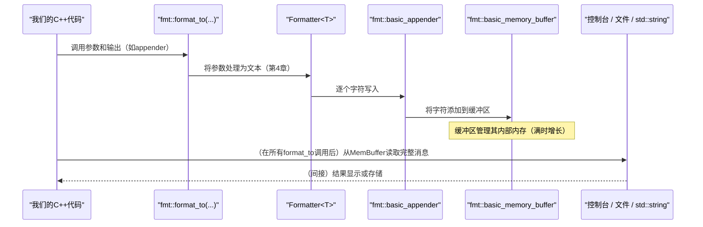

# 第5章：输出缓冲（`basic_memory_buffer`，`basic_appender`）

在[上一章：格式化器（`formatter<T, Char>`）](04_formatter___formatter_t__char____.md)中，我们学习了`fmt`如何==将每个单独的数据片段（如`int`或自定义的`Point`对象）转换为文本表示==。

但一旦生成文本，它会立即去哪里？通常不会直接逐个字符地输出到控制台或文件，因为那样会非常慢

想象一下，我们在将一条长消息写入最终文档或发送之前，会先在==临时便签==上起草。我们不会直接在最终文档中逐个单词写入再擦掉添加下一个单词，而是会在便签上完成整条消息的起草、修改和补充，直到完美后才将完整消息复制到最终目的地。

这个临时便签本质上就是`fmt`中的**输出缓冲**。

它是一个特殊的内存区域，所有格式化文本都会高效地逐字符收集到这里，直到消息完成。然后，整个组装好的消息才会被发送到最终目的地（如控制台、文件或程序的其他部分）。这一过程显著加快了格式化速度，尤其是对于许多小型格式化操作。

## 核心工具：`basic_memory_buffer`和`basic_appender`

这两个组件是`fmt`高效输出缓冲系统的核心：

1. **`basic_memory_buffer`**：这是我们的灵活**“临时便签”**。它类似于一个特殊的动态数组（类似于`std::vector<char>`），`fmt`用它来存储字符。它的智能之处在于可以==随着更多文本的添加自动增长，确保始终有足够的空间==。它优化了频繁的内存重新分配问题，因为这种操作可能代价高昂。当我们使用`memory_buffer`时，通常使用的是`basic_memory_buffer<char>`。

2. **`basic_appender`**：这是我们的高效**“笔”**，用于写入便签。`basic_appender`是一个==输出迭代器==（C++中的一个概念，允许以通用方式写入各种目的地），它知道如何快速将字符添加到`basic_memory_buffer`的末尾。它专为速度设计，==直接推送字符==，避免了某些通用迭代器可能带来的开销。

它们共同构成了一个强大的组合，通过==最小化直接I/O操作和内存管理开销==，使`fmt`的格式化变得极其高效

## 使用场景：在内存中构建消息

在[第1章：输入/输出适配器（`fmt::print`，`fmt::format_to`，`fmt::output_file`）](01_input_output_adapters___fmt__print____fmt__format_to____fmt__output_file___.md)中，我们简要看到了`fmt::format_to`用于在内存中构建字符串。现在让我们看看`basic_memory_buffer`和`basic_appender`如何与它一起使用。

假设我们正在创建一个复杂的日志条目。我们希望逐部分构建它，然后在完成后将其打印到日志文件或通过网络发送。

```cpp
#include <fmt/format.h> // 用于fmt::format_to, fmt::memory_buffer, fmt::appender
#include <string>       // 用于std::string转换

int main() {
    // 1. 创建临时便签（字符缓冲区）
    fmt::memory_buffer log_buffer;

    // 2. 创建高效笔（缓冲区的appender）
    auto appender = fmt::appender(log_buffer);

    // 3. 使用笔将格式化部分写入便签
    fmt::format_to(appender, "时间戳: {}", 1678886400); // 添加第一部分
    fmt::format_to(appender, ", 事件: {}", "用户登录"); // 添加第二部分
    fmt::format_to(appender, ", 用户ID: {}", 123);      // 添加第三部分

    // 4. 完成后，将便签内容转换为标准字符串
    std::string final_log_message = fmt::to_string(log_buffer);

    // 5. 将完整消息打印到控制台（或保存到文件、发送等）
    fmt::println("{}", final_log_message);
    // 输出: 时间戳: 1678886400, 事件: 用户登录, 用户ID: 123
    return 0;
}
```

**解释：**

- `fmt::memory_buffer log_buffer;`创建一个空的、灵活的内存缓冲区。它开始时有一个小的固定大小内部存储，但如果需要，可以向系统请求更多内存。
- `auto appender = fmt::appender(log_buffer);`创建我们的“笔”。这个`appender`是一个轻量级对象，高效地直接写入`log_buffer`。
- 每个`fmt::format_to`调用将其格式化输出写入`appender`，后者再将字符添加到`log_buffer`。
- 最后，`fmt::to_string(log_buffer)`将`log_buffer`中积累的所有字符放入`std::string`。

这种方法确保所有格式化工作都在内存中完成，直到整个消息准备好发送到最终目的地时才进行缓慢的系统调用。

## 底层机制：缓冲系统

让我们深入看看`fmt`的缓冲系统是如何高效实现这一切的。

### 流程：格式化到缓冲区

当我们调用`fmt::format_to`等`fmt`函数时，以下是涉及输出缓冲的简化事件序列：



此图显示`Formatter`不会直接写入最终输出，而是写入`Appender`，后者再更新`Memory Buffer`。这种间接性是性能的关键。

### 探讨：`basic_memory_buffer`的内部结构

`basic_memory_buffer`（定义在`include/fmt/format.h`中）在内存管理方面非常聪明。它使用一个小的固定大小数组**位于`basic_memory_buffer`对象内部**来存储小字符串。如果我们的消息足够小，这完全避免了动态内存分配。如果不够，它会动态分配内存。

以下是其结构的简化视图：

```cpp
// 来自include/fmt/format.h（简化）
template <typename T, size_t SIZE = inline_buffer_size, typename Allocator = detail::allocator<T>>
class basic_memory_buffer : public detail::buffer<T> {
private:
  T store_[SIZE]; // 小的内联缓冲区
  FMT_NO_UNIQUE_ADDRESS Allocator alloc_; // 动态内存的分配器

  // 动态增长缓冲区的函数
  static FMT_CONSTEXPR20 void grow(detail::buffer<T>& buf, size_t size) {
    // ... 计算新容量的逻辑 ...
    // 如果当前数据在'store_'中，则复制到新的动态内存。
    // 如果已经是动态的，则重新分配并复制。
    // 使用alloc_.allocate(new_capacity)和memcpy。
  }

public:
  // ... 构造函数、析构函数、size()、capacity()、data()等 ...
};
```

**`basic_memory_buffer`的关键特性：**

| 特性                        | 描述                                                         |
| :-------------------------- | :----------------------------------------------------------- |
| **`store_`数组**            | 这是一个内部的固定大小数组（默认为`char`的`inline_buffer_size = 500`字符）。如果格式化文本足够小，它会直接写在这里，完全避免堆分配。这是对常见小字符串的主要优化。 |
| **动态增长（`grow`函数）**  | 如果`store_`填满，会调用`grow`函数。它计算一个新的更大的容量（通常加倍），并使用`Allocator`（通常是`fmt::detail::allocator`，使用`malloc`/`free`）分配内存。然后将现有内容复制到新的更大的缓冲区。这种策略最小化了重新分配的次数。 |
| **`detail::buffer<T>`基类** | `basic_memory_buffer`继承自`detail::buffer<T>`，为所有`fmt`的内部缓冲区提供了一个通用接口（`data()`、`size()`、`capacity()`、`push_back()`、`append()`），无论其具体存储策略如何。 |

### 探讨：`basic_appender`的简洁性

`basic_appender`（定义在`include/fmt/base.h`中）要简单得多。它本质上是一个指向`detail::buffer`的指针的包装器，并实现了`OutputIt`概念，这意味着它有`operator*`、`operator++`和`operator=`。

```cpp
// 来自include/fmt/base.h（简化）
template <typename T>
class basic_appender {
protected:
  detail::buffer<T>* container; // 指向它写入的缓冲区的指针

public:
  FMT_CONSTEXPR basic_appender(detail::buffer<T>& buf) : container(&buf) {}

  // 当字符“赋值”给appender时，它会推送到缓冲区。
  FMT_CONSTEXPR20 auto operator=(T c) -> basic_appender& {
    container->push_back(c);
    return *this;
  }

  // 这些让它表现得像标准输出迭代器。
  FMT_CONSTEXPR20 auto operator*() -> basic_appender& { return *this; }
  FMT_CONSTEXPR20 auto operator++() -> basic_appender& { return *this; }
  FMT_CONSTEXPR20 auto operator++(int) -> basic_appender { return *this; }
};
```

`basic_appender`之所以高效，是因为：
- 它直接持有`detail::buffer`的指针，避免了任何虚函数调用或复杂的分派。
- 它的`operator=`直接调用`container->push_back(c)`，这通常是一个非常快的操作（只是写入一个字符并递增计数器），尤其是在缓冲区有容量时。
- 它完全避免了在中间格式化步骤中创建临时的`std::string`对象。

`basic_appender`和`basic_memory_buffer`之间的这种直接、低开销的交互是`fmt`性能的基石。

## 结论

在本章中，我们探讨了`fmt`的核心输出缓冲机制，重点关注：

- **`basic_memory_buffer`**：动态的“临时便签”，高效存储格式化字符，利用小的内联缓冲区避免小字符串的分配，并在需要时动态增长。
- **`basic_appender`**：高效的“笔”，以最小开销直接将字符写入`basic_memory_buffer`，作为`fmt`的优化输出迭代器。

我们已经了解了`fmt`如何在内存中收集格式化文本，确保像I/O和内存重新分配这样的高成本操作被最小化，从而实现快速高效的消息生成。

这种缓冲是在[输入/输出适配器（`fmt::print`，`fmt::format_to`，`fmt::output_file`）](01_input_output_adapters___fmt__print____fmt__format_to____fmt__output_file___.md)交付最终格式化输出之前的一个内部步骤。

现在我们已经理解了`fmt`如何==高效地构建格式化消息==，在下一章中，我们将深入探讨另一种高级优化技术：[格式化字符串编译（`FMT_COMPILE`，`compiled_string`）](06_format_string_compilation___fmt_compile____compiled_string___.md)，它可以通过在==编译时执行解析==来使我们的格式化更快。

