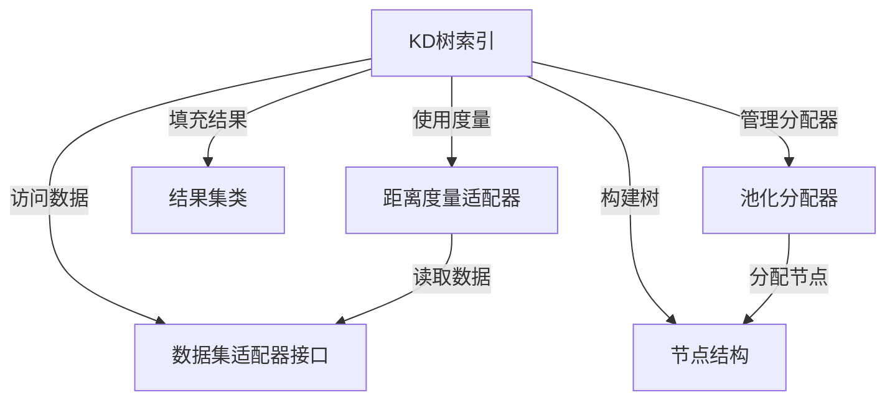

# docss：nanoflann

`nanoflann` 是一个**仅头文件的C++库**，提供了一种*高效*的方式将数据点组织成**KD树**结构。这使得*极速最近邻搜索*（例如找到离查询点最近的点）成为可能，而无需将现有数据复制到新格式中。它支持多种*距离度量*，并能处理固定和动态变化的数据集。

## 可视化

## 章节

1. [数据集适配器接口](01_dataset_adaptor_interface_.md)
2. [距离度量适配器](02_distance_metric_adaptors_.md)
3. [KD树索引](03_kd_tree_index_.md)
4. [结果集类](04_result_set_classes_.md)
5. [节点结构](05_node_structure_.md)
6. [池化分配器](06_pooled_allocator_.md)

---

