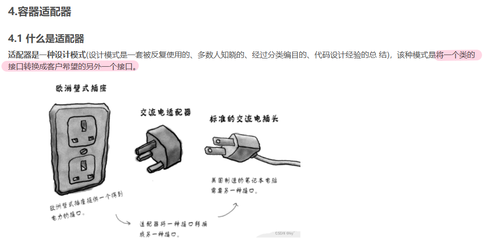
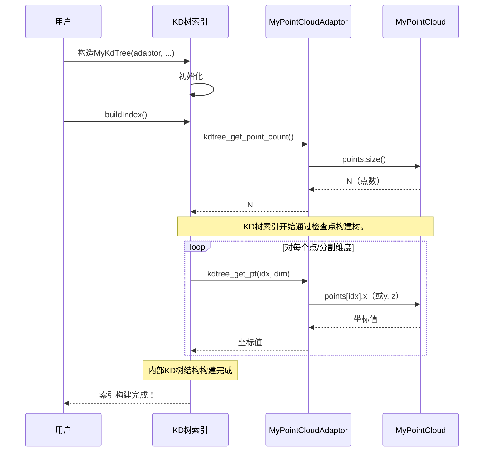

# 第1章：数据集适配器接口

欢迎来到`nanoflann`

如果想在数据上执行闪电般快速的最近邻搜索，那么你来对地方了

在我们深入探讨强大的KD树之前，首先需要教会`nanoflann`如何理解数据。

这就是**数据集适配器接口**的用武之地。

## 万能数据插头适配器

想象一下，有一个来自其他国家的酷炫小工具，但它的插头与你的墙插不兼容。你既不想剪断电线，也不想重新布线整个房子。

前文传送：[10.STL中stack和queue的基本使用(附习题）](https://blog.csdn.net/2301_80171004/article/details/139031207?ops_request_misc=%257B%2522request%255Fid%2522%253A%25228ac15a9cb67a9e9c4a771f1b12dd23e1%2522%252C%2522scm%2522%253A%252220140713.130102334.pc%255Fblog.%2522%257D&request_id=8ac15a9cb67a9e9c4a771f1b12dd23e1&biz_id=0&utm_medium=distribute.pc_search_result.none-task-blog-2~blog~first_rank_ecpm_v1~rank_v31_ecpm-3-139031207-null-null.nonecase&utm_term=%E9%80%82%E9%85%8D%E5%99%A8&spm=1018.2226.3001.4450)



相反，会使用一个万能插头适配器！这个适配器不会复制你的小工具，而是充当一个==翻译器==，让你的小工具插头能够适配你的插座。

`nanoflann`的数据集适配器接口正是这样工作的。你可能已经以某种特定方式存储了数据——可能是一个自定义点结构的`std::vector`，或者是一个矩阵。`nanoflann`==不会强迫==将所有数据==复制==到它自己的特殊格式中。相反，你可以创==建一个小的“适配器”，教会`nanoflann`如何“读取”==你现有的数据结构。

- 这种方式非常高效，因为它避免了内存重复，对于大型数据集尤为重要。

## 你的数据，`nanoflann`的规则

为了让`nanoflann`理解你的数据，你需要在适配器中实现几个简单的函数。这些函数充当“翻译规则”。

假设你有一个存储3D点的常见数据结构：

```cpp
// 你现有的3D点数据结构
struct MyPoint {
    float x, y, z;
};

struct MyPointCloud {
    std::vector<MyPoint> points;
    // ... 可能还有其他数据或方法 ...
};
```

现在，我们来看看适配器需要做什么。

## 关键适配器函数

你的自定义适配器类需要实现三个关键函数（其中一个是可选的，但建议实现）：

1. **`kdtree_get_point_count()`**：`nanoflann`需要知道你的数据集中有多少个数据点。
2. **`kdtree_get_pt(idx, dim)`**：`nanoflann`会频繁询问特定点（`idx`）的特定坐标（`dim`）的值。
3. **`kdtree_get_bbox(bb)`（可选）**：你可以告诉`nanoflann`是否已经计算了数据集的边界框（包围所有点的最小盒子）。如果不提供，`nanoflann`会自行计算。从该函数返回`false`表示`nanoflann`应自行计算。

以下是为我们的`MyPointCloud`示例创建`MyPointCloudAdaptor`的方式：

```cpp
// 教会nanoflann如何读取MyPointCloud的桥梁
struct MyPointCloudAdaptor {
    const MyPointCloud& data_source; // 保存对你实际数据的引用

    // 构造函数：存储对你的数据的引用
    MyPointCloudAdaptor(const MyPointCloud& source) : data_source(source) {}

    // 1. 告诉nanoflann你有多少个点
    inline size_t kdtree_get_point_count() const {
        return data_source.points.size();
    }

    // 2. 告诉nanoflann如何获取特定点（idx）的坐标（x、y或z）
    inline float kdtree_get_pt(const size_t idx, const size_t dim) const {
        if (dim == 0) return data_source.points[idx].x;
        else if (dim == 1) return data_source.points[idx].y;
        else return data_source.points[idx].z;
    }

    // 3. （可选）告诉nanoflann你是否已预先计算边界框
    template <class BBOX>
    bool kdtree_get_bbox(BBOX& /* bb */) const {
        return false; // 让nanoflann计算边界框
    }
};
```

**解释：**
- `MyPointCloudAdaptor`并不“拥有”数据，它只是保存了对你的`MyPointCloud`对象的`const`引用。这意味着没有数据复制！
- `kdtree_get_point_count()`返回点的总数。
- `kdtree_get_pt()`接收一个`idx`（要访问的点）和`dim`（坐标：0表示x，1表示y，2表示z），然后返回请求的值。`inline`关键字和`if/else`结构（当`dim`在编译时已知时，这在`nanoflann`中很常见）允许非常高效的访问。
- `kdtree_get_bbox()`是模板化的，用于告诉`nanoflann`是否已计算边界框。为了简单起见，我们返回`false`，让`nanoflann`处理它。

## 连接到KD树

一旦你有了数据和适配器，就可以创建一个`nanoflann`的KD树索引。这个索引将使用你的适配器来访问实际的点数据。

以下是使用我们的示例创建和构建KD树的方式：

```cpp
// 1. 创建你的数据结构并填充数据
MyPointCloud cloud;
cloud.points.push_back({1.0f, 2.0f, 3.0f});
cloud.points.push_back({4.0f, 5.0f, 6.0f});
cloud.points.push_back({7.0f, 8.0f, 9.0f});
// ... 添加更多点 ...

// 2. 创建适配器实例，将其链接到你的数据
MyPointCloudAdaptor adaptor(cloud);

// 3. 定义你的KD树索引类型
//    我们使用L2_Simple_Adaptor计算平方欧氏距离，
//    MyPointCloudAdaptor作为数据集，并指定3维。
using MyKdTree = nanoflann::KDTreeSingleIndexAdaptor<
    nanoflann::L2_Simple_Adaptor<float, MyPointCloudAdaptor>,
    MyPointCloudAdaptor,
    3 // 维度（x, y, z）
>;

// 4. 构建KD树索引
//    - 第一个'3'是维度。
//    - 'adaptor'是我们的数据集适配器。
//    - '{10}'设置叶子节点中的最大点数（一个调优参数）。
MyKdTree index(3, adaptor, {10});
index.buildIndex(); // 构建KD树结构
```

调用`index.buildIndex()`后，`nanoflann`会使用你在`MyPointCloudAdaptor`中提供的函数，将你的`MyPointCloud`数据组织成树结构。

## `nanoflann`如何使用适配器（底层原理）

当你调用`buildIndex()`时，`nanoflann`需要构建KD树。这涉及反复询问你的适配器：
- “你有多少个点？”（通过`kdtree_get_point_count()`）
- “这个特定点的X、Y或Z坐标是什么？”（通过`kdtree_get_pt()`）
- “你的数据集的边界框是什么？”（通过`kdtree_get_bbox()`）

以下是简化的交互序列：



查看`nanoflann.hpp`文件，`KDTreeSingleIndexAdaptor`类（在我们的示例中使用）继承自`KDTreeBaseClass`。这个基类和适配器本身通过`dataset_`成员（即你的`MyPointCloudAdaptor`实例）调用`kdtree_get_point_count()`和`kdtree_get_pt()`方法。

例如，在`KDTreeBaseClass`中（来自`include/nanoflann.hpp`的相关部分）：

```cpp
// ... 在nanoflann::KDTreeBaseClass中 ...

// 辅助函数访问数据集点：
ElementType dataset_get(
    const Derived& obj, IndexType element, Dimension component) const
{
    // obj.dataset_指向你的适配器对象
    return obj.dataset_.kdtree_get_pt(element, component);
}

// ... 稍后，在buildIndex()或相关方法中 ...
void computeBoundingBox(BoundingBox& bbox)
{
    // ...
    if (dataset_.kdtree_get_bbox(bbox)) // 调用你的kdtree_get_bbox
    {
        // 完成！
    }
    else
    {
        // ... 如果你的kdtree_get_bbox返回false，nanoflann会通过
        // 反复调用kdtree_get_pt()来计算它
        // 例如：
        // bbox[i].low = bbox[i].high = this->dataset_get(*this, Base::vAcc_[0], i);
        // ...
    }
}
```

这表明`nanoflann`如何透明地使用你的适配器函数与原始数据交互，同时将核心KD树逻辑与你的特定数据存储分离。

## 结论

数据集适配器接口是你使用`nanoflann`的第一步。通过实现几个简单的函数，你可以为`nanoflann`提供“如何读取”自定义数据结构的必要指令，而无需数据复制的开销。这种优雅的设计使`nanoflann`灵活、高效且易于集成到你的C++项目中。

现在我们已经了解了`nanoflann`如何访问你的数据，在下一章中，我们将探讨它如何通过不同的[距离度量适配器](02_distance_metric_adaptors_.md)测量点之间的距离。

