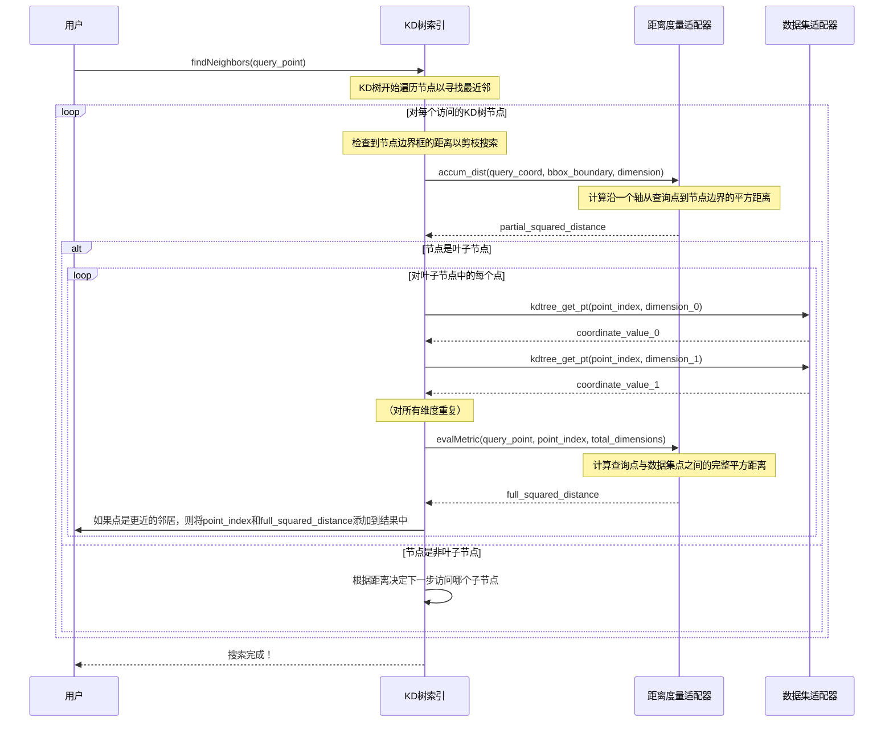

# 第2章：距离度量适配器

在[第1章：数据集适配器接口](01_dataset_adaptor_interface_.md)中，我们学习了如何构建一个桥梁——`Dataset Adaptor`，教会`nanoflann`如何访问和理解自定义数据的*结构*。但理解结构只是成功的一半。为了找到“最近邻”，`nanoflann`还需要知道如何衡量点之间的**接近程度**。这就是**距离度量适配器**的用武之地！

## 为任务选择合适的尺子

想象一下，你试图在一群人中找到“最接近”的那个人。“最接近”是什么意思？
- 如果你在寻找物理上最近的人，你会使用卷尺（欧氏距离）。
- 如果你在城市中且只能沿着街道行走，你会测量他们距离你几个街区（曼哈顿距离）。
- 如果你在比较两个罗盘航向，直接的角度差可能不够；350度“更接近”10度，而不是180度（角度距离）。

就像你会根据不同情况选择不同的尺子一样，`nanoflann`需要一个特定的“距离度量适配器”来准确衡量数据的接近程度。这个组件告诉KD树*如何*计算点之间的距离，使其能够根据你对“接近”的定义高效地找到邻居。

## 什么是距离度量适配器？

距离度量适配器是一个小类，`nanoflann`将其用作“距离计算器”。它负责两种主要类型的距离计算：

1. **`evalMetric(query_point, dataset_point_index, dimensions)`**：此函数计算`query_point`（你搜索的起点）与数据集中特定点（由`dataset_point_index`标识）之间的*完整距离*。
2. **`accum_dist(coord_a, coord_b, dimension_index)`**：此函数计算*部分距离*（或其分量）沿单个维度。KD树在内部使用此函数快速估计到边界框的距离，从而帮助剪枝（跳过）距离过远的树部分，加速搜索。

`nanoflann`提供了几种内置的度量适配器，覆盖常见场景。让我们来看一些例子。

### `nanoflann`中的常见距离度量

`nanoflann`提供了几种现成的距离度量适配器：

- **欧氏距离（L2平方）**：
  - **`nanoflann::L2_Simple_Adaptor`**：这是几何数据（如2D或3D点）最常见的选择。它计算*平方*欧氏距离（每个坐标的平方差之和）。为什么用平方？因为比较平方距离与比较实际距离在最近邻搜索中效果相同，而且避免了计算开销较大的平方根操作，速度更快！只有在最终需要*实际*距离时才需要平方根。
  - **`nanoflann::L2_Adaptor`**：与`L2_Simple_Adaptor`类似，但针对高维数据集进行了优化。对于典型的2D或3D点，`L2_Simple_Adaptor`通常足够。

- **曼哈顿距离（L1）**：
  - **`nanoflann::L1_Adaptor`**：也称为“城市街区”距离。它计算坐标的绝对差之和。想象一下在网格状城市中导航：你只能沿着水平或垂直街道移动。

- **专用度量（用于角度和旋转）**：
  - **`nanoflann::SO2_Adaptor`**：专为1D角度（如罗盘航向）设计。它正确处理“环绕”效应（例如，350度距离10度仅20度，而不是340度）。
  - **`nanoflann::SO3_Adaptor`**：用于3D旋转，通常用四元数表示。此适配器计算两个旋转之间的距离。

## 如何使用距离度量适配器

在[第1章：数据集适配器接口](01_dataset_adaptor_interface_.md)中，我们看到了如何使用`KDTreeSingleIndexAdaptor`创建`nanoflann`的KD树索引。距离度量是该类的*第一个*模板参数。

让我们继续使用第1章中的`MyPointCloud`和`MyPointCloudAdaptor`。要为我们的3D点使用`L2_Simple_Adaptor`（平方欧氏距离）：

```cpp
// 1. （从第1章）创建你的数据结构并填充数据
MyPointCloud cloud;
cloud.points.push_back({1.0f, 2.0f, 3.0f});
cloud.points.push_back({4.0f, 5.0f, 6.0f});
// ... 添加更多点 ...

// 2. （从第1章）创建适配器实例，将其链接到你的数据
MyPointCloudAdaptor adaptor(cloud);

// 3. 定义你的KD树索引类型。
//    第一个模板参数是我们的距离度量适配器：L2_Simple_Adaptor
using MyKdTree = nanoflann::KDTreeSingleIndexAdaptor<
    nanoflann::L2_Simple_Adaptor<float, MyPointCloudAdaptor>, // <-- 我们的距离度量！
    MyPointCloudAdaptor,                                    // <-- 我们的数据集适配器
    3                                                       // <-- 维度数
>;

// 4. 构建KD树索引
MyKdTree index(3, adaptor, {10}); // 3维，我们的适配器，每个叶子节点最多10个点
index.buildIndex(); // 构建KD树结构
```
**解释：**

- `nanoflann::L2_Simple_Adaptor<float, MyPointCloudAdaptor>`指定我们使用平方欧氏距离。
  - `float`是坐标的数据类型（与`MyPoint`的`x, y, z`匹配）。
  - `MyPointCloudAdaptor`告诉度量适配器*如何*访问数据集中的点（它会在内部调用`kdtree_get_pt`）。
- `KDTreeSingleIndexAdaptor`定义的其余部分和构造过程与第1章相同。

如果你想使用曼哈顿距离，只需将`L2_Simple_Adaptor`替换为`L1_Adaptor`：

```cpp
// ... （MyPointCloud和适配器设置如前） ...

// 使用L1_Adaptor定义KD树索引类型
using MyKdTreeL1 = nanoflann::KDTreeSingleIndexAdaptor<
    nanoflann::L1_Adaptor<float, MyPointCloudAdaptor>, // <-- 现在使用L1度量
    MyPointCloudAdaptor,
    3
>;

// 构建KD树索引
MyKdTreeL1 indexL1(3, adaptor, {10});
indexL1.buildIndex();
```

### 创建自定义距离度量

`nanoflann`非常灵活！如果内置度量都不符合你的需求，你可以创建自定义的距离度量适配器。只需提供一个实现`evalMetric`和`accum_dist`方法的类，并有一个构造函数，将`DataSource`（你的数据集适配器）作为其第一个参数。

以下是一个简化示例，展示如何创建一个基于幂的自定义度量（类似于L_p范数），并带有一个自定义参数`_myParam`：

```cpp
template <class T, class DataSource, typename _DistanceType = T>
struct My_Custom_Metric_Adaptor {
    using ElementType  = T;
    using DistanceType = _DistanceType;

    const DataSource& data_source; // 对数据集适配器的引用
    double _myParam = 1.0;         // 我们的自定义参数

    // 构造函数：接收数据源和我们的自定义参数
    My_Custom_Metric_Adaptor(const DataSource& _data_source, double myParam)
        : data_source(_data_source), _myParam(myParam) {}

    // 计算两点之间的完整自定义距离
    inline DistanceType evalMetric(const T* a, const size_t b_idx, size_t size) const {
        DistanceType result = DistanceType();
        for (size_t i = 0; i < size; ++i) {
            const DistanceType diff = a[i] - data_source.kdtree_get_pt(b_idx, i);
            result += std::pow(std::abs(diff), _myParam); // 自定义距离逻辑
        }
        return result;
    }

    // 沿单个维度累积部分距离
    template <typename U, typename V>
    inline DistanceType accum_dist(const U a, const V b, const size_t) const {
        return std::pow(std::abs(a - b), _myParam); // 自定义累积逻辑
    }
};
```
**解释：**
- 此适配器在构造函数中接收`myParam`，并在距离计算中使用它。
- `evalMetric`通过对每个维度的`std::pow(std::abs(diff), _myParam)`求和来计算总距离。
- `accum_dist`对单个维度执行相同的计算，这对KD树的内部逻辑非常重要。

要使用此自定义度量并传递其`_myParam`值：

```cpp
// ... （MyPointCloud和适配器设置） ...

using MyKdTreeCustom = nanoflann::KDTreeSingleIndexAdaptor<
    My_Custom_Metric_Adaptor<float, MyPointCloudAdaptor>, // <-- 我们的自定义度量
    MyPointCloudAdaptor,
    3
>;

const double customPower = 4.0; // 我们的自定义_myParam的值
// 将customPower传递给KDTree构造函数，它会将其转发给度量的构造函数
MyKdTreeCustom indexCustom(3, adaptor, {10}, customPower);
indexCustom.buildIndex();
```
`nanoflann`会自动将`KDTreeSingleIndexAdaptor`构造函数中的任何额外参数转发给你的自定义距离度量构造函数，从而轻松配置你的度量。

## `nanoflann`如何使用度量适配器（底层原理）

KD树结构的核心是高效组织点以加速搜索。距离度量适配器对这种效率至关重要。

当你调用`buildIndex()`时：
- `nanoflann`需要通过沿特定维度（例如，先按X坐标，再按Y，最后按Z）“分割”将数据集划分为更小的组。
- 在此过程中，它可能使用`accum_dist`函数计算点在不同维度上的“分散程度”，以决定最佳分割方式，并计算每个节点的边界框。

当你调用`findNeighbors()`时：
- KD树从根节点开始遍历树。在每个内部节点，它需要决定哪个子分支（左或右）“更接近”你的`query_point`。
- 更重要的是，它需要确定是否可以跳过*整个分支*，因为其边界框与`query_point`的距离比目前找到的最佳邻居更远。这时会大量使用`accum_dist`：它计算`query_point`到节点边界框的距离。如果这个最小边界框距离大于当前找到的“最差”（最远）邻居，则剪枝该分支。
- 当搜索到达“叶子节点”（包含少量实际点的节点）时，`nanoflann`遍历这些点。对每个点，它调用`evalMetric`函数计算与`query_point`的*精确*距离，并将其添加到结果集中（如果是最近的邻居之一）。

以下是搜索过程中这些交互的简化序列图：



查看`nanoflann.hpp`源代码，可以看到`KDTreeSingleIndexAdaptor`如何使用你的`distance_`对象：

```cpp
// ... 在nanoflann::KDTreeSingleIndexAdaptor的构造函数中 ...
// 初始化distance_成员，传递数据集适配器和任何额外参数。
distance_(inputData, std::forward<Args>(args)...)
// ...

// ... 在KDTreeSingleIndexAdaptor::searchLevel中（简化） ...
template <class RESULTSET>
bool searchLevel(RESULTSET& result_set, const ElementType* vec, ...) const
{
    // ... 处理叶子节点时 ...
    DistanceType dist = distance_.evalMetric(
        vec, accessor, (DIM > 0 ? DIM : Base::dim_)); // <-- 调用evalMetric！
    if (dist < worst_dist) { /* ... */ }

    // ... 剪枝其他分支时 ...
    DistanceType cut_dist; // ... 使用distance_.accum_dist计算 ...
    if (mindist * epsError <= result_set.worstDist()) { /* ... 递归到其他子节点 ... */ }
}
```
这表明`nanoflann`如何巧妙地将数据访问（通过你的[数据集适配器](01_dataset_adaptor_interface_.md)）和距离计算（通过你的距离度量适配器）的关注点分离。

## `nanoflann`内置距离度量总结

以下是`nanoflann`中标准距离度量适配器的快速概述：

| 度量类型               | `nanoflann`适配器   | 描述                                                         | `evalMetric`计算方式     |
| :--------------------- | :------------------ | :----------------------------------------------------------- | :----------------------- |
| **欧氏距离（L2）平方** | `L2_Simple_Adaptor` | 2D/3D点的标准“直线”距离。返回平方距离以提高性能。适用于大多数点云数据。 | 每个维度的平方差之和     |
| **欧氏距离（L2）平方** | `L2_Adaptor`        | 与`L2_Simple_Adaptor`类似，但针对高维数据集优化。返回平方距离。 | 每个维度的平方差之和     |
| **曼哈顿距离（L1）**   | `L1_Adaptor`        | “城市街区”或“出租车”距离。坐标的绝对差之和。                 | 每个维度的绝对差之和     |
| **角度距离（SO2）**    | `SO2_Adaptor`       | 专为1D角度数据设计。正确处理角度的周期性（例如，359度接近0度）。假设角度归一化为`[-pi, pi]`。 | 考虑环绕的最小绝对角度差 |
| **旋转距离（SO3）**    | `SO3_Adaptor`       | 用于3D旋转数据（通常用四元数表示）。内部在四元数分量上使用`L2_Simple_Adaptor`来测量旋转相似性。 | 四元数分量的平方差之和   |

## 结论

你现在明白了，`nanoflann`不仅仅是一个适用于所有最近邻搜索问题的通用解决方案。通过使用**距离度量适配器**，你可以告诉`nanoflann`如何为你的特定数据类型和问题精确衡量“接近程度”，无论是标准的3D点、复杂角度，还是完全自定义的数据。这种灵活性确保了高效且有意义的搜索结果。

通过[数据集适配器](01_dataset_adaptor_interface_.md)理解你的数据结构，并通过距离度量适配器处理你对距离的定义，`nanoflann`已经掌握了构建其强大内部数据结构——KD树所需的所有信息。在下一章中，我们将深入探讨`nanoflann`的核心：[KD树索引](03_kd_tree_index_.md)本身
