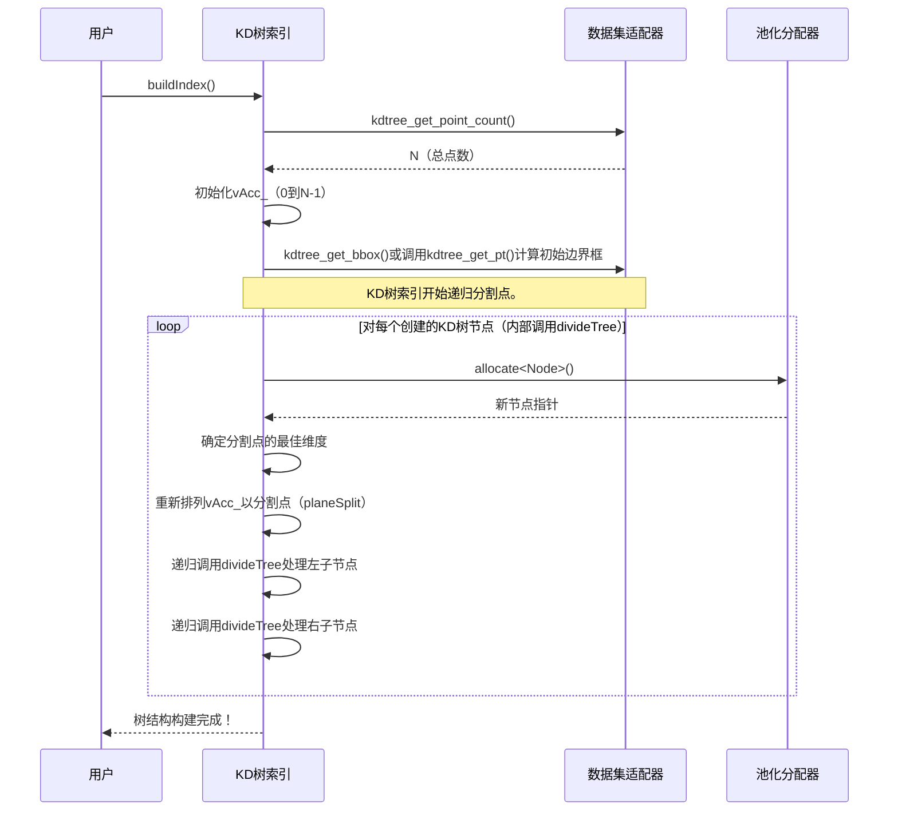

# 第3章：KD树索引

在[第1章：数据集适配器接口](01_dataset_adaptor_interface_.md)中，学会了如何教会`nanoflann`“==读取==”数据。

接着，在[第2章：距离度量适配器](02_distance_metric_adaptors_.md)中，我们展示了如何指导它“如何==测量==”数据点之间的距离。

现在，是时候将这些部分结合起来，深入探讨`nanoflann`的核心引擎：**KD树索引**！

## 数据点的数字图书管理员

想象一下，有一个巨大的图书馆，里面堆满了数百万本书，但它们都随机散落在地板上。如果有人让你找到所有关于“猫”的书，出版于“法国”，作者名为“Pierre”，你必须*逐本检查每一本书*。这将花费很长时间！

现在，假设图书馆采用了一种巧妙的系统：
1. 所有书籍按主题分类。
2. 在每个主题下，按国家分类。
3. 在每个国家下，按作者分类。

这样快多了！你可以迅速找到“猫”的部分，然后是“法国”的子部分，再查找“Pierre”。你不需要检查关于狗的书，或者来自德国的书，或者作者是Maria的书。

**KD树索引**正是这种为数据点服务的聪明图书管理员。给`nanoflann`一组数据（空间中的数据点），它会将它们组织成一个特殊的树结构——**KD树**。这棵树让`nanoflann`能够快速找到靠近特定位置（你的“查询点”）的数据点，而无需逐一点检查。这就是`nanoflann`速度背后的魔法

## 什么是KD树？

“KD树”代表**K维树**。它是一种特殊的二叉搜索树，用于组织k维空间中的点（其中“k”是数据的特征或维度数量，例如3D点的x、y、z）。

核心思想很简单：
- 它反复将整个空间（你的点所在的空间）划分为越来越小的区域。
- 每次划分沿着数据的一个维度进行（例如，先按X，再按Y，再按Z，然后又是X，依此类推）。
- 每次划分创建两个“子”区域，直到每个区域只包含少量可管理的点。

这种分层划分创建了一个“树”结构，其中树中的每个**节点**代表空间的特定区域，其==子节点代表子区域==。


当你搜索邻居时，`nanoflann`使用这棵树==智能地跳过那些保证距离过远的大块数据。这称为**剪枝**==，正是它让KD树如此高效

## KD树索引的两种类型：静态与动态

`nanoflann`提供了两种主要的KD树索引类型，取决于你的数据在树构建后是否会变化：

### 1. 静态KD树索引（`KDTreeSingleIndexAdaptor`）

这是最常见且通常最快的选项。在以下情况下使用：
- 你的数据点是固定的。你构建KD树一次，之后不期望添加或删除任何点。
- 你需要在同一不变的数据集上执行多次搜索。

可以将其想象为在图书馆中构建一个坚固、永久的书架系统。一旦构建完成，查找书籍非常高效，但你无法轻松添加或删除整个部分，除非重建整个系统。

#### 如何使用静态KD树索引

让我们继续使用前面章节中的`MyPointCloud`和`MyPointCloudAdaptor`。要使用静态KD树，你需要用`nanoflann::KDTreeSingleIndexAdaptor`定义其类型，构造它，然后调用`buildIndex()`。

```cpp
// 1. 准备你的数据及其适配器（来自第1章）
MyPointCloud cloud;
cloud.points.push_back({1.0f, 2.0f, 3.0f});
cloud.points.push_back({4.0f, 5.0f, 6.0f});
cloud.points.push_back({7.0f, 8.0f, 9.0f});
// ... 向'cloud'中添加更多点 ...

MyPointCloudAdaptor adaptor(cloud);

// 2. 定义你的静态KD树索引类型。
//    - nanoflann::L2_Simple_Adaptor：我们的距离度量（第2章）
//    - MyPointCloudAdaptor：我们的数据源（第1章）
//    - 3：维度数（x, y, z）
using MyStaticKdTree = nanoflann::KDTreeSingleIndexAdaptor<
    nanoflann::L2_Simple_Adaptor<float, MyPointCloudAdaptor>,
    MyPointCloudAdaptor,
    3 // 维度
>;

// 3. 构建KD树索引
//    - '3'是维度数。
//    - 'adaptor'是我们的数据集适配器。
//    - '{10}'指定叶子节点最多包含10个点。
//      这是一个调优参数：较小的值意味着更深的树和
//      可能更快的搜索，但树本身占用更多内存。
MyStaticKdTree index(3, adaptor, {10});
index.buildIndex(); // 这将你的数据组织成KD树！

// 现在'index'已完全构建，可以进行闪电般快速的搜索！
// 我们将在第4章中看到如何进行搜索。
```
调用`index.buildIndex()`后，`nanoflann`已在内存中创建了整个树结构，使其准备好进行查询。

### 2. 动态KD树索引（`KDTreeSingleIndexDynamicAdaptor`）

有时你的数据不是固定的。你可能不断收到传感器读数，或者场景中的对象被添加或移除。对于这些情况，`nanoflann`提供了**动态KD树索引**。

- 它允许你在树创建后添加新点和逻辑删除现有点。
- 它不会为每次更改重建整个树（这会很慢），而是巧妙地管理几个较小的静态KD树，以模拟单个动态树。

可以将其想象为一个模块化图书馆，可以快速添加新部分或替换旧部分，而无需对整个建筑进行完全重组。

#### 如何使用动态KD树索引

动态索引使用`nanoflann::KDTreeSingleIndexDynamicAdaptor`创建。它需要一个额外参数：`maximumPointCount`，即你预计存储的最大点数。

```cpp
// 1. 准备你的数据容器及其适配器。
//    cloud可以初始为空。
MyPointCloud dynamic_cloud;
MyPointCloudAdaptor dynamic_adaptor(dynamic_cloud); // 适配器引用我们的动态cloud

// 2. 定义你的动态KD树索引类型。
using MyDynamicKdTree = nanoflann::KDTreeSingleIndexDynamicAdaptor<
    nanoflann::L2_Simple_Adaptor<float, MyPointCloudAdaptor>,
    MyPointCloudAdaptor,
    3 // 维度
>;

// 3. 构建动态KD树索引
//    - '3'维度，'dynamic_adaptor'，'{10}'最大叶子大小。
//    - '1000000'是树预计容纳的最大点数。
//      这帮助nanoflann高效预分配资源。
MyDynamicKdTree dynamic_index(3, dynamic_adaptor, {10}, 1000000);

// 4. 向数据源添加点，然后通知索引
dynamic_cloud.points.push_back({1.0f, 2.0f, 3.0f}); // 添加点0
dynamic_cloud.points.push_back({4.0f, 5.0f, 6.0f}); // 添加点1
dynamic_cloud.points.push_back({7.0f, 8.0f, 9.0f}); // 添加点2
dynamic_index.addPoints(0, 2); // 添加数据集中索引为0、1和2的点

// 5. 你可以稍后添加更多点：
dynamic_cloud.points.push_back({10.0f, 11.0f, 12.0f}); // 添加点3
dynamic_index.addPoints(3, 3); // 添加索引为3的点

// 6. 你也可以逻辑删除点（它们在搜索中被标记为无效）
dynamic_index.removePoint(0); // 原始索引为0的点现在在搜索中被忽略

// 'dynamic_index'始终准备好进行搜索，
// 自动适应添加/删除的点！
```
`addPoints`方法接收原始`MyPointCloud`中新添加的点的索引范围（`start`, `end`）。`removePoint`将特定点标记为逻辑删除，意味着它将在未来的搜索中被忽略。

## 幕后：静态KD树的构建过程

让我们揭开帷幕，看看当你调用静态KD树的`buildIndex()`时发生了什么。

### 树的构建块

在内部，KD树由`Node`对象组成。每个`Node`代表：
- **内部节点**：它有两个子节点，代表一个决策点，空间沿某个维度被分割。
- **叶子节点**：它没有子节点，包含一个实际数据点索引的小列表。

`nanoflann`还使用一个辅助数组`vAcc_`，它存储了对原始数据点索引的重新排序列表。这使得`nanoflann`在树构建过程中可以排序和分割点，而无需移动实际数据，只需重新排列指针（索引）。

`buildIndex()`过程是一个递归分割数据集的舞蹈：

1. **初始化**：`nanoflann`首先创建`vAcc_`，它只是一个列表`0, 1, 2, ..., N-1`（其中N是你的总点数）。然后使用你的[数据集适配器](01_dataset_adaptor_interface_.md)计算整个数据集的边界框（每个维度的最小和最大值）。

2. **递归分割（`divideTree`）**：
   - **停止决策**：如果空间的一个区域（由一个节点表示）包含`leaf_max_size_`个点或更少，它成为一个**叶子节点**。它的`lr.left`和`lr.right`成员存储属于该叶子的`vAcc_`中的索引范围。
   - **寻找最佳分割**：如果不是叶子节点，`nanoflann`查看当前区域的边界框，并找到点“分散”最大的维度。这个维度通常是分割的最佳候选，因为它有助于创建平衡的子树。
   - **分割数据**：它选择一个“分割值”（通常是所选维度分散的中点），然后使用`planeSplit`重新排列`vAcc_`数组。这个函数高效地划分索引，使得所有在`cutfeat`维度上小于`cutval`的点位于一侧，大于的点位于另一侧。
   - **创建子节点**：创建两个新的子节点，每个代表分割的一侧。`divideTree`在这些子节点上递归调用。

以下是`buildIndex()`过程中的简化交互序列：



### 深入代码（简化）

KD树的核心逻辑主要在`include/nanoflann.hpp`中。

**节点结构：**

```cpp
// 来自nanoflann.hpp
struct Node
{
    union
    {
        struct leaf
        {
            Offset left, right;  //!< 叶子节点中的点索引
        } lr;
        struct nonleaf
        {
            Dimension divfeat;  //!< 用于分割的维度。
            DistanceType divlow, divhigh; // 分割值
        } sub;
    } node_type;

    Node *child1 = nullptr, *child2 = nullptr; // 子节点
};
```
这个`Node`结构由一个特殊的`PooledAllocator`分配（我们将在[第6章：池化分配器](06_pooled_allocator_.md)中讨论），以高效管理数千或数百万个节点的内存。`union`是一个巧妙的C++技巧：它允许`lr`（用于叶子数据）和`sub`（用于非叶子数据）共享相同的内存空间，因为一个节点*要么*是叶子节点，*要么*是内部节点，不会同时是两者。

**`buildIndex`方法：**

```cpp
// 简化自KDTreeSingleIndexAdaptor::buildIndex in nanoflann.hpp
void buildIndex()
{
    Base::size_ = dataset_.kdtree_get_point_count();
    init_vind(); // 用0, 1, 2, ..., N-1填充Base::vAcc_
    this->freeIndex(*this); // 清除之前构建的任何树
    Base::size_at_index_build_ = Base::size_;

    if (Base::size_ == 0) return; // 无需构建！

    computeBoundingBox(Base::root_bbox_); // 找到所有点的最小/最大边界

    // 通过递归分割点构建树
    Base::root_node_ = this->divideTree(*this, 0, Base::size_, Base::root_bbox_);
}
```
`divideTree`函数（定义在`KDTreeBaseClass`中）是递归分割发生的地方：

```cpp
// 简化自KDTreeBaseClass::divideTree in nanoflann.hpp
NodePtr divideTree(
    Derived& obj, const Offset left, const Offset right, BoundingBox& bbox)
{
    // 从内存池分配一个新节点
    NodePtr node = obj.pool_.template allocate<Node>();
    const auto dims = (DIM > 0 ? DIM : obj.dim_);

    if ((right - left) <= static_cast<Offset>(obj.leaf_max_size_)) {
        // 这是一个叶子节点：存储点的范围（vAcc_中的索引）
        node->child1 = node->child2 = nullptr;
        node->node_type.lr.left     = left;
        node->node_type.lr.right    = right;
        // 计算该叶子节点的边界框
        // ...（遍历obj.vAcc_[k]并调用obj.dataset_.kdtree_get_pt）...
    } else {
        // 这是一个内部节点：找到最佳分割并递归
        Offset idx;
        Dimension cutfeat;
        DistanceType cutval;
        // 选择一个维度（cutfeat）和值（cutval）进行分割
        middleSplit_(obj, left, right - left, idx, cutfeat, cutval, bbox);

        node->node_type.sub.divfeat = cutfeat; // 存储分割维度

        // 递归构建左子树
        BoundingBox left_bbox(bbox);
        left_bbox[cutfeat].high = cutval;
        node->child1 = this->divideTree(obj, left, left + idx, left_bbox);

        // 递归构建右子树
        BoundingBox right_bbox(bbox);
        right_bbox[cutfeat].low = cutval;
        node->child2 = this->divideTree(obj, left + idx, right, right_bbox);

        // 存储分割的实际边界
        node->node_type.sub.divlow  = left_bbox[cutfeat].high;
        node->node_type.sub.divhigh = right_bbox[cutfeat].low;

        // 更新该父节点的边界框
        // ...（合并left_bbox和right_bbox）...
    }
    return node;
}
```
`middleSplit_`和`planeSplit`函数（也在`KDTreeBaseClass`中）分别处理寻找最佳分割维度/值和重新排列`vAcc_`的实际逻辑。

## 静态与动态KD树的快速比较

以下是静态和动态KD树索引的选择总结：

| 特性           | `KDTreeSingleIndexAdaptor`（静态）                         | `KDTreeSingleIndexDynamicAdaptor`（动态）                    |
| :------------- | :--------------------------------------------------------- | :----------------------------------------------------------- |
| **数据不变性** | 在`buildIndex()`后点固定。                                 | 支持添加（`addPoints()`）和逻辑删除（`removePoint()`）点。   |
| **搜索速度**   | 通常查询最快。                                             | 由于管理多个树和检查删除的点，搜索稍慢。                     |
| **构建速度**   | 如果所有数据已知，初始构建更快。                           | `addPoints()`触发部分重建，对于大型初始数据集可能比单次完整静态构建慢。 |
| **内存使用**   | 优化树结构的最小内存占用。                                 | 更高，因为它可能在内部存储多个较小的KD树。                   |
| **复杂性**     | 固定数据的设置更简单。                                     | 管理动态数据更复杂，需要估计`maximumPointCount`。            |
| **典型用例**   | 大型、不变的数据集（例如固定地图、对象模型、预计算特征）。 | 实时传感器数据、演化模拟、点频繁变化的应用程序。             |

## 结论

KD树索引是`nanoflann`的核心，高效组织你的数据点以实现闪电般快速的最近邻搜索。通过了解你的数据是静态还是动态，你可以选择合适的`nanoflann`适配器（固定数据用`KDTreeSingleIndexAdaptor`，变化数据用`KDTreeSingleIndexDynamicAdaptor`）来构建最优索引。

现在，你的数据已被`nanoflann`理解（通过[数据集适配器接口](01_dataset_adaptor_interface_.md)），距离被正确测量（通过[距离度量适配器](02_distance_metric_adaptors_.md)），KD树已构建，你已准备好实际*获取*搜索结果！在下一章中，我们将探讨`nanoflann`用于传递这些邻居的各种[结果集类](04_result_set_classes_.md)。

