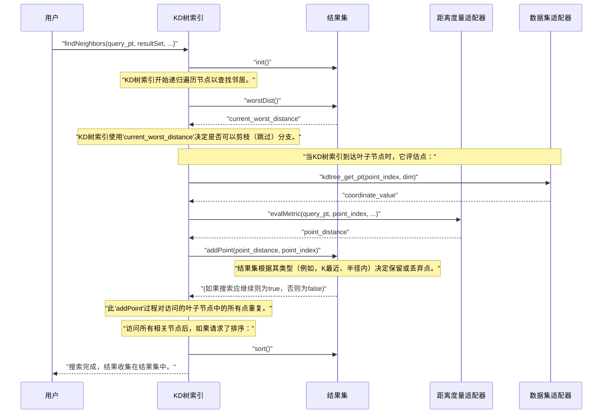

# 第4章：结果集类

在[第1章：数据集适配器接口](01_dataset_adaptor_interface_.md)中，我们学习了如何教会`nanoflann`“读取”你的数据。接着，在[第2章：距离度量适配器](02_distance_metric_adaptors_.md)中，我们展示了如何指导它“如何测量”数据点之间的距离。最后，在[第3章：KD树索引](03_kd_tree_index_.md)中，我们构建了高效组织数据的强大KD树。现在，经过所有这些准备，是时候实际执行搜索并*收集结果*了

## 搜索结果的专用购物车

想象一下，你在一家杂货店（你的KD树索引）里寻找特定商品（邻近的数据点）。你不会随机抓取商品，而是使用购物车！但什么样的购物车呢？

- 如果你需要恰好5件特定商品，你可能会使用一个小巧、有序的篮子（`KNNResultSet`）。你会把5件最佳商品放入其中，不断用更好的商品替换较差的商品，始终保持前5名。
- 如果你需要商店某个区域内的*所有*商品，你会使用一个可扩展的大推车（`RadiusResultSet`）。你只需将所有符合“区域”条件的商品扔进去，无论有多少。
- 如果你需要恰好5件商品，但前提是它们也必须在特定区域内，你会使用一个结合了两种规则的特殊篮子（`RKNNResultSet`）。

在`nanoflann`中，**结果集类**就是这些专用购物车。当你要求KD树查找邻居时，这些类是智能容器，根据你的特定搜索需求管理和保存结果。它们高效地收集找到的点及其距离，有时还会对结果进行排序或限制数量。

让我们看看`nanoflann`提供的主要结果集类及其使用方法。

## 结果集类的类型

`nanoflann`提供了三种主要的结果集类，每种适用于不同类型的最近邻搜索：

1. **`KNNResultSet`**：用于K最近邻（KNN）搜索。
   - **目的**：找到查询点的*固定数量*（`k`）的绝对最近邻居。
   - **工作原理**：此类内部维护一个排序的`k`个结果列表。当KD树找到潜在的邻居时，`KNNResultSet`会检查新点是否比当前存储的*最远*（或“最差”）点更近。如果是，新点替换旧的最差点，列表保持排序。这确保你始终得到`k`个最佳匹配。

2. **`RadiusResultSet`**：用于半径搜索。
   - **目的**：找到查询点*指定最大距离*（半径）内的*所有*邻居。
   - **工作原理**：与`KNNResultSet`不同，此类没有固定容量。它简单地收集所有距离查询点小于给定半径的点。结果通常存储在`std::vector`中，随着找到更多点而增长。默认情况下，结果不按距离排序，但你可以请求排序。

3. **`RKNNResultSet`**：用于半径K最近邻（RKNN）搜索。
   - **目的**：找到*固定数量*（`k`）的最近邻居，但*仅当*它们也在指定的最大距离（半径）内。
   - **工作原理**：这是`KNNResultSet`和`RadiusResultSet`的结合。它维护最多`k`个邻居的排序列表，但任何超出指定半径的潜在邻居都会被忽略，即使它可能是`k`个最近邻之一（如果没有半径限制）。

## 如何使用结果集类

`nanoflann`中的所有搜索操作都使用KD树索引的`findNeighbors()`方法。此方法接收一个结果集类的实例作为参数。

让我们继续使用前面章节中的`MyPointCloud`和`MyKdTree`设置：

```cpp
#include <iostream>
#include <vector>
#include <nanoflann.hpp>

// 你现有的3D点数据结构
struct MyPoint {
    float x, y, z;
};

struct MyPointCloud {
    std::vector<MyPoint> points;
    // ... 可能还有其他数据或方法 ...
};

// 教会nanoflann如何读取MyPointCloud的桥梁
struct MyPointCloudAdaptor {
    const MyPointCloud& data_source;
    MyPointCloudAdaptor(const MyPointCloud& source) : data_source(source) {}
    inline size_t kdtree_get_point_count() const { return data_source.points.size(); }
    inline float kdtree_get_pt(const size_t idx, const size_t dim) const {
        if (dim == 0) return data_source.points[idx].x;
        else if (dim == 1) return data_source.points[idx].y;
        else return data_source.points[idx].z;
    }
    template <class BBOX> bool kdtree_get_bbox(BBOX& /* bb */) const { return false; }
};

// 定义你的KD树索引类型
using MyKdTree = nanoflann::KDTreeSingleIndexAdaptor<
    nanoflann::L2_Simple_Adaptor<float, MyPointCloudAdaptor>,
    MyPointCloudAdaptor,
    3 // 维度（x, y, z）
>;

void perform_searches() {
    // 1. 创建你的数据并填充
    MyPointCloud cloud;
    cloud.points.push_back({1.0f, 2.0f, 3.0f});
    cloud.points.push_back({1.1f, 2.1f, 3.1f});
    cloud.points.push_back({5.0f, 6.0f, 7.0f});
    cloud.points.push_back({5.1f, 6.1f, 7.1f});
    cloud.points.push_back({10.0f, 11.0f, 12.0f});
    cloud.points.push_back({10.2f, 11.2f, 12.2f});
    cloud.points.push_back({1.05f, 2.05f, 3.05f}); // 一个非常接近前两点的点

    // 2. 创建适配器实例
    MyPointCloudAdaptor adaptor(cloud);

    // 3. 构建KD树索引
    MyKdTree index(3, adaptor, {10});
    index.buildIndex();

    // 我们想要查找邻居的查询点
    float query_pt[3] = {1.0f, 2.0f, 3.0f};
```

现在让我们使用不同的结果集类：

### 1. 使用`KNNResultSet`（查找K最近邻）

要找到固定数量的最近点，你会使用`KNNResultSet`。你需要告诉它要找到多少个邻居（`num_results`），并提供数组来存储找到的点的索引和平方距离。

```cpp
    std::cout << "\n--- KNN搜索（k=2）---" << std::endl;

    const size_t num_closest = 2; // 我们想要2个最近邻居

    // 这些向量将存储结果
    std::vector<size_t> knn_indices(num_closest);
    std::vector<float>  knn_dists_sqr(num_closest);

    // 创建KNNResultSet
    nanoflann::KNNResultSet<float, size_t> knn_resultSet(num_closest);

    // 初始化结果集，指向我们的结果向量
    knn_resultSet.init(&knn_indices[0], &knn_dists_sqr[0]);

    // 执行搜索
    index.findNeighbors(knn_resultSet, query_pt);

    // 打印结果
    std::cout << "找到 " << knn_resultSet.size() << " 个KNN结果：" << std::endl;
    for (size_t i = 0; i < knn_resultSet.size(); ++i) {
        std::cout << "  邻居 " << i + 1 << ": 索引 = " << knn_indices[i]
                  << ", 平方距离 = " << knn_dists_sqr[i] << std::endl;
    }
```
**解释：**
- `knn_resultSet(num_closest)`创建一个结果集，它将恰好保存`num_closest`个条目。
- `knn_resultSet.init()`将结果集连接到你的`knn_indices`和`knn_dists_sqr`向量，结果将写入其中。
- `index.findNeighbors()`执行实际搜索，填充你的向量。
- 结果自动按距离排序（升序）。

### 2. 使用`RadiusResultSet`（查找半径内的所有点）

要找到某个距离内的所有点，你会使用`RadiusResultSet`。你提供最大平方半径和一个`std::vector`的`ResultItem`来存储发现。

```cpp
    std::cout << "\n--- 半径搜索（平方半径 = 0.1）---" << std::endl;

    const float search_radius_sqr = 0.1f; // 找到所有在此平方距离内的点

    // 这个向量将存储结果，作为（索引，平方距离）对
    std::vector<nanoflann::ResultItem<size_t, float>> radius_results;

    // 创建RadiusResultSet
    nanoflann::RadiusResultSet<float, size_t> radius_resultSet(search_radius_sqr, radius_results);

    // 初始化结果集（清除radius_results中的任何先前结果）
    radius_resultSet.init();

    // 执行搜索
    // 我们可以传递SearchParameters来请求排序。
    nanoflann::SearchParameters searchParams;
    searchParams.sorted = true; // 请求排序结果
    index.findNeighbors(radius_resultSet, query_pt, searchParams);

    // 打印结果
    std::cout << "找到 " << radius_resultSet.size() << " 个点在平方半径 "
              << search_radius_sqr << " 内：" << std::endl;
    for (const auto& item : radius_results) {
        std::cout << "  点索引 = " << item.first
                  << ", 平方距离 = " << item.second << std::endl;
    }
```
**解释：**
- `radius_resultSet(search_radius_sqr, radius_results)`创建一个半径搜索结果集。`radius_results`是累积找到的项的`std::vector`。
- `radius_resultSet.init()`准备结果集，通常清除`radius_results`。
- 我们使用`nanoflann::SearchParameters`请求结果`sorted`。如果`searchParams.sorted`是`false`（默认），结果可能是任意顺序。

### 3. 使用`RKNNResultSet`（查找半径内的K最近邻）

要找到`k`个最近邻居，但仅在一定半径内，使用`RKNNResultSet`。它的工作方式类似于`KNNResultSet`，但增加了半径约束。

```cpp
    std::cout << "\n--- RKNN搜索（k=2，平方半径 = 0.005）---" << std::endl;

    const size_t rknn_num_closest = 2;
    const float  rknn_search_radius_sqr = 0.005f; // 找到2个最近邻居，但仅在此半径内

    // 这些向量将存储结果
    std::vector<size_t> rknn_indices(rknn_num_closest);
    std::vector<float>  rknn_dists_sqr(rknn_num_closest);

    // 创建RKNNResultSet
    nanoflann::RKNNResultSet<float, size_t> rknn_resultSet(rknn_num_closest, rknn_search_radius_sqr);

    // 初始化结果集
    rknn_resultSet.init(&rknn_indices[0], &rknn_dists_sqr[0]);

    // 执行搜索
    index.findNeighbors(rknn_resultSet, query_pt);

    // 打印结果
    std::cout << "找到 " << rknn_resultSet.size() << " 个RKNN结果：" << std::endl;
    for (size_t i = 0; i < rknn_resultSet.size(); ++i) {
        std::cout << "  邻居 " << i + 1 << ": 索引 = " << rknn_indices[i]
                  << ", 平方距离 = " << rknn_dists_sqr[i] << std::endl;
    }
} // perform_searches函数结束
```
**解释：**
- `rknn_resultSet(rknn_num_closest, rknn_search_radius_sqr)`结合了两种约束。
- 搜索将找到最多`rknn_num_closest`个点，但任何平方距离大于`rknn_search_radius_sqr`的点将被忽略。如果半径内找到的点少于`k`个，`resultSet.size()`将反映这一点。

## 幕后：结果集在搜索期间的工作原理

当你调用`index.findNeighbors(resultSet, query_pt)`时，KD树的遍历开始。结果集在整个过程中扮演关键角色，而不仅仅是在最后。

将KD树索引想象成一个复杂的探索者搜索广阔区域，结果集则是一个聪明的伙伴，带着一个特殊的袋子。

1. **准备**：首先，`KDTree Index`要求`Result Set`执行`init()`。这就像伙伴准备好袋子并清除任何旧物品。
2. **遍历期间**：当`KDTree Index`导航树时，它持续执行两个关键动作：
   - **候选评估**：当搜索到达“叶子节点”（一小组实际点）时，`KDTree Index`遍历这些点。对于每个点：
     - 它向`Dataset Adaptor`请求点的坐标。
     - 然后使用`Distance Metric Adaptor`计算到`query_pt`的精确距离。
     - 最后，它通过调用`addPoint(distance, index)`将此潜在邻居提供给`Result Set`。`Result Set`根据其特定逻辑决定保留或丢弃该点（例如，“这是K个最近的吗？”，“这在半径内吗？”）。
   - **剪枝**：为避免检查肯定太远的树部分，`KDTree Index`频繁询问`Result Set`的`worstDist()`。这个`worstDist()`（当前结果集中最远邻居的距离）作为关键阈值。如果到整个KD树分支的最小可能距离*大于*`worstDist()`，则可以“剪枝”（跳过）整个分支，节省大量时间！
3. **完成**：一旦KD树被完全探索（或剪枝），`nanoflann`可能会调用`Result Set::sort()`，如果请求了排序（例如，通过`RadiusResultSet`的`SearchParameters`）。

以下是交互的简化序列：



### `nanoflann.hpp`源代码中的关键方法

让我们看看`nanoflann.hpp`文件中的简化片段：

```cpp
// 简化自nanoflann::KNNResultSet::addPoint
template <typename _DistanceType, typename _IndexType>
class KNNResultSet {
public:
    // ... 成员如'indices', 'dists', 'capacity', 'count' ...

    bool addPoint(DistanceType dist, _IndexType index) {
        // 找到插入新点的正确位置，保持按距离排序。
        _CountType i;
        for (i = count; i > 0; --i) {
            if (dists[i - 1] > dist) { // 如果新点比现有点更近
                if (i < capacity) {    // 如果容量允许，移动现有点
                    dists[i]   = dists[i - 1];
                    indices[i] = indices[i - 1];
                }
            } else break; // 找到插入点，或新点更差
        }
        if (i < capacity) { // 如果有空间，插入新点
            dists[i]   = dist;
            indices[i] = index;
        }
        if (count < capacity) count++; // 如果未满，增加计数
        return true; // 对于KNN，始终返回true，搜索继续直到找到k个点
    }

    DistanceType worstDist() const {
        return (count < capacity || !count)
                   ? std::numeric_limits<DistanceType>::max() // 如果未满，任何距离都比无穷大更好
                   : dists[count - 1]; // 返回存储的最远邻居的距离
    }
    // ...
};
```
`KNNResultSet`中的`addPoint`方法负责保持前`k`个邻居按距离排序。`worstDist`对剪枝至关重要。

```cpp
// 简化自nanoflann::RadiusResultSet::addPoint
template <typename _DistanceType, typename _IndexType>
class RadiusResultSet {
public:
    const DistanceType radius; // 最大搜索半径
    std::vector<nanoflann::ResultItem<_IndexType, _DistanceType>>& m_indices_dists;
    // ...

    bool addPoint(DistanceType dist, _IndexType index) {
        if (dist < radius) { // 仅当点在半径内时添加
            m_indices_dists.emplace_back(index, dist); // 添加到向量
        }
        return true; // 始终返回true，半径搜索继续直到探索所有分支
    }

    DistanceType worstDist() const {
        return radius; // 剪枝的“最差”距离就是半径本身
    }
    // ...
};
```
对于`RadiusResultSet`，`addPoint`仅检查半径。这里的`worstDist`就是半径，因为任何比它更远的点都会被剪枝。

```cpp
// 简化自KDTreeSingleIndexAdaptor::searchLevel in nanoflann.hpp
template <class RESULTSET>
bool KDTreeSingleIndexAdaptor::searchLevel(
    RESULTSET& result_set, const ElementType* vec, const NodePtr node,
    DistanceType mindist, distance_vector_t& dists, const float epsError) const
{
    // ...
    if (node->child1 == node->child2) // 这是一个叶子节点
    {
        DistanceType worst_dist = result_set.worstDist(); // 获取当前最差距离
        for (Offset i = node->node_type.lr.left; i < node->node_type.lr.right; ++i) {
            const IndexType current_idx = Base::vAcc_[i];
            DistanceType    dist = distance_.evalMetric(vec, current_idx, (DIM > 0 ? DIM : Base::dim_));

            if (dist < worst_dist) { // 仅当比当前最差更近时考虑
                if (!result_set.addPoint(dist, Base::vAcc_[i])) {
                    return false; // 结果集告诉我们停止搜索
                }
            }
        }
        return true; // 继续搜索
    }

    // ... （非叶子节点的逻辑，决定访问哪个子节点） ...

    // 剪枝检查：如果到'otherChild'的估计最小距离太高，跳过它
    if (mindist * epsError <= result_set.worstDist()) { // 使用worstDist剪枝！
        if (!searchLevel(result_set, otherChild_data...)) {
            return false;
        }
    }
    return true;
}
```
这个`searchLevel`函数是KD树的一部分，协调整个搜索。它反复调用`result_set.worstDist()`进行剪枝，调用`result_set.addPoint()`添加叶子节点中找到的实际邻居。

## 结果集类总结

| 结果集类          | 目的                                 | 最大结果 | 默认排序 | 主要搜索方法   |
| :---------------- | :----------------------------------- | :------- | :------- | :------------- |
| `KNNResultSet`    | 找到*固定数量*的最近邻居             | `k`      | 是       | `knnSearch`    |
| `RadiusResultSet` | 找到*所有*半径内的邻居               | 可变     | 否       | `radiusSearch` |
| `RKNNResultSet`   | 找到*固定数量*的最近邻居*且在半径内* | `k`      | 是       | `rknnSearch`   |

## 结论

结果集类是使用`nanoflann`执行最近邻搜索时的关键伙伴。它们提供了收集、管理和传递结果的结构和逻辑，无论你需要固定数量的最近点、特定范围内的所有点，还是两者的结合。通过选择正确的结果集类，你可以确保`nanoflann`查询既高效又精确地满足你的应用需求。

通过理解数据、测量距离、构建KD树和收集结果，你已经掌握了`nanoflann`搜索能力的核心！在下一章中，我们将深入探讨KD树本身的物理构建块：[节点结构](05_node_structure_.md)。

