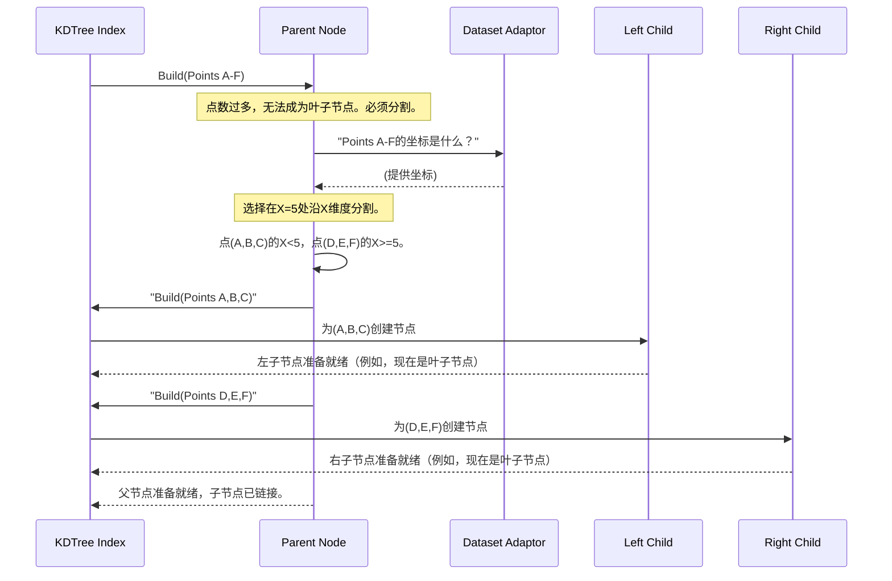

# 第5章：节点结构

在[第4章：结果集类](04_result_set_classes_.md)中，我们看到了`nanoflann`如何智能地收集和管理最近邻搜索的结果。但`nanoflann`是如何以有组织的方式存储数据，从而实现这些闪电般快速的搜索的呢？答案在于**节点结构**——KD树的基本构建块。

## KD树的分支与叶子

想象一棵物理树。它有树干、主要分支、较小的分支，最后是叶子。每个部分在树的整体结构和功能中都扮演着角色。类似地，KD树由相互连接的**节点**组成，这些节点就像是这棵数字树的分支和叶子。这些节点是`nanoflann`保持数据组织并准备好高效搜索的方式。

作为`nanoflann`的用户，你通常不会直接创建或操作这些节点。相反，当你调用KD树的`buildIndex()`时（如[第3章：KD树索引](03_kd_tree_index_.md)中介绍的），`nanoflann`会处理所有构建和链接这些节点的复杂工作。然而，理解它们的结构是掌握KD树如何实现其速度的关键。

## 什么是节点？

节点的核心是KD树中的一个小型数据容器。每个节点代表数据空间的特定区域，并保存帮助`nanoflann`执行以下操作的信息：

1. **引导搜索**：如果它是一个“非叶子”（内部）节点，它会告诉`nanoflann`向树的哪个方向深入。
2. **包含实际数据**：如果它是一个“叶子”节点，它会保存一小部分实际数据点的索引。

所有这些节点链接在一起，形成完整的树结构，使`nanoflann`能够高效地导航数据。

让我们看看两种主要类型的节点：

### 1. 非叶子节点（路标）

想象你在一个按字母顺序组织的图书馆中寻找一本书。你首先找到“S”部分。这个“S”部分就像一个非叶子节点。它不包含具体的书，但它告诉你：“如果你的书以A-R开头，向左走；如果以S-Z开头，向右走。”

在KD树中，非叶子节点充当**路标**。它包含：
- **“分割维度”**：这是数据的一个坐标（例如，3D点的X轴、Y轴或Z轴）。
- **“分割值”**：这是沿所选维度的特定值。

这些信息定义了节点如何将其空间区域划分为两个较小的子区域。例如，一个节点可能会说：“如果一个点的X坐标小于50，查看我的‘左’子节点；否则，查看我的‘右’子节点。”

### 2. 叶子节点（最终目的地）

继续我们的图书馆类比，当你到达“Smith, John”书架时，你会看到John Smith的实际书籍。这个书架就像一个叶子节点。

叶子节点是KD树分支中的**最终目的地**。它不再分割空间，而是直接包含一小部分实际数据点的**索引**。当`nanoflann`的搜索到达叶子节点时，它会检查存储在那里的所有数据点索引，以找到真正的最近邻。

叶子节点可以容纳的最大点数由你在构建KD树时提供的`leaf_max_size`参数决定，如[第3章：KD树索引](03_kd_tree_index_.md)中所述。

## 节点在树构建过程中如何协同工作

当你调用`index.buildIndex()`时，`nanoflann`递归地创建这些节点来组织数据。它从一个包含所有数据点的“根”节点开始，然后反复执行以下步骤：

1. **检查叶子条件**：如果一个节点代表的区域只有少量数据点（少于`leaf_max_size`），它成为一个**叶子节点**，`nanoflann`将那些点的索引存储在其中。该分支的处理停止。
2. **寻找最佳分割**：如果有许多点，它成为一个**非叶子节点**。`nanoflann`会巧妙地分析该节点区域内点的分布，找到“最佳”的分割维度。通常，它会选择点分布最分散的维度。
3. **执行分割**：它沿该维度选择一个“分割值”，并将点的索引分成两组：小于分割值的点和大于等于分割值的点。
4. **创建子节点**：它创建两个新的子节点，并对每组点递归重复该过程。

这个过程持续进行，直到所有点都包含在叶子节点中。

以下是`nanoflann`如何通过分割父节点构建KD树的一小部分的简化序列：


这个图展示了递归的一个步骤，展示了`Parent Node`如何将其职责分配给`Left Child`和`Right Child`节点。`nanoflann`在做出这些分割决策时使用你的[数据集适配器](01_dataset_adaptor_interface_.md)获取点坐标。

## 代码中的节点结构

节点定义的核心位于`nanoflann.hpp`文件中。`nanoflann`使用了一个巧妙的C++特性——`union`，以节省内存。`union`允许不同的成员共享相同的内存位置，因为一个节点*要么*是叶子节点，*要么*是内部（非叶子）节点，但不会同时是两者。

以下是`Node`结构的简化视图：

```cpp
// 来自nanoflann.hpp，位于nanoflann::KDTreeBaseClass中
struct Node
{
    union
    {
        // 叶子节点的数据：
        struct leaf
        {
            // 'left'和'right'是vAcc_数组的索引，
            // 定义了该叶子节点保存的数据点范围。
            Offset left, right;
        } lr;

        // 非叶子（内部）节点的数据：
        struct nonleaf
        {
            // 'divfeat'是用于分割的维度（例如，0表示X，1表示Y）。
            Dimension divfeat;
            // 'divlow'和'divhigh'是沿'divfeat'定义分割的值。
            DistanceType divlow, divhigh;
        } sub;
    } node_type; // 这个union名为'node_type'

    // 指向子节点的指针。如果是叶子节点，两者均为nullptr。
    Node *child1 = nullptr, *child2 = nullptr;
};
```
**解释：**
- **`node_type` union**：这是魔法发生的地方。
  - 如果节点是**叶子节点**，其`lr`成员是活动的。`lr.left`和`lr.right`存储`nanoflann`内部`vAcc_`数组中的起始和结束索引（数据集原始点索引的重新排序列表）。
  - 如果节点**不是叶子节点**（它是内部节点），其`sub`成员是活动的。`sub.divfeat`告诉`nanoflann`使用哪个维度（例如，X、Y、Z）进行分割。`sub.divlow`和`sub.divhigh`定义了实际的分割边界值。
- **`child1`, `child2`**：这些是指向其他`Node`对象的指针。如果节点有子节点，这些指针会指向它们。如果是叶子节点，两个指针均为`nullptr`。

## 节点类型一览

| 节点类型       | 角色                                       | 存储的关键信息                                               | 子节点？   |
| :------------- | :----------------------------------------- | :----------------------------------------------------------- | :--------- |
| **非叶子节点** | 引导搜索；将数据空间划分为两个较小的区域。 | - `divfeat`：用于分割的维度。 <br> - `divlow`, `divhigh`：沿该维度定义分割的值。 | 是（两个） |
| **叶子节点**   | 分支的终点；包含要直接检查的实际数据点。   | - `left`, `right`：`vAcc_`中的索引范围，指向实际数据点。     | 否         |

## 结论

节点结构是KD树的骨架，由`nanoflann`精心设计，以组织数据实现最佳搜索性能。每个节点，无论是作为路标的非叶子节点还是保存数据的叶子节点，都在KD树快速导航和剪枝数据集的能力中扮演关键角色。虽然你不直接与这些节点交互，但它们的高效设计是`nanoflann`如此快速的原因。

这些节点需要内存，而高效管理这些内存（尤其是对于非常大的数据集）是`nanoflann`的另一个巧妙之处。在下一章中，我们将探讨负责这种优化内存管理的[池化分配器](06_pooled_allocator_.md)。

