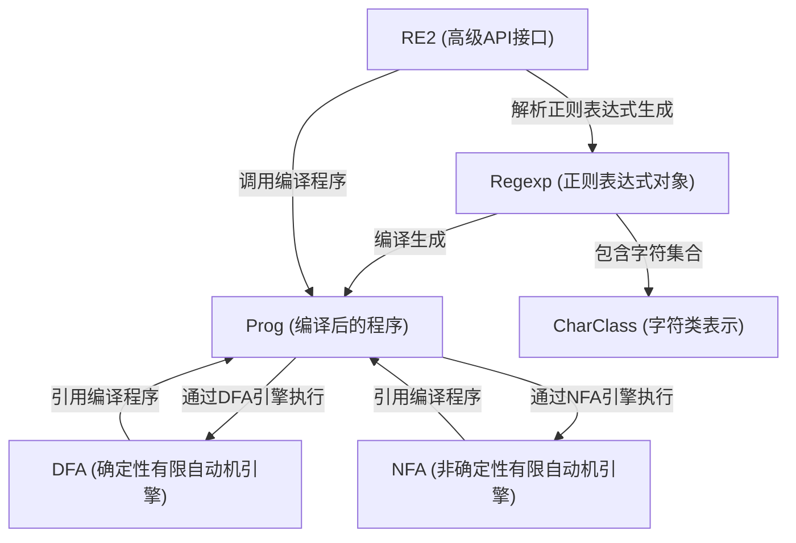
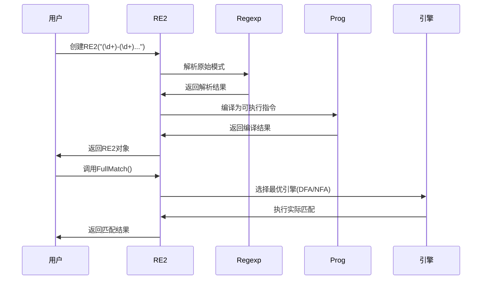

链接：[re2/README.md at main · google/re2](https://github.com/google/re2/blob/main/README.md)

# docs：RE2正则表达式引擎

RE2是一个*高性能*的C++库，用于**正则表达式匹配**。

它接收正则表达式模式，将其*解析*为符号化表示（Regexp），然后**编译**成可执行程序（Prog）。

该程序随后由各种*优化匹配引擎*（如DFA和NFA）执行，以快速安全地在文本中查找模式。

## 可视化



## 核心模块

1. [RE2 (高级API接口)](01_re2__high_level_api__.md)
2. [Regexp (正则表达式对象)](02_regexp__regular_expression_object__.md)
3. [Prog (编译后的程序)](03_prog__compiled_program__.md)
4. [DFA (确定性有限自动机引擎)](04_dfa__deterministic_finite_automaton_engine__.md)
5. [NFA (非确定性有限自动机引擎)](05_nfa__nondeterministic_finite_automaton_engine__.md)
6. [CharClass (字符类表示)](06_charclass__character_class_representation__.md)

---

# 第1章：RE2（高级API）

欢迎来到`re2`

在第一章中，我们将深入探索`re2`库的核心：`RE2`类。你可以把`RE2`视为C++中处理正则表达式的全能工具，它封装了所有底层复杂性，让你能专注于快速准确地完成模式匹配。

### RE2解决什么问题？

假设你有一堆文本，需要从中提取特定模式（如电话号码、电子邮件或日期）。正则表达式（简称"regex"或"regexp"）是描述这类模式的强大工具。例如电话号码"650-253-0001"的模式可表示为：`(\d+)-(\d+)-(\d+)`。而`RE2`类正是帮助你在C++中实现这种模式匹配的桥梁。

`RE2`类提供三大核心功能：
1. **定义模式**：将正则表达式字符串转换为可执行格式
2. **执行匹配**：检查文本是否符合模式
3. **提取信息**：获取匹配文本的特定部分（如电话号码中的区号）

### 快速入门：编译模式

使用正则表达式前需要先"编译"模式字符串，这类似于将菜谱转化为计算机可执行的指令：

```cpp
#include "re2/re2.h"
#include <iostream>

int main() {
    // 1. 定义正则表达式模式
    RE2 phone_pattern("(\\d+)-(\\d+)-(\\d+)");

    // 检查编译是否成功
    if (!phone_pattern.ok()) {
        std::cerr << "正则表达式编译错误: " << phone_pattern.error() << std::endl;
        return 1;
    }

    std::cout << "模式编译成功！" << std::endl;
    return 0;
}
```

### 执行匹配与数据提取

`RE2`提供两种主要匹配方法：
- **`RE2::FullMatch`**：完全匹配
- **`RE2::PartialMatch`**：部分匹配

电话号码提取示例：
```cpp
#include "re2/re2.h"
#include <iostream>
#include <string>

int main() {
    RE2 phone_pattern("(\\d+)-(\\d+)-(\\d+)");
    std::string text = "650-253-0001";
    
    std::string area_code, prefix, line_number;

    if (RE2::FullMatch(text, phone_pattern, &area_code, &prefix, &line_number)) {
        std::cout << "匹配成功！完整号码: " << text << std::endl;
        std::cout << "  区号: " << area_code << std::endl;    // 输出: 650
        std::cout << "  前缀: " << prefix << std::endl;      // 输出: 253
        std::cout << "  线路号: " << line_number << std::endl; // 输出: 0001
    }

    // 部分匹配示例
    std::string long_text = "联系电话：650-253-0001或408-123-4567";
    std::string found_number;
    if (RE2::PartialMatch(long_text, phone_pattern, &found_number)) {
        std::cout << "\n在文本中发现号码: \"" << long_text << "\"" << std::endl;
        std::cout << "  首个号码(区号): " << found_number << std::endl; 
    }
    
    return 0;
}
```

### RE2内部工作机制

`RE2`类作为协调者，将任务分发给专门的内核模块：



核心组件包括：
1. **Regexp**：语法解析器
2. **Prog**：模式编译器
3. **匹配引擎**：DFA/NFA等实际执行者

脑中对这四行代码留下印象，基本上就掌握调用啦

```cpp
	RE2 phone_pattern("(\\d+)-(\\d+)-(\\d+)");
    std::string text = "650-253-0001";
    std::string area_code, prefix, line_number;

//call
    if (RE2::FullMatch(text, phone_pattern, &area_code, &prefix, &line_number))
```


### 代码实现

初始化流程（简化自`re2/re2.cc`）：
```cpp
void RE2::Init(absl::string_view pattern, const Options& options) {
    // 语法解析
    entire_regexp_ = Regexp::Parse(pattern, options.ParseFlags(), &status);
    
    // 模式编译
    prog_ = entire_regexp_->CompileToProg(options.max_mem() * 2 / 3);
}
```

匹配引擎选择逻辑：
```cpp
bool RE2::Match(...) const {
    // 根据模式特性选择最优引擎
    if (can_one_pass && anchor != Prog::kUnanchored) {
        prog_->SearchOnePass(...);
    } else if (can_bit_state...) {
        prog_->SearchBitState(...);
    } else {
        prog_->SearchNFA(...);
    }
}
```

### 总结

`RE2`类作为高级接口：
- 封装了正则表达式的完整生命周期
- 自动选择最优匹配策略
- 提供简洁易用的API接口

[下一章：Regexp（正则表达式对象）](02_regexp__regular_expression_object__.md)

