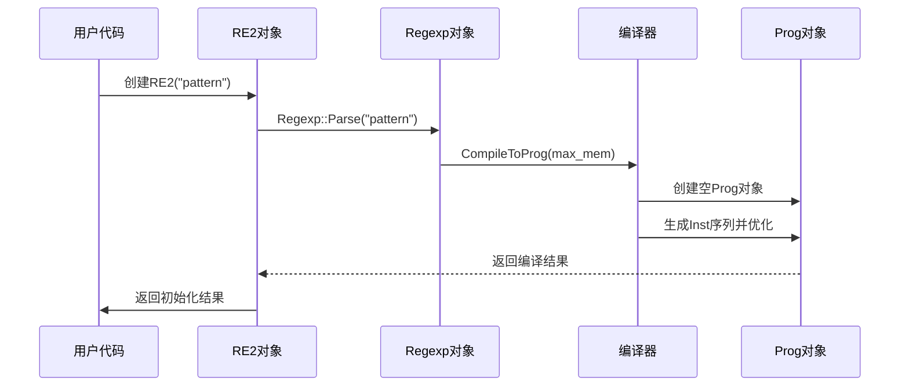

# 第3章：Prog（编译程序）

欢迎回来

在[第2章：Regexp（正则表达式对象）](02_regexp__regular_expression_object__.md)中，我们探讨了如何将人类可读的正则表达式字符串转换为结构化的`Regexp`对象。这个`Regexp`对象就像建筑的蓝图，但蓝图本身并不能直接使用——我们需要将其转化为可执行的实体

这就是**Prog（编译程序）**的职责所在。如果说`Regexp`是蓝图，那么`Prog`就是经过完全构建和优化的指令集——即"机器码"——`re2`库可以直接执行它以实现高效的模式匹配。

### Prog解决什么问题？

想象你有一个复杂的食谱。你可以逐行阅读并尝试理解每一步，这类似于"解释"正则表达式字符串。虽然可行，但这种方式效率较低，因为你需要不断思考下一步该做什么。

现在，假设有一位专业厨师，他已经将食谱熟记于心，优化了每一个动作，并提前规划了整个烹饪流程。他们能够毫不犹豫地执行精确的操作序列。这正是`Prog`为你的正则表达式提供的功能。

`Prog`对象是`re2`内部**编译并优化**的正则表达式表示形式。它不再需要每次匹配时都解释`Regexp`蓝图，而是==将其转换为一系列简单直接的指令，供匹配引擎==（如DFA或NFA，我们稍后会介绍）高效执行。

### Prog：可执行指令集

`Prog`本质上是一个由基本"机器指令"（称为`Inst`）组成的列表。这些`Inst`对象可以看作是高效操作手册中的独立步骤。

以下是`Prog`中可能包含的一些`Inst`类型：

- **`kInstByteRange`**：检查文本的下一个字节是否在特定范围内（例如`'a'`到`'z'`）。如果是，跳转到指令X。
- **`kInstAlt`**：尝试指令X，如果失败则尝试指令Y。用于处理正则表达式中的`|`（或）操作。
- **`kInstCapture`**：记录文本的当前位置，然后跳转到指令X。用于捕获组`(...)`。
- **`kInstEmptyWidth`**：检查"零宽度"条件（如行首`^`或单词边界`\b`）。如果为真，跳转到指令X。
- **`kInstMatch`**：成功！在此处找到匹配。
- **`kInstNop`**：无操作，直接跳转到指令X。
- **`kInstFail`**：此处无法匹配。

每个`Inst`通常有一个"输出"（`out`）或"备用输出"（`out1`），指向下一条要执行的指令，形成一个类似流程图的逻辑结构。

#### Prog的核心特性：

- **优化的字节码**：它不是通用的`Regexp`树，而是扁平化、高效的指令序列，专为快速执行设计。
- **多入口点**：根据匹配类型（锚定在文本开头或非锚定），`Prog`可以有不同的起始点。
- **预计算表**：`Prog`包含预计算表（如`bytemap`），以加速逐字节比较。

### 从Regexp到Prog

作为用户，你无需直接创建`Prog`对象。`RE2`类（高级API）会在你提供正则表达式字符串时自动完成这一过程。

以下是简化的内部流程：



### 深入Prog的编译过程

让我们回顾`RE2::Init`方法，重点关注`Prog`的编译步骤：

```cpp
// 简化自re2/re2.cc
void RE2::Init(absl::string_view pattern, const Options& options) {
    // 步骤1：将原始字符串解析为Regexp对象
    entire_regexp_ = Regexp::Parse(pattern, options.ParseFlags(), &status);
    if (entire_regexp_ == NULL) { /* 处理错误 */ return; }

    // 步骤2：将Regexp蓝图编译为Prog对象
    prog_ = entire_regexp_->CompileToProg(options.max_mem() * 2 / 3);
    if (prog_ == NULL) { /* 处理错误 */ return; }

    // 后续设置...
}
```

> `entire_regexp_->CompileToProg(...)`是核心编译调用，实际工作由内部`Compiler`类完成。

#### 1. Prog与Inst结构

`Prog`类包含一个`Inst`对象数组，每个`Inst`设计紧凑以最大化速度和内存效率：

```cpp
// 简化自re2/prog.h
class Prog {
 private:
    PODArray<Inst> inst_;  // 指令数组
    int start_;            // 锚定匹配的入口点
    int start_unanchored_; // 非锚定匹配的入口点
    uint8_t bytemap_[256]; // 字节分类映射表
};

class Prog::Inst {
 private:
    uint32_t out_opcode_; // 打包的输出和操作码
    union {               // 根据操作码存储不同数据
        uint32_t out1_;
        int32_t cap_;
        struct { uint8_t lo_, hi_; };
    };
};
```

#### 2. 编译器的工作

`Compiler`类遍历`Regexp`对象（抽象语法树），==将每个节点转换为一个或多个`Inst`对象，实现树的线性化==：

```cpp
// 简化自re2/compile.cc
Frag Compiler::PostVisit(Regexp* re) {
    switch (re->op()) {
        case kRegexpLiteral:
            return Literal(re->rune(), (re->parse_flags()&Regexp::FoldCase) != 0);
        // 其他操作...
    }
}
```

#### 3. Prog的优化

编译完成后，`Prog`会执行多项关键优化：

| 优化                   | 功能描述                                                 | 重要性                                                       |
| :--------------------- | :------------------------------------------------------- | :----------------------------------------------------------- |
| **`Optimize()`**       | 窥孔优化：查找并替换低效指令序列（如`Nop`）。            | 清理生成的代码，使其更小更快。                               |
| **`Flatten()`**        | ==将分支化的`Inst`序列转换为线性结构==，同时保留逻辑。   | 提高缓存局部性，减少匹配引擎开销。                           |
| **`ComputeByteMap()`** | 分析所有`kInstByteRange`指令，将输入字节分组为"字节类"。 | 引擎只需检查少数字节类，而非所有256种可能，大幅提升字符匹配速度。 |

### 本章总结

`Prog`对象是`re2`将正则表达式编译后的高效字节码：
- 将`Regexp`蓝图==转换为线性==`Inst`指令序列
- 通过==字节映射和指令扁平化==等优化提升性能
- 作为匹配引擎的直接执行基础

[下一章：DFA（确定性有限自动机引擎）](04_dfa__deterministic_finite_automaton_engine__.md)

