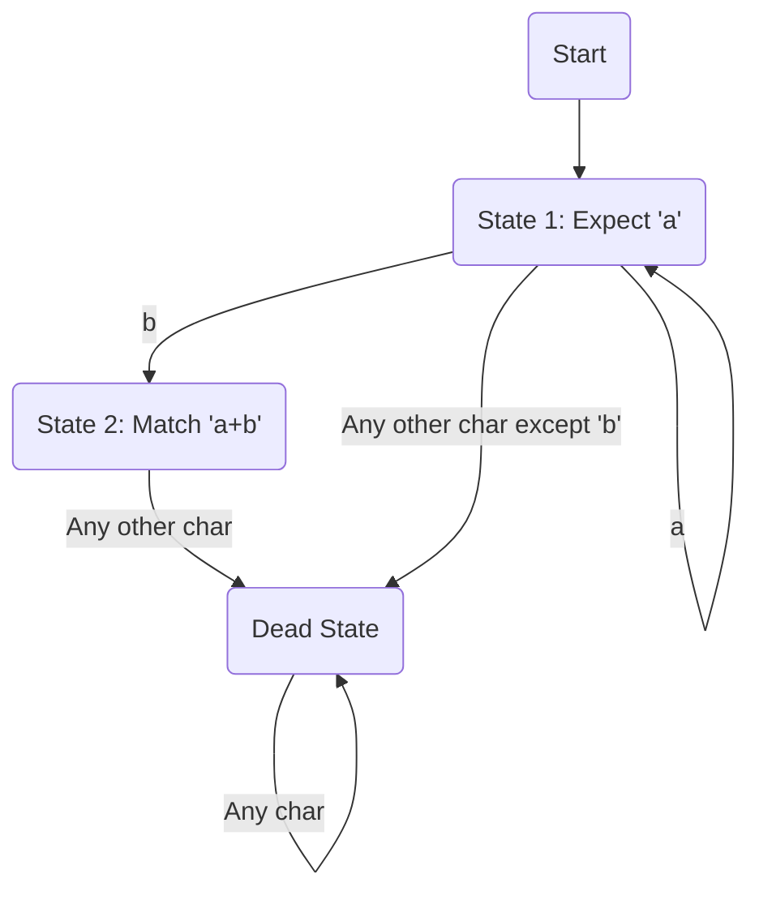
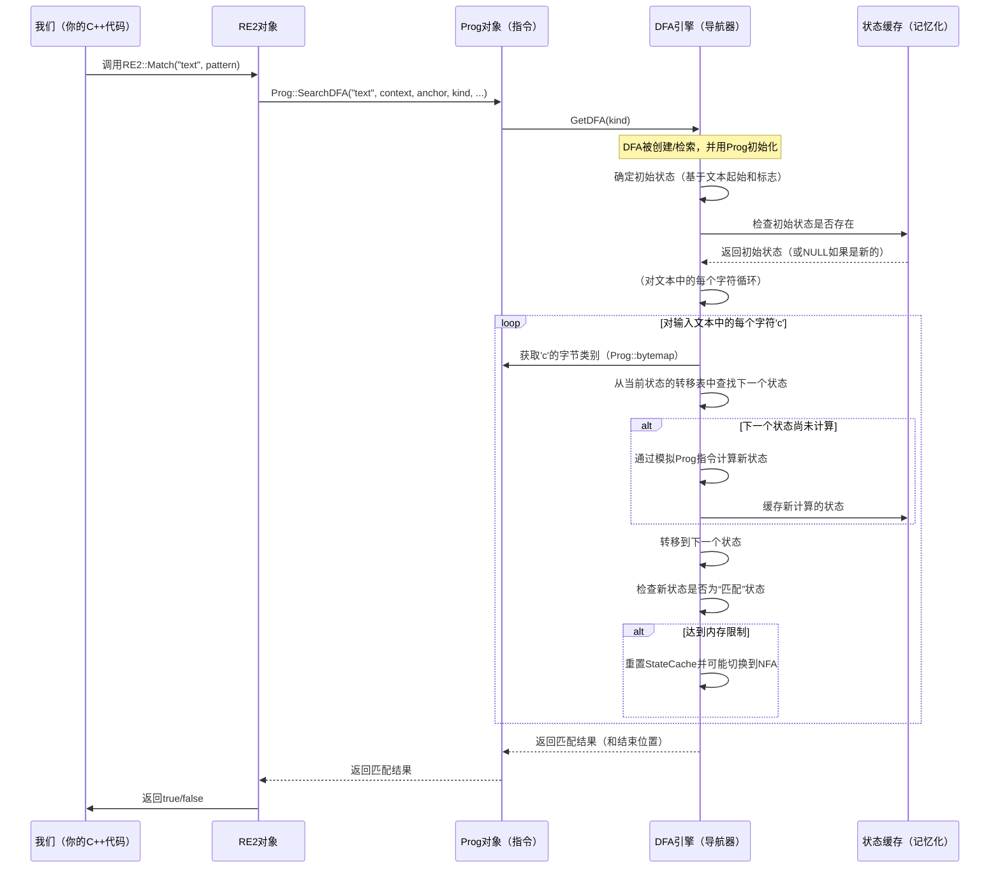

# 第4章：DFA（确定性有限自动机引擎）

欢迎回来

在[第3章：Prog（编译后的程序）](03_prog__compiled_program__.md)中，我们了解到`re2`会将你的正则表达式编译成一个高度优化的指令序列，称为`Prog`对象。这个`Prog`就像是你的正则表达式的机器代码。但仅有指令是不够的；还需要有东西能够真正*运行*这些指令来匹配你的文本。

这就是**DFA（确定性有限自动机引擎）**的作用所在。DFA是`re2`内部的一个强大“引擎”，它接收`Prog`并用它来在文本中查找匹配。

### DFA解决了什么问题？

想象一下你正在尝试走一个迷宫。使用某些迷宫解法技巧时，你可能会沿着一条路径走，遇到死胡同后==回溯==，再尝试另一条路径。这种方式可能会很慢且低效，尤其是对于复杂的迷宫。

现在，想象另一种迷宫，在每个岔路口都有一个==神奇的标志==，告诉你*下一步*应该走哪条路径，没有任何错误的可能性，也不需要回头。这就是**确定性有限自动机（DFA）**的核心思想。

`re2`中的`DFA`是一个非常高效的正则表达式匹配引擎，因为它是**确定性的**。这意味着当它处理输入文本时，对于每一个读取的字符，它都能*精确地*知道下一个“状态”（即在正则表达式模式中的位置）应该是什么。

> 它不需要猜测，不需要回溯，也不需要尝试多种可能性。

它的主要目的是回答一个问题：“这段文本是否包含与我的正则表达式匹配的模式？如果有，匹配的结束位置在哪里？”它能够以极快的速度完成这一任务，通常是**线性时间**（即其速度与文本长度成正比，而不会因复杂模式而指数级变慢）。

然而，这种速度可能会带来一个潜在的代价：**内存**。

为了实现其确定性特性，DFA`可能需要构建并存储一个巨大的“状态映射”`，包含所有可能的状态。对于一些非常复杂的正则表达式，这个映射可能会变得非常大，从而消耗大量内存。

### DFA：流程图导航器

可以将DFA看作一个高度优化的流程图。

*   **状态（方框）**：流程图中的每个方框代表DFA的一个“状态”。一个状态表示你在正则表达式模式中当前所处位置的独特组合。
*   **转移（箭头）**：从每个方框出发，都有指向其他方框的箭头。关键的是，对于*每一个可能的输入字符*，都有*恰好一个*箭头指向下一个状态。你总是知道下一步该去哪里。
*   **确定性**：这种“总是知道下一步该去哪里”的特性就是确定性的体现。不需要猜测，不需要回溯。
*   **匹配状态**：某些方框被标记为“匹配状态”。如果你到达其中一个状态，意味着到目前为止处理的文本已经成功匹配了你的模式。

以下是一个简单的正则表达式`a+b`如何表示为DFA的概念图：


在这个简单的例子中：
*   你从`start`开始。
*   如果看到`a`，你会进入`state1`。
*   如果看到另一个`a`，你会保持在`state1`。
*   如果从`state1`看到`b`，你会进入`state2`（一个匹配状态！）。
*   如果看到其他任何字符，你会进入`dead`状态，意味着从那里开始无法匹配。

### DFA如何执行Prog

当`RE2`决定使用`DFA`引擎来搜索你的文本（通过`Prog::SearchDFA`实现）时，以下是简化的执行流程：



### 探索：DFA内部

DFA引擎的核心是其`State`结构以及这些状态如何链接。

#### 1. `DFA::State`结构

在`re2/dfa.h`中，`DFA::State`代表我们流程图中的一个“方框”。

```cpp
// 简化自re2/dfa.h
class DFA {
 public:
  struct State {
    int* inst_;         // 当前状态中活跃的Prog指令ID数组
    int ninst_;         // 活跃指令ID的数量
    uint32_t flag_;     // 标志，如'IsMatch'、'LastWordChar'、空宽度信息

    // 这是指向下一个状态的转移表。
    // 其大小取决于prog_->bytemap_range() + 1（为kByteEndText预留）。
    std::atomic<State*> next_[]; // 指向下一个状态的指针数组
  };
  // ... 其他成员 ...
};
```
*   `inst_`和`ninst_`：DFA的`State`由一组[Prog（编译后的程序）](03_prog__compiled_program__.md)指令（`Inst` ID）定义，这些指令在匹配过程中*可能活跃*。
*   `flag_`：存储关于该状态的重要信息，例如它是否是`kFlagMatch`状态（意味着正则表达式匹配可以在此结束）以及与空宽度断言相关的标志（如`^`表示行首，`\b`表示单词边界）。
*   `next_[]`：这是转移表。对于每个可能的输入字节*类别*（由`Prog::bytemap`定义），它指向下一个`DFA::State`。它还包含一个`kByteEndText`条目，这是一个特殊的概念性“字节”，表示输入字符串的结束。这个数组是`std::atomic`的，以确保多线程安全地读取和更新。

#### 2. 构建和运行状态（`DFA::RunStateOnByte`）

`DFA`会按需增量地构建其状态图。当`DFA::Search`需要从`current_state`找到字符`c`的下一个状态时，它会查看`current_state->next_[bytemap[c]]`。

如果这个槽位是`NULL`，意味着下一个状态尚未计算。`DFA`会调用`RunStateOnByte`（简化如下）来确定下一个状态：

```cpp
// 简化自re2/dfa.cc
DFA::State* DFA::RunStateOnByte(State* state, int c) {
  // 检查下一个状态是否已计算并缓存。
  // 使用memory_order_acquire确保多线程安全访问。
  State* ns = state->next_[ByteMap(c)].load(std::memory_order_acquire);
  if (ns != NULL) {
    return ns; // 找到了！
  }

  // 如果未缓存，将当前'state'转换为临时指令列表（Workq）。
  // StateToWorkq(state, q0_);

  // 运行'Prog'指令（从q0_）对字符'c'进行处理，
  // 以确定下一个状态的新活跃指令集（q1_）。
  // 此步骤还会检测是否找到匹配（'ismatch'）。
  // RunWorkqOnByte(q0_, q1_, c, afterflag, &ismatch);

  // 使用结果'q1_'（新活跃指令）和'ismatch'标志，
  // 查找现有状态或创建新状态，并缓存它。
  // 可能会返回特殊状态，如DeadState（无法继续匹配）。
  ns = WorkqToCachedState(q1_, NULL /* mq */, flag /* 包括ismatch、空宽度标志 */);

  // 将新计算的状态存储在当前状态的转移表中，供将来使用。
  // 使用memory_order_release确保多线程一致性。
  state->next_[ByteMap(c)].store(ns, std::memory_order_release);
  return ns;
}
```
`RunStateOnByte`本质上模拟了底层[Prog（编译后的程序）](03_prog__compiled_program__.md)指令在给定字符`c`时的行为，然后将结果活跃指令汇总为一个新的`DFA::State`。这个新状态随后被**缓存**（`state_cache_`）并链接到状态图中。

#### 3. 内存管理与回退

由于状态图可能变得非常大，`re2`为DFA实现了智能的内存管理：

*   **`mem_budget_`**：每个`DFA`实例都有一个内存预算（来自`Prog`的`dfa_mem_`），用于存储`State`对象时不能超过该预算。
*   **`state_cache_`**：所有分配的`DFA::State`对象都存储在这里。当需要某个状态时，`re2`首先检查`state_cache_`。
*   **`ResetCache`**：如果`DFA`在搜索过程中耗尽了内存预算，它可以决定`ResetCache()`。这会清除*所有*之前计算的状态，并从头开始构建状态图。这可以防止内存耗尽，但意味着某些工作可能会重复。


**回退到NFA**：在极端情况下，如果`DFA`频繁重置其缓存（表明状态图对于给定的内存预算来说过大或过于复杂），`re2`会检测到这一点，并且`Prog::SearchDFA`会将`failed`标志设置为`true`。

这会告诉更高层的[RE2（高级API）](01_re2__high_level_api__.md)切换到另一个匹配引擎，通常是[NFA（非确定性有限自动机引擎）](05_nfa__nondeterministic_finite_automaton_engine__.md)，它使用更少的内存，但对于某些模式可能会更慢。`Prog::TESTING_ONLY_set_dfa_should_bail_when_slow`标志（在`re2/testing/dfa_test.cc`中可见）在测试期间控制此行为。

#### 4. `Prog::SearchDFA` - 入口点

最终，`Prog`对象暴露了DFA搜索功能。当`RE2`想要使用DFA时，它会调用`Prog::SearchDFA`。

```cpp
// 简化自re2/prog.cc
bool Prog::SearchDFA(absl::string_view text, absl::string_view context,
                     Anchor anchor, MatchKind kind, absl::string_view* match0,
                     bool* failed, SparseSet* matches) {
  // ... 初始设置和标志处理 ...

  // 1. 获取适当的DFA实例（缓存在Prog中）。
  //    这个DFA配置为匹配的'kind'（例如kLongestMatch）。
  DFA* dfa = GetDFA(kind);

  // 2. 调用DFA的内部Search方法。
  //    这是实际的状态导航发生的地方。
  const char* ep; // 'ep'将存储匹配的结束指针
  bool matched = dfa->Search(text, context, anchored,
                             want_earliest_match, !reversed_,
                             failed, &ep, matches);

  // ... 错误处理和匹配结果后处理 ...

  // 3. 如果找到匹配，填充match0。
  //    注意：DFA仅高效跟踪匹配的*结束*位置。
  //    起始位置假定为text.data()。
  if (matched && match0) {
    *match0 = absl::string_view(text.data(), static_cast<size_t>(ep - text.data()));
  }

  return matched;
}
```
这展示了`Prog`如何作为`RE2`和实际`DFA`引擎之间的桥梁。`Prog`创建并管理`DFA`实例，然后将原始文本扫描任务委托给它们。

### 总结

DFA（确定性有限自动机）引擎是`re2`内部的一个强大工具，专为极快的线性时间正则表达式匹配而设计。

- 它像一个精确的流程图一样运行，总是根据输入字符知道下一个状态应该是什么，从而避免了昂贵的回溯。
- 虽然其确定性保证了速度，但对于非常复杂的模式，它可能会==消耗大量内存来构建状态图==。
- `re2`通过缓存状态并在==必要时重置缓存==或==回退==到其他引擎（如NFA）来智能地管理这一点。

现在我们已经理解了DFA的确定性高性能方法，接下来让我们探索其对应物NFA，它在性能和内存使用之间提供了不同的平衡。

[下一章：NFA（非确定性有限自动机引擎）](05_nfa__nondeterministic_finite_automaton_engine__.md)

