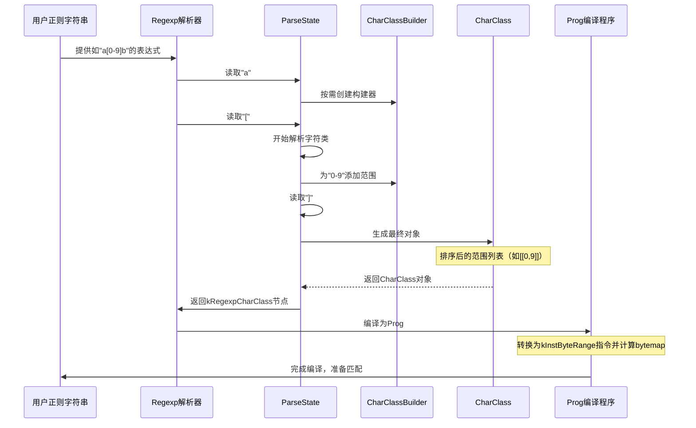

# 第6章：CharClass（字符类表示）

欢迎回来

在[第5章：NFA（非确定性有限自动机引擎）](05_nfa__nondeterministic_finite_automaton_engine__.md)中，我们探讨了NFA引擎如何高效追踪复杂正则匹配和子表达式。无论是NFA还是[DFA（确定性有限自动机引擎）](04_dfa__deterministic_finite_automaton_engine__.md)，它们都需要不断回答诸如"这个字符是数字吗？"、"是字母吗？"或"是否属于特定范围？"等问题。

快速准确地回答这些问题（尤其是涉及Unicode和大小写不敏感匹配时）对`re2`的性能至关重要。这就是**CharClass（字符类表示）**的用武之地。

### CharClass解决什么问题？

假设你需要从文档中识别所有电话号码。正则表达式可能使用`\d`匹配任意数字，或用`[0-9]`实现相同功能。又或者你想用`[A-Z]`匹配所有大写字母。

`re2`如何高效判断字符'5'是否属于`\d`？或者'B'是否属于`[a-z]`（尤其是在启用大小写不敏感匹配时）？

`CharClass`抽象就是`re2`的解决方案。它是一种优化后的内部表示方式，用于存储**字符（或Unicode中的"符文"）集合**，使得匹配引擎（[DFA](04_dfa__deterministic_finite_automaton_engine__.md)和[NFA](05_nfa__nondeterministic_finite_automaton_engine__.md)）能快速判断给定字符是否属于定义好的集合。

这包括以下复杂场景：
- 标准字符范围：`[a-z]`、`[0-9]`
- 预定义字符类：`\d`（数字）、`\s`（空白字符）、`\w`（单词字符）
- Unicode属性：`\p{L}`（任意Unicode字母）、`\P{N}`（非数字字符）
- 大小写折叠：`[a-z]`同时匹配`A-Z`

如果没有`CharClass`，`re2`将不得不反复检查单个字符是否符合一长串可能性或复杂逻辑，从而大幅降低匹配速度。`CharClass`将其简化为紧凑、可快速查询的数据结构。

### CharClass：高效字符集管理器

作为`re2`用户，你无需直接创建`CharClass`对象。你只需在正则表达式字符串中定义字符类（如`[a-z]`），`re2`会自动在后台将其转换为`CharClass`对象。

以下是`re2`管理字符类的核心机制：

1. **RuneRange**：最基本的构建块。定义起始字符（`lo`）和结束字符（`hi`）。例如`[0-9]`对应`lo=0, hi=9`。
2. **CharClassBuilder**：解析阶段使用的临时可变"工作台"。当`re2`遇到`[0-9]`或`\p{L}`时，会构建`CharClassBuilder`对象，支持添加多个`RuneRange`、合并重叠范围或对整个集合取反（如将`[0-9]`转为`[^0-9]`）。
3. **CharClass**：最终优化的不可变对象，供匹配引擎使用。本质上是已排序且不重叠的`RuneRange`列表。

这种两阶段处理（可变构建器→不可变最终对象）确保了高效构建和快速查询。

### `re2`如何使用CharClass（高层视角）

观察字符类从正则字符串到内部表示的转换过程：



### CharClass实现

关键结构和方法的源码解析（定义于`re2/regexp.h`，实现在`re2/regexp.cc`和`re2/parse.cc`）：

#### 1. RuneRange结构
```cpp
struct RuneRange {
  Rune lo; // 范围起始字符
  Rune hi; // 范围结束字符
};
```

#### 2. CharClassBuilder构建器
```cpp
class CharClassBuilder {
  bool AddRange(Rune lo, Rune hi); // 添加范围并自动合并重叠
  void Negate();                   // 集合取反
  CharClass* GetCharClass();       // 生成最终CharClass
 private:
  RuneRangeSet ranges_; // 已排序且不重叠的范围集合
};
```

#### 3. CharClass最终类
```cpp
class CharClass {
  bool Contains(Rune r) const; // 二分查找判断字符归属
 private:
  RuneRange *ranges_; // 排序后的范围数组
  int nranges_;       // 范围数量
};
```

#### Unicode处理
`re2`通过`unicode_groups.h`和`unicode_casefold.h`中定义的Unicode数据，支持`\p{L}`等属性匹配和跨语言的大小写折叠。

### 总结

`CharClass`是`re2`中高效表示和查询字符集合的核心抽象：
- 通过排序后的`RuneRange`实现快速二分查找
- 构建阶段处理Unicode属性和大小写折叠
- 编译后转换为高效的字节范围指令

至此我们完成了对`re2`核心组件的深度探索：
1. [RE2（高级API）](01_re2__high_level_api__.md) - 用户接口层
2. [Regexp（正则表达式对象）](02_regexp__regular_expression_object__.md) - 语法解析层
3. [Prog（编译程序）](03_prog__compiled_program__.md) - 指令编译层
4. [DFA/NFA引擎](04_dfa__deterministic_finite_automaton_engine__.md) - 执行层
5. [CharClass](06_charclass__character_class_representation__.md) - 字符处理层

`re2`库的探索之旅 END *★,°*:.☆(￣▽￣)/*.°★* 。

